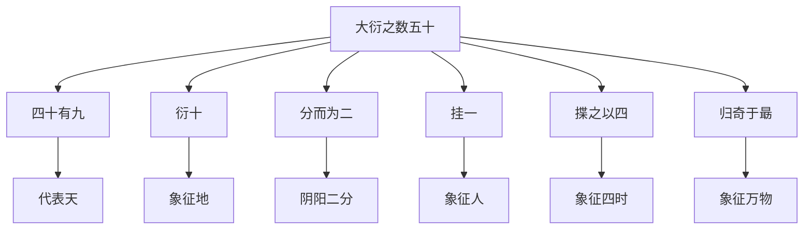
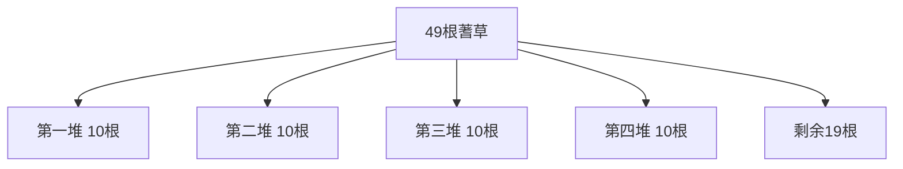
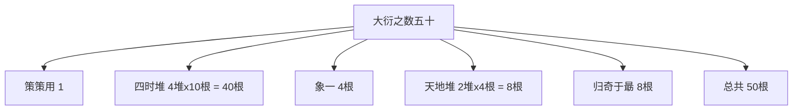
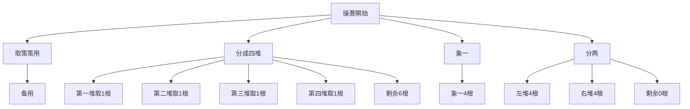

# 蓍草占卜法

> 🎯 **學習目標**：掌握传统大衍筮法的操作步骤、数理原理和注意事項，理解蓍草占卜的哲学内涵和实际應用程式。

## 📚 蓍草占卜概述

### 什么是大衍筮法

# 方法

### 大衍之数五十的哲学意义

## 🔄 大衍筮法的操作步骤

### 操蓍前的准备

#### 蓍草的准备
**選擇蓍草**：选用50根蓍草，每根长约15-20厘米，粗细均匀。

**清洁蓍草**：将蓍草清洁干净，确保能夠均匀操作。

**放置蓍草**：将50根蓍草放在干净的桌面上，按"大衍之数五十"的要求進行分组。

#### 大衍之数五十的分组

**第一階段**：取出一根策策用（象征太极）

**第二階段**：分成四堆（象四时）

**第三階段**：取出一根策策用（象一）

**第四階段**：从剩余49根中取出一根（象征人）

**第五階段**：四堆分二（象天地）
- 第一堆：取出4根，象征四季的開始
- 第二堆：取出4根，象征四时
- 第三堆：取出4根，象征四象
- 第四堆：取出4根，象征四纪

## 🔍 大衍筮法的具体操作

### 第一步：取策策用

1. 从50根蓍草中取出一根策策用（象征太极），放在一边备用。
2. 这根策策用不参与後續的抽取。

### 第二步：象四时（分成四堆）

将剩余的49根蓍草随机分成四堆：
- 第一堆：10根
- 第二堆：10根  
- 第三堆：10根
- 第四堆：10根
- 剩余：9根

### 第三步：象一（取出1根）

从四堆中各取出一根，放在策策用旁边。这4根象征天、地、人、三才。

### 第四步：分二（象天地）

从每堆中再取出一根，分两堆：
- 左堆：取自第一、三堆
- 右堆：取自第二、四堆

### 第五步：归奇于朂（剩余的8根）

将最后剩余的8根作为"归奇于朂"，放在策策用旁边。

## 🎲 大衍筮法的数理原理

### 大衍之数的构成

### 三变得爻原理

大衍筮法通過三次取爻来决定一爻的阴阳。

**第一变**：从天地堆中随机取出一根
- 从天地堆中随机取出一根蓍草
- 观察取出的蓍草是奇数还是偶数
- 奇数为阳爻（—）
- 偶数为阴爻（- -）

**第二变**：重复上述過程
- 再次从天地堆中取出一根
- 確定第二爻的阴阳

**第三变**：重复上述過程
- 再次从天地堆中取出一根
- 確定第三爻的阴阳

### 变爻的處理

**动爻**：如果某爻发生了变化，称为"变爻"，会影响卦的含義。

**变卦**：变爻会导致整卦的变化，从原卦变为新卦。

## 🎯 大衍筮法的注意事項

### 诚敬之心的培养

**诚心**：占卜时要保持诚敬之心，不可有杂念。

**安静環境**：選擇安静的環境，避免干扰。

**專注一心**：全神贯注于占卜過程。

### 操蓍的技巧

**均匀用力**：每次取蓍草要均匀用力，确保随机性。

**随手而发**：不要刻意控制結果，要做到随机。

**記錄結果**：及时記錄每次取出的蓍草奇偶数。

### 結果的記錄

**三变得爻記錄**：按照从下到上的顺序，記錄三变得爻的阴阳。

**整卦記錄**：根据三变得爻的阴阳，確定整卦。

**变爻記錄**：如果有变爻，要記錄哪一爻发生了变化。

## 📖 大衍筮法的哲学内涵

### 大衍之数的宇宙观

**五十象征宇宙**：大衍之数五十象征宇宙万物的总数。

**四时循环**：象四时体现四季循环规律。

**天人合一**：通過归奇于朂体现天人合一的思想。

### 变易的哲学

**变化永恒**：大衍筮法通過取爻体现万物的不断变化。

**规律永恒**：虽然万变但规律不变。

**变中有常**：在变化中寻找不变的规律。

## 💡 大衍筮法的實踐應用程式

### 操蓍实例

### 取爻的六次重复

每次取爻都要重复上述過程，共進行六次，得到六个爻，从下到上排列。

## 🎯 學習要點

### 掌握操作步骤
1. 理解大衍之数五十的分组原理
2. 掌握四堆、象一、分二的顺序
3. 掌握三变得爻的数理原理
# 方法

### 理解哲学内涵
1. 理解大衍之数五十的宇宙观
2. 理解四时循环的象征意义
3. 理解天人合一的思想体现
4. 理解变易不易的哲学

### 掌握實踐技巧
1. 掌握蓍草的均匀用力技巧
2. 掌握随机結果的心理素质
# 方法
4. 掌握变爻的處理原則

## 🔗 相關資源

- [[大衍之数与操蓍]] - 深入學習大衍之数
# 方法
# 方法
- [[占卜中的心理投射]] - 理解占卜的心理機制

---
*創建時間: 2026-02-01*  
*分類: 4 Interests*
