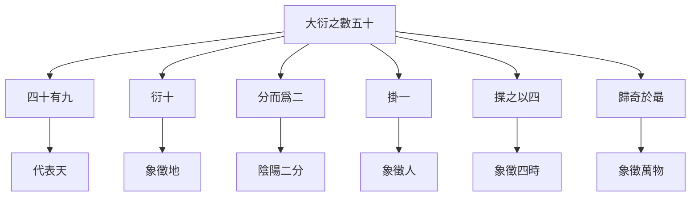
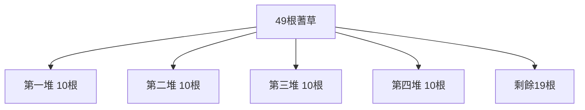
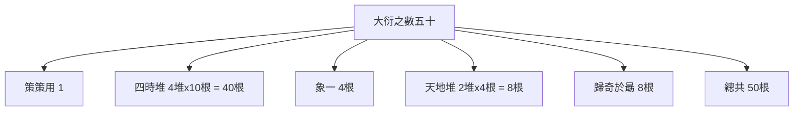
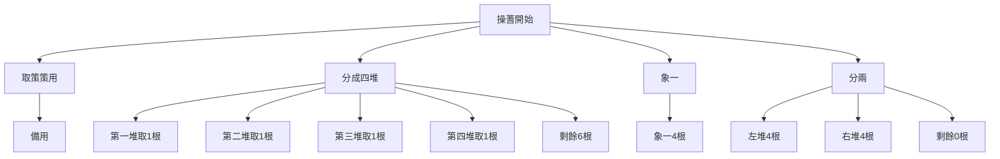

# 蓍草占卜法

> 🎯 **學習目標**：掌握傳統大衍筮法的操作步驟、數理原理和注意事項，理解蓍草占卜的哲學內涵和實際應用程式。

## 📚 蓍草占卜概述

### 什麼是大衍筮法

# 方法

### 大衍之數五十的哲學意義

## 🔄 大衍筮法的操作步驟

### 操蓍前的準備

#### 蓍草的準備
**選擇蓍草**：選用50根蓍草，每根長約15-20釐米，粗細均勻。

**清潔蓍草**：將蓍草清潔乾淨，確保能夠均勻操作。

**放置蓍草**：將50根蓍草放在乾淨的桌面上，按"大衍之數五十"的要求進行分組。

#### 大衍之數五十的分組

**第一階段**：取出一根策策用（象徵太極）

**第二階段**：分成四堆（象四時）

**第三階段**：取出一根策策用（象一）

**第四階段**：從剩餘49根中取出一根（象徵人）

**第五階段**：四堆分二（象天地）
- 第一堆：取出4根，象徵四季的開始
- 第二堆：取出4根，象徵四時
- 第三堆：取出4根，象徵四象
- 第四堆：取出4根，象徵四紀

## 🔍 大衍筮法的具體操作

### 第一步：取策策用

1. 從50根蓍草中取出一根策策用（象徵太極），放在一邊備用。
2. 這根策策用不參與後續的抽取。

### 第二步：象四時（分成四堆）

將剩餘的49根蓍草隨機分成四堆：
- 第一堆：10根
- 第二堆：10根  
- 第三堆：10根
- 第四堆：10根
- 剩餘：9根

### 第三步：象一（取出1根）

從四堆中各取出一根，放在策策用旁邊。這4根象徵天、地、人、三才。

### 第四步：分二（象天地）

從每堆中再取出一根，分兩堆：
- 左堆：取自第一、三堆
- 右堆：取自第二、四堆

### 第五步：歸奇於朂（剩餘的8根）

將最後剩餘的8根作爲"歸奇於朂"，放在策策用旁邊。

## 🎲 大衍筮法的數理原理

### 大衍之數的構成

### 三變得爻原理

大衍筮法通過三次取爻來決定一爻的陰陽。

**第一變**：從天地堆中隨機取出一根
- 從天地堆中隨機取出一根蓍草
- 觀察取出的蓍草是奇數還是偶數
- 奇數爲陽爻（—）
- 偶數爲陰爻（- -）

**第二變**：重複上述過程
- 再次從天地堆中取出一根
- 確定第二爻的陰陽

**第三變**：重複上述過程
- 再次從天地堆中取出一根
- 確定第三爻的陰陽

### 變爻的處理

**動爻**：如果某爻發生了變化，稱爲"變爻"，會影響卦的含義。

**變卦**：變爻會導致整卦的變化，從原卦變爲新卦。

## 🎯 大衍筮法的注意事項

### 誠敬之心的培養

**誠心**：占卜時要保持誠敬之心，不可有雜念。

**安靜環境**：選擇安靜的環境，避免干擾。

**專注一心**：全神貫注於占卜過程。

### 操蓍的技巧

**均勻用力**：每次取蓍草要均勻用力，確保隨機性。

**隨手而發**：不要刻意控制結果，要做到隨機。

**記錄結果**：及時記錄每次取出的蓍草奇偶數。

### 結果的記錄

**三變得爻記錄**：按照從下到上的順序，記錄三變得爻的陰陽。

**整卦記錄**：根據三變得爻的陰陽，確定整卦。

**變爻記錄**：如果有變爻，要記錄哪一爻發生了變化。

## 📖 大衍筮法的哲學內涵

### 大衍之數的宇宙觀

**五十象徵宇宙**：大衍之數五十象徵宇宙萬物的總數。

**四時循環**：象四時體現四季循環規律。

**天人合一**：通過歸奇於朂體現天人合一的思想。

### 變易的哲學

**變化永恆**：大衍筮法通過取爻體現萬物的不斷變化。

**規律永恆**：雖然萬變但規律不變。

**變中有常**：在變化中尋找不變的規律。

## 💡 大衍筮法的實踐應用程式

### 操蓍實例

### 取爻的六次重複

每次取爻都要重複上述過程，共進行六次，得到六個爻，從下到上排列。

## 🎯 學習要點

### 掌握操作步驟
1. 理解大衍之數五十的分組原理
2. 掌握四堆、象一、分二的順序
3. 掌握三變得爻的數理原理
# 方法

### 理解哲學內涵
1. 理解大衍之數五十的宇宙觀
2. 理解四時循環的象徵意義
3. 理解天人合一的思想體現
4. 理解變易不易的哲學

### 掌握實踐技巧
1. 掌握蓍草的均勻用力技巧
2. 掌握隨機結果的心理素質
# 方法
4. 掌握變爻的處理原則

## 🔗 相關資源

- [[大衍之數與操蓍]] - 深入學習大衍之數
# 方法
# 方法
- [[占卜中的心理投射]] - 理解占卜的心理機制

---
*創建時間: 2026-02-01*  
*分類: 4 Interests*
