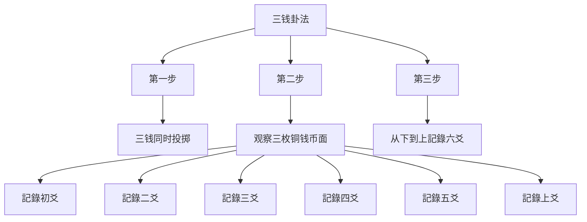
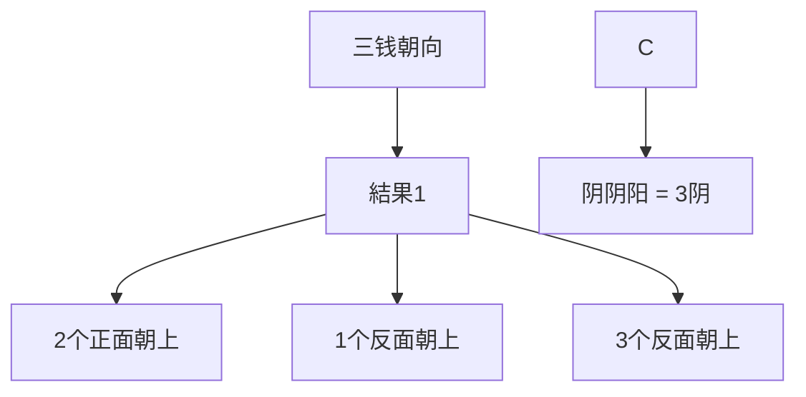
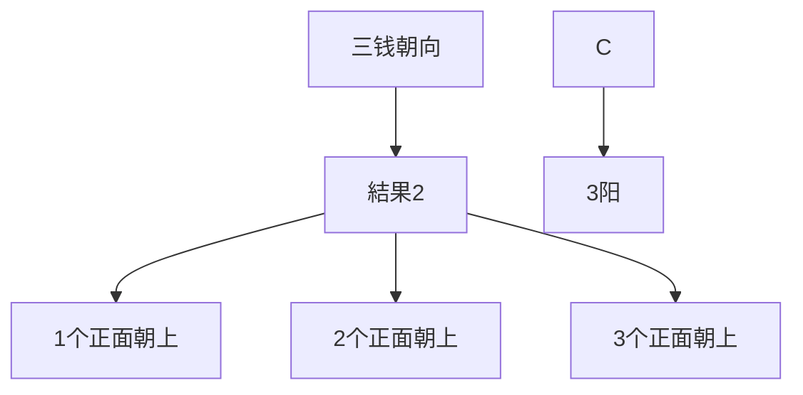
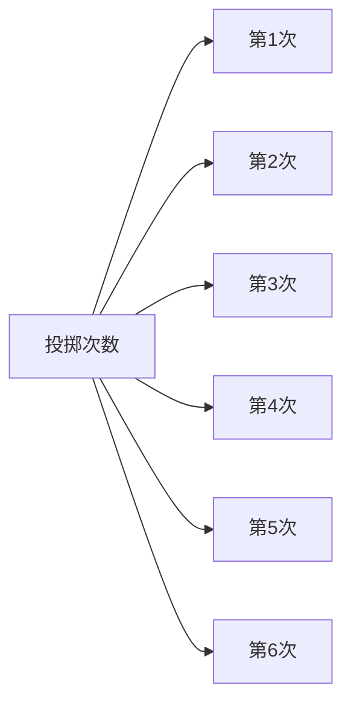
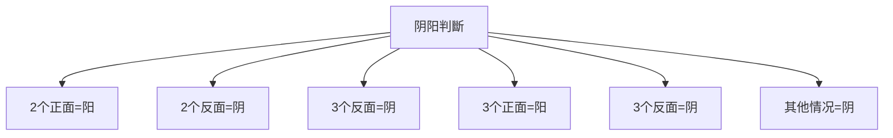
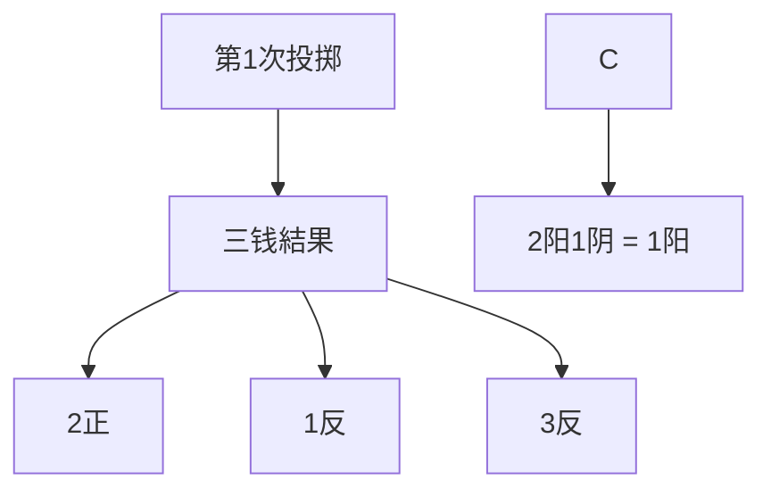
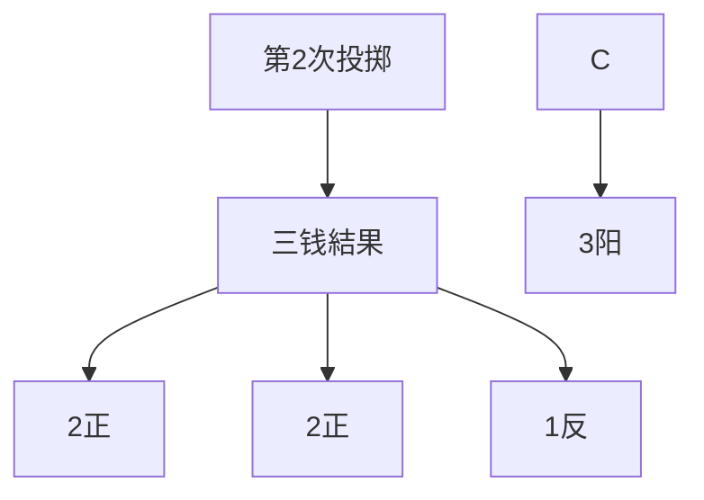
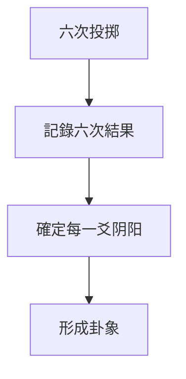
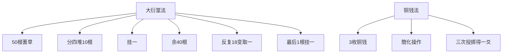

# 铜钱卦法

> 🎯 **學習目標**：掌握金钱卦法的基本操作步骤、簡化特點和起卦技巧，理解其与大衍筮法的对应关系，能夠独立進行金钱卦占卜。

## 📚 铜钱卦法概述

### 什么是金钱卦法

# 方法

### 金钱卦法的优点

**簡化操作**：用铜钱蓍草，操作简单易学

**節省時間**：不需要复杂的蓍草准备和清洁

**便于普及**：更容易被初学者掌握和传播

**携带方便**：三枚铜钱随时可以進行占卜

## 🔄 铜钱卦法的操作步骤

### 基礎操作

#### 准备工作

**准备三枚铜钱**
- 材质：铜钱即可，不拘泥于特定朝代或面值
- 数量：三枚相同的铜钱
- 特征：最好選擇有正反两面区分明显的铜钱

#### 明确币面定义

**币面规定**：
- 正面：阳爻（—）
- 反面：阴爻（- -）
- 或：规定某一面为阳，另一面为阴

**币值规定**：
- 字面：4、5、6、8、9、0
- 花面：1、2、7、8、3

## 🔍 三钱起卦法

# 方法

#### 操作步骤

#### 第一步：三钱同时投掷
将三枚铜钱同时投掷，让铜钱自然落地。

#### 第二步：观察結果
記錄下三枚铜钱币面的朝向：
- **正面朝上**（阳爻）
- **反面朝上**（阴爻）

#### 第三步：从下到上記錄

按照从初爻到上爻的顺序，記錄六爻：

# 方法

**第一次投掷**：得到初爻（初爻）

**第二次投掷**：得到二爻（二爻）

繼續投掷，共六次，得到从初爻到上爻的六爻。

# 方法

#### 操作步骤

#### 第一步：第一枚铜钱投掷
投掷第一枚铜钱，观察币面朝向，記錄为初爻。

#### 第二步：第二枚铜钱投掷
投掷第二枚铜钱，观察币面朝向，記錄为二爻。

#### 第三步：第三枚铜钱投掷
投掷第三枚铜钱，观察币面朝向，記錄为三爻。

#### 第四步：重复上述過程
重复上述過程，記錄四爻、五爻、上爻。

## 📊 六爻的阴阳確定

### 阴阳判斷规则

#### 基本规则
- **阳爻（—）**：正面朝上
- **阴爻（- -）**：反面朝上

#### 变形规则

#### 实例說明

| 三钱正面数 | 三钱反面数 | 初爻（下爻） | 解釋 |
|-----------|-----------|-----------|------|
| 3 | 0 | 阳爻（—） | 3个正面，2个反面 |
| 0 | 3 | 阴爻（- -） | 0个正面，3个反面 |
| 2 | 1 | 阴爻（- -） | 2个正面，1个反面 |
| 1 | 2 | 阳爻（—） | 1个正面，2个反面 |
| 1 | 2 | 阴爻（- -） | 1个正面，2个反面 |
| 0 | 3 | 阴爻（- -） | 0个正面，3个反面 |

## 🎯 起卦实战演示

### �示一：構建乾卦（䷀）

#### 投掷過程

**第一次投掷（初爻）**

**第二次投掷（二爻）**

繼續投掷第三、四、五、六次，記錄各爻的阴阳。

#### 完整卦象結果

假设六次投掷的結果如下：
- 初爻：1阳2阴 = 阳爻（—）
- 二爻：3阳0阴 = 阳爻（—）
- 三爻：2阳1阴 = 阴爻（- -）
- 四爻：0阳3阴 = 阴爻（- -）
- 五爻：1阳2阴 = 阳爻（—）
- 上爻：3阳0阴 = 阳爻（—）

最终得到：䷀（乾卦）

### 演示二：構建坤卦（䷁）

#### 投掷過程

假设六次投掷結果如下：
- 初爻：0正3反 = 阴爻（- -）
- 二爻：1正2反 = 阳爻（—）
- 三爻：2正1反 = 阴爻（- -）
- 四爻：3正0反 = 阳爻（—）
- 五爻：0正3反 = 阴爻（- -）
- 上爻：1正2反 = 阳爻（—）

最终得到：䷁（坤卦）

## 🎯 实战练习

### 练习1：独立起卦

**任務要求**：
1. 按照三钱起卦法進行六次投掷
2. 記錄每次投掷的三钱朝向
3. 確定每一爻的阴阳
4. 写出最终的卦象

**參考結果**：

### 练习2：识别卦象

**任務要求**：
1. 给定一个卦象，反推可能的三钱朝向组合
2. 列举所有可能的三钱朝向组合
3. 驗證是否能夠得到该卦象

**示例**：
- 目標卦象：䷁（坤卦）
- 可能的三钱朝向组合：每次都是1正2反（0正3反）
- 驗證：这种组合确实能产生坤卦

## 💡 學習要點

### 操作步骤
1. **明确币面规则**：先確定哪一面是阳，哪一面是阴
2. **均匀用力**：每次投掷要均匀用力，确保随机性
3. **及时記錄**：每次投掷后立即記錄結果，避免遗忘
4. **从下到上**：严格按照从初爻到上爻的顺序記錄

### 理解原理
1. **50根蓍草簡化为3枚铜钱**：大衍之数五十，揲之四十有九，其余一分为二，各四十有九，揲之以四。
2. **每次投掷代表一次取蓍**：六次投掷模拟大衍之数的操作過程
3. **随机性原則**：铜钱的随机性对应了大衍筮法中的随机性

### 哜钱法与大衍筮法的对应

### 对应关系

### 主要簡化

1. **操作簡化**：从50根蓍草簡化为3枚铜钱
2. **時間節省**：大大缩短占卜時間
3. **门槛降低**：更容易被初学者掌握
4. **便于携带**：三枚铜钱随时可用

### 核心原理保持

1. **随机性**：保持与大衍筮法相同的随机性
2. **六次投掷**：每次投掷得一爻
3. **从下到上**：严格按照初爻到上爻的顺序
4. **阴阳判定**：根据2正1反=阳的规则判定阴阳

## 🔍 相關資源

- [[大衍筮法]] - 學習传统大衍筮法
# 方法
# 方法
- [[占卜中的心理投射]] - 理解占卜的心理機制

---
*創建時間: 2026-02-01*  
*分類: 4 Interests*
