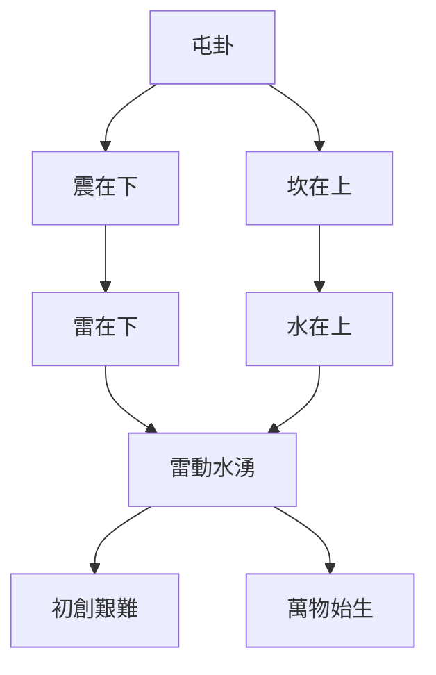
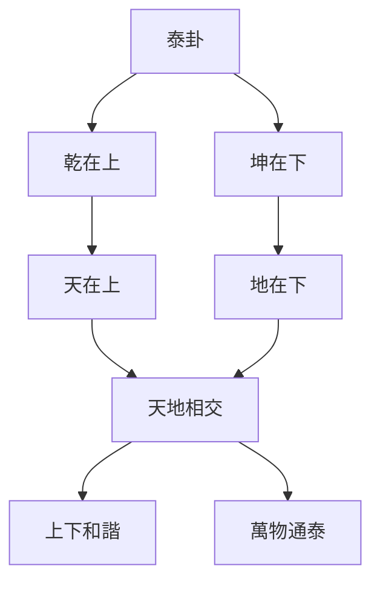
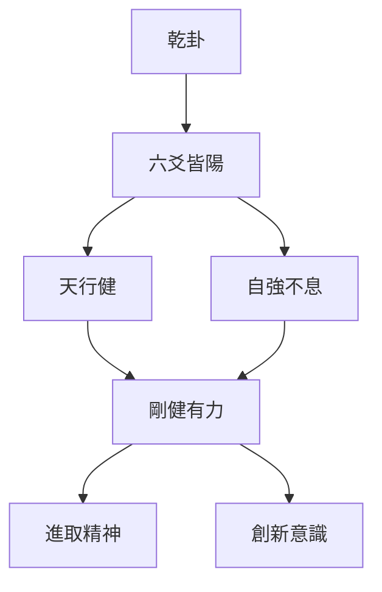

# 易理管理智慧

> 🎯 **學習目標**：掌握易經中的管理智慧，理解屯卦、泰卦、謙卦等重要卦象的管理啓示，能夠將易理應用於現代企業管理、團隊建設和領導力發展。

## 📚 易理管理概述

### 易經的管理哲學

《周易》不僅是一部占卜之書，更是一部蘊含深刻管理智慧的經典。易經通過六十四卦的卦象、卦辭、爻辭，闡述了豐富的管理思想和管理原則。這些智慧跨越千年，對現代企業管理仍有重要啓示。

### 易理管理的核心思想

**順應天時**：根據外部環境調整管理策略

**合乎地利**：利用內部資源和條件

**重視人和**：關注團隊能力和人際關係

**剛柔並濟**：根據情況靈活運用管理方式

**中正之道**：堅持中正原則，不走極端

## 🔄 屯卦的管理智慧

### 屯卦概述

屯卦（䷂）由震（雷）在坎（水）上組成，象徵"水雷屯"。

### 屯卦卦辭解析

**卦辭**："屯，元亨利貞，勿用有攸往，利建侯。"

**解析**：
- "屯"：艱難、創始
- "元亨利貞"：大吉大利，利於堅守
- "勿用有攸往"：不要急於行動
- "利建侯"：利於建立基業

**爻辭要點**：
- 初爻："磐桓，利居貞，利建侯。"
- 二爻："屯如邅如，乘馬班如，匪寇婚媾，女子貞不字，十年乃字。"
- 三爻："即鹿無虞，惟入於林中，君子幾不如舍，往吝。"
- 四爻："乘馬班如，求婚媾，往吉，無不利。"
- 五爻："屯其膏，小貞吉，大貞兇。"
- 上爻："乘馬班如，泣血漣如。"

### 屯卦的管理啓示

#### 啓示一：初創期管理

**初創期特點**：
- 萬物始生，前景廣闊
- 資源有限，困難重重
- 時機未到，需要等待

**管理策略**：
- 磐桓堅持：堅守創業初心，不輕言放棄
- 厚積薄發：積累資源和能力，等待時機
- 低調發展：避免過早暴露，減少競爭對手

#### 啓示二：艱難應對

**應對困難**：
- 承認困難：創業艱難是正常的
- 保持耐心：困難是暫時的
- 尋求突破：找到突破困境的方法

**管理方法**：
- 即鹿無虞：沒有嚮導不要盲目進入
- 幾不如舍：時機不成熟不如放棄
- 往吝：盲目行動會導致後悔

#### 啓示三：建立基業

**建立基業**：
- 利建侯：利於建立事業基業
- 積累資源：積累人力、財力、物力
- 建立團隊：建立核心團隊

**管理要點**：
- 確立目標：明確發展方向
- 建立制度：建立基本管理制度
- 培養文化：建立企業文化

## 🔄 泰卦的管理智慧

### 泰卦概述

泰卦（䷊）由乾（天）在坤（地）上組成，象徵"天地交泰"。

### 泰卦卦辭解析

**卦辭**："泰，小往大來，吉亨。"

**解析**：
- "泰"：通達、安泰
- "小往大來"：小的失去，大的得到
- "吉亨"：吉祥通達

**爻辭要點**：
- 初爻："拔茅茹，以其匯，徵吉。"
- 二爻："包荒，用馮河，不遐遺，朋亡，得尚於中行。"
- 三爻："無平不陂，無往不復，艱貞無咎。"
- 四爻："翩翩不富，以其鄰，不戒以孚。"
- 五爻："帝乙歸妹，以祉，元吉。"
- 上爻："城復於隍，勿用師，自邑告命，貞吝。"

### 泰卦的管理啓示

#### 啓示一：上下溝通

**天地相交的智慧**：
- 上位者要下交下位者
- 下位者要上求上位者
- 上下溝通順暢

**管理應用**：
- 建立溝通渠道：上下溝通渠道暢通
- 保持溝通頻率：定期溝通，及時反饋
- 溝通方式多樣：會議、郵件、面對面等多種方式

#### 啓示二：團隊和諧

**陰陽和合的藝術**：
- 剛柔相濟，不偏執一端
- 陰陽平衡，和諧共處
- 中正之道，不走極端

**管理應用**：
- 剛柔並用：嚴格管理與人文關懷結合
- 平衡發展：業務發展與團隊建設平衡
- 和諧共處：部門之間、員工之間和諧相處

#### 啓示三：吉祥通達

**通達的條件**：
- 順應天時：把握市場機遇
- 合乎地利：利用內部資源
- 得到人和：獲得團隊支持

**管理應用**：
- 時機成熟：在合適的時機推出合適的產品
- 利用資源：充分利用公司資源
- 贏得支持：獲得員工和客戶的支持

## 🔄 謙卦的管理智慧

### 謙卦管理啓示

#### 啓示一：謙遜領導

**謙遜的領導者**：
- 不驕傲自滿，保持謙虛
- 承認自己的不足
- 欣賞他人的優點

**管理應用**：
- 虛心學習：不斷學習，不斷提升
- 承認錯誤：勇於承認錯誤，及時改正
- 尊重他人：尊重員工，尊重同事

#### 啓示二：低調管理

**低調的智慧**：
- 高調容易招致嫉妒和敵意
- 低調可以避免不必要的麻煩
- 低調做事，高調做人

**管理應用**：
- 低調做人：不炫耀成就，不張揚業績
- 高調做事：高標準要求，高質量完成
- 成就團隊：將成就歸功於團隊

#### 啓示三：勞謙不伐

**勞謙的含義**：
- 勞：勤奮工作
- 謙：謙遜態度
- 不伐：不自誇

**管理應用**：
- 勤奮工作：以身作則，勤奮工作
- 謙遜態度：保持謙遜，不自高自大
- 不居功自傲：將成就歸功於團隊

## 🔄 乾卦的管理智慧

### 乾卦概述

乾卦（䷀）由六條陽爻組成，象徵"天"。

### 乾卦卦辭解析

**卦辭**："乾，元亨利貞。"

**解析**：
- "乾"：剛健、進取
- "元亨利貞"：大吉大利，利於堅守

**爻辭要點**：
- 初爻："潛龍勿用。"
- 二爻："見龍在田，利見大人。"
- 三爻："君子終日乾乾，夕惕若，厲無咎。"
- 四爻："或躍在淵，無咎。"
- 五爻："飛龍在天，利見大人。"
- 上爻："亢龍有悔。"

### 乾卦的管理啓示

#### 啓示一：自強不息

**乾卦的進取精神**：
- 天行健，君子以自強不息
- 不斷進取，永不滿足
- 持續創新，不斷超越

**管理應用**：
- 持續創新：不斷創新產品和服務
- 不斷進取：不斷追求更高的目標
- 永不滿足：不滿足現狀，持續改進

#### 啓示二：循序漸進

**六爻的發展階段**：
- 初爻：潛龍勿用（準備階段）
- 二爻：見龍在田（初步發展）
- 三爻：終日乾乾（努力奮鬥）
- 四爻：或躍在淵（突破發展）
- 五爻：飛龍在天（成功階段）
- 上爻：亢龍有悔（警惕階段）

**管理應用**：
- 準備階段：做好準備工作
- 初步發展：開始初步發展
- 努力奮鬥：持續努力奮鬥
- 突破發展：尋求突破發展
- 成功階段：取得成功
- 警惕階段：警惕驕傲自滿

#### 啓示三：剛柔並濟

**乾卦的剛健精神**：
- 剛健有力，不軟弱
- 積極主動，不被動
- 勇於擔當，不推卸

**管理應用**：
- 剛柔並用：嚴格管理與人文關懷結合
- 積極主動：主動發現問題，主動解決問題
- 勇於擔當：勇於承擔責任，勇於面對挑戰

## 💡 易理管理的現代應用

### 戰略管理

#### 順應天時（外部環境分析）

**天時的含義**：
- 市場環境：市場趨勢、競爭格局
- 政策環境：政策法規、政府支持
- 技術環境：技術發展、技術變革

**戰略應用**：
- 分析市場環境：瞭解市場趨勢，把握市場機遇
- 分析政策環境：瞭解政策法規，順應政策導向
- 分析技術環境：瞭解技術發展，把握技術機遇

#### 合乎地利（內部資源分析）

**地利的內容**：
- 人力資源：人才儲備、團隊能力
- 財務資源：資金實力、融資能力
- 物質資源：設備設施、技術專利

**戰略應用**：
- 利用人力資源：發揮人才優勢，提升團隊能力
- 利用財務資源：合理配置資金，提高資金效率
- 利用物質資源：充分利用設施，發揮專利價值

#### 重視人和（團隊能力建設）

**人和的內容**：
- 團隊能力：專業能力、協作能力
- 團隊文化：企業文化、價值觀
- 團隊士氣：工作積極性、滿意度

**戰略應用**：
- 提升團隊能力：培訓學習，提升專業技能
- 建設團隊文化：建立積極向上的企業文化
- 提高團隊士氣：激勵員工，提高工作積極性

### 團隊管理

#### 陰陽平衡（剛柔並濟）

**剛柔並濟的管理**：
- 剛：制度管理、績效考覈
- 柔：人文關懷、激勵激勵
- 剛柔並濟：制度管理與人文關懷結合

**團隊應用**：
- 建立制度：建立完善的制度體系
- 考覈績效：建立科學的績效考覈體系
- 人文關懷：關心員工，激勵員工

#### 天人合一（團隊和諧）

**天人合一的含義**：
- 天：公司目標、公司戰略
- 人：員工需求、員工發展
- 合一：公司目標與員工需求統一

**團隊應用**：
- 明確目標：明確公司目標和團隊目標
- 瞭解需求：瞭解員工需求和發展期望
- 目標統一：將公司目標與員工發展結合

### 領導力發展

#### 乾卦的領導力

**乾卦領導特質**：
- 自強不息：不斷進取，永不滿足
- 剛健有力：積極主動，勇於擔當
- 循序漸進：分階段發展，逐步推進

**領導力應用**：
- 自我提升：不斷學習，不斷提升
- 主動擔當：主動承擔責任，主動解決問題
- 循序漸進：分階段設定目標，逐步實現

#### 謙卦的領導力

**謙卦領導特質**：
- 謙遜有禮：保持謙遜，不驕傲自滿
- 低調做人：不炫耀成就，不張揚業績
- 勞謙不伐：勤奮工作，不居功自傲

**領導力應用**：
- 保持謙遜：虛心學習，承認不足
- 低調做人：低調做事，高調做人
- 成就團隊：將成就歸功於團隊

## 🎯 易理管理學習要點

### 理解易理管理思想

1. **屯卦的智慧**：初創期的管理，艱難應對，建立基業
2. **泰卦的智慧**：上下溝通，團隊和諧，吉祥通達
3. **謙卦的智慧**：謙遜領導，低調管理，勞謙不伐
4. **乾卦的智慧**：自強不息，循序漸進，剛柔並濟

### 應用易理管理

1. **戰略管理**：順應天時，合乎地利，重視人和
2. **團隊管理**：陰陽平衡，天人合一，剛柔並濟
3. **領導力發展**：自強不息，謙遜有禮，循序漸進

### 實踐管理原則

1. **順應天時**：根據外部環境調整管理策略
2. **合乎地利**：利用內部資源和條件
3. **重視人和**：關注團隊能力和人際關係
4. **剛柔並濟**：根據情況靈活運用管理方式

## 📊 易理管理圖表彙總

### 易卦管理智慧對照表

| 卦象 | 管理思想 | 管理原則 | 應用場景 |
|--[[易經中的處世哲學]]--|---------|---------|
| 屯卦 | 初創期管理 | 磐桓堅持，厚積薄發，低調發展 | 創業初期、新項目啓動 |
| 泰卦 | 上下溝通 | 天地相交，陰陽和合，吉祥通達 | 團隊建設、組織管理 |
| 謙卦 | 謙遜領導 | 謙遜有禮，低調做人，勞謙不伐 | 領導力發展、團隊管理 |
| 乾卦 | 自強不息 | 剛健有力，循序漸進，剛柔並濟 | 戰略管理、創新管理 |

### 易理管理三要素表

| 要素 | 內容 | 含義 | 應用 |
|------|------|------|------|
| 天時 | 外部環境 | 市場環境、政策環境、技術環境 | 戰略規劃、機會把握 |
| 地利 | 內部資源 | 人力資源、財務資源、物質資源 | 資源配置、能力建設 |
| 人和 | 團隊能力 | 專業能力、團隊文化、團隊士氣 | 團隊建設、激勵管理 |

## 🔗 相關資源

- [[易經中的處世哲學]] - 處世哲學思想
- [[陰陽變化與變易之道]] - 變易哲學
- [[易學與現代生活]] - 現代生活應用
- [[易經與決策智慧]] - 決策智慧應用
- [[個人修身與易經]] - 個人修養指導

---
*創建時間: 2026-02-01*  
*分類: 4 Interests*
