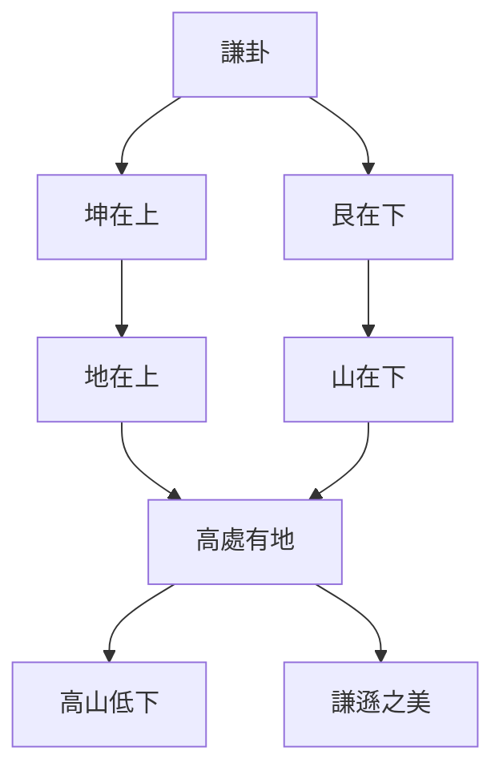
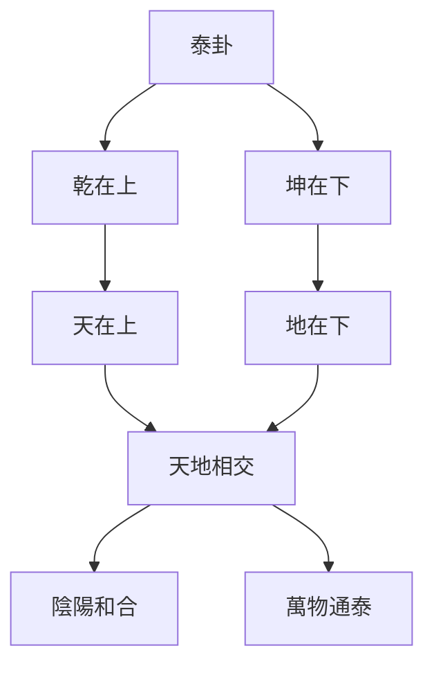
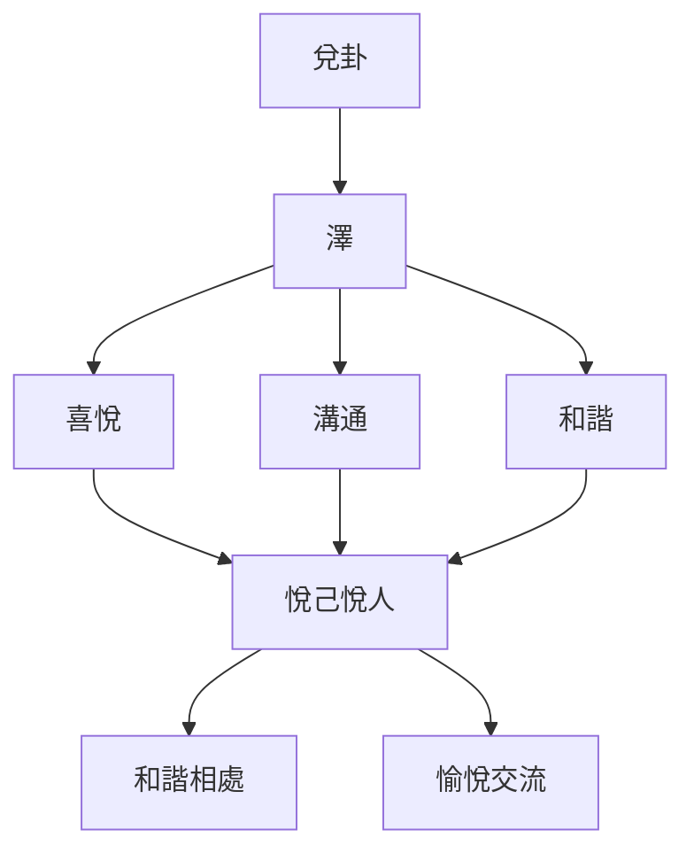
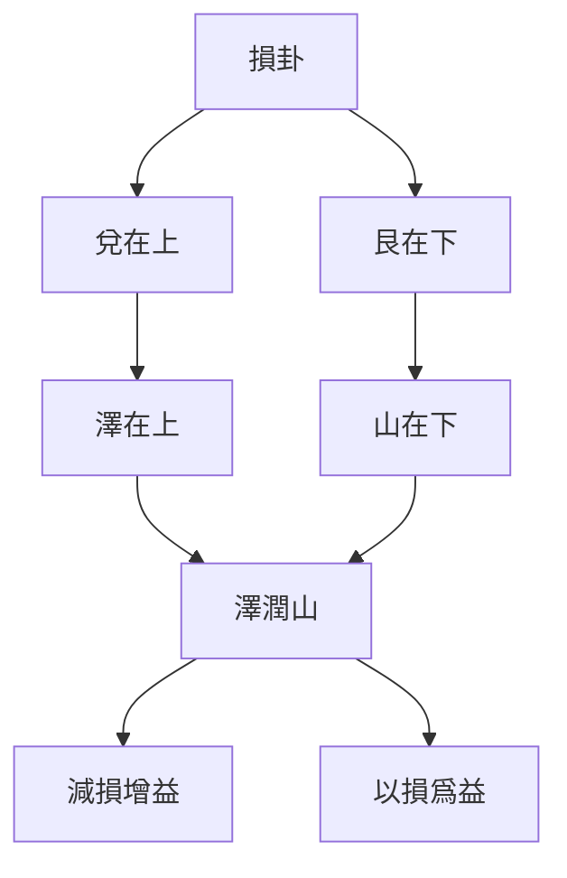

# 易經中的處世哲學

> 🎯 **學習目標**：掌握易經中的處世哲學思想，理解謙卦、兌卦、泰卦等重要卦象的處世智慧，能夠在現實生活中運用易經哲學指導人際交往和處世之道。

## 📚 易經處世哲學概述

### 易經的處世智慧

《周易》不僅是占卜之書，更是人生智慧的寶庫。易經通過六十四卦的卦象、卦辭、爻辭，闡述了豐富而深刻的處世哲學。這些智慧跨越千年，對現代人的處世之道仍有重要啓示。

### 易經處世哲學的核心

**順應天時**：根據時機調整處世策略

**中正之道**：堅持中正原則，不走極端

**謙遜持重**：保持謙遜態度，避免驕傲自滿

**剛柔並濟**：根據情況靈活運用剛柔

**知進知退**：懂得進退時機，避免盲目行動

## 🔄 謙卦的處世智慧

### 謙卦概述

謙卦（䷎）由坤（地）在艮（山）上組成，象徵"地山謙"。

### 謙卦卦辭解析

**卦辭**："謙，亨，君子有終。"

**解析**：
- "謙"：謙虛、謙遜
- "亨"：通達、順利
- "君子有終"：君子會有好的結果

**爻辭要點**：
- 初爻："謙謙君子，用涉大川，吉。"
- 二爻："鳴謙，貞吉。"
- 三爻："勞謙，君子有終，吉。"
- 四爻："無不利，揮謙。"
- 五爻："不富以其鄰，利用侵伐，無不利。"
- 上爻："鳴謙，利用行師，徵邑國。"

### 謙卦處世原則

#### 原則一：謙遜有禮

**謙遜的力量**：
- 謙遜不是軟弱，而是智慧
- 謙遜的人更容易獲得他人的尊重和幫助
- 謙遜是成長的基礎

**實踐方法**：
- 多聽少說，虛心學習
- 承認自己的不足
- 欣賞他人的優點

#### 原則二：低調做人

**低調的智慧**：
- 高調容易招致嫉妒和敵意
- 低調可以避免不必要的麻煩
- 低調做事，高調做人

**實踐方法**：
- 成功時不炫耀
- 有能力但不張揚
- 保持謙虛的態度

#### 原則三：勞謙不伐

**勞謙的含義**：
- 勞：勤奮工作
- 謙：謙遜態度
- 不伐：不自誇

**實踐方法**：
- 努力工作但不炫耀
- 取得成績不居功
- 始終保持謙遜

## 🔄 泰卦的處世智慧

### 泰卦概述

泰卦（䷊）由乾（天）在坤（地）上組成，象徵"天地交泰"。

### 泰卦卦辭解析

**卦辭**："泰，小往大來，吉亨。"

**解析**：
- "小往大來"：小的失去，大的得到
- "吉亨"：吉祥通達

**爻辭要點**：
- 初爻："拔茅茹，以其匯，徵吉。"
- 二爻："包荒，用馮河，不遐遺，朋亡，得尚於中行。"
- 三爻："無平不陂，無往不復，艱貞無咎。"
- 四爻："翩翩不富，以其鄰，不戒以孚。"
- 五爻："帝乙歸妹，以祉，元吉。"
- 上爻："城復於隍，勿用師，自邑告命，貞吝。"

### 泰卦處世原則

#### 原則一：天地相交

**相交的智慧**：
- 上位者要下交下位者
- 下位者要上求上位者
- 上下溝通順暢

**實踐方法**：
- 上級要關心下屬
- 下級要尊重上級
- 建立良好的溝通渠道

#### 原則二：陰陽和合

**和合的藝術**：
- 剛柔相濟，不偏執一端
- 陰陽平衡，和諧共處
- 中正之道，不走極端

**實踐方法**：
- 根據情況調整處事風格
- 剛柔並用，靈活變通
- 保持平衡和諧

#### 原則三：吉祥通達

**通達的條件**：
- 順應天時
- 合乎地利
- 得到人和

**實踐方法**：
- 時機成熟時果斷行動
- 利用有利條件
- 爭取他人支持

## 🔄 兌卦的處世智慧

### 兌卦概述

兌卦（䷹）由兌（澤）組成，象徵"澤"和"悅"。

### 兌卦卦辭解析

**卦辭**："兌，亨，利貞。"

**解析**：
- "兌"：喜悅、溝通
- "亨"：通達、順利
- "利貞"：利於堅守正道

**爻辭要點**：
- 初爻："和兌，吉。"
- 二爻："孚兌，吉，悔亡。"
- 三爻："來兌，兇。"
- 四爻："商兌未寧，介疾有喜。"
- 五爻："孚於剝，有厲。"
- 上爻："引兌。"

### 兌卦處世原則

#### 原則一：和兌吉祥

**和兌的含義**：
- 和：和諧、和睦
- 兌：喜悅、溝通
- 和兌：和諧喜悅地溝通

**實踐方法**：
- 用喜悅的態度與人交流
- 保持和諧的人際關係
- 創造愉悅的溝通氛圍

#### 原則二：孚兌有信

**孚兌的含義**：
- 孚：誠信、信任
- 兌：溝通
- 孚兌：真誠地溝通

**實踐方法**：
- 說話真誠，不虛僞
- 守信踐諾，建立信任
- 用誠信贏得他人的尊重

#### 原則三：溝通有道

**溝通的原則**：
- 選擇合適的時機
- 使用恰當的方式
- 保持真誠的態度

**實踐方法**：
- 言語溫和，不傷人
- 傾聽他人，理解對方
- 表達清晰，避免誤解

## 🔄 損卦的處世智慧

### 損卦概述

損卦（䷨）由兌（澤）在艮（山）上組成，象徵"澤山損"。

### 損卦卦辭解析

**卦辭**："損，有孚，元吉，無咎，可貞，利有攸往。曷之用？二簋可用享。"

**解析**：
- "損"：減損、損失
- "有孚"：有誠信
- "元吉"：大吉大利
- "無咎"：沒有過錯

**爻辭要點**：
- 初爻："已事遄往，無咎，酌損之。"
- 二爻："利貞，徵兇，弗損益之。"
- 三爻："三人行，則損一人；一人行，則得其友。"
- 四爻："損其疾，使遄有喜，無咎。"
- 五爻："或益之，十朋之龜，弗克違，元吉。"
- 上爻："弗損益之，無咎，貞吉，利有攸往，得臣無家。"

### 損卦處世原則

#### 原則一：以損爲益

**損益的辯證**：
- 有失必有得
- 減損不一定是壞事
- 有時減損是爲了更大的收穫

**實踐方法**：
- 短期利益服從長期利益
- 個人利益服從集體利益
- 適當的減損可以獲得更大的回報

#### 原則二：誠信爲本

**誠信的重要性**：
- 誠信是處世的基礎
- 誠信可以化解矛盾
- 誠信可以贏得信任

**實踐方法**：
- 承諾要兌現
- 說話要算數
- 行爲要一致

#### 原則三：適時而損

**損的時機**：
- 在適當的時機減損
- 減損要適度
- 減損要合理

**實踐方法**：
- 根據情況決定是否減損
- 減損的幅度要適度
- 減損的方式要合理

## 🔄 中庸的處世哲學

### 中庸之道

#### 中庸的含義

**中**：
- 不偏不倚
- 不走極端
- 保持平衡

**庸**：
- 平常
- 恆常
- 守常

**中庸**：
- 中正平和的處世態度
- 不偏不倚的處事方法
- 恆久不變的道德原則

#### 中庸的實踐

**處世中庸**：
- 不偏執一端
- 不走極端
- 保持平衡和諧

**決策中庸**：
- 考慮各方利益
- 綜合各種因素
- 做出合理決策

**行爲中庸**：
- 言行得體
- 舉止大方
- 不卑不亢

## 💡 易經處世哲學的現代應用

### 職場處世

#### 上級對下級

**泰卦智慧**：
- 天地相交，上下和諧
- 關心下屬，傾聽意見
- 公正公平，賞罰分明

**謙卦智慧**：
- 謙遜有禮，不驕傲
- 承認下屬的貢獻
- 虛心學習，不斷進步

#### 下級對上級

**兌卦智慧**：
- 和兌吉祥，和諧溝通
- 孚兌有信，真誠交流
- 適時表達，不卑不亢

**損卦智慧**：
- 適時而損，合理讓步
- 誠信爲本，建立信任
- 以損爲益，獲得更大收穫

### 家庭處世

#### 夫妻相處

**泰卦智慧**：
- 夫妻和合，家庭和睦
- 相互尊重，相互支持
- 陰陽平衡，剛柔並濟

**兌卦智慧**：
- 和兌吉祥，愉快相處
- 孚兌有信，相互信任
- 溝通順暢，避免誤解

#### 親子關係

**謙卦智慧**：
- 父母謙遜，子女尊重
- 子女謙遜，父母關愛
- 相互學習，共同成長

**中庸智慧**：
- 嚴慈相濟，不偏不倚
- 寬嚴適度，恰到好處
- 平等對話，相互尊重

### 社交處世

#### 朋友相處

**兌卦智慧**：
- 和兌吉祥，和睦相處
- 孚兌有信，真誠相待
- 溝通順暢，增進友誼

**謙卦智慧**：
- 謙遜有禮，尊重他人
- 不驕不躁，平等待人
- 虛心學習，共同進步

#### 商業合作

**泰卦智慧**：
- 合作共贏，互利互惠
- 上下溝通，信息共享
- 陰陽和合，和諧共處

**損卦智慧**：
- 適當讓步，達成共識
- 誠信爲本，建立合作
- 以損爲益，獲得更大利益

## 🎯 學習要點

### 理解處世哲學

1. **謙卦的謙遜**：謙遜不是軟弱，而是智慧
2. **泰卦的和合**：天地相交，陰陽和合
3. **兌卦的溝通**：和諧溝通，真誠交流
4. **損卦的智慧**：以損爲益，適時減損
5. **中庸的中正**：不偏不倚，保持平衡

### 應用處世智慧

1. **職場應用**：運用易經智慧處理職場關係
2. **家庭應用**：運用易經智慧促進家庭和睦
3. **社交應用**：運用易經智慧改善人際關係
4. **商業應用**：運用易經智慧促進合作共贏

### 實踐處世原則

1. **謙遜持重**：保持謙遜，不驕傲自滿
2. **和合溝通**：和諧溝通，真誠交流
3. **中正之道**：不偏不倚，保持平衡
4. **剛柔並濟**：根據情況，靈活運用

## 📊 易經處世哲學圖表彙總

### 易卦處世原則對照表

| 卦象 | 核心思想 | 處世原則 | 應用場景 |
|------|---------|---------|---------|
| 謙卦 | 謙遜有禮 | 謙遜持重，低調做人 | 職場、社交、學習 |
| 泰卦 | 天地交泰 | 上下溝通，陰陽和合 | 團隊、家庭、合作 |
| 兌卦 | 和兌吉祥 | 和諧溝通，真誠交流 | 人際關係、談判、交流 |
| 損卦 | 以損爲益 | 適時減損，誠信爲本 | 合作、談判、利益分配 |

### 處世哲學實踐步驟

| 步驟 | 內容 | 方法 |
|------|------|------|
| 第一步 | 理解卦象 | 研讀卦辭、爻辭，理解卦象內涵 |
| 第二步 | 掌握原則 | 總結處世原則，明確指導方針 |
| 第三步 | 分析情境 | 分析具體情境，判斷適用原則 |
| 第四步 | 靈活應用 | 根據實際情況，靈活應用原則 |
| 第五步 | 反思總結 | 反思應用效果，總結經驗教訓 |

## 🔗 相關資源

- [[易經與現代生活]] - 易學現代生活應用
- [[易理管理智慧]] - 易學管理智慧
- [[陰陽變化與變易之道]] - 變易哲學
- [[個人修身與易經]] - 個人修養指導
- [[易經與人際關係]] - 人際關係處理

---
*創建時間: 2026-02-01*  
*分類: 4 Interests*
