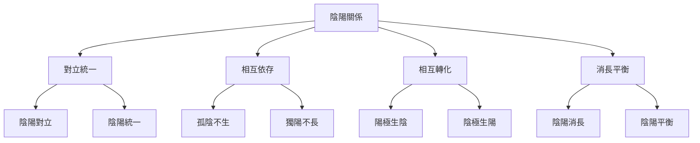
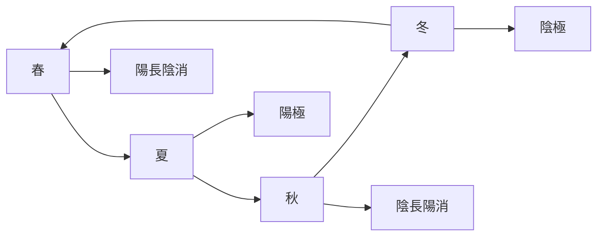

# 陰陽變化與變易之道

> 🎯 **學習目標**：深入理解易經中的陰陽哲學和變易思想，掌握陰陽變化的規律，理解變易不易簡易三義的深刻內涵，能夠在現實生活中運用變易智慧應對變化。

## 📚 陰陽哲學概述

### 陰陽的基本概念

陰陽是中國古代哲學的核心概念，也是易經哲學的基礎。陰陽表示宇宙萬物兩種對立統一的屬性，是一切變化的根源。

**陰陽的含義**：
- 陽：主動、剛健、向上、光明、熱、動、外、雄
- 陰：被動、柔順、向下、黑暗、冷、靜、內、雌

### 陰陽的辯證關係

### 陰陽的特徵

#### 特徵一：對立性

陰陽是兩種對立的屬性：
- 天與地、晝與夜、熱與冷、動與靜
- 這種對立性構成了宇宙的基本矛盾
- 對立性是變化的動力

#### 特徵二：統一性

陰陽在對立中統一：
- 陰陽相互依存，不能獨立存在
- 孤陰不生，獨陽不長
- 陰陽統一是和諧的基礎

#### 特徵三：轉化性

陰陽可以相互轉化：
- 陽極生陰，陰極生陽
- 物極必反，否極泰來
- 轉化是變化的形式

#### 特徵四：消長性

陰陽處於不斷的消長過程中：
- 陽消陰長，陰消陽長
- 消長是動態平衡的過程
- 消長推動事物發展

## 🔄 陰陽變化的規律

### 規律一：陰陽消長律

#### 消長的含義

**消長過程**：
- 陽長陰消：陽增長，陰減少
- 陰長陽消：陰增長，陽減少

**消長的特徵**：
- 消長是動態的、連續的過程
- 消長是循環的、往復的
- 消長是漸進的、累積的

#### 消長的應用

**四時消長**：

**晝夜消長**：
- 白晝：陽氣旺盛
- 黑夜：陰氣旺盛
- 日出日落：陰陽交替

### 規律二：陰陽轉化律

#### 轉化的條件

**轉化的條件**：
- 陰陽達到極點
- 條件發生變化
- 量變引起質變

**轉化的形式**：
- 陽極生陰：陽發展到極點轉化爲陰
- 陰極生陽：陰發展到極點轉化爲陽

#### 轉化的應用

**物極必反**：
- 事物發展到極點就會向反面轉化
- 榮極必衰，否極泰來
- 認識規律，避免極端

**應用實例**：
- 事業：成功到極點要警惕衰落
- 情緒：興奮到極點要保持冷靜
- 關係：親密到極點要保持距離

### 規律三：陰陽平衡律

#### 平衡的含義

**平衡的內涵**：
- 陰陽相對平衡
- 不是絕對平均
- 是動態平衡

**平衡的狀態**：
- 和諧：陰陽協調
- 穩定：相對靜止
- 健康：陰陽調和

#### 平衡的維持

**維持平衡的方法**：
- 調節陰陽，使陰陽相對平衡
- 避免陰陽失衡
- 保持動態平衡

**應用實例**：
- 身體健康：調節陰陽，保持健康
- 心理平衡：調節情緒，保持平衡
- 人際關係：調節關係，保持和諧

## 🔄 易理三義

### 變易

#### 變易的含義

**變易的定義**：
- 宇宙萬物都在不斷變化
- 沒有什麼是永恆不變的
- 變化是宇宙的基本規律

**變易的表現**：
- 自然變化：四季更替、日夜循環
- 社會變化：朝代更替、社會變革
- 人生變化：生老病死、成敗得失

#### 變易的智慧

**理解變化**：
- 認識變化的必然性
- 接受變化的客觀性
- 適應變化的規律性

**應對變化**：
- 順應變化，而非對抗變化
- 在變化中尋找機會
- 在變化中保持穩定

**應用實例**：
- 職業發展：適應行業變化，調整職業方向
- 人際關係：適應關係變化，調整相處方式
- 市場競爭：適應市場變化，調整經營策略

### 不易

#### 不易的含義

**不易的定義**：
- 變化的規律永恆不變
- 道德原則恆久不變
- 核心價值長久不變

**不易的表現**：
- 自然規律：陰陽變化規律永恆不變
- 道德原則：仁義禮智信恆久不變
- 核心價值：真善美長久不變

#### 不易的智慧

**找到不易**：
- 在變化中找到不變的規律
- 在變化中找到不變的原則
- 在變化中找到不變的價值

**堅持不易**：
- 堅持不變的原則
- 堅持不變的道德
- 堅持不變的價值

**應用實例**：
- 職業發展：堅持職業道德，變化工作內容
- 人際關係：堅持真誠待人，變化相處方式
- 市場競爭：堅持誠信經營，變化經營策略

### 簡易

#### 簡易的含義

**簡易的定義**：
- 掌握規律後變得簡單
- 複雜中有簡單
- 簡單中有道理

**簡易的表現**：
- 規律簡單：陰陽變化規律簡單
- 道理簡單：大道理往往是簡單的
- 方法簡單：有效的方法往往是簡單的

#### 簡易的智慧

**化繁爲簡**：
- 將複雜的問題簡化
- 找到問題的核心
- 用簡單的方法解決複雜問題

**簡而不簡**：
- 簡單但不簡單化
- 簡單但不失深度
- 簡單但不減效果

**應用實例**：
- 解決問題：找到問題的核心，用簡單的方法解決
- 學習方法：掌握核心規律，簡化學習方法
- 管理方法：簡化管理流程，提高管理效率

## 🔄 變易之道的生活應用

### 應對職場變化

#### 理解變化（變易）

**認識職場變化**：
- 行業變化：技術進步、市場變化
- 公司變化：戰略調整、人員變動
- 個人變化：職位變化、角色變化

**適應職場變化**：
- 持續學習，提升能力
- 調整心態，積極面對
- 抓住機會，主動求變

#### 堅持原則（不易）

**堅持職業原則**：
- 職業道德：誠信、責任、敬業
- 職業素養：專業、效率、創新
- 職業態度：積極、主動、負責

**堅持核心價值**：
- 堅持誠信：不欺騙、不虛僞
- 堅持責任：不推卸、不逃避
- 堅持創新：不固守、不停滯

#### 簡化方法（簡易）

**簡化工作方法**：
- 找到工作的核心
- 優化工作流程
- 提高工作效率

**簡化溝通方式**：
- 溝通直接、清晰
- 避免複雜、冗長
- 提高溝通效率

### 應對人際關係變化

#### 理解關係變化（變易）

**認識關係變化**：
- 關係性質變化：朋友變爲戀人、同事變爲朋友
- 關係強度變化：親密變疏遠、疏遠變親密
- 關係內容變化：工作關係變爲生活關係

**適應關係變化**：
- 接受變化，不抗拒
- 調整相處方式
- 尋找新的平衡

#### 堅持真誠（不易）

**堅持真誠待人**：
- 說話真誠：不虛僞、不欺騙
- 行爲真誠：不虛僞、不僞裝
- 態度真誠：不虛僞、不傲慢

**堅持尊重他人**：
- 尊重他人：不輕視、不嘲笑
- 理解他人：不指責、不抱怨
- 包容他人：不苛求、不苛責

#### 簡化相處（簡易）

**簡化相處方式**：
- 直接表達，不拐彎抹角
- 簡單相處，不復雜化
- 輕鬆交往，不沉重化

**簡化期望**：
- 期望合理，不苛刻
- 要求簡單，不繁瑣
- 目標明確，不模糊

### 應對人生變化

#### 理解人生變化（變易）

**認識人生變化**：
- 年齡變化：從年輕到年老
- 角色變化：從學生到職員、從單身到結婚
- 狀態變化：從健康到疾病、從成功到失敗

**接受人生變化**：
- 接受變化，不抗拒
- 適應變化，不固執
- 擁抱變化，不恐懼

#### 堅持價值觀（不易）

**堅持核心價值**：
- 真：追求真理，不說謊言
- 善：行善積德，不作惡事
- 美：追求美好，不醜陋

**堅持人生原則**：
- 負責任：對自己負責，對他人負責
- 守信用：言必信，行必果
- 有愛心：關愛他人，幫助他人

#### 簡化生活（簡易）

**簡化生活方式**：
- 簡化物質：不追求過多物質
- 簡化關係：保持簡單的人際關係
- 簡化慾望：減少不必要的慾望

**簡化思維**：
- 簡單思考：不復雜化問題
- 簡單決策：不猶豫不決
- 簡單生活：不復雜化生活

## 🎯 陰陽變化的學習要點

### 理解陰陽哲學

1. **陰陽的基本概念**：理解陰陽的含義和特徵
2. **陰陽的辯證關係**：理解陰陽的對立統一、相互依存、相互轉化、消長平衡
3. **陰陽變化的規律**：理解陰陽消長、轉化、平衡的規律

### 理解易理三義

1. **變易**：理解萬物皆變、變化的必然性
2. **不易**：理解規律永恆、原則不變
3. **簡易**：理解掌握規律後變得簡單

### 應用變易智慧

1. **應對變化**：認識變化、接受變化、適應變化
2. **堅持原則**：在變化中堅持不變的原則
3. **簡化方法**：化繁爲簡，用簡單的方法解決複雜問題

## 📊 陰陽變化圖表彙總

### 陰陽特徵對照表

| 特徵 | 陽 | 陰 |
|------|----|----|
| 性質 | 主動、剛健 | 被動、柔順 |
| 方向 | 向上 | 向下 |
| 狀態 | 明亮、熱 |[[易經中的處世哲學]]動 | 動 | 靜 |
| 位置 | 外 | 內 |
| 性別 | 雄 | 雌 |

### 陰陽變化規律表

| 規律 | 內容 | 應用 |
|------|------|------|
| 陰陽消長律 | 陽長陰消、陰長陽消 | 調節陰陽，保持平衡 |
| 陰陽轉化律 | 陽極生陰、陰極生陽 | 避免極端，防止轉化 |
| 陰陽平衡律 | 陰陽相對平衡 | 維持平衡，保持和諧 |

### 易理三義對照表

| 易義 | 含義 | 智慧 | 應用 |
|------|------|------|------|
| 變易 | 萬物皆變 | 理解變化，適應變化 | 接受變化，抓住機會 |
| 不易 | 規律永恆 | 找到不變，堅持不變 | 堅持原則，保持價值 |
| 簡易 | 掌握簡單 | 化繁爲簡，簡單有效 | 簡化方法，提高效率 |

## 🔗 相關資源

- [[易經中的處世哲學]] - 處世哲學思想
- [[易理管理智慧]] - 管理智慧應用
- [[易學與現代生活]] - 現代生活應用
- [[個人修身與易經]] - 個人修養指導
- [[易經與決策智慧]] - 決策智慧應用

---
*創建時間: 2026-02-01*  
*分類: 4 Interests*
