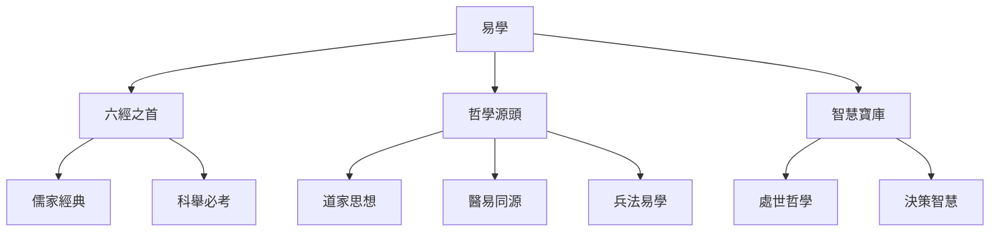
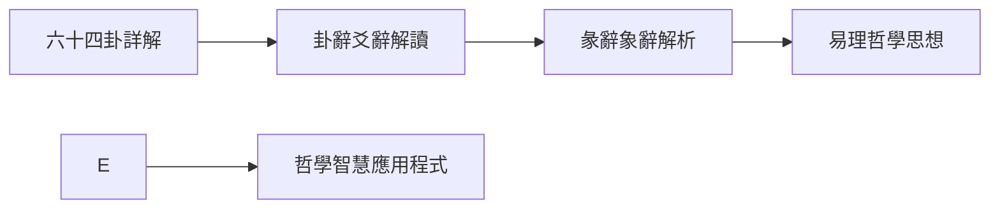
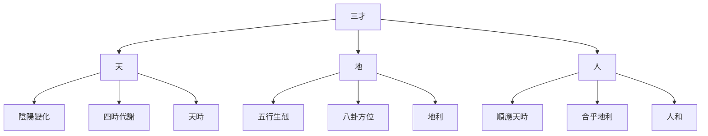

---
# 知識庫
status: active
priority: high
tags: [resource/interests/yijing, yixue, 易經, 國學, 東方智慧]
# 指南
created: 2026-02-01
---

# 知識庫

## 🎯 學習目標

- **初學者**：從零開始掌握《周易》的基本概念和哲學思想
# 方法
- **實踐者**：學會在現實生活中運用易學智慧
- **文化愛好者**：瞭解易學在中國文化史上的重要地位

## 📚 易學概述

### 什麼是易學

易學是研究《周易》的一門學問，是中華文明"大道之源"之一。《周易》包括《經》和《傳》兩個部分，不僅是中國傳統文化的瑰寶，也是對世界哲學思想的重要貢獻。

**易學三義**：
- **變易**：宇宙萬物都在不斷變化
- **不易**：變化的規律永恆不變
- **簡易**：掌握規律後變得簡單

### 易學在中國文化中的地位

# 知識庫

### 🔰 01 基礎入門 ✅
[[易學概述與發展史]] - 易學的起源、演變與歷史地位
[[易經結構與組成]] - 《經》《傳》的組成與六十四卦結構
[[八卦基礎與象徵]] - 先天后天八卦與象徵意義
[[陰陽五行理論基礎]] - 陰陽五行理論與在易學中的應用程式
# 方法

### 🔨 02 易經核心
[[六十四卦詳解]] - 每一卦的含義、卦辭、象辭與哲學內涵
[[十二訊息卦]] - 十二訊息卦與月令節氣的關係
[[彖辭象辭解析]] - 彖辭與象辭的哲學內涵與修辭藝術
[[易理哲學思想]] - 變易不易簡易三義與天人合一思想

### 03 占卜方法
[[銅錢卦法]] - 金錢卦法與簡化起卦技巧
[[六爻預測基礎]] - 六爻裝卦、世應六親與六神應用程式
[[現代易學應用]] - 數字卦法、時間卦法與心理投射理論

### 🚀 04 哲學智慧 ✅
[[易經中的處世哲學]] - 謙、柔、剛、中正等處世之道
[[陰陽變化與變易之道]] - 變化的哲學與順勢而爲的智慧
[[易學與現代生活]] - 易經在職場、家庭、健康中的應用程式
[[儒道釋三教融合]] - 易學與儒道釋三教的關係

### 💡 05 實踐應用程式 ✅
[[個人修身與易經]] - 自我認知、心性修養與命運理解
[[易經與決策智慧]] - 決策時機、風險評估與進退之道
[[易經與人際關係]] - 處世之道、人際交往與和諧共處
[[易經與健康養生]] - 五行臟腑、情緒調理與四季養生
[[現代易經案例解析]] - 現代生活應用程式實例與成功失敗案例分析

### 🛠️ 06 學習資源 ✅
[[經典文獻導讀]] - 《周易本義》《易經來注》等經典著作
[[易學流派與傳承]] - 象數易、義理易等流派與歷代易學家
[[推薦閱讀書單]] - 入門、進階、研究書籍推薦
[[線上學習資源]] - 線上課程、學習平臺與易學社羣

## 🗺️ 學習路徑圖

### 🟢 初學者路徑 (1-3個月)

### 🟡 進階路徑 (3-6個月)

### 🔴 專家路徑 (6-12個月)

## 📊 核心概念體系

### 三才之道

### 易學核心要素
| 要素 | 內涵 | 在易學中的作用 |
|------|------|---------------|
| **陰陽** | 萬物的兩種基本屬性 | 構成八卦、六十四卦的基礎 |
| **八卦** | 自然現象的抽象符號 | 象徵宇宙萬物的八種基本狀態 |
| **五行** | 木火土金水五種屬性 | 解釋事物之間的相生相剋關係 |
| **六十四卦** | 八卦的重疊組合 | 模擬宇宙萬物的六十四種基本狀態 |
| **卦辭** | 每一卦的整體說明 | 解釋一卦的核心含義 |
| **爻辭** | 每一爻的具體說明 | 解釋某一爻的特殊情況 |
| **彖辭** | 卦的總論 | 闡述一卦的哲學內涵 |
| **象辭** | 卦的象義 | 用形象比喻解釋卦的含義 |

## 🎯 學習重點

### 理論學習
- ✅ **掌握基礎理論**：陰陽五行、八卦象數
- ✅ **理解哲學思想**：變易不易簡易、天人合一
- ✅ **熟悉經典原文**：卦辭爻辭、彖辭象辭
- ✅ **瞭解歷史傳承**：三聖作易、歷代易學流派

### 實踐應用程式
# 方法
- ✅ **培養觀象能力**：從現象中體悟易理
- ✅ **運用於生活**：決策、處世、修身等
- ✅ **避免迷信化**：保持理性客觀的學習態度

## 💡 學習建議

### 正確的學習態度
1. **尊重傳統**：對傳統文化保持敬畏之心
2. **理性客觀**：避免陷入迷信和宿命論
3. **哲學導向**：注重易理的哲學內涵而非占卜結果
4. **循序漸進**：從基礎開始，不可急於求成
5. **理論實踐結合**：在理解理論的基礎上進行實踐

# 方法
1. **先讀原文**：先讀《周易》原文，建立初步認識
2. **參考註疏**：參考歷代注家，理解不同解讀
3. **融會貫通**：將八卦、五行、六十四卦聯繫起來
4. **生活實踐**：將易學智慧應用程式於日常生活
5. **長期堅持**：易學學習是長期過程，需要持續學習

### 注意事項
- ❌ **斷章取義**：避免只取一句卦辭就下定論
- ❌ **迷信占卜**：占卜是輔助決策的工具，不是決定命運的依據
# 方法
- ❌ **急於求成**：易學博大精深，需要長期積累
- ❌ **教條化應用程式**：避免生搬硬套，要因時因地因人制宜

## 📈 學習進度追蹤

### 🏆 成就係統
- 🥉 新手：完成基礎理論學習，理解陰陽五行、八卦基礎
- 🥈 學徒：能夠獨立進行基本占卜，理解六十四卦概覽
# 方法
- 👑 易師：能夠將易學智慧應用程式於實踐，有自己獨特的體悟

### 📊 技能評估
- **理論掌握**：理解陰陽五行、八卦象數、六十四卦基礎
- **實踐能力**：能夠獨立進行蓍草、銅錢等基本占卜
- **哲學理解**：理解變易不易簡易、天人合一等核心思想
- **應用程式能力**：能夠將易學智慧應用程式於生活決策和處世

## 🤝 學習社區

### 📚 優質學習資源
- **經典文獻**：《周易本義》《易經來注》《周易折中》等
- **現代著作**：南懷瑾《易經系傳別講》、傅佩榮《易經入門》等
- **線上課程**：各大平臺的易經課程
- **易學論壇**：易學愛好者的交流平臺

### 💬 交流學習
- **學習小組**：組建學習小組，共同研讀
- **線上社羣**：加入易學相關微信羣、QQ羣
- **專家講座**：參加易學專家的講座和課程
- **實踐交流**：與他人交流占卜經驗和體悟

## 🚀 開始你的易學之旅

### 🎓 推薦學習流程
1. **建立正確認識** - 瞭解易學的歷史地位和哲學價值
2. **學習基礎理論** - 陰陽五行、八卦象數
3. **研讀易經結構** - 六十四卦的結構和組成
# 方法
5. **深入易理哲學** - 彖辭象辭、哲學思想
6. **實踐應用程式生活** - 將易學智慧應用程式於生活

### 👀 快速導航
- 💚 **零基礎** → [[易學概述與發展史]]
- 🔵 **有基礎** → [[六十四卦詳解]]  
- 🟢 **想應用程式** → [[易經與決策智慧]]
- 🟡 **需深入** → [[經典文獻導讀]]

---
# 方法

**🌟 開始你的易學智慧探索之旅吧！**

---
*創建時間: 2026-02-01*  
*分類: 4 Interests*
