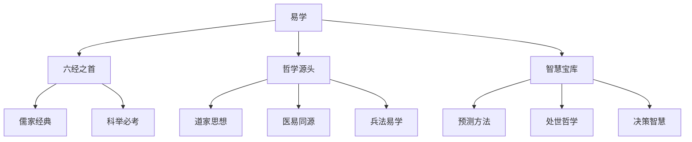

# 易学知识库导航

> 欢迎来到易学（易经）东方智慧知识库！这里涵盖了从基础入门到深入研究的《周易》全方位学习体系，探寻中华文明的哲学智慧。

## 🎯 学习目标

- **初学者**：从零开始掌握《周易》的基本概念和哲学思想
- **研究者**：深入研究《周易》的哲学内涵和实践方法
- **实践者**：学会在现实生活中运用易学智慧
- **文化爱好者**：了解易学在中国文化史上的重要地位

## 📚 易学概述

### 什么是易学

易学是研究《周易》的一门学问，是中华文明"大道之源"之一。《周易》包括《经》和《传》两个部分，不仅是中国传统文化的瑰宝，也是对世界哲学思想的重要贡献。

**易学三义**：
- **变易**：宇宙万物都在不断变化
- **不易**：变化的规律永恒不变
- **简易**：掌握规律后变得简单

### 易学在中国文化中的地位

## 📁 知识库结构

### 🔰 01 基础入门 ✅
[[易学概述与发展史]] - 易学的起源、演变与历史地位
[[易经结构与组成]] - 《经》《传》的组成与六十四卦结构
[[八卦基础与象征]] - 先天后天八卦与象征意义
[[阴阳五行理论基础]] - 阴阳五行理论与在易学中的应用
[[易学入门方法论]] - 学习易经的正确方法与学习路径

### 🔨 02 易经核心
[[六十四卦详解]] - 每一卦的含义、卦辞、象辞与哲学内涵
[[十二消息卦]] - 十二消息卦与月令节气的关系
[[卦辞爻辞解读]] - 卦辞与爻辞的解读方法与象数义理
[[彖辞象辞解析]] - 彖辞与象辞的哲学内涵与修辞艺术
[[易理哲学思想]] - 变易不易简易三义与天人合一思想

### 🌿 03 占卜方法
[[蓍草占卜法]] - 传统大衍筮法与操蓍方法
[[铜钱卦法]] - 金钱卦法与简化起卦技巧
[[梅花易数入门]] - 梅花易数的起卦方法与断卦技巧
[[六爻预测基础]] - 六爻装卦、世应六亲与六神应用
[[现代易学应用]] - 数字卦法、时间卦法与心理投射理论

### 🚀 04 哲学智慧
[[易经中的处世哲学]] - 谦、柔、刚、中正等处世之道
[[阴阳变化与变易之道]] - 变化的哲学与顺势而为的智慧
[[易理管理智慧]] - 屯卦、泰卦等企业管理启示
[[易学与现代生活]] - 易经在职场、家庭、健康中的应用
[[儒道释三教融合]] - 易学与儒道释三教的关系

### 💡 05 实践应用
[[个人修身与易经]] - 自我认知、心性修养与命运理解
[[易经与决策智慧]] - 决策时机、风险评估与进退之道
[[易经与人际关系]] - 处世之道、人际交往与和谐共处
[[易经与健康养生]] - 五行脏腑、情绪调理与四季养生
[[现代易经案例解析]] - 现代生活应用实例与成功失败案例分析

### 🛠️ 06 学习资源
[[经典文献导读]] - 《周易本义》《易经来注》等经典著作
[[学习方法与建议]] - 学习路径规划与理论实践结合
[[易学流派与传承]] - 象数易、义理易等流派与历代易学家
[[推荐阅读书单]] - 入门、进阶、研究书籍推荐
[[在线学习资源]] - 在线课程、学习平台与易学社群

## 🗺️ 学习路径图

### 🟢 初学者路径 (1-3个月)

### 🟡 进阶路径 (3-6个月)

### 🔴 专家路径 (6-12个月)

## 📊 核心概念体系

### 三才之道

### 易学核心要素
| 要素 | 内涵 | 在易学中的作用 |
|------|------|---------------|
| **阴阳** | 万物的两种基本属性 | 构成八卦、六十四卦的基础 |
| **八卦** | 自然现象的抽象符号 | 象征宇宙万物的八种基本状态 |
| **五行** | 木火土金水五种属性 | 解释事物之间的相生相克关系 |
| **六十四卦** | 八卦的重叠组合 | 模拟宇宙万物的六十四种基本状态 |
| **卦辞** | 每一卦的整体说明 | 解释一卦的核心含义 |
| **爻辞** | 每一爻的具体说明 | 解释某一爻的特殊情况 |
| **彖辞** | 卦的总论 | 阐述一卦的哲学内涵 |
| **象辞** | 卦的象义 | 用形象比喻解释卦的含义 |

## 🎯 学习重点

### 理论学习
- ✅ **掌握基础理论**：阴阳五行、八卦象数
- ✅ **理解哲学思想**：变易不易简易、天人合一
- ✅ **熟悉经典原文**：卦辞爻辞、彖辞象辞
- ✅ **了解历史传承**：三圣作易、历代易学流派

### 实践应用
- ✅ **学习占卜方法**：蓍草、铜钱、梅花易数等
- ✅ **培养观象能力**：从现象中体悟易理
- ✅ **运用于生活**：决策、处世、修身等
- ✅ **避免迷信化**：保持理性客观的学习态度

## 💡 学习建议

### 正确的学习态度
1. **尊重传统**：对传统文化保持敬畏之心
2. **理性客观**：避免陷入迷信和宿命论
3. **哲学导向**：注重易理的哲学内涵而非占卜结果
4. **循序渐进**：从基础开始，不可急于求成
5. **理论实践结合**：在理解理论的基础上进行实践

### 学习方法建议
1. **先读原文**：先读《周易》原文，建立初步认识
2. **参考注疏**：参考历代注家，理解不同解读
3. **融会贯通**：将八卦、五行、六十四卦联系起来
4. **生活实践**：将易学智慧应用于日常生活
5. **长期坚持**：易学学习是长期过程，需要持续学习

### 注意事项
- ❌ **断章取义**：避免只取一句卦辞就下定论
- ❌ **迷信占卜**：占卜是辅助决策的工具，不是决定命运的依据
- ❌ **忽视易理**：只学占卜方法不学易理，如同舍本逐末
- ❌ **急于求成**：易学博大精深，需要长期积累
- ❌ **教条化应用**：避免生搬硬套，要因时因地因人制宜

## 📈 学习进度追踪

### 🏆 成就系统
- 🥉 新手：完成基础理论学习，理解阴阳五行、八卦基础
- 🥈 学徒：能够独立进行基本占卜，理解六十四卦概览
- 🥇 学者：深入研读经典文献，掌握多种占卜方法
- 👑 易师：能够将易学智慧应用于实践，有自己独特的体悟

### 📊 技能评估
- **理论掌握**：理解阴阳五行、八卦象数、六十四卦基础
- **实践能力**：能够独立进行蓍草、铜钱等基本占卜
- **哲学理解**：理解变易不易简易、天人合一等核心思想
- **应用能力**：能够将易学智慧应用于生活决策和处世

## 🤝 学习社区

### 📚 优质学习资源
- **经典文献**：《周易本义》《易经来注》《周易折中》等
- **现代著作**：南怀瑾《易经系传别讲》、傅佩荣《易经入门》等
- **在线课程**：各大平台的易经课程
- **易学论坛**：易学爱好者的交流平台

### 💬 交流学习
- **学习小组**：组建学习小组，共同研读
- **在线社群**：加入易学相关微信群、QQ群
- **专家讲座**：参加易学专家的讲座和课程
- **实践交流**：与他人交流占卜经验和体悟

## 🚀 开始你的易学之旅

### 🎓 推荐学习流程
1. **建立正确认识** - 了解易学的历史地位和哲学价值
2. **学习基础理论** - 阴阳五行、八卦象数
3. **研读易经结构** - 六十四卦的结构和组成
4. **学习占卜方法** - 蓍草、铜钱等基本方法
5. **深入易理哲学** - 彖辞象辞、哲学思想
6. **实践应用生活** - 将易学智慧应用于生活

### 👀 快速导航
- 💚 **零基础** → [[易学概述与发展史]]
- 🔵 **有基础** → [[六十四卦详解]]  
- 🟢 **想应用** → [[易经与决策智慧]]
- 🟡 **需深入** → [[经典文献导读]]

---
> 💡 **学习提示**：《周易》是中华文明的智慧结晶，学习易学不仅是学习一种预测方法，更是学习一种看待世界、理解宇宙的哲学智慧。保持敬畏之心，持理性态度，循序渐进地学习，必能有所收获。

**🌟 开始你的易学智慧探索之旅吧！**

---
*创建时间: 2026-02-01*  
*分类: 4 Interests*
