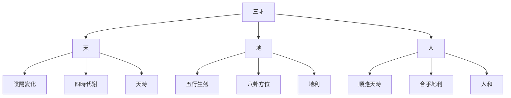

# 三才之道

## 概述

易學認爲宇宙由天道、地道、人道三個層次構成，這就是"三才之道"。三才之道是易學哲學的核心理念，體現了中國古代對宇宙萬物的根本認識。

## 三才的含義

### 天

**天的含義**：代表宇宙的自然法則和規律

**天的特性**：

**陰陽變化**：
- 陰陽的消長變化
- 陰陽的相互轉化
- 陰陽的動態平衡

**四時代謝**：
- 春夏秋冬四季的更替
- 二十四節氣的變化
- 自然界的新陳代謝

**天時**：
- 時機的把握
- 時勢的判斷
- 自然規律的順應

### 地

**地的含義**：代表物質世界和空間環境

**地的特性**：

**五行生剋**：
- 木火土金水五行相生相剋
- 五行的旺相休囚死
- 五行的動態平衡

**八卦方位**：
- 先天八卦的方位（先天八卦）
- 後天八卦的方位（後天八卦）
- 八卦與五行的對應關係

**地利**：
- 空間環境的選擇
- 地理位置的把握
- 自然環境的利用

### 人

**人的含義**：代表人類社會和人類活動

**人的特性**：

**順應天時**：
- 順應陰陽變化
- 把握時機時勢
- 順應自然規律

**合乎地利**：
- 選擇合適的環境
- 利用地理優勢
- 順應空間條件

**人和**：
- 人際關係的協調
- 社會關係的和諧
- 人與環境的統一

## 三才的關係

### 三才之間的相互關係

**天與地**：
- 天時地利：天時與地利結合
- 天地的協調：天地自然的和諧共存

**天與人**：
- 天人合一：人順應天時，與天合二爲一
- 天人關係：人參與自然，認識自然規律

**地與人**：
- 人地合一：人合乎地利，與地相處和諧
- 人地關係：人利用地利，改善生活環境

**天地人**：
- 三才合一：天時、地利、人和三者的統一
- 三才協調：天地人三者協調統一

### 三才的互動關係

**天制約人**：
- 天的規律制約人的活動
- 自然環境影響人的行爲
- 人需要順應天的規律

**人利用地**：
- 人利用地的資源
- 人改造地的環境
- 人與地和諧共存

**人認識天**：
- 人通過地認識天
- 人通過地理解天的規律
- 人通過天提升自己的境界

## 三才合一的智慧

### 天時地利人和

**天時地利人和**：
- 把握時機
- 利用優勢
- 人際和諧

**三者統一**：
- 天時、地利、人和三者統一
- 上下協調，內外兼顧

**平衡之道**：
- 追求三者的平衡
- 不偏廢某一方
- 和諧共存

### 三才在易學中的應用

**在占卜中的應用**：
- 天時：判斷占卜的時機
- 地利：判斷占卜的空間條件
- 人和：判斷占卜的人際關係

**在處世中的應用**：
- 順應天時：把握機會時勢
- 合乎地利：選擇合適的環境
- 追求人和：協調人際關係

**在決策中的應用**：
- 綜合考慮天時、地利、人和
- 三者統籌進行決策
- 不單獨某一方面的因素

## 三才的哲學意義

### 天道自然

**天人合一**：
- 人與自然的統一
- 人與宇宙的和諧
- 順應自然規律

**道法自然**：
- 道來自自然
- 人法遵循自然
- 人與自然協調共處

### 人法天地

**順應自然**：
- 人應該順應自然規律
- 不違反自然法則
- 與自然環境和諧共處

**利用自然**：
- 合理利用自然資源
- 保護自然環境
- 人與自然可持續發展

## 三才的現代意義

### 生態環境

**天人合一的現代詮釋**：
- 人與自然環境的和諧
- 可持續發展的人類社會
- 人與自然的可持續發展

**生態文明建設**：
- 尊重天時、地利、人和
- 建設可持續發展的人類社會
- 實現人與自然的和諧

### 可持續發展

**三才平衡**：
- 維持天時、地利、人和的平衡
- 避免破壞任何一方的平衡
- 確保人類社會的長期發展

**和諧共存**：
- 追求天地人的和諧
- 人類與自然的協調共處
- 人類社會的長期繁榮

## 學習建議

1. **理解三才**：深入理解天、地、人三才的含義和關係
2. **領悟合一**：領悟天人合一、天時地利人和的智慧
3. **實踐應用**：將三才之道應用於實際生活和決策
4. **平衡發展**：追求天時、地利、人和的平衡發展

## 相關資源

- [[易學概述]] - 易學的基本概念
- [[陰陽理論]] - 陰陽的基本概念和關係
- [[五行理論]] - 五行的基本概念和屬性
- [[易理哲學思想]] - 變易不易簡易三義與天人合一思想
- [[易經中的處世哲學]] - 謙、柔、剛、中正等處世之道

---
*創建時間: 2026-02-02*
*更新時間: 2026-02-02*
*分類: 4 Interests*
