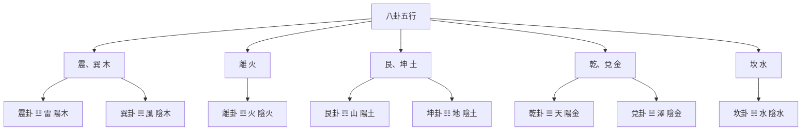

# 五行在八卦中的體現

## 八卦與五行的關係

八卦與五行有著密切的關係，每一個八卦都對應特定的五行。這種對應關係是易學佈局和占卜的重要基礎。

## 八卦五行對應關係

### 震、巽：屬木

**震卦 ☳**：
- 自然象徵：雷
- 五行：木
- 陰陽：陽木
- 特性：震動、生發、向上

**巽卦 ☴**：
- 自然象徵：風
- 五行：木
- 陰陽：陰木
- 特性：柔順、滲透、傳播

### 離：屬火

**離卦 ☲**：
- 自然象徵：火
- 五行：火
- 陰陽：陰火
- 特性：光明、溫暖、昇騰

### 艮、坤：屬土

**艮卦 ☶**：
- 自然象徵：山
- 五行：土
- 陰陽：陽土
- 特性：穩定、靜止、止息

**坤卦 ☷**：
- 自然象徵：地
- 五行：土
- 陰陽：陰土
- 特性：柔順、承載、包容

### 乾、兌：屬金

**乾卦 ☰**：
- 自然象徵：天
- 五行：金
- 陰陽：陽金
- 特性：剛健、主宰、領導

**兌卦 ☱**：
- 自然象徵：澤
- 五行：金
- 陰陽：陰金
- 特性：喜悅、溝通、交流

### 坎：屬水

**坎卦 ☵**：
- 自然象徵：水
- 五行：水
- 陰陽：陰水
- 特性：險陷、沈陷、流動

## 八卦五行對應圖

## 對應關係總結

| 八卦 | 符號 | 自然象徵 | 五行 | 陰陽 | 特性 |
|------|------|----------|------|------|------|
| 乾 | ☰ | 天 | 金 | 陽金 | 剛健、主宰、領導 |
| 兌 | ☱ | 澤 | 金 | 陰金 | 喜悅、溝通、交流 |
| 震 | ☳ | 雷 | 木 | 陽木 | 震動、生發、向上 |
| 巽 | ☴ | 風 | 木 | 陰木 | 柔順、滲透、傳播 |
| 坎 | ☵ | 水 | 水 | 陰水 | 險陷、沈陷、流動 |
| 離 | ☲ | 火 | 火 | 陰火 | 光明、溫暖、昇騰 |
| 艮 | ☶ | 山 | 土 | 陽土 | 穩定、靜止、止息 |
| 坤 | ☷ | 地 | 土 | 陰土 | 柔順、承載、包容 |

## 先天八卦與五行

先天八卦是伏羲八卦，體現了宇宙的本源狀態。

**先天八卦方位**：
- 乾：南（上）
- 坤：北（下）
- 離：東（左）
- 坎：西（右）
- 震：東北
- 巽：西南
- 艮：西北
- 兌：東南

**先天八卦與五行**：
- 體現了五行的本質和源頭
- 強調五行的先天屬性
- 用於理解五行的本質

## 後天八卦與五行

後天八卦是文王八卦，體現了宇宙的運動狀態。

**後天八卦方位**：
- 乾：西北
- 坤：西南
- 離：南
- 坎：北
- 震：東
- 巽：東南
- 艮：東北
- 兌：西

**後天八卦與五行**：
- 體現了五行的運動和變化
- 強調五行的後天應用
- 用於實際佈局和應用

## 應用意義

### 在佈局中的應用

**五行相生佈局**：
- 木火組合：東南方，適合辦公
- 火土組合：南方，適合社交
- 土金組合：西南方，適合休息
- 金水組合：西方，適合娛樂
- 水木組合：北方，適合學習

### 在占卜中的應用

**五行屬性判斷**：
- 根據卦的五行屬性判斷吉凶
- 五行相生相剋關係用於解卦
- 五行的旺相休囚死用於判斷卦象的強弱

### 在生活中的應用

**方位選擇**：
- 根據五行對應的方位進行房間佈局
- 根據五行對應的方位選擇居住環境
- 根據五行對應的方位進行活動安排

**人體對應**：
- 木行：肝、膽、目、筋
- 火行：心、小腸、舌、脈
- 土行：脾、胃、口、肉
- 金行：肺、大腸、鼻、皮
- 水行：腎、膀胱、耳、骨

## 學習建議

1. **記憶對應**：記憶八卦與五行的對應關係
2. **理解陰陽**：理解每個八卦的陰陽屬性
3. **聯繫應用**：將八卦五行對應關係聯繫到實際應用
4. **實踐應用**：將八卦五行對應關係應用於佈局和占卜

## 相關資源

- [[八卦基礎與象徵]] - 八卦的詳細解釋
- [[五行理論]] - 五行的基本概念和屬性
- [[五行相生相剋]] - 五行相生相剋關係
- [[陰陽五行關係]] - 陰陽與五行的關係
- [[陰陽五行在占卜中的應用]] - 五行在占卜中的應用

---
*創建時間: 2026-02-01*
*更新時間: 2026-02-02*
*分類: 4 Interests*
