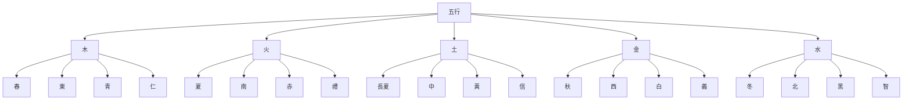

# 五行理論

## 什麼是五行

五行是中國古代哲學的另一個基本概念，用來解釋宇宙萬物的構成和相互關係。五行包括木、火、土、金、水五種基本元素，這五種元素之間存在相生相剋的關係。

五行思想同樣源遠流長，可以追溯到上古時期。人們通過觀察自然現象，發現宇宙萬物可以歸納爲五種基本屬性，逐漸形成了五行的哲學概念。

《尚書·洪範》中最早明確記載了五行："五行：一曰水，二曰火，三曰木，四曰金，五曰土。"

## 五行的基本屬性

五行各有其獨特的屬性，包括季節、方位、顏色、五德、特性、人體對應等。

### 五行總覽

## 五行的詳細屬性

### 木

**自然屬性**：
- 季節：春
- 方位：東
- 顏色：青（綠色）
- 五德：仁

**特性**：
- 生長、發展
- 條達、舒展
- 向上、向外

**人體對應**：
- 臟腑：肝、膽
- 五官：目（眼睛）
- 五體：筋（肌腱）
- 五志：怒
- 五味：酸

**象徵意義**：
- 代表生命力的生長和發展
- 體現了春天的生機勃勃
- 象徵仁愛和寬容的品質

### 火

**自然屬性**：
- 季節：夏
- 方位：南
- 顏色：赤（紅色）
- 五德：禮

**特性**：
- 炎熱、向上
- 光明、溫暖
- 興奮、活躍

**人體對應**：
- 臟腑：心、小腸
- 五官：舌
- 五體：脈（血管）
- 五志：喜
- 五味：苦

**象徵意義**：
- 代表熱情和活力
- 體現了夏天的熱烈
- 象徵禮儀和規範

### 土

**自然屬性**：
- 季節：長夏（夏季最後一個月）
- 方位：中
- 顏色：黃
- 五德：信

**特性**：
- 承載、生化
- 厚重、穩定
- 中和、協調

**人體對應**：
- 臟腑：脾、胃
- 五官：口
- 五體：肉（肌肉）
- 五志：思
- 五味：甘（甜）

**象徵意義**：
- 代表穩定和承載
- 體現了土地的厚重
- 象徵誠信和信任

### 金

**自然屬性**：
- 季節：秋
- 方位：西
- 顏色：白
- 五德：義

**特性**：
- 收斂、肅殺
- 堅硬、剛強
- 清潔、整齊

**人體對應**：
- 臟腑：肺、大腸
- 五官：鼻
- 五體：皮（皮膚）
- 五志：悲
- 五味：辛（辣）

**象徵意義**：
- 代表收斂和肅殺
- 體現了秋天的肅殺之氣
- 象徵正義和果斷

### 水

**自然屬性**：
- 季節：冬
- 方位：北
- 顏色：黑
- 五德：智

**特性**：
- 滋潤、向下
- 寒冷、沈澱
- 聰明、智慧

**人體對應**：
- 臟腑：腎、膀胱
- 五官：耳
- 五體：骨（骨骼）
- 五志：恐
- 五味：鹹

**象徵意義**：
- 代表智慧和沈澱
- 體現了冬天的寒冷和收藏
- 象徵智慧和機智

## 五行屬性對照表

| 屬性 | 木 | 火 | 土 | 金 | 水 |
|------|----|----|----|----|-----|
| 季節 | 春 | 夏 | 長夏 | 秋 | 冬 |
| 方位 | 東 | 南 | 中 | 西 | 北 |
| 顏色 | 青 | 赤 | 黃 | 白 | 黑 |
| 五德 | 仁 | 禮 | 信 | 義 | 智 |
| 特性 | 生髮條達 | 炎上光明 | 承載生化 | 收斂肅殺 | 滋潤向下 |
| 臟腑 | 肝膽 | 心小腸 | 脾胃 | 肺大腸 | 腎膀胱 |
| 五官 | 目 | 舌 | 口 | 鼻 | 耳 |
| 五體 | 筋 | 脈 | 肉 | 皮 | 骨 |
| 五志 | 怒 | 喜 | 思 | 悲 | 恐 |
| 五味 | 酸 | 苦 | 甘 | 辛 | 鹹 |

## 五行的哲學意義

### 整體觀念

五行體現了中國古代的整體觀念。

**萬物相關**：宇宙萬物都是相互聯繫的整體
**系統思維**：從整體出發考慮問題
**協調平衡**：追求五行之間的協調平衡

### 動態平衡

五行體現了動態平衡的思想。

**相互制約**：五行之間相互制約，維持平衡
**動態變化**：五行處於不斷的動態變化中
**和諧共存**：追求五行之間的和諧共存

### 辯證思維

五行體現了中國古代的辯證思維。

**相互聯繫**：五行之間相互聯繫，不是孤立的
**相互轉化**：五行在一定條件下可以相互轉化
**質量互變**：五行的量變達到一定程度會引起質變

## 五行的歷史發展

### 起源

上古時期，人們對物質的認識和觀察，逐漸形成了五行的概念。

### 發展

春秋戰國時期，《尚書·洪範》明確五行，諸子百家對五行進行了闡述。

### 成熟

漢代，五行的系統化，與陰陽學說結合，形成了完整的陰陽五行理論體系。

### 完善

宋明時期，理學家對五行進行了深入闡釋，將五行與理氣結合，形成了更加完善的理論體系。

## 五行的現代意義

### 哲學意義

五行理論體現了中國古代的辯證法思想，對現代哲學仍有啓發意義。

### 科學意義

五行理論雖然不是現代科學，但其整體觀念、平衡觀念對現代科學仍有借鑑意義。

### 文化意義

五行理論是中國傳統文化的重要組成部分，對現代文化仍有重要影響。

## 學習建議

1. **理解爲主**：理解五行的基本概念和屬性，不要死記硬背
2. **圖形結合**：結合五行圖、八卦圖等圖形來理解
3. **實踐應用**：將五行理論應用於實際生活，在實踐中加深理解
4. **理性客觀**：以理性客觀的態度學習五行，不要陷入迷信和神祕化

## 相關資源

- [[陰陽理論]] - 陰陽的基本概念和關係
- [[五行相生相剋]] - 五行相生相剋關係
- [[陰陽五行關係]] - 陰陽與五行的關係
- [[五行在八卦中的體現]] - 五行在八卦中的體現

---
*創建時間: 2026-02-01*
*分類: 4 Interests*
