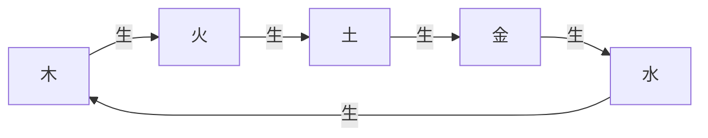
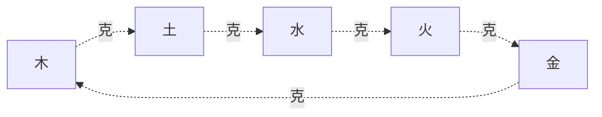

# 五行相生相剋

## 五行相生

五行相生是指五行之間存在促進、助長、滋生、幫助的關係。相生關係體現了事物之間的相互促進和良性循環。

### 相生循環

五行相生形成一個閉合的循環，木生火，火生土，土生金，金生水，水生木。

### 相生關係詳解

**木生火**：
- 物理解釋：木燃燒產生火
- 哲學含義：木代表生長，火代表熱情，生長的過程中會產生熱情
- 應用意義：在佈局中，木和火的組合表示生機勃勃

**火生土**：
- 物理解釋：火燃燒後變成灰燼，成爲土
- 哲學含義：火代表熱情，土代表穩定，熱情過後會回歸穩定
- 應用意義：在佈局中，火和土的組合表示熱情與穩定的結合

**土生金**：
- 物理解釋：土中埋藏金屬礦物
- 哲學含義：土代表穩定，金代表堅硬，穩定中會產生堅硬
- 應用意義：在佈局中，土和金的組合表示穩定與堅強的結合

**金生水**：
- 物理解釋：金屬冷卻後會凝結出水珠
- 哲學含義：金代表堅硬，水代表智慧，堅硬中會產生智慧
- 應用意義：在佈局中，金和水的組合表示堅強與智慧的結合

**水生木**：
- 物理解釋：水滋養樹木生長
- 哲學含義：水代表智慧，木代表生長，智慧會促進生長
- 應用意義：在佈局中，水和木的組合表示智慧與生長的結合

### 相生的規律

**順生**：
- 木生火，火生土，土生金，金生水，水生木
- 順生關係是正常的、有益的關係

**相生相對**：
- 每一行都有相對的一行和相生的一行
- 如：木生火，水生木；木是火的母，水是木的母

## 五行相剋

五行相剋是指五行之間存在制約、壓制、克服、控制的關係。相剋關係體現了事物之間的相互制約和平衡。

### 相剋循環

五行相剋也形成一個閉合的循環，木克土，土克水，水克火，火克金，金克木。

### 相剋關係詳解

**木克土**：
- 物理解釋：樹木的根可以破土而出
- 哲學含義：木代表生長，土代表穩定，生長會打破穩定
- 應用意義：在佈局中，木和土的組合可能會破壞穩定

**土克水**：
- 物理解釋：土可以吸收水分
- 哲學含義：土代表穩定，水代表智慧，穩定會限制智慧的流動
- 應用意義：在佈局中，土和水的組合可能會限制智慧的發揮

**水克火**：
- 物理解釋：水可以滅火
- 哲學含義：水代表智慧，火代表熱情，智慧會控制熱情
- 應用意義：在佈局中，水和火的組合表示智慧與熱情的平衡

**火克金**：
- 物理解釋：火的高溫可以熔化金屬
- 哲學含義：火代表熱情，金代表堅硬，熱情可以熔化堅硬
- 應用意義：在佈局中，火和金的組合表示熱情與堅硬的對抗

**金克木**：
- 物理解釋：金屬工具可以砍伐樹木
- 哲學含義：金代表堅硬，木代表生長，堅硬會限制生長
- 應用意義：在佈局中，金和木的組合可能會限制生長

### 相剋的規律

**順剋**：
- 木克土，土克水，水克火，火克金，金克木
- 順剋關係是正常的制約關係

**相剋相對**：
- 每一行都有相對的一行和相剋的一行
- 如：木克土，金克木；木克土，土是木的所勝；金克木，金是木的所不勝

## 五行的旺相休囚死

五行的旺相休囚死是指五行在不同時期的狀態，這是五行學說的重要概念。

### 基本概念

**旺**：處於最旺盛的狀態，得時當令
**相**：處於次旺盛的狀態，受旺行相生
**休**：處於休息的狀態，生旺行，力已盡
**囚**：處於受制狀態，被旺行所剋
**死**：處於最衰弱的狀態，被旺行所剋，且生旺行

### 四季五行的旺相休囚死

#### 春季（木旺）

- **木旺**：木得時當令，處於最旺盛狀態
- **火相**：木生火，火受木相生，處於次旺盛狀態
- **土休**：火生土，土生木，土生木後力已盡，處於休息狀態
- **金囚**：木克土，土生金，金受木所剋，處於受制狀態
- **水死**：水生木，水生木後力已盡，且被木所洩，處於最衰弱狀態

#### 夏季（火旺）

- **火旺**：火得時當令，處於最旺盛狀態
- **土相**：火生土，土受火相生，處於次旺盛狀態
- **金休**：土生金，金生火，金生火後力已盡，處於休息狀態
- **水囚**：火克金，金生水，水受火所剋，處於受制狀態
- **木死**：木生火，木生火後力已盡，且被火所洩，處於最衰弱狀態

#### 長夏（土旺）

- **土旺**：土得時當令，處於最旺盛狀態
- **金相**：土生金，金受土相生，處於次旺盛狀態
- **水休**：金生水，水生土，水生土後力已盡，處於休息狀態
- **木囚**：土克水，水生木，木受土所剋，處於受制狀態
- **火死**：火生土，火生土後力已盡，且被土所洩，處於最衰弱狀態

#### 秋季（金旺）

- **金旺**：金得時當令，處於最旺盛狀態
- **水相**：金生水，水受金相生，處於次旺盛狀態
- **木休**：水生木，木生金，木生金後力已盡，處於休息狀態
- **火囚**：金克木，木生火，火受金所剋，處於受制狀態
- **土死**：土生金，土生金後力已盡，且被金所洩，處於最衰弱狀態

#### 冬季（水旺）

- **水旺**：水得時當令，處於最旺盛狀態
- **木相**：水生木，木受水相生，處於次旺盛狀態
- **火休**：木生火，火生水，火生水後力已盡，處於休息狀態
- **土囚**：水克火，火生土，土受水所剋，處於受制狀態
- **金死**：金生水，金生水後力已盡，且被水所洩，處於最衰弱狀態

### 旺相休囚死對照表

| 季節 | 旺 | 相 | 休 | 囚 | 死 |
|------|----|----|----|----|-----|
| 春 | 木 | 火 | 土 | 金 | 水 |
| 夏 | 火 | 土 | 金 | 水 | 木 |
| 長夏 | 土 | 金 | 水 | 木 | 火 |
| 秋 | 金 | 水 | 木 | 火 | 土 |
| 冬 | 水 | 木 | 火 | 土 | 金 |

## 五行生剋的應用

### 在占卜中的應用

**生**：五行相生爲吉
- 表示事物得到促進和支持
- 順利、成功、吉祥

**克**：五行相剋爲兇
- 表示事物受到制約和壓制
- 困難、挫折、不順

**比**：五行相同爲和
- 表示事物處於和諧狀態
- 平穩、穩定、中庸

### 在佈局中的應用

**相生組合**：選擇相生關係的五行組合
- 表示促進和支持
- 如：木火組合、火土組合

**相剋組合**：避免相剋關係的五行組合
- 表示制約和壓制
- 如：木土組合、水火組合

**平衡佈局**：追求五行平衡
- 避免某一行過旺或過弱
- 追求和諧與平衡

## 五行生剋的哲學意義

### 辯證法思想

五行生剋體現了中國古代的辯證法思想。

**相互聯繫**：五行之間相互聯繫，不是孤立的
**相互制約**：五行之間相互制約，維持平衡
**相互轉化**：五行之間可以相互轉化

### 整體觀念

五行生剋體現了中國古代的整體觀念。

**系統思維**：從整體出發考慮問題
**協調平衡**：追求五行之間的協調平衡
**動態變化**：五行處於不斷的動態變化中

## 學習建議

1. **理解爲主**：理解五行生剋的基本原理，不要死記硬背
2. **圖形結合**：結合五行生剋圖來理解
3. **實踐應用**：將五行生剋理論應用於實際佈局，在實踐中加深理解
4. **理性客觀**：以理性客觀的態度學習五行生剋，不要陷入迷信和神祕化

## 相關資源

- [[陰陽理論]] - 陰陽的基本概念和關係
- [[五行理論]] - 五行的基本概念和屬性
- [[陰陽五行關係]] - 陰陽與五行的關係
- [[五行在占卜中的應用]] - 五行在占卜中的應用

---
*創建時間: 2026-02-01*
*分類: 4 Interests*
