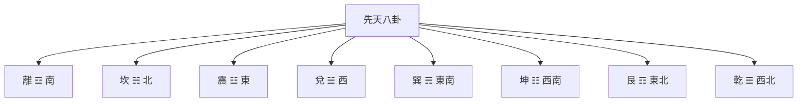

# 先天八卦

## 概述

先天八卦又稱**伏羲八卦**，相傳為伏羲氏所創。先天八卦強調宇宙的生成和演化過程，體現了"有生於無"的哲學思想。

## 八卦方位與順序

### 方位分布

### 卦序排列

先天八卦的順序（從一到八）：

1. **乾一**：天，宇宙的起源，☰ 西北
2. **兌二**：澤，天地的交融，☱ 西方
3. **離三**：火，能量的釋放，☲ 南方
4. **震四**：雷，生命的萌動，☳ 東方
5. **巽五**：風，萬物的生長，☴ 東南
6. **坎六**：水，生命的基础，☵ 北方
7. **艮七**：山，生命的形成，☶ 東北
8. **坤八**：地，萬物的母親，☷ 西南

## 天地定位

先天八卦最重要的特徵是"天地定位"：

- **乾（天）**在**西北**（天位）
- **坤（地）**在**西南**（地位）

其他六卦圍繞天地排列，體現了天地的主宰地位。

## 哲學內涵

### 宇宙生成觀

先天八卦體現了宇宙從無到有的生成過程：

**從無到有**：從乾（天）到坤（地），體現了從無到有的生成過程

**陰陽消長**：從乾到坤，體現了陰陽的消長過程

**天地定位**：乾上坤下，體現了天在上、地在下的宇宙觀

**萬物化生**：八卦象徵萬物的八種基本狀態，體現了萬物的生成過程

### 天道觀

先天八卦主要體現的是**天道**：

- 強調宇宙的自然演化規律
- 體現了自然的、本質的關係
- 反映了宇宙的原始狀態

## 特點總結

| 特點 | 說明 |
|------|------|
| 創造者 | 伏羲 |
| 哲學重點 | 宇宙生成、天道觀 |
| 卦序 | 乾兌離震巽坎艮坤 |
| 天地關係 | 乾西北，坤西南 |
| 主要體現 | 有生於無、陰陽消長 |

## 應用領域

- **易學理論**：理解宇宙生成和演化
- **風水學**：先天八卦用於理氣風水
- **哲學思考**：理解天人合一的思想

## 相關資源

- [[八卦基礎與象徵]] - 八卦的完整介紹
- [[後天八卦]] - 與先天八卦的對比
- [[先後天八卦的區別]] - 兩者的詳細對比
- [[三才之道]] - 天地人三才的說明

---
*創建時間: 2026-02-02*
