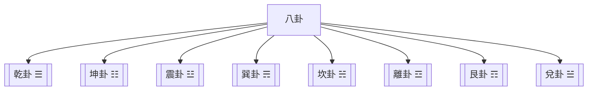

# 八卦基礎與象徵

> 🎯 **學習目標**：掌握八卦的基本構成、象徵意義、方位關係和先天后天八卦的區別，爲深入學習《周易》和易學哲學打下堅實基礎。

## 📚 八卦的基本概念

### 什麼是八卦

八卦是由三條爻組成的符號，每爻可以是陽爻（—）或陰爻（- -），因此八卦共有2³=8種組合。八卦是易學的基礎，象徵着宇宙萬物的八種基本狀態。

### 八卦的構成原理

詳細內容請參閱：[[八卦構成原理]]

### 八卦的構成原理

**三條爻**：八卦由三條爻組成，從下到上分別稱爲下爻、中爻、上爻。

**陽爻陰爻**：每爻可以是陽爻（—）或陰爻（- -）。

**八卦組合**：三條爻可以產生2³=8種組合，這就是八卦。

**爻位含義**：下爻代表地，中爻代表人，上爻代表天，體現了天、地、人三才之道。

## 🔵 先天八卦

詳細內容請參閱：[[先天八卦]]

## 🟡 後天八卦

詳細內容請參閱：[[後天八卦]]

## 🔤 先後天八卦的區別

詳細內容請參閱：[[先後天八卦的區別]]

## 📖 每一卦的詳細象徵

每個八卦的詳細象徵請參閱各個卦的專門筆記：

- [[乾卦 ☰]] - 天、父、君
- [[坤卦 ☷]] - 地、母、臣
- [[震卦 ☳]] - 雷、長男、動
- [[巽卦 ☴]] - 風、長女、入
- [[坎卦 ☵]] - 水、中男、陷
- [[離卦 ☲]] - 火、中女、附
- [[艮卦 ☶]] - 山、少男、止
- [[兌卦 ☱]] - 澤、少女、悅

## 🎯 八卦的哲學內涵

### 陰陽平衡

八卦體現了陰陽平衡的思想，每一卦都有特定的陰陽屬性。

**四陽四陰**：八卦中，乾、震、坎、艮是陽卦，兌、離、巽、坤是陰卦。

**陰陽中和**：每一卦都有陰陽，體現了陰陽中和的思想。

**剛柔並濟**：陽卦代表剛，陰卦代表柔，剛柔並濟才能達到和諧。

### 三才之道

八卦體現了天、地、人三才之道的思想。

**下爻**：代表地，體現地之德
**中爻**：代表人，體現人之德
**上爻**：代表天，體現天之德

天人合一，是易學的核心思想。

### 宇宙觀

八卦體現了古代中國的宇宙觀。

**天圓地方**：乾代表天，坤代表地，體現了天圓地方的宇宙觀。

**八極方位**：八卦對應八個方位，體現了對宇宙空間的認知。

**萬物生成**：八卦象徵萬物的八種基本狀態，體現了萬物生成的思想。

## 🔗 八卦與自然萬物的對應

詳細內容請參閱：[[八卦與自然萬物的對應]]

### 學習方法

詳細內容請參閱各個卦的專門筆記中的"應用層面"部分。

## 📚 學習建議

### 先理解後記憶

理解八卦的基本構成和象徵意義，然後再記憶，不要死記硬背。

### 圖形結合

結合八卦圖來理解，通過圖形可以更直觀地理解八卦的方位和關係。

### 實踐應用

將八卦的哲學思想應用於實際生活，在實踐中加深理解。

### 循序漸進

不要急於求成，先理解一兩個卦，然後逐步擴展到全部八卦。

## 🔗 相關資源

- [[易學概述與發展史]] - 瞭解易學的發展歷程
- [[易經結構與組成]] - 理解《周易》的基本結構
- [[MOC_陰陽五行理論基礎]] - 學習陰陽五行的基本理論
- [[六十四卦詳解]] - 系統學習每一卦

---
*創建時間: 2026-02-01*  
*分類: 4 Interests*
