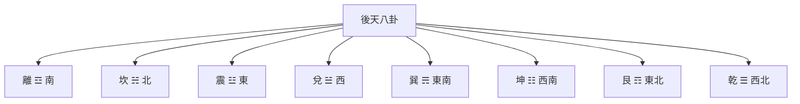

# 後天八卦

## 概述

後天八卦又稱**文王八卦**，相傳為周文王在先天八卦的基礎上重新排列而成。後天八卦強調萬物的生成和發展過程，體現了"生生不息"的哲學思想。

## 八卦方位與順序

### 方位分布

### 卦序排列（萬物生長循環）

後天八卦的順序反映了萬物的生長發展過程（從一到八）：

1. **震一**：春，萬物萌動，☳ 東方
2. **巽二**：春末，萬物生長，☴ 東南
3. **離三**：夏，萬物繁盛，☲ 南方
4. **坤四**：夏末，萬物成熟，☷ 西南
5. **兌五**：秋，萬物收穫，☱ 西方
6. **乾六**：秋末，陽氣收藏，☰ 西北
7. **坎七**：冬，萬物蟄伏，☵ 北方
8. **艮八**：冬末，萬物待生，☶ 東北

## 四季對應

後天八卦與四季密切對應：

| 季節 | 卦象 | 特徵 | 萬物狀態 |
|------|------|------|----------|
| 春 | 震、巽 | 生發 | 萌動、生長 |
| 夏 | 離、坤 | 繁盛 | 繁榮、成熟 |
| 秋 | 兌、乾 | 收斂 | 收穫、收藏 |
| 冬 | 坎、艮 | 蟄伏 | 休養、待生 |

## 哲學內涵

### 萬物發展觀

後天八卦體現了萬物的生長發展規律：

**春夏秋冬**：八卦對應四季，體現了季節的循環

**生生不息**：從震（萌動）到艮（待生），體現了生命循環不息的思想

**天地交感**：後天八卦體現了天地的交感互動

**人道體現**：後天八卦更側重於人道，強調人的作用

### 人道觀

後天八卦主要體現的是**人道**：

- 強調萬物的生長發展
- 體現了社會的、應用的關係
- 反映了萬物的實際狀態

## 特點總結

| 特點 | 說明 |
|------|------|
| 創造者 | 文王 |
| 哲學重點 | 萬物發展、人道觀 |
| 卦序 | 震巽離坤兌乾坎艮 |
| 天地關係 | 坎北，離南 |
| 主要體現 | 生生不息、四季循環 |

## 應用領域

- **風水學**：後天八卦用於形勢風水
- **占卜預測**：判斷事物的發展趨勢
- **農業曆法**：指導農時農事

## 與先天八卦的主要區別

| 特點 | 先天八卦 | 後天八卦 |
|------|----------|----------|
| 創造者 | 伏羲 | 文王 |
| 哲學重點 | 宇宙生成（天道） | 萬物發展（人道） |
| 卦序 | 乾兌離震巽坎艮坤 | 震巽離坤兌乾坎艮 |
| 天地定位 | 乾西北，坤西南 | 坎北，離南 |

## 相關資源

- [[八卦基礎與象徵]] - 八卦的完整介紹
- [[先天八卦]] - 與後天八卦的對比
- [[先後天八卦的區別]] - 兩者的詳細對比

---
*創建時間: 2026-02-02*
