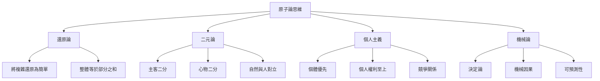
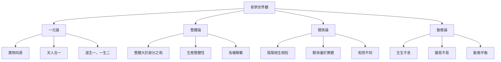
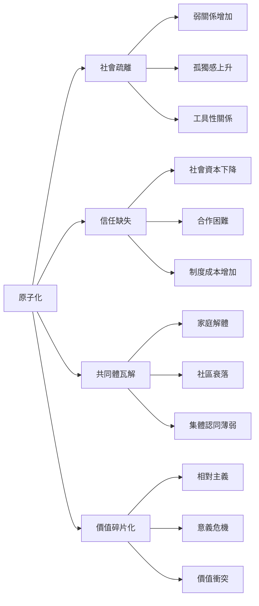
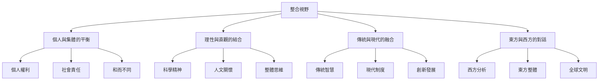

# 原子化哲學與易學的對比研究

> 🎯 **核心問題**：西方「原子化」思維與東方「天人合一」思想，如何看待個體與整體的關係？易學能否為現代社會的原子化困境提供解決方案？

---

## 📚 西方原子論哲學

### 歷史淵源

**德謨克利特（Democritus，約460-370 BC）**：

- 提出「原子論」：宇宙由不可分割的原子組成
- 原子是物質的最基本單位，在虛空中運動
- 世界是機械的、決定論的

**現代發展**：

- 牛頓力學：世界是機械的、可預測的
- 啟蒙運動：強調個人主義、理性主義
- 自由主義：個體是基本單位，社會是個體的集合

### 核心特徵

### 社會學意義上的「原子化」

**滕尼斯（Ferdinand Tönnies）**：從「共同體」到「社會」的轉變

- **共同體**：有機聯繫、情感紐帶、傳統約束
- **社會**：機械聯繫、理性契約、個體原子化

**現代社會的原子化表現**：

- 🔴 **人際疏離**：關係淺層化、工具化
- 🔴 **社會撕裂**：價值多元導致共識瓦解
- 🔴 **精神危機**：意義感缺失、存在焦慮
- 🔴 **生態危機**：人與自然對立、可持續性問題

---

## ☯️ 易學的整體觀與陰陽論

### 核心思想

**《繫辭上》**：
> 「一陰一陽之謂道，繼之者善也，成之者性也。」

**《繫辭下》**：
> 「易之爲書也，廣大悉備，有天道焉，有人道焉，有地道焉。」

### 易學的世界觀

### 易學的核心範疇

#### 1. 天人合一

- **人是自然的一部分**：人應順應自然規律
- **天人相應**：人的行為影響天，天的變化影響人
- **和諧共生**：不是征服自然，而是與自然協調

#### 2. 陰陽動態平衡

- **陰陽互根**：陰中有陽，陽中有陰
- **陰陽消長**：事物在陰陽之間流轉
- **中庸之道**：不偏不倚，恰到好處

#### 3. 變易與不易

- **變易**：宇宙萬物都在變化
- **不易**：變化的規律是永恆的
- **掌握規律**：理解變易才能應對變化

---

## ⚖️ 兩者的根本差異

### 對比表格

| 維度 | 西方原子論 | 東方易學 |
|------|-----------|---------|
| **本體論** | 原子是基本單元 | 氣是本源，陰陽是基本關係 |
| **認識論** | 分析還原 | 整體直觀 |
| **方法論** | 部分到整體 | 整體到部分 |
| **價值觀** | 個體優先 | 關係優先 |
| **自然觀** | 人與自然對立 | 天人合一 |
| **時間觀** | 線性進步 | 循環往復 |
| **思維方式** | 二元對立 | 辯證統一 |

### 深層差異分析

#### 1. 部分與整體的關係

**原子論**：
- 整體 = 部分之和
- 個體是第一性，整體是派生的
- 通過研究部分來理解整體

**易學**：
- 整體 > 部分之和（有機整體）
- 整體是第一性，個體是整體的展現
- 通過把握整體來理解部分

> **例子**：
> - 西方醫學：分解為器官、細胞、分子
> - 中醫（醫易同源）：整體觀，辨證論治

#### 2. 個體與社會的關係

**原子論**：
- 個體是目的，社會是手段
- 個體權利優先於社會利益
- 社會是個體的契約集合

**易學**：
- 個體在關係中定義
- 家國天下一體
- 個體的發展與整體和諧統一

> **例子**：
> - 西方：「我思故我在」——個體為本
> - 東方：「仁者愛人」——關係為本

#### 3. 人與自然的關係

**原子論**：
- 人與自然主客二分
- 人是主體，自然是客體
- 人可以征服、改造自然

**易學**：
- 天人合一
- 人是自然的一部分
- 人應順應自然、與自然和諧

> **例子**：
> - 西方：科技進步 = 征服自然
> - 東方：可持續發展 = 與自然協調

---

## 🌍 現代社會的原子化困境

### 表現

#### 1. 社會層面

#### 2. 個體層面

- 🔴 **意義缺失**：生活無明確目標和方向
- 🔴 **存在焦慮**：自由帶來的責任負擔
- 🔴 **身份認同危機**：在多元價值中迷失自我
- 🔴 **精神空虛**：物質豐富但精神貧乏

#### 3. 生態層面

- 🔴 **環境破壞**：資源過度開發、污染
- 🔴 **氣候危機**：人類活動導致氣候變化
- 🔴 **可持續性問題**：當代發展以犧牲後代為代價

### 原子化的哲學根源

西方哲學的原子論思維，在現代社會中演化為：

1. **個人主義極端化**：過分強調個體權利，忽視社會責任
2. **工具理性主導**：一切都可以量化、市場化、交易化
3. **價值相對主義**：沒有絕對價值，一切相對化
4. **實用主義勝利**：有用即真理，長遠價值被忽略

---

## 💡 易學的啟示：重尋整體性

### 1. 重建天人合一

**實踐路徑**：

- **敬畏自然**：認識到人的局限性
- **生態文明**：發展模式轉向可持續
- **簡單生活**：減少物質需求，回歸本質

> **《繫辭上》**：「天行健，君子以自強不息；地勢坤，君子以厚德載物。」

### 2. 重建人際和諧

**實踐路徑**：

- **強調關係**：人在關係中定義自己
- **責任倫理**：權利與責任並重
- **共同體意識**：重建社區、家庭、鄰里紐帶

> **《家人卦》**：「家人有嚴君焉，父母之謂也。父父子子，兄兄弟弟，夫夫婦婦，而家道正。」

### 3. 重建內在平衡

**實踐路徑**：

- **陰陽平衡**：工作與休息、競爭與合作、理性與感性
- **中庸之道**：不偏不倚，恰到好處
- **知止不殆**：知足常樂，適可而止

> **《謙卦》**：「謙，亨，君子有終。」

### 4. 重建意義世界

**實踐路徑**：

- **回歸傳統**：從文化傳統中汲取智慧
- **哲學導向**：將生活視為一種哲學實踐
- **精神修養**：通過學習、冥想、反思提升自我

> **《繫辭上》**：「易，窮則變，變則通，通則久。」

---

## 🔮 批判性反思

### 易學的局限性

1. **缺乏現代性**：易學是在農業文明時期形成的
2. **等級思想**：可能強化等級秩序
3. **模糊性**：缺乏精確性和可驗證性
4. **應用難度**：現代社會如何具體應用？

### 整合的可能性

**不是「非此即彼」，而是「兼收並蓄」**：

### 實踐框架

| 層次 | 原子論優勢 | 易學優勢 | 整合實踐 |
|------|-----------|---------|---------|
| **個體** | 自由、權利、創新 | 關係、責任、和諧 | 自由擔責，創新向善 |
| **社會** | 法治、市場、效率 | 禮治、德治、信任 | 法德兼治，效率公平 |
| **自然** | 科技、開發、進步 | 順應、節制、可持續 | 科技向善，綠色發展 |
| **精神** | 理性、實證、世俗 | 直觀、超越、意義 | 理性超越，世俗中尋神聖 |

---

## 📖 延伸思考

### 當代學者觀點

**杜維明**：
- 提出「儒家第三期發展」
- 強調「對話文明」：不同文明之間的對話

**成中英**：
- 提出「本體詮釋學」
- 企圖整合東西方哲學

**安樂哲（Roger Ames）**：
- 提出「角色倫理學」
- 批評西方個人主義，推崇東方關係本位

### 實踐案例

**日本「共生社會」**：
- 強調和諧與集體
- 同時保留個人創新空間

**北歐「可持續發展」**：
- 個人自由與社會福利並重
- 經濟發展與生態保護協調

**中國「人類命運共同體」**：
- 天人合一的現代詮釋
- 全球治理的新視野

---

## 🎯 結論

### 核心觀點

1. **原子化是現代性的副產品**：帶來自由與個體性，但也導致疏離與危機

2. **易學提供了一種整體性視野**：天人合一、陰陽平衡、關係本位

3. **關鍵是整合而非替代**：不是要回到過去，而是要吸收東方智慧，對現代性進行修正

4. **哲學思考的意義在於實踐**：將易學智慧轉化為現代生活的指導原則

### 個人啟示

對於當代人來說，易學的啟示在於：

- ✅ **在原子化的時代，重尋整體性**
- ✅ **在個人主義的時代，重建關係性**
- ✅ **在工具理性的時代，恢復價值理性**
- ✅ **在線性進步的時代，認識循環性**

> **最終**：易學不是要我們拒絕現代性，而是要我們以更智慧的方式生活於現代性之中。原子化帶來的自由是真實的，但自由的真正意義，或許在於如何自覺地選擇與他人、與自然、與整體建立有意義的關係。

---

## 🔗 相關資源

- [[易學概述與發展史]] - 瞭解易學的歷史與內涵
- [[易學學習態度]] - 如何以哲學導向學習易學
- [[MOC_陰陽五行理論基礎]] - 掌握陰陽五行的基礎理論

---

*創建時間: 2026-02-02*
*分類: 4 Interests*
*標籤: #哲學對比 #東西方哲學 #易學應用*
