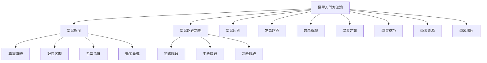

# 易學入門方法論

> 📖 本文檔是易學入門的總綱，提供了系統的學習方法論。各個主題已原子化為獨立筆記，可點擊連結深入閱讀。

## 📚 學習框架概覽

易學入門學習包含以下核心模塊：

1. **[[易學學習態度]]** - 建立正確的學習態度
2. **[[易學學習路徑規劃]]** - 初中高三階段學習計劃
3. **[[易學學習原則]]** - 四大學習原則
4. **[[易學學習常見誤區]]** - 避免五大學習誤區
5. **[[易學學習效果檢驗]]** - 三個層次的檢驗標準
6. **[[易學學習建議]]** - 實用學習建議
7. **[[易學學習技巧]]** - 記憶、理解、應用技巧
8. **[[易學推薦學習資源]]** - 書籍和線上資源
9. **[[易學學習順序]]** - 10步學習順序

---

## 📖 快速導航

### 🎯 建立學習基礎

開始學習前，首先要建立正確的學習態度：

- **[[易學學習態度]]** - 學習易學需要什麼樣的態度？
  - 尊重傳統
  - 理性客觀
  - 哲學深度
  - 循序漸進

### 📅 規劃學習路徑

了解如何系統地學習易學：

- **[[易學學習路徑規劃]]** - 初中高三階段學習計劃
  - 初級階段（1-3個月）：建立整體認識
  - 中級階段（3-6個月）：掌握六十四卦
  - 高級階段（6-12個月）：占卜與應用

### ⚖️ 掌握學習原則

遵循科學的學習原則：

- **[[易學學習原則]]** - 四大學習原則
  - 理論與實踐結合
  - 經典與註疏結合
  - 理解與記憶結合
  - 獨學與交流結合

### ⚠️ 避免學習誤區

避免常見的學習錯誤：

- **[[易學學習常見誤區]]** - 五大誤區及正確做法
  - 斷章取義
  - 迷信占卜
  - 忽視易理
  - 急於求成
  - 教條化應用

### 📊 檢驗學習效果

了解如何評估自己的學習成果：

- **[[易學學習效果檢驗]]** - 三個層次的檢驗標準
  - 理論掌握
  - 實踐能力
  - 哲學理解

### 💡 實用學習建議

獲取實用的學習建議：

- **[[易學學習建議]]** - 實用學習建議
  - 時間安排
  - 學習筆記
  - 學習小組
  - 實踐應用

### 🎨 學習技巧

掌握有效的學習技巧：

- **[[易學學習技巧]]** - 三類技巧
  - 記憶技巧（聯想、圖形、故事、重複）
  - 理解技巧（類比、舉例、對比、實踐）
  - 應用技巧（情景模擬、實際應用、總結提升）

### 📚 推薦學習資源

獲取優質的學習資源：

- **[[易學推薦學習資源]]** - 書籍和線上資源
  - 入門書籍（《周易本義》《易經入門》《周易系傳別講》）
  - 進階書籍（《周易來注》《周易折中》《王弼注》）
  - 研究著作（《周易尚氏學》《周易古經今注》《周易譯註》）
  - 線上資源（課程、論壇、APP）

### 🔗 學習順序

按照科學的順序學習：

- **[[易學學習順序]]** - 10步學習順序
  1. 易學概述與發展史
  2. 陰陽五行理論基礎
  3. 八卦基礎與象徵
  4. 易經結構與組成
  5. 六十四卦詳解
  6. 先後天八卦
  7. 彖辭象辭解析
  8. 易理哲學思想
  9. 占卜方法入門
  10. 實踐應用

---

## 🗺️ 學習路徑圖

---

## 📋 學習檢查清單

### 開始學習前

- [ ] 閱讀 [[易學學習態度]]，建立正確的學習心態
- [ ] 查看 [[易學學習路徑規劃]]，了解學習階段
- [ ] 閱讀 [[易學學習常見誤區]]，避免學習陷阱

### 學習過程中

- [ ] 遵循 [[易學學習原則]]，科學學習
- [ ] 運用 [[易學學習技巧]]，提高效率
- [ ] 使用 [[易學推薦學習資源]]，擴展知識

### 檢驗學習效果

- [ ] 按照 [[易學學習效果檢驗]] 評估學習成果
- [ ] 調整學習方法，持續改進

---

## 💎 核心理念

易學學習的核心在於：

1. **哲學導向**：將易學作爲一門哲學來學習，而非純粹的占卜工具
2. **循序漸進**：按部就班，打好基礎，逐步深入
3. **理論與實踐結合**：理解易理，並將其應用於生活
4. **長期堅持**：易學博大精深，需要長期學習和實踐

---

## 🔗 相關知識點

- [[易學概述與發展史]] - 瞭解易學的發展歷程
- [[易經結構與組成]] - 理解《周易》的基本結構
- [[八卦基礎與象徵]] - 掌握八卦基礎知識
- [[MOC_陰陽五行理論基礎]] - 掌握陰陽五行理論

---

*創建時間: 2026-02-01*
*最後更新: 2026-02-02*
*分類: 4 Interests*
