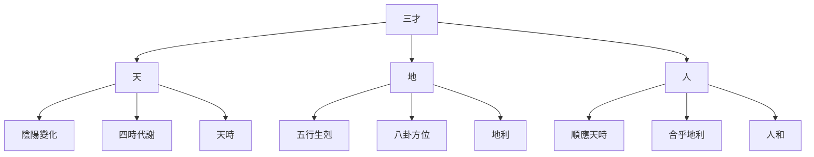

# 易學核心概念體系

## 三才之道

易學認爲宇宙由天道、地道、人道三個層次構成，這就是"三才之道"。

### 三才的含義

### 三才的關係

1. **天**：代表宇宙的自然法則和規律
   - 包括陰陽變化、四時代謝
   - 體現了"天時"的概念

2. **地**：代表物質世界和空間環境
   - 包括五行生剋、八卦方位
   - 體現了"地利"的概念

3. **人**：代表人類社會和人類活動
   - 包括順應天時、合乎地利
   - 體現了"人和"的概念

### 三才合一的智慧

易學追求的是天時、地利、人和的統一，這也是易學智慧的核心理念。

## 易學核心要素

易學體系由多個核心要素構成，這些要素相互關聯、相互作用，共同組成了完整的易學體系。

| 要素 | 內涵 | 在易學中的作用 |
|------|------|---------------|
| **陰陽** | 萬物的兩種基本屬性 | 構成八卦、六十四卦的基礎 |
| **八卦** | 自然現象的抽象符號 | 象徵宇宙萬物的八種基本狀態 |
| **五行** | 木火土金水五種屬性 | 解釋事物之間的相生相剋關係 |
| **六十四卦** | 八卦的重疊組合 | 模擬宇宙萬物的六十四種基本狀態 |
| **卦辭** | 每一卦的整體說明 | 解釋一卦的核心含義 |
| **爻辭** | 每一爻的具體說明 | 解釋某一爻的特殊情況 |
| **彖辭** | 卦的總論 | 闡述一卦的哲學內涵 |
| **象辭** | 卦的象義 | 用形象比喻解釋卦的含義 |

### 陰陽

陰陽是易學最基本的概念，是宇宙萬物存在和變化的基礎。

**陰陽的特性**：
- 對立統一：陰陽相互對立又相互統一
- 相互依存：陰陽相互依存，不可分割
- 相互轉化：陰陽可以相互轉化
- 動態平衡：陰陽保持動態平衡

**陰陽在易學中的應用**：
- 構成八卦：由陰爻（--）和陽爻（—）組成八卦
- 構成六十四卦：八卦相互重疊形成六十四卦
- 解釋變化：陰陽的消長解釋了事物的發展變化

### 八卦

八卦是易學的基本符號體系，代表了宇宙萬物的八種基本狀態。

**八卦的構成**：
- 由三個陰陽爻組成
- 經卦：乾、坤、震、巽、坎、離、艮、兌

**八卦的象徵**：
| 八卦 | 符號 | 自然象徵 | 家庭象徵 | 身體部位 |
|------|------|----------|----------|----------|
| 乾 | ☰ | 天 | 父 | 首 |
| 坤 | ☷ | 地 | 母 | 腹 |
| 震 | ☳ | 雷 | 長男 | 足 |
| 巽 | ☴ | 風 | 長女 | 股 |
| 坎 | ☵ | 水 | 中男 | 耳 |
| 離 | ☲ | 火 | 中女 | 目 |
| 艮 | ☶ | 山 | 少男 | 手 |
| 兌 | ☱ | 澤 | 少女 | 口 |

### 五行

五行是解釋事物之間相互關係的基本理論。

**五行的屬性**：
- **木**：生長、昇發、條達
- **火**：溫熱、昇騰、向上
- **土**：生化、承載、受納
- **金**：清潔、肅降、收斂
- **水**：寒涼、滋潤、向下

**五行相生相剋**：
- **相生**：木生火，火生土，土生金，金生水，水生木
- **相剋**：木剋土，土剋水，水剋火，火剋金，金剋木

**五行在易學中的應用**：
- 解釋八卦之間的關係
- 解釋事物發展的規律
- 指導決策和處世

### 六十四卦

六十四卦是八卦的相互重疊，代表了宇宙萬物的六十四種基本狀態。

**六十四卦的組成**：
- 由上下兩個八卦重疊而成
- 每卦六爻，從下到上依次爲初爻、二爻、三爻、四爻、五爻、上爻

**六十四卦的類型**：
- **純卦**：上下卦相同的卦，如乾卦（上乾下乾）、坤卦（上坤下坤）
- **錯卦**：陰陽相對的卦，如乾卦與坤卦
- **綜卦**：上下顛倒的卦，如屯卦與蒙卦

**六十四卦的意義**：
- 代表了宇宙萬物的六十四種基本狀態
- 每一卦都有其特定的含義和哲學內涵
- 通過六十四卦可以理解宇宙萬物的變化規律

### 卦辭、爻辭、彖辭、象辭

**卦辭**：
- 每一卦的整體說明
- 解釋一卦的核心含義
- 體現了一卦的基本判斷

**爻辭**：
- 每一爻的具體說明
- 解釋某一爻的特殊情況
- 體現了事物發展的不同階段

**彖辭**：
- 卦的總論
- 闡述一卦的哲學內涵
- 將一卦提升到哲學高度

**象辭**：
- 卦的象義
- 用形象比喻解釋卦的含義
- 使抽象的易理形象化

## 核心概念之間的關係

易學的核心概念不是孤立的，而是相互關聯、相互作用的。

1. **陰陽是基礎**：陰陽是構成八卦、六十四卦的基礎
2. **八卦是核心**：八卦是易學的核心符號體系
3. **五行是工具**：五行是解釋事物關係的工具
4. **六十四卦是應用**：六十四卦是易學理論的實際應用
5. **卦辭爻辭是解釋**：卦辭爻辭解釋了六十四卦的含義
6. **彖辭象辭是提升**：彖辭象辭將易理提升到哲學高度

## 學習建議

1. **循序漸進**：先學習陰陽五行，再學習八卦，最後學習六十四卦
2. **相互聯繫**：將各個核心概念相互聯繫起來理解
3. **實踐應用**：將易學理論應用於實際生活
4. **長期堅持**：易學學習是長期過程，需要持續學習

## 相關資源

- [[八卦基礎與象徵]] - 八卦的詳細解釋
- [[MOC_陰陽五行理論基礎]] - 陰陽五行理論
- [[六十四卦詳解]] - 六十四卦的詳細解釋
- [[易學概述]] - 易學的基本概念

---
*創建時間: 2026-02-01*
*分類: 4 Interests*
