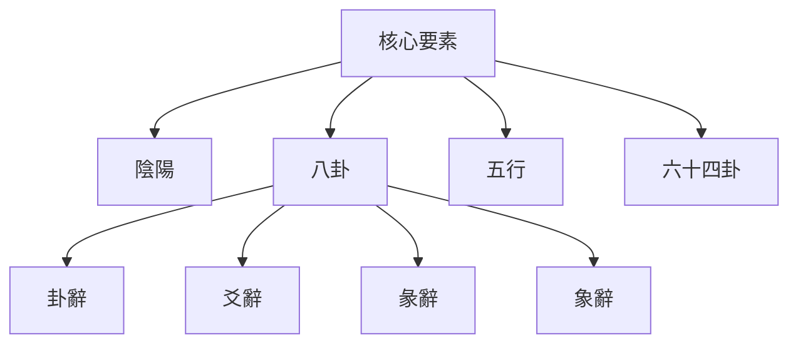

# 易學核心要素

## 概述

易學體系由多個核心要素構成，這些要素相互關聯、相互作用，共同組成了完整的易學體系。理解這些核心要素是學習易學的基礎。

## 核心要素總覽

### 陰陽

**基本概念**：
- 萬物的兩種基本屬性
- 構成八卦、六十四卦的基礎
- 體現事物的對立統一關係

**在易學中的作用**：
- 構成八卦、六十四卦的基礎
- 體現事物的對立統一關係
- 解釋事物的變化規律

**相關資源**：[[陰陽理論]]

### 八卦

**基本概念**：
- 自然現象的抽象符號
- 象徵宇宙萬物的八種基本狀態
- 構成六十四卦的基礎

**在易學中的作用**：
- 象徵宇宙萬物的八種基本狀態
- 構成六十四卦的基礎
- 體現事物的基本屬性

**相關資源**：[[八卦基礎與象徵]]

### 五行

**基本概念**：
- 木火土金水五種基本元素
- 解釋事物之間的相生相剋關係
- 輔助判斷卦象的吉凶

**在易學中的作用**：
- 解釋事物之間的相生相剋關係
- 輔助判斷卦象的吉凶
- 指導決策和處世

**相關資源**：[[五行理論]]、[[五行相生相剋]]

### 六十四卦

**基本概念**：
- 八卦的重疊組合
- 代表宇宙萬物的六十四種基本狀態
- 是易學占卜和哲學思考的基礎

**在易學中的作用**：
- 模擬宇宙萬物的六十四種基本狀態
- 是易學占卜和哲學思考的基礎
- 每一卦都有其特定的含義和哲學內涵

**相關資源**：[[六十四卦詳解]]

### 卦辭

**基本概念**：
- 每一卦的整體說明
- 解釋一卦的核心含義
- 體現了一卦的基本判斷

**在易學中的作用**：
- 解釋一卦的核心含義
- 體現了一卦的基本判斷
- 爲占卜的重要參考

**內容特點**：
- 簡明扼要，概括全卦
- 文字優美，修辭精煉
- 哲學內涵豐富，哲學深刻

### 爻辭

**基本概念**：
- 每一爻的具體說明
- 解釋某一爻的特殊情況
- 體現了事物發展的不同階段

**在易學中的作用**：
- 解釋某一爻的特殊情況
- 體現了事物發展的不同階段
- 爲占卜和哲學思考的重要參考

**內容特點**：
- 描述具體，詳細深入
- 文字優美，修辭精煉
- 體現事物發展的動態過程

### 彖辭

**基本概念**：
- 卦的總論
- 闡述一卦的哲學內涵
- 將一卦提升到哲學高度

**在易學中的作用**：
- 闡述一卦的哲學內涵
- 將一卦提升到哲學高度
- 易學哲學的重要組成部分

**內容特點**：
- 哲學深邃，義理精微
- 邏輯統，體系完整
- 富含哲理，啟迪深思

### 象辭

**基本概念**：
- 卦的象義
- 用形象比喻解釋卦的含義
- 使抽象的易理形象化

**在易學中的作用**：
- 用形象比喻解釋卦的含義
- 使抽象的易理形象化
- 幫助理解和記憶易理

**內容特點**：
- 形象生動，比喻生動
- 意象豐富，文采優美
- 便於理解，利於記憶

## 核心要素的結構

### 層次結構

### 相互關係

**陰陽是基礎**：
- 陰陽是構成八卦、六十四卦的基礎
- 五行體現了陰陽思想
- 沒有陰陽就沒有八卦和六十四卦

**八卦是核心**：
- 八卦是易學的核心符號體系
- 八卦體現了陰陽和五行思想
- 八卦的重疊形成六十四卦

**五行是工具**：
- 五行是解釋事物關係的工具
- 五行與八卦有密切的對應關係
- 五行輔助判斷卦象的吉凶

**六十四卦是應用**：
- 六十四卦是易學理論的實際應用
- 六十四卦包含了易學的哲學思想
- 卦辭、爻辭、彖辭、象辭解釋了六十四卦

**卦辭爻辭是解釋**：
- 卦辭、爻辭解釋了六十四卦的含義
- 是理解和運用易學的基礎

**彖辭象辭是提升**：
- 彖辭、象辭將易理提升到哲學高度
- 是易學哲學的重要組成部分

## 核心要素的應用

### 在占卜中的應用

**陰陽五行**：
- 用來判斷卦象的五行屬性
- 用來判斷五行的旺相休囚死
- 用來判斷五行的相生相剋關係

**八卦六十四卦**：
- 用來起卦和解卦
- 用來判斷卦象的吉凶
- 用來分析事物的發展趨勢

**卦辭爻辭**：
- 用來理解卦的含義
- 用來判斷吉凶
- 用來指導行動

**彖辭象辭**：
- 用來理解卦的哲學內涵
- 用來提升對易理的理解
- 用來指導處世之道

### 在哲學中的應用

**陰陽變化**：
- 理解事物的對立統一和變化
- 理解動態平衡的重要性
- 理解變化的必然性

**八卦象徵**：
- 理解自然現象的象徵意義
- 理解抽象符號與具體事物的聯繫
- 理解宇宙萬物的基本狀態

**五行關係**：
- 理解事物之間的相互聯繫
- 理解事物的發展規律
- 理解相生相剋的辯證思維

**六十四卦變化**：
- 理解宇宙萬物的變化狀態
- 理解事物發展的階段
- 理解易學的哲學內涵

## 學習建議

1. **循序漸進**：先學習陰陽，再學習八卦，最後學習六十四卦
2. **理解原理**：深入理解每個核心要素的基本原理和相互關係
3. **綜合應用**：將核心要素綜合起來理解和應用
4. **實踐體悟**：通過實踐加深對核心要素的理解，形成自己的體悟

## 相關資源

- [[陰陽理論]] - 陰陽的基本概念和關係
- [[八卦基礎與象徵]] - 八卦的詳細解釋
- [[五行理論]] - 五行的基本概念和屬性
- [[五行相生相剋]] - 五行相生相剋關係
- [[六十四卦詳解]] - 六十四卦的詳細解釋
- [[三才之道]] - 天地人三才的詳細說明
- [[核心概念之間的關係]] - 核心要素之間的相互關係

---
*創建時間: 2026-02-02*
*更新時間: 2026-02-02*
*分類: 4 Interests*
