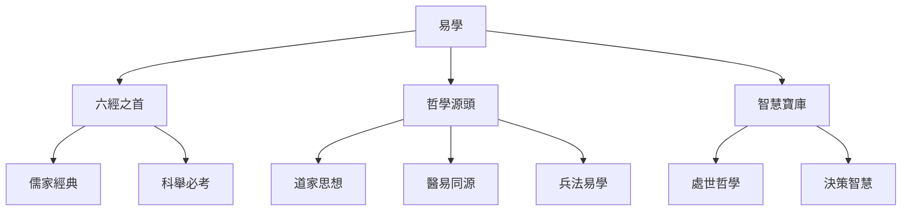

# 易學概述

## 什麼是易學

易學是研究《周易》的一門學問，是中華文明"大道之源"之一。《周易》包括《經》和《傳》兩個部分，不僅是中國傳統文化的瑰寶，也是對世界哲學思想的重要貢獻。

### 《經》與《傳》

**《經》**（經文）：
- 由六十四卦、卦辭、爻辭組成
- 是占卜的基礎文本
- 反映了古代先民的宇宙觀和人生觀

**《傳》**（傳文）：
- 包括《彖傳》、《象傳》、《繫辭》、《文言》、《說卦》、《序卦》、《雜卦》
- 是對《經》的哲學解釋和闡發
- 將占卜工具提升爲哲學經典

### 易學三義

《繫辭》中說："易之爲書也，廣大悉備。有天道焉，有人道焉，有地道焉。"易學的核心可以概括爲三義：

| 三義 | 含義 | 哲學意義 |
|------|------|----------|
| **變易** | 宇宙萬物都在不斷變化 | 認識到變化的普遍性和必然性 |
| **不易** | 變化的規律永恆不變 | 發現變化中的不變之理 |
| **簡易** | 掌握規律後變得簡單 | 化繁爲簡，以簡馭繁 |

### 易學的價值

易學的價值體現在多個層面：

1. **哲學價值**：提供了關於宇宙、人生、社會的哲學思考框架
2. **實踐價值**：爲決策、處世、修身提供了智慧指導
3. **文化價值**：是中華文化的重要組成部分和標誌性符號
4. **歷史價值**：記錄了古代先民的思維方式和智慧結晶

## 易學在中國文化中的地位

### 六經之首

易學在中國傳統文化中佔有極其重要的地位，被稱爲"六經之首"。

### 對各個領域的影響

**哲學思想**：
- 儒家：將《周易》列爲經典，發展出義理易
- 道家：吸收了易學的陰陽變化思想
- 佛家：宋明理學將易學與佛學相結合

**醫學**：
- "醫易同源"：中醫理論深受易學影響
- 五行學說：用陰陽五行解釋人體生理病理
- 辯證施治：體現了易學的辯證思維

**兵法**：
- 《孫子兵法》運用了易學的辯證思想
- 兵家易學：將易理應用於軍事決策
- 奇門遁甲：與易學密切相關

**藝術**：
- 書法：運筆的剛柔、疏密體現易理
- 繪畫：構圖、色彩運用陰陽五行
- 园林設計：體現天人合一的思想

## 易學的發展歷程

### 三聖作易

傳統認爲《周易》由三位聖人共同創作：

1. **伏羲** - 畫八卦
   - 相傳伏羲氏觀察天地萬物，創造了八卦
   - 代表了對宇宙萬物的初步認識

2. **文王** - 重卦爲六十四卦
   - 周文王在羑里被囚期間，將八卦重疊爲六十四卦
   - 並爲每一卦寫了卦辭

3. **孔子** - 作《十翼》
   - 孔子及其後學爲《周易》作《十翼》（即《傳》）
   - 將占卜工具提升爲哲學經典

### 歷代易學流派

**漢代易學**：
- 以象數爲主，注重卦象和數字
- 代表人物：京房、鄭玄

**魏晉易學**：
- 以義理爲主，注重哲學闡釋
- 代表人物：王弼，掃除象數之繁

**宋代易學**：
- 象數與義理並重
- 代表人物：朱熹、邵雍

**明清易學**：
- 集前人之大成
- 代表人物：來知德、李光地

## 易學的現代價值

在現代社會，易學依然具有重要的價值：

### 哲學思考
- 提供了關於變化的深刻洞見
- 啓發了辯證思維和整體思維

### 決策輔助
- 爲複雜環境下的決策提供參考
- 幫助認識形勢、把握時機

### 處世智慧
- 培養謙遜、剛健、中正等品質
- 指導人際交往和自我修養

### 文化傳承
- 瞭解和繼承中華優秀傳統文化
- 增強文化自信和認同感

## 相關資源

- [[易學概述與發展史]] - 詳細的易學歷史
- [[易經結構與組成]] - 《周易》的基本結構
- [[八卦基礎與象徵]] - 八卦的詳細解釋
- [[MOC_陰陽五行理論基礎]] - 陰陽五行理論

---
*創建時間: 2026-02-01*
*分類: 4 Interests*
