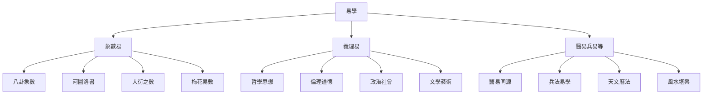
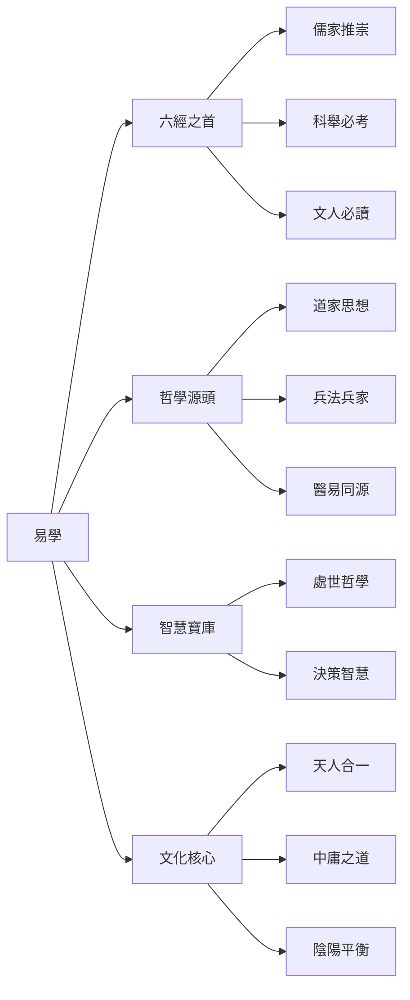
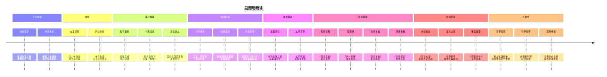
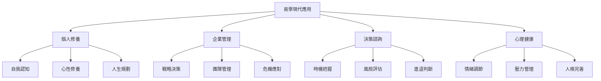

# 易學概述與發展史

> 🎯 **學習目標**：瞭解易學的起源、發展歷程、主要流派和在中國文化史上的重要地位，建立對易學的整體認識。

## 📚 什麼是易學

### 易學的基本概念

### 易學的三重內涵

### 易學三義

**變易**：宇宙萬物都在不斷變化，沒有永恆不變的事物。《繫辭上》雲端："生生之謂易"，說明易的核心在於變化。

**不易**：雖然萬物在變化，但變化的規律是永恆不變的。春夏秋冬四季循環，生老病死自然規律，這些都是不易。

**簡易**：掌握了變化的規律後，複雜的事物就變得簡單了。所謂"大道至簡"，易學的最高境界就是將複雜的宇宙規律簡化爲最簡單的形式。

### 易學在中國文化中的地位

## 🕰️ 易學發展歷史

### 三聖作易

根據傳統說法，易學的形成經歷了"三聖作易"的過程：

**伏羲氏**（上古）：作八卦

相傳伏羲氏仰觀天象，俯察地理，創造了八卦，用以象徵宇宙萬物的八種基本狀態。《繫辭下》雲端："古者包犧氏之王天下也，仰則觀象於天，俯則觀法於地，觀鳥獸之文與地之宜，近取諸身，遠取諸物，於是始作八卦，以通神明之德，以類萬物之情。"

**周文王**（中古）：演六十四卦

周文王在伏羲八卦的基礎上，將八卦兩兩相重，演爲六十四卦，並作了卦辭和爻辭。《繫辭下》雲端："易之興也，其於中古乎？作易者，其有憂患乎？"

**孔子**（近古）：作十翼

孔子晚年喜易，韋編三絕，作《易傳》（又稱《十翼》）來解釋《易經》。《史記·孔子世家》載："孔子晚而喜易，序彖、系、象、說卦、文言。"

### 易學發展時間軸

## 🏛️ 易學主要流派

### 象數易派

**特點**：注重卦象和數理，通過觀察卦象的變化來推測吉凶。

**代表人物**：
- **京房**（漢）：創立八宮卦說、納甲法、納支法，開創象數易學新紀元
- **邵雍**（宋）：創立先天學，著《皇極經世書》，用數理推演宇宙歷史
**代表人物**：
- **尚秉和**（清）：專研象數，著《周易尚氏學》

**主要方法**：
- 八宮卦：將六十四卦按八宮分類，每宮八卦
- 納甲納支：將天干地支納入卦中，用於占卜
- 大衍之數：用五十根蓍草進行占卜
- 梅花易數：用數字、時間、方位等起卦

### 義理易派

**特點**：注重易理的哲學內涵，從倫理、政治、哲學等角度闡釋《周易》。

**代表人物**：
- **王弼**（魏晉）：掃除象數之繁，以義理爲主，主張"得意忘象"
- **程頤**（宋）：著《伊川易傳》，用理學思想闡釋易理
- **朱熹**（宋）：著《周易本義》，集義理易學之大成
- **王夫之**（明末清初）：著《周易外傳》，用唯物主義觀點闡釋易理

**主要觀點**：
- 易學是政治哲學：《周易》包含君臣父子、治國安邦的道理
- 易學是倫理學：強調君子之道、中庸之德
- 易學是哲學：探討天人關係、宇宙規律、人生哲理

### 醫易派

**代表人物**：
- **孫思邈**（唐）："不知易，不足以言太醫"
- **張景嶽**（明）：著《類經圖翼》，用易理解釋醫學

**主要理論**：
- 陰陽平衡：用陰陽理論解釋人體生理病理
- 五行生剋：用五行理論解釋臟腑關係
- 卦象與疾病：將八卦與身體部位、器官對應
- 八卦與藥物：用八卦理論解釋藥性藥理

### 兵法易派

**特點**：將易學應用程式于軍事，用易理指導戰爭。

**代表人物**：
- **孫武**（春秋）：《孫子兵法》深受易學影響
- **諸葛亮**（三國）：精通易學，用之指導軍事

**主要應用**：
- 軍隊佈局：用八卦方位安排軍隊
- 時機把握：用十二訊息卦把握戰機

## 📊 易學的哲學貢獻

### 天人合一思想

易學的核心思想是"天人合一"，認爲人是自然的一部分，應該順應自然規律而生活。

**《繫辭上》雲端**："一陰一陽之謂道，繼之者善也，成之者性也。"這說明陰陽變化是道，人應該繼承這種變化，形成自己的本性。

### 變易哲學

易學認爲宇宙萬物都在不斷變化，沒有永恆不變的事物。這種變化是有規律的，掌握了規律就能順應變化。

**《繫辭下》雲端**："易之爲書也，廣大悉備，有天道焉，有人道焉，有地道焉。"說明易學包含了天地人的道理。

### 中庸之道

易學強調中庸之道，主張凡事不要走極端，要適度。

**《繫辭上》雲端**："一陰一陽之謂道"，說明陰陽要平衡，不可偏廢。在處世中也要剛柔並濟，陰陽平衡。

## 🎯 易學的現代價值

### 哲學價值

易學是中國古代哲學的集大成者，對後來的儒家、道家、兵家、醫家等都產生了深遠影響。

### 文化價值

易學是中國文化的源頭之一，是中國人的宇宙觀、價值觀、人生觀的重要來源。

### 應用程式價值

易學的智慧可以應用程式於現代生活的各個方面：

## 📖 重要經典文獻

### 古代經典

**《周易》**：分爲《經》和《傳》兩部分。《經》包括六十四卦的卦辭和爻辭；《傳》包括《彖辭》《象辭》《繫辭》《文言》《說卦》《序卦》《雜卦》等七種十篇，合稱《十翼》。

**《易傳》**：又稱《十翼》，是對《經》的解釋和發揮，是易學哲學思想的重要載體。

### 歷代註疏

**《周易本義》**（朱熹 宋）：朱熹對《周易》的註疏，是理學的代表作品。

**《易經來注》**（來知德 明）：明代來知德的注本，集前人之大成。

**《周易折中》**（李光地 清）：清代官方注本，乾隆帝御定。

**《王弼注》**（王弼 魏晉）：掃除象數之繁，以義理爲主的代表作品。

## 🤔 學習易學的意義

### 文化傳承

學習易學是傳承中華優秀傳統文化的重要途徑，瞭解中國人的宇宙觀、價值觀、人生觀。

### 哲學思辨

易學蘊含着深刻的哲學思想，學習易學可以培養思辨能力，理解宇宙人生的深刻道理。

### 實踐指導

易學的智慧可以指導我們的日常生活，幫助我們做出更好的決策，處理人際關係，提升個人修養。

### 心靈滋養

易學是一種心靈滋養的方式，通過學習易學，可以達到內心的平靜和智慧的增長。

## 💡 學習易學的正確態度

### 尊重傳統

對傳統文化保持敬畏之心，理解易學在中華文明中的重要地位，不輕視、不嘲弄。

### 理性客觀

以理性客觀的態度學習易學，不陷入迷信和宿命論，理解易學的哲學內涵而非占卜結果。

### 哲學導向

將易學作爲一種哲學思想來學習，而非純粹的占卜工具，注重其哲學價值和人生智慧。

### 循序漸進

從基礎開始，循序漸進地學習，不可急於求成，更不可斷章取義。

### 理論實踐結合

將學習與實踐相結合，在生活中運用易學的智慧，不僅停留在理論層面。

## 🔗 相關資源

- [[易經結構與組成]] - 學習《周易》的基本結構
- [[MOC_陰陽五行理論基礎]] - 理解陰陽五行的基本理論

---
*創建時間: 2026-02-01*  
*分類: 4 Interests*
