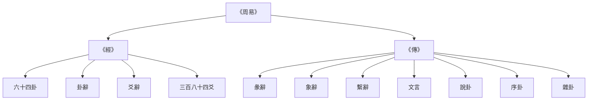
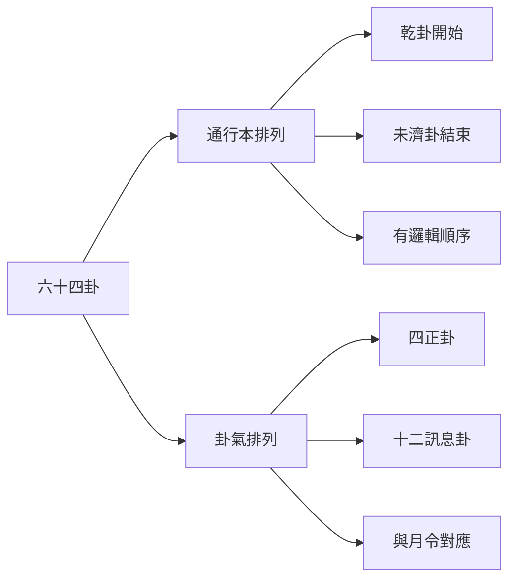
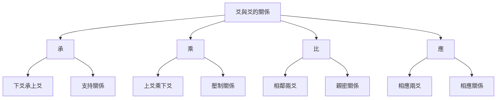
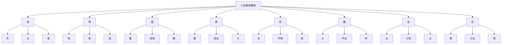

# 易經結構與組成

> 🎯 **學習目標**：掌握《周易》的基本結構，理解《經》與《傳》的關係，熟悉六十四卦的排列規律，爲深入學習《周易》打下堅實基礎。

## 📚 《周易》的基本構成

### 經傳分體

《周易》由《經》和《傳》兩部分組成，這是易學研究的基本分類。

### 《經》的組成

《經》是指《周易》的原文部分，包括六十四卦、卦辭和爻辭。

**六十四卦**：由八卦兩兩相重而成，每卦六爻，共三百八十四爻。

**卦辭**：每卦的總說明，解釋一卦的基本含義。《說卦》雲端："卦者，象也；象者，像也。"

**爻辭**：每爻的具體說明，解釋某一爻的特殊情況。《繫辭下》雲端："爻者，效天下之動者也。"

**三百八十四爻**：六十四卦每卦六爻，共三百八十四爻。

### 《傳》的組成

《傳》又稱《十翼》，是對《經》的解釋和發揮，共七種十篇。

**《彖辭》**（上下篇）：解釋卦辭的哲學內涵，闡明一卦的大義。

**《象辭》**（上下篇）：用形象比喻解釋卦的含義，分大象和小象。

**《繫辭》**（上下篇）：闡述易學的哲學思想，是易學哲學的集中體現。

**《文言》**：專門解釋乾、坤兩卦，是《彖辭》《象辭》的補充。

**《說卦》**：解釋八卦的象徵意義，闡述八卦與自然萬物的對應關係。

**《序卦》**：解釋六十四卦的排列順序，說明卦與卦之間的因果關係。

**《雜卦》**：雜述六十四卦的關係，用簡潔的語言概括每卦的特點。

## 📖 六十四卦的結構

### 卦的基本構成

每卦由六個爻組成，從下到上分別稱爲：初爻、二爻、三爻、四爻、五爻、上爻。

**爻的性質**：爻分陰陽，用"—"表示陽爻，用"- -"表示陰爻。

**爻的位置**：爻的位置有特殊的哲學意義。初爻代表開始，上爻代表終結。

**爻的變化**：爻可以變化，陰爻可以變爲陽爻，陽爻可以變爲陰爻，這就是"變爻"。

### 卦名的構成

卦名通常由兩個字組成，如"乾卦""坤卦"等。

**第一個字**：通常表示卦的基本性質，如"乾"表示剛健，"坤"表示柔順。

**第二個字**：表示卦的屬性，如"卦"表示這是一個卦象。

### 六十四卦的排列

六十四卦按照一定的規律排列，主要有兩種排列方式：

**通行本排列**：即《周易》的排列方式，從乾卦開始，到未濟卦結束。

**卦氣排列**：按卦氣學說排列，每卦對應一個月，用卦氣表示一年四季的變化。

## 🎯 卦辭的結構

### 卦辭的基本構成

卦辭是對一卦的總說明，通常包括以下內容：

**卦名**：說明這是哪一卦。

**卦義**：解釋一卦的基本含義。

**吉凶**：判斷這一卦是吉還是兇。

**條件**：說明在什麼情況下是吉，什麼情況下是兇。

# 方法

解讀卦辭需要注意以下幾點：

**理解卦名**：首先要理解卦名的含義，這是理解一卦的基礎。

**結合卦象**：卦辭要與卦象結合起來理解，不能孤立地解讀卦辭。

**注意條件**：卦辭中的吉凶都是有條件的，不能簡單地認爲某卦就是吉或某卦就是兇。

**參考彖象**：彖辭和象辭是對卦辭的深入解釋，要結合起來理解。

## 📿 爻辭的結構

### 爻辭的基本構成

爻辭是對一爻的具體說明，通常包括以下內容：

**爻位**：說明這是第幾爻。

**爻的性質**：說明這一爻是陽爻還是陰爻。

**爻義**：解釋這一爻的含義。

**吉凶**：判斷這一爻是吉還是兇。

# 方法

解讀爻辭需要注意以下幾點：

**理解爻位**：爻位有特殊的哲學意義，初爻代表開始，上爻代表終結。

**理解爻性**：爻性指爻的性質，陽爻代表剛健，陰爻代表柔順。

**理解爻與爻的關係**：爻與爻之間有承乘比應的關係，這影響爻的含義。

**理解變爻**：爻可以變化，變爻會影響卦的含義。

### 爻與爻的關係

**承**：下爻承上爻，表示支持關係。

**乘**：上爻乘下爻，表示壓制關係。

**比**：相鄰兩爻，表示親密關係。

**應**：相應兩爻（初爻與四爻，二爻與五爻，三爻與上爻），表示相應關係。

## 🔤 《彖辭》的結構

### 彖辭的基本構成

彖辭是對卦辭的哲學解釋，通常包括以下內容：

**卦名**：說明這是哪一卦。

**卦德**：解釋一卦的德性。

**卦用**：解釋一卦的用途。

**卦象**：解釋一卦的象義。

### 彖辭的哲學內涵

彖辭的哲學內涵非常豐富，主要包括：

**天道觀**：闡述天人關係，強調人應該順應天道。

**倫理觀**：闡述君臣父子、夫妻朋友的倫理關係。

**政治觀**：闡述治國安邦的道理。

**人生觀**：闡述處世的哲學和人生智慧。

## 🌊 《象辭》的結構

### 象辭的基本構成

象辭是用形象比喻解釋卦的含義，分爲大象和小象。

**大象**：解釋一卦的整體象義。

**小象**：解釋一爻的象義。

### 象辭的修辭藝術

象辭的修辭藝術非常高超，主要特點包括：

**形象生動**：用具體的形象說明抽象的道理。

**比喻恰當**：用恰當的比喻解釋複雜的易理。

**簡潔精煉**：用簡潔的語言傳達深刻的哲理。

**音韻和諧**：講究音韻，讀起來朗朗上口。

## 📜 《繫辭》的結構

### 《繫辭》的基本構成

《繫辭》是易學哲學的集中體現，分爲上下兩篇。

**上篇**：主要闡述宇宙觀、人生觀、天人關係等哲學問題。

# 方法

### 《繫辭》的哲學思想

《繫辭》的哲學思想非常豐富，主要包括：

**一陰一陽之謂道**：陰陽是宇宙的基本規律。

**天人合一**：人是自然的一部分，應該順應自然規律。

**變易不易簡易**：宇宙萬物都在變化，但變化的規律不變，掌握了規律就變得簡單。

**中庸之道**：凡事不要走極端，要適度。

## 🎨 《文言》的結構

### 《文言》的基本構成

《文言》是專門解釋乾、坤兩卦的文章，分爲兩部分：

**乾卦文言**：解釋乾卦的卦辭、爻辭、彖辭、象辭。

**坤卦文言**：解釋坤卦的卦辭、爻辭、彖辭、象辭。

### 《文言》的哲學內涵

《文言》的哲學內涵主要包括：

**君子的品德**：闡述君子應該具備的品德和修養。

# 方法

**進退的道理**：闡述君子進退的道理和時機把握。

## 🔮 《說卦》的結構

### 《說卦》的基本構成

《說卦》主要解釋八卦的象徵意義，闡述八卦與自然萬物的對應關係。

**八卦的基本含義**：解釋乾、坤、震、巽、坎、離、艮、兌八卦的基本含義。

**八卦與自然萬物的對應**：闡述八卦與自然萬物的對應關係，包括天、地、雷、風、水、火、山、澤等。

### 八卦的象徵體系

## 📖 《序卦》的結構

### 《序卦》的基本構成

《序卦》解釋六十四卦的排列順序，說明卦與卦之間的因果關係。

**卦序的邏輯**：闡述六十四卦排列的邏輯和順序。

**卦與卦的關係**：說明卦與卦之間的因果關係和發展關係。

### 《序卦》的邏輯思想

《序卦》的邏輯思想主要包括：

**因果關係**：前一卦是後一卦的原因，後一卦是前一卦的結果。

**發展關係**：卦與卦之間存在發展的關係，從低級到高級。

**循環關係**：卦與卦之間還存在循環關係，從起點回到起點。

## 🎭 《雜卦》的結構

### 《雜卦》的基本構成

《雜卦》雜述六十四卦的關係，用簡潔的語言概括每卦的特點。

**卦的特點**：概括每卦的特點和性質。

**卦與卦的關係**：雜述卦與卦之間的關係。

### 《雜卦》的修辭特點

**簡潔精煉**：用簡潔的語言概括複雜的卦義。

**對仗工整**：卦與卦之間形成對仗，形式美觀。

**音韻和諧**：講究音韻，讀起來朗朗上口。

## 🔗 相關資源

- [[易學概述與發展史]] - 瞭解易學的發展歷程
# 知識
- [[MOC_陰陽五行理論基礎]] - 理解陰陽五行理論
- [[六十四卦詳解]] - 系統學習每一卦

---
*創建時間: 2026-02-01*  
*分類: 4 Interests*
