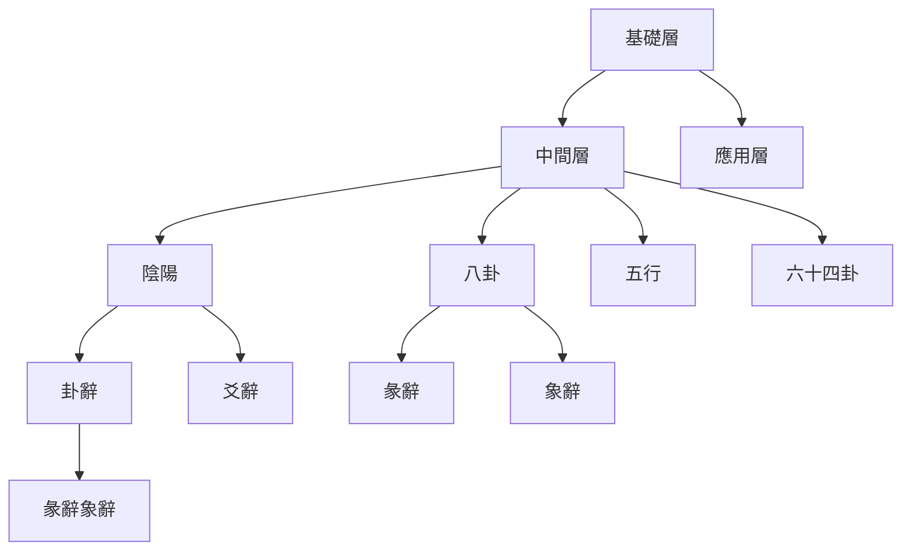

# 核心概念之間的關係

## 概述

易學的核心概念不是孤立的，而是相互關聯、相互作用的。理解核心概念之間的關係，是深入學習易學的關鍵。

## 基礎層次關係

### 陰陽是基礎

**陰陽構成八卦、六十四卦**：
- 陰陽是構成八卦、六十四卦的基礎
- 陽爻（—）和陰爻（--）組成八卦
- 八卦相互重疊形成六十四卦

**五行體現陰陽思想**：
- 五行的陰陽體現了陰陽思想
- 每一行都有陰陽之分（陽木、陰木，陽火、陰火等）
- 五行的相生相剋體現了陰陽的對立統一

**沒有陰陽就沒有易學**：
- 陰陽是易學最基本的元素
- 沒有陰陽就無法構成八卦和六十四卦
- 沒有陰陽就無法理解易學的哲學思想

### 八卦是核心

**八卦體現陰陽和五行**：
- 八卦是易學的核心符號體系
- 八卦體現了陰陽思想（陽卦、陰卦）
- 八卦體現了五行思想（木、火、土、金、水）

**八卦的重疊形成六十四卦**：
- 六十四卦是八卦的重疊組合
- 六十四卦體現了陰陽和五行的相互作用
- 六十四卦的變化體現了陰陽五行的動態關係

**八卦是理解陰陽五行的關鍵**：
- 通過八卦可以理解陰陽五行的對應關係
- 通過八卦可以理解事物的分類和屬性
- 通過八卦可以理解事物之間的相互關係

### 五行是工具

**五行輔助判斷卦象**：
- 五行是判斷卦象吉凶的重要工具
- 五行與八卦有密切的對應關係
- 五行的旺相休囚死用於判斷卦象的強弱

**五行體現了陰陽**：
- 五行的相生相剋體現了陰陽的對立統一
- 五行的陰陽體現體現了事物的發展變化
- 五行的陰陽體現體現了事物之間的相互關係

### 六十四卦是應用

**六十四卦包含陰陽五行**：
- 六十四卦包含了陰陽和五行的全部思想
- 六十四卦是陰陽五行的實際應用
- 六十四卦的變化體現了陰陽五行的動態過程

**卦辭爻辭解釋了陰陽五行**：
- 卦辭、爻辭解釋了六十四卦中陰陽五行的含義
- 彖辭、象辭將陰陽五行的關係提升到哲學高度

## 層次結構

### 層次說明

**基礎層（陰陽五行八卦六十四卦）**：
- 這些是易學的基本構成元素
- 它們相互關聯、相互作用
- 理解它們是深入學習易學的關鍵

**中間層（卦辭爻辭彖辭象辭）**：
- 這些是解釋核心要素的工具
- 它們幫助理解和運用核心要素
- 它們體現了易學的哲學思想

**應用層（占卜、哲學、生活）**：
- 這些是核心要素的實際應用
- 它們將易學理論應用於實踐
- 它們體現了易學的實用價值

## 相互關係詳解

### 陰陽與八卦的關係

詳細內容請參閱：[[陰陽與八卦的關係]]

### 陰陽與五行的關係

詳細內容請參閱：[[陰陽與五行的關係]]

### 八卦與五行的關係

詳細內容請參閱：[[八卦與五行的關係]]

### 五行與六十四卦的關係

詳細內容請參閱：[[五行與六十四卦的關係]]

### 卦辭爻辭與核心要素的關係

詳細內容請參閱：[[卦辭爻辭與核心要素的關係]]

### 四者的統一

**四者統一**：
- 陰陽、八卦、五行的統一
- 四者相互依賴、相互作用
- 四者共同構成易學的完整體系

**整體性**：
- 陰陽是八卦的基礎，八卦體現陰陽和五行
- 五行是解釋關係的工具，體現了陰陽思想
- 六十四卦是陰陽五行的應用，包含卦辭爻辭彖辭象辭

**在學習中的重要性**：
- 理解四者的統一關係是深入學習易學的關鍵
- 不能孤立地學習某一個核心要素
- 要從整體上理解它們的相互關係

## 學習建議

1. **系統思維**：從整體上理解核心要素之間的相互關係
2. **循序漸進**：先學習陰陽，再學習八卦，然後學習五行，最後學習六十四卦
3. **相互聯繫**：不要孤立地學習某一個核心要素，要理解它們之間的相互關係
4. **實踐應用**：通過實踐加深對核心要素之間關係的理解

## 相關資源

- [[陰陽理論]] - 陰陽的基本概念和關係
- [[五行理論]] - 五行的基本概念和屬性
- [[五行相生相剋]] - 五行相生相剋關係
- [[八卦基礎與象徵]] - 八卦的詳細解釋
- [[六十四卦詳解]] - 六十四卦的詳細解釋
- [[三才之道]] - 天地人三才的詳細說明
- [[易學核心要素]] - 陰陽、八卦、五行、六十四卦、卦辭、爻辭、彖辭、象辭的詳細說明

---
*創建時間: 2026-02-02*
*更新時間: 2026-02-02*
*分類: 4 Interests*
