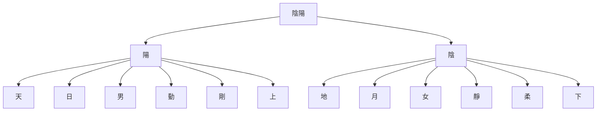
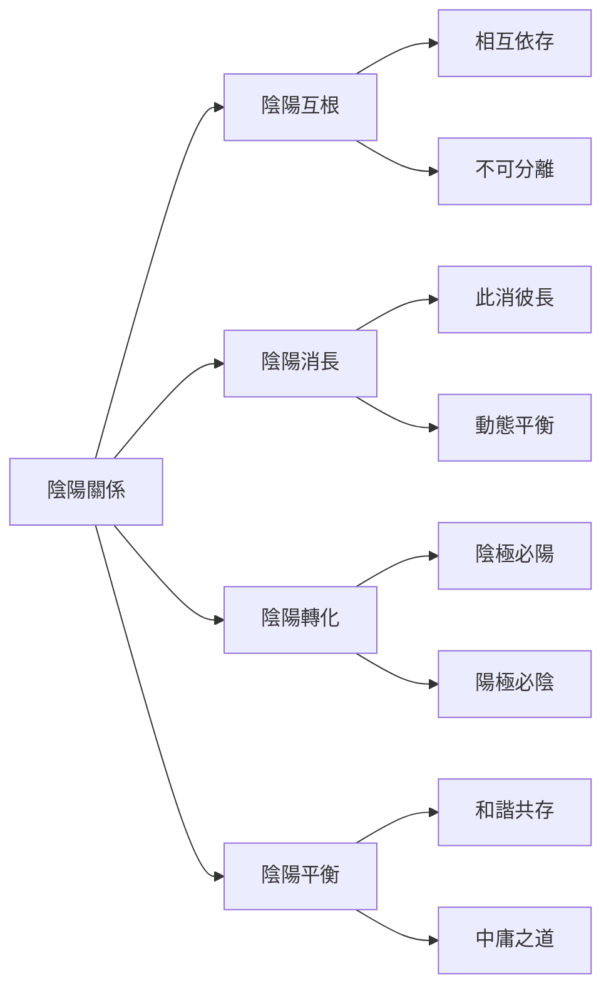

# 陰陽理論

## 什麼是陰陽

陰陽是中國古代哲學的一對基本概念，用來解釋宇宙萬物的對立統一關係。陰陽不是絕對的對立，而是相互依存、相互轉化、相互制約的對立統一。

陰陽思想源遠流長，可以追溯到上古時期。人們通過觀察自然現象，發現宇宙萬物都存在對立統一的兩個方面，如天與地、日與月、男與女、動與靜等，逐漸形成了陰陽的哲學概念。

### 陰陽的象徵

## 陰陽的特徵

### 陽的特徵

陽代表主動、外向、明亮、溫暖、剛強的特性。

**自然象徵**：
- **天**：蒼穹、天空
- **日**：太陽、光明
- **男**：男性、雄性

**方位與數字**：
- **上**：上方、高處
- **左**：左方（以面南爲標準）
- **奇數**：一、三、五、七、九

**功能特性**：
- **推動**：主動推動事物發展
- **創造**：創造新生事物
- **發展**：促進事物成長

### 陰的特徵

陰代表被動、內向、陰暗、寒冷、柔弱的特性。

**自然象徵**：
- **地**：大地、土壤
- **月**：月亮、夜晚
- **女**：女性、雌性

**方位與數字**：
- **下**：下方、低處
- **右**：右方（以面南爲標準）
- **偶數**：二、四、六、八、十

**功能特性**：
- **承載**：承載萬物生長
- **滋養**：滋養萬物發育
- **收斂**：收斂保存能量

## 陰陽的關係

陰陽之間存在四種基本關係：陰陽互根、陰陽消長、陰陽轉化、陰陽平衡。

### 陰陽互根

陰陽互根是指陰陽相互依存、不可分離。

**相互依存**：
- 無陽則陰無以生
- 無陰則陽無以化
- 陰陽相互依賴，缺一不可

**不可分離**：
- 陰陽共同構成宇宙萬物
- 任何事物都包含陰陽兩個方面
- 陰陽相互制約，維持動態平衡

### 陰陽消長

陰陽消長是指陰陽相互消長、動態平衡。

**此消彼長**：
- 陽消則陰長
- 陰消則陽長
- 陰陽處於不斷變化中

**動態平衡**：
- 陰陽消長維持動態平衡
- 平衡不是靜態的，而是動態的
- 陰陽平衡則和諧，失衡則疾病

### 陰陽轉化

陰陽轉化是指陰陽在一定條件下可以相互轉化。

**陰極必陽**：
- 陰發展到極端必然轉化爲陽
- 如：冬至陰極，一陽生

**陽極必陰**：
- 陽發展到極端必然轉化爲陰
- 如：夏至陽極，一陰生

### 陰陽平衡

陰陽平衡是指陰陽和諧共存、中庸之道。

**和諧共存**：
- 陰陽和諧則萬物生
- 陰陽失調則疾病生
- 追求陰陽平衡是養生的核心

**中庸之道**：
- 不偏不倚，執兩用中
- 避免過陽或過陰
- 追求中和之美

### 陰陽關係圖

## 陰陽在易學中的應用

### 八卦的陰陽

八卦分爲陽卦和陰卦兩類。

**陽卦**（4個）：
- **乾** ☰ - 父卦
- **震** ☳ - 長男
- **坎** ☵ - 中男
- **艮** ☶ - 少男

**陰卦**（4個）：
- **兌** ☱ - 少女
- **離** ☲ - 中女
- **巽** ☴ - 長女
- **坤** ☷ - 母卦

### 六十四卦的陰陽

根據陰陽爻的數量，六十四卦可以分爲三類。

**陽卦**：
- 陽爻多於陰爻的卦
- 如：乾卦（六陽）、大有卦（五陽一陰）

**陰卦**：
- 陰爻多於陽爻的卦
- 如：坤卦（六陰）、比卦（五陰一陽）

**陰陽平衡卦**：
- 陰陽爻數量相等的卦
- 如：既濟卦（三陰三陽）、未濟卦（三陰三陽）

### 爻的陰陽

爻是構成八卦和六十四卦的基本單位，分爲陽爻和陰爻。

**陽爻**：—
- 代表陽性、主動、剛強
- 用奇數表示：初九、九二、九三、九四、九五、上九

**陰爻**：- -
- 代表陰性、被動、柔弱
- 用偶數表示：初六、六二、六三、六四、六五、上六

## 陰陽理論的哲學意義

### 辯證法思想

陰陽理論體現了中國古代的辯證法思想。

**對立統一**：陰陽既對立又統一，共同構成宇宙萬物
**相互轉化**：陰陽在一定條件下可以相互轉化
**質量互變**：陰陽的量變達到一定程度會引起質變

### 整體觀念

陰陽理論體現了中國古代的整體觀念。

**萬物一體**：宇宙萬物都是一個整體，相互聯繫
**天人合一**：人與自然是統一的整體
**身心合一**：身體和精神是統一的整體

### 中庸之道

陰陽理論體現了中國古代的中庸之道。

**不偏不倚**：避免過陽或過陰，追求中庸
**執兩用中**：掌握陰陽兩端，運用中道
**中和之美**：追求和諧、平衡、中正

## 學習建議

1. **理解爲主**：理解陰陽的基本概念和相互關係，不要死記硬背
2. **圖形結合**：結合八卦圖、陰陽圖等圖形來理解
3. **實踐應用**：將陰陽理論應用於實際生活，在實踐中加深理解
4. **理性客觀**：以理性客觀的態度學習陰陽，不要陷入迷信和神祕化

## 相關資源

- [[五行理論]] - 五行的基本概念和屬性
- [[五行相生相剋]] - 五行相生相剋關係
- [[陰陽五行關係]] - 陰陽與五行的關係
- [[陰陽五行在占卜中的應用]] - 陰陽五行在占卜中的應用

---
*創建時間: 2026-02-01*
*分類: 4 Interests*
