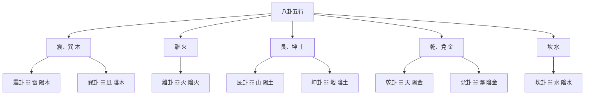

# 陰陽五行關係

## 陰陽與五行的統一

陰陽和五行是中國古代哲學的兩個基本概念，它們不是獨立的，而是相互聯繫、相互統一的。陰陽是五行的基礎，五行是陰陽的具體表現。

### 陰陽是五行的基礎

每一行都有陰陽之分，體現了陰陽思想的普遍性。

**木**：陽木、陰木
- 陽木：如松柏，堅硬挺拔
- 陰木：如花草，柔軟婀娜

**火**：陽火、陰火
- 陽火：如太陽，光明溫暖
- 陰火：如燈燭，柔和微弱

**土**：陽土、陰土
- 陽土：如山石，堅硬穩定
- 陰土：如泥土，柔軟滋潤

**金**：陽金、陰金
- 陽金：如鐵器，堅硬鋒利
- 陰金：如金銀，柔軟珍貴

**水**：陽水、陰水
- 陽水：如江河，流動有力
- 陰水：如湖泊，平靜柔順

### 陰陽在五行中的體現

陰陽思想體現在五行的各個方面，包括季節、方位、特性等。

**季節的陰陽**：
- 春：陽氣生發
- 夏：陽氣旺盛
- 長夏：陰陽轉化
- 秋：陰氣收斂
- 冬：陰氣盛極

**方位的陰陽**：
- 東：陽氣初生
- 南：陽氣旺盛
- 中：陰陽中正
- 西：陰氣收斂
- 北：陰氣盛極

**特性的陰陽**：
- 木：陽生陰長
- 火：純陽
- 土：陰陽中正
- 金：陰收
- 水：純陰

## 五行在八卦中的體現

八卦與五行有著密切的關係，每一個八卦都對應特定的五行。

### 八卦五行對應關係

**震、巽**：屬木
- 震卦 ☳：雷，屬陽木
- 巽卦 ☴：風，屬陰木

**離**：屬火
- 離卦 ☲：火，屬陰火

**艮、坤**：屬土
- 艮卦 ☶：山，屬陽土
- 坤卦 ☷：地，屬陰土

**乾、兌**：屬金
- 乾卦 ☰：天，屬陽金
- 兌卦 ☱：澤，屬陰金

**坎**：屬水
- 坎卦 ☵：水，屬陰水

### 八卦五行對應圖

### 先天八卦與五行

先天八卦是伏羲八卦，體現了宇宙的本源狀態。

**先天八卦方位**：
- 乾：南（上）
- 坤：北（下）
- 離：東（左）
- 坎：西（右）
- 震：東北
- 巽：西南
- 艮：西北
- 兌：東南

**先天八卦五行**：
- 體現了五行的本質和源頭
- 強調五行的先天屬性
- 用於理解五行的本質

### 後天八卦與五行

後天八卦是文王八卦，體現了宇宙的運動狀態。

**後天八卦方位**：
- 乾：西北
- 坤：西南
- 離：南
- 坎：北
- 震：東
- 巽：東南
- 艮：東北
- 兌：西

**後天八卦五行**：
- 體現了五行的運動和變化
- 強調五行的後天應用
- 用於實際佈局和應用

## 陰陽五行的相互作用

### 陰陽調節五行

陰陽調節五行的平衡，使五行處於動態平衡狀態。

**陽調節**：
- 陽氣促進五行的生發和發展
- 陽氣過旺會導致五行失衡

**陰調節**：
- 陰氣促進五行的收斂和保存
- 陰氣過旺會導致五行衰退

**陰陽平衡**：
- 陰陽平衡則五行平衡
- 陰陽失衡則五行失衡

### 五行體現陰陽

五行體現了陰陽的變化和轉化。

**木體現陽**：
- 木代表生長和發展，體現陽的特性

**火體現純陽**：
- 火代表熱情和光明，體現純陽的特性

**土體現中**：
- 土代表穩定和中正，體現陰陽中正

**金體現陰**：
- 金代表收斂和肅殺，體現陰的特性

**水體現純陰**：
- 水代表智慧和沈澱，體現純陰的特性

## 陰陽五行的統一哲學

### 天人合一

陰陽五行體現了天人合一的哲學思想。

**天**：陰陽五行的本源
**人**：陰陽五行的體現
**合一**：天人合一，相互統一

### 辯證統一

陰陽五行體現了辯證統一的哲學思想。

**對立統一**：陰陽五行既對立又統一
**相互聯繫**：陰陽五行相互聯繫，不是孤立的
**相互轉化**：陰陽五行可以相互轉化

### 動態平衡

陰陽五行體現了動態平衡的哲學思想。

**動態變化**：陰陽五行處於不斷的動態變化中
**動態平衡**：陰陽五行處於動態平衡狀態
**平衡追求**：追求陰陽五行的平衡

## 陰陽五行在易學中的地位

### 基礎理論

陰陽五行理論是易學的基礎理論，不理解陰陽五行就無法理解《周易》的深層含義。

### 哲學核心

陰陽五行理論是易學哲學的核心，體現了中國古代對宇宙萬物的根本認識。

### 實踐指導

陰陽五行理論是易學實踐的指導，爲占卜、養生、處世等提供了理論基礎。

## 學習建議

1. **理解統一性**：理解陰陽與五行的統一性，不要將它們看作獨立的概念
2. **理解陰陽性**：理解每一行的陰陽性，體現陰陽思想的普遍性
3. **理解八卦對應**：理解八卦與五行的對應關係
4. **理解相互作用**：理解陰陽與五行的相互作用，體現它們的辯證統一

## 相關資源

- [[陰陽理論]] - 陰陽的基本概念和關係
- [[五行理論]] - 五行的基本概念和屬性
- [[五行相生相剋]] - 五行相生相剋關係
- [[八卦基礎與象徵]] - 八卦的基礎知識

---
*創建時間: 2026-02-01*
*分類: 4 Interests*
