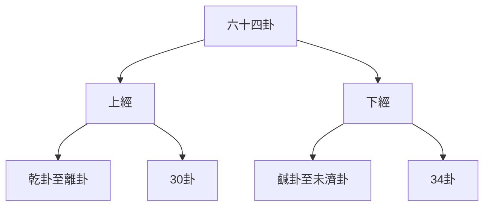
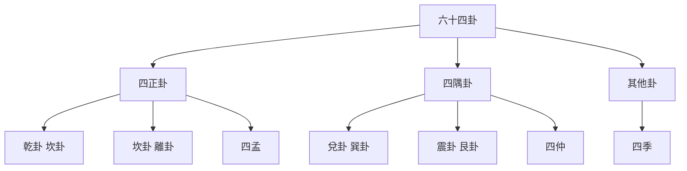
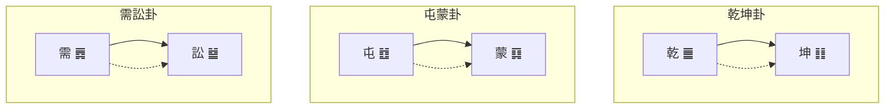

# 六十四卦詳解

> 🎯 **學習目標**：系統掌握六十四卦的基本含義、卦辭、象辭和哲學內涵，爲深入研讀《周易》奠定堅實基礎。

## 📚 六十四卦概述

### 六十四卦的構成

六十四卦是由八卦兩兩相重而成，每卦六爻，共三百八十四爻。六十四卦構成了《周易》的核心內容，模擬宇宙萬物的各種狀態。

### 六十四卦的排列規律

六十四卦按照一定的規律排列，體現了事物的發展變化規律。

**上經**：從乾卦到離卦，共30卦，主要闡述天地初創、萬物萌發的過程。

**下經**：從鹹卦到未濟卦，共34卦，主要闡述人倫關係、社會發展的過程。

## 🌌 乾卦（乾爲天）

### 卦畫卦象
**卦畫**：䷀（六爻皆陽）
**卦象**：天

### 卦辭
**乾，元亨利貞。**

**象辭**
**大象**：天行健，君子以自強不息。
**小象**：潛龍勿用，陽在下也。見龍在田，德施普也。終日乾乾，反覆道也。或躍在淵，進無咎也。飛龍在天，大人造也。亢龍有悔，盈不可久也。用九，天德不可爲首也。

### 爻辭詳解
**初九：潛龍勿用。**
九二：見龍在田，利見大人。
九三：君子終日乾乾，夕惕若厲，無咎。
九四：或躍在淵，進無咎。
九五：飛龍在天，利見大人。
上九：亢龍有悔。
用九：見羣龍無首，吉。

### 哲學內涵
乾卦象徵天的剛健性質，強調自強不息的精神。初爻代表潛藏待時，二爻代表嶄露頭角，三爻代表勤奮努力，四爻代表謹慎進取，五爻代表事業有成，上爻代表盛極必衰。

## 🌍 坤卦（坤爲地）

### 卦畫卦象
**卦畫**：䷁（六爻皆陰）
**卦象**：地

### 卦辭
**坤，元亨，利牝馬之貞。君子有攸往，先迷後得主，利西南得朋，東北喪朋。安貞吉。**

**象辭**
**大象**：地勢坤，君子以厚德載物。
**小象**：履霜堅冰至，馴致其道。直方大，不習無不利。含章可貞，或從王事，無成有終。括囊無咎，慎害也。黃裳元吉，文在中也。龍戰於野，其血玄黃。

### 爻辭詳解
初六：履霜，堅冰至。
六二：直方大，不習無不利。
六三：含章可貞，或從王事，無成有終。
六四：括囊，無咎無譽。
六五：黃裳，元吉。
上六：龍戰於野，其血玄黃。

### 哲學內涵
坤卦象徵地的柔順性質，強調厚德載物的精神。坤卦體現了包容、承載、柔順的品德，是女性、母親、大地的象徵。

## 🌟 屯卦（水雷屯）

### 卦畫卦象
**卦畫**：䷂（坎上震下）
**卦象**：雲端雷

### 卦辭
**屯，元亨利貞，勿用有攸往，利建侯。**

### 哲學內涵
屯卦象徵萬物初生的艱難，強調創業起步階段的困難。屯卦告訴我們，事物的發展不會一帆風順，需要克服困難，穩步前進。

## 🌞 蒙卦（山水蒙）

### 卦畫卦象
**卦畫**：䷃（艮上坎下）
**卦象**：山出雲端

### 卦辭
**蒙，亨。匪我求童蒙，童蒙求我。初筮告，再三瀆，瀆則不告。利貞。**

### 哲學內涵
蒙卦象徵矇昧無知的狀態，強調啓蒙教育的重要性。蒙卦告訴我們，學習需要謙遜、有耐心，不可急於求成。

## 📊 六十四卦分類體系

### 按卦氣分類

### 按卦象性質分類

**陽卦**：乾、震、坎、艮（四卦爲陽）

**陰卦**：坤、巽、離、兌（四卦爲陰）

**純陽卦**：乾卦（六爻皆陽）

**純陰卦**：坤卦（六爻皆陰）

### 按六爻陰陽數分類

**陽卦**：陽爻多於陰爻的卦

**陰卦**：陰爻多於陽爻的卦

**平衡卦**：陰陽爻數量相等的卦

## 🎯 六十四卦學習要點

### 掌握基本構成

理解每一卦的：
- 卦畫：六爻的陰陽構成
- 卦名：卦的名稱和含義
- 卦象：卦象徵的事物
- 卦辭：一卦的總論

### 理解爻辭含義

理解每一爻的：
- 爻辭：每一爻的具體含義
- 爻位：爻位特殊的哲學意義
- 爻象：爻所象徵的狀態

### 結合彖象辭

將卦辭、爻辭與彖辭、象辭結合起來理解，融會貫通。

### 理解哲學內涵

每一卦都蘊含着深刻的哲學思想，要理解其哲學內涵。

## 💡 學習建議

### 循序漸進

不要試圖一次記住所有六十四卦，要循序漸進地學習。

### 先易後難

先學習純陽純陰卦，再學習其他卦。

### 結合生活

將六十四卦與生活實際結合起來，在應用程式中加深理解。

### 持續複習

六十四卦需要反覆學習，才能深入理解。

## 📖 六十四卦速查表

| 序號 | 卦名 | 卦畫 | 卦象 | 特徵 |
|------|------|------|------|------|
| 1 | 乾卦 | ䷀ | 天 | 剛健 |
| 2 | 坤卦 | ䷁ | 地 | 柔順 |
| 3 | 屯卦 | ䷂ | 雲端雷 | 初生 |
| 4 | 蒙卦 | ䷃ | 山出雲端 | 矇昧 |
| 5 | 需卦 | ䷅ | 水天 | 訟息 |
| 6 | 訟卦 | ䷄ | 天水 | 爭訟 |
| ... | ... | ... | ... | ... |
| 64 | 未濟卦 | ䷾ | 水在火上 | 未完成 |

## 🔄 六十四卦的關係

### 相錯關係

卦與卦之間六爻陰陽相反，稱爲相錯。

### 相綜關係

卦的上下卦位置互換，稱爲相綜。

### 訊息卦

陰陽爻逐一消長的十二卦，稱爲訊息卦。

## 🎨 學習圖表

### 六十四卦方圖

## 🔗 相關資源

- [[易經結構與組成]] - 理解《周易》的基本結構
# 方法
- [[彖辭象辭解析]] - 深入理解彖辭象辭的哲學內涵
- [[十二訊息卦]] - 學習十二訊息卦的特殊規律

---
*創建時間: 2026-02-01*  
*分類: 4 Interests*
