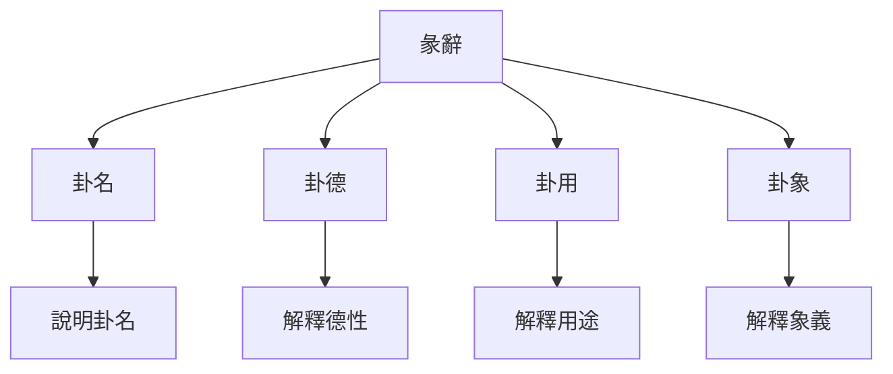
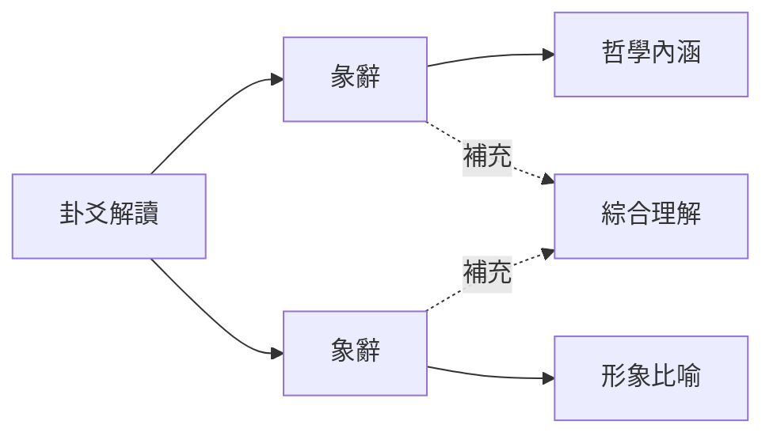

# 彖辭象辭解析

# 方法

## 📚 彖辭概述

### 什麼是彖辭

彖辭又稱"彖傳"，是對卦辭的總論，主要解釋卦的哲學內涵、卦德和卦用。《繫辭上》雲端："彖者，言乎象者也。"說明彖辭是用形象比喻來解釋卦義。

### 彖辭的構成

**卦名**：說明這是哪一卦。

**卦德**：解釋一卦的德性。

**卦用**：解釋一卦的用途。

**卦象**：解釋一卦的象義。

## 📖 象辭概述

### 什麼是象辭

象辭又稱"象傳"，是對卦辭和爻辭的形象化解釋，包括大象和小象。《繫辭下》雲端："象者，像也。"

### 象辭的構成

**大象**：解釋全卦的象義。

**小象**：解釋每一爻的象義。

**修辭特點**：用生動的形象比喻解釋抽象的易理。

## 🔄 彖辭與象辭的關係

### 相互補充

彖辭和象辭不是對立的，而是相互補充的關係。

**彖辭**：側重於哲學內涵的闡述。

**象辭**：側重於形象比喻的說明。

**結合運用**：解讀卦爻時，要將彖辭和象辭結合起來理解。

## 🎯 彖辭的哲學內涵

### 天道觀

彖辭主要闡述的是天道觀，即人與天的關係。

**順應天道**：強調人應該順應天道，按照天道的規律行事。

**天人合一**：強調人是自然的一部分，應該與自然和諧相處。

**變易不易**：強調萬物都在變化，但變化的規律永恆不變。

### 倫理觀

彖辭也包含豐富的倫理觀念，強調君臣父子、夫妻朋友的倫理關係。

**君臣之道**：闡述君臣應該各盡其責，君主要明智，臣主要忠誠。

**父子之道**：闡述父子之間的倫理關係，父主要慈愛，子主要孝順。

**夫妻之道**：闡述夫妻之間的倫理關係，主要和諧互補。

**朋友之道**：闡述朋友之間的倫理關係，主要誠信互助。

### 政治觀

彖辭還包含政治觀念，闡述治國安邦的道理。

**德治爲主**：強調以德治國，君主要以德來感化臣民。

**禮樂並重**：強調禮樂的重要性，用禮樂來規範社會秩序。

**中庸之道**：強調中庸不偏，不要走極端。

## 🎨 象辭的修辭藝術

### 形象生動

象辭的修辭藝術非常高超，主要特點包括：

**用具體形象**：用具體的自然現象來說明抽象的易理。

**比喻恰當**：用恰當的比喻來解釋複雜的易理。

**簡潔精煉**：用簡潔的語言傳達深刻的哲理。

**音韻和諧**：講究音韻，讀起來朗朗上口。

### 修辭手法

**比喻**：用自然現象比喻人事。

**擬人**：將自然現象擬人化。

**對仗**：形成對仗工整的結構。

**排比**：用排比句式增強氣勢。

## 📊 彖辭的哲學思想

### 變易思想

彖辭深入闡述了變易的哲學思想。

**萬物皆變**：宇宙萬物都在不斷變化，沒有永恆不變的事物。

**變中有常**：雖然萬物都在變化，但變化的規律是永恆不變的。

**順應變化**：人應該順應萬物的變化，不要固執己見。

### 不易思想

彖辭也體現了不易的思想。

**規律永恆**：雖然萬物都在變化，但變化的規律是永恆不變的。

**天道不變**：天的運行規律是永恆不變的，春夏秋冬四季循環。

**人道不變**：人的基本倫理道德也是不變的。

### 簡易思想

彖辭還體現了簡易的思想。

**大道至簡**：掌握了變化的規律後，複雜的事物就變得簡單了。

**執簡御繁**：用簡單的道理來處理複雜的事情。

**知變應變**：掌握了變化規律，就能從容應對各種變化。

## 🎨 象辭的形象比喻

### 自然現象比喻

象辭用大量的自然現象來比喻人事：

**天**：象徵君、父、剛健、高遠。

**地**：象徵母、臣、柔順、承載。

**雷**：象徵動、起、震驚、奮發。

**風**：象徵入、從、柔順、滲透。

**水**：象徵陷、險、下流、潛藏。

**火**：象徵明、上、炎上、附麗。

**山**：象徵止、固、高崇、穩重。

**澤**：象徵悅、聚、柔順、和美。

### 人體比喻

象辭還用人體部位來比喻：

**頭**：象徵高貴、統御、智慧。

**腹**：象徵包容、承載、消化。

**足**：象徵行動、運動、奔跑。

**手**：象徵把握、操作、創造。

**目**：象徵觀察、辨別、智慧。

**耳**：象徵傾聽、接受、智慧。

### 動物比喻

象辭用動物來比喻：

**馬**：象徵剛健、奔跑、奮鬥。

**牛**：象徵勤勞、溫順、奉獻。

**龍**：象徵變化、神祕、高貴。

**雉**：象徵隱逸、等待、機緣。

**豬**：象徵貪喫、懶惰、滿足。

# 方法

### 結合卦象

解讀彖辭象辭要結合卦象來理解。

**理解卦的組成**：理解上卦和下卦的組成及其象徵意義。

**理解卦的關係**：理解上卦與下卦的關係。

**理解卦的整體**：從整體上理解一卦的含義。

### 結合卦辭

解讀彖辭象辭要結合卦辭來理解。

**理解卦辭的吉凶**：理解卦辭判斷的吉凶情況。

**理解卦辭的條件**：理解卦辭中吉凶的條件。

**理解卦辭的應用程式**：理解卦辭在什麼情況下應用程式。

### 結合爻辭

解讀彖辭象辭要結合爻辭來理解。

**理解爻辭的含義**：理解每一爻的具體含義。

**理解爻與爻的關係**：理解承乘比應關係對爻辭的影響。

**理解爻的變化**：理解爻變對卦辭含義的影響。

## 💡 彖辭象辭的應用程式

### 在解卦中的應用程式

**輔助判斷**：用彖辭象辭輔助判斷卦的含義。

**深入理解**：用彖辭象辭深入理解卦的哲學內涵。

**綜合判斷**：結合卦辭爻辭、彖辭象辭進行綜合判斷。

### 在處世中的應用程式

**哲學指導**：從彖辭中學習處世哲學。

# 方法

**決策智慧**：從彖辭象辭中學習決策的智慧。

## 🔍 彖辭象辭的深度解讀

### 天人合一思想

**《繫辭上》雲端**："易與天地準，故能彌綸天地之道。"

**天人關係**：彖辭象辭強調天人合一，人是自然的一部分。

**順應天時**：人應該順應天時，按照天道的規律行事。

**成就事業**：順應天道才能成就大事業。

### 君子之道

**《繫辭上》雲端**："君子進德修業。"

**君子品德**：從彖辭象辭中學習君子應該具備的品德。

# 方法

# 方法

### 中庸之道

**《繫辭上》雲端**："一陰一陽之謂道。"

**陰陽平衡**：彖辭象辭強調陰陽平衡，不要走極端。

**中正之道**：從彖辭象辭中學習中正之道。

**適度原則**：從象辭中學習適度原則，不要太過或不及。

## 📊 彖辭象辭的學習要點

### 理解哲學內涵

**天道觀**：理解彖辭中體現的天道觀。

**倫理觀**：理解彖辭中體現的倫理觀。

**政治觀**：理解彖辭中體現的政治觀。

**人生觀**：理解彖辭中體現的人生觀。

### 掌握修辭技巧

**比喻藝術**：掌握彖辭象辭的比喻藝術。

**對仗技巧**：掌握彖辭象辭的對仗技巧。

**排比手法**：掌握彖辭象辭的排比手法。

**音韻和諧**：體會彖辭象辭的音韻和諧。

### 結合實際應用程式

**解卦應用程式**：在解卦中運用彖辭象辭。

**處世應用程式**：在處世中運用彖辭象辭的智慧。

**修養應用程式**：在自我修養中運用彖辭象辭。

**決策應用程式**：在決策中運用彖辭象辭的智慧。

## 💡 學習建議

### 按序漸進

**先理解卦辭**：先理解卦辭，再學習彖辭象辭。

**再理解彖辭**：理解彖辭的哲學內涵。

**再理解象辭**：理解象辭的形象比喻。

**最後綜合**：將三者綜合起來理解。

### 參考註疏

**歷代注家**：參考歷代注家的註釋，理解不同的解讀。

**對比學習**：對比不同注家的解讀，形成自己的理解。

**融會貫通**：將不同注家的解讀融會貫通。

### 實踐應用程式

**解卦實踐**：在解卦中運用彖辭象辭。

**生活實踐**：在生活中運用彖辭象辭的智慧。

**反思總結**：反思總結學習心得，形成自己的體悟。

## 🔗 相關資源

- [[六十四卦詳解]] - 系統學習每一卦
# 方法
- [[易理哲學思想]] - 學習易理的哲學思想
- [[易經中的處世哲學]] - 學習處世哲學

---
*創建時間: 2026-02-01*  
*分類: 4 Interests*
