# 梅花易數入門

# 方法

## 📚 梅花易數概述

### 什麼是梅花易數

# 方法

### 梅花易數的特點

**起卦靈活**：可以用時間、方位、數字、物象等多種方式起卦

**重外應**：非常重視外應（年月日時）的配合作用

# 分析

**形象生動**：用花葉象喻易理，易於理解和記憶

## 🔄 梅花易數基礎

### 基礎概念

#### 體卦、互卦、變卦

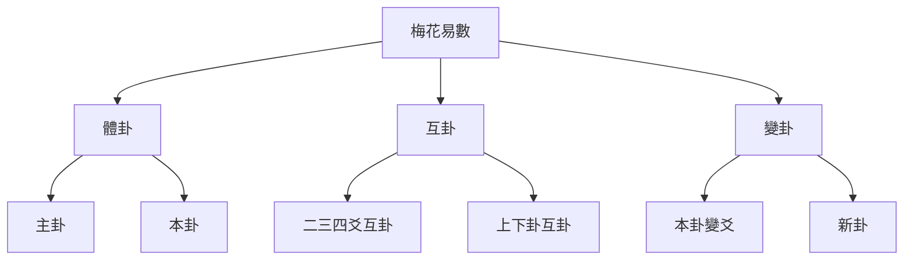

#### 外應、卦體、卦用

**外應**：取卦的時間年月日時

**卦體**：本卦（體卦）
- 上卦：上三爻
- 下卦：下三爻

**卦用**：起卦時的外部因素

### 基本原理

#### 起卦原理

1. **確定外應**：記錄起卦的年月日時
# 方法
3. **求互卦**：根據體卦的上下卦關係求互卦
4. **求變卦**：根據動爻的位置和陰陽變化求變卦
5. **斷卦**：根據體卦、互卦、變卦的綜合情況推斷吉凶

# 方法

### 時間起卦法

#### 年月日時起卦

**基本原理**：
- 年月日時對應八卦
- 根據時間推算體卦

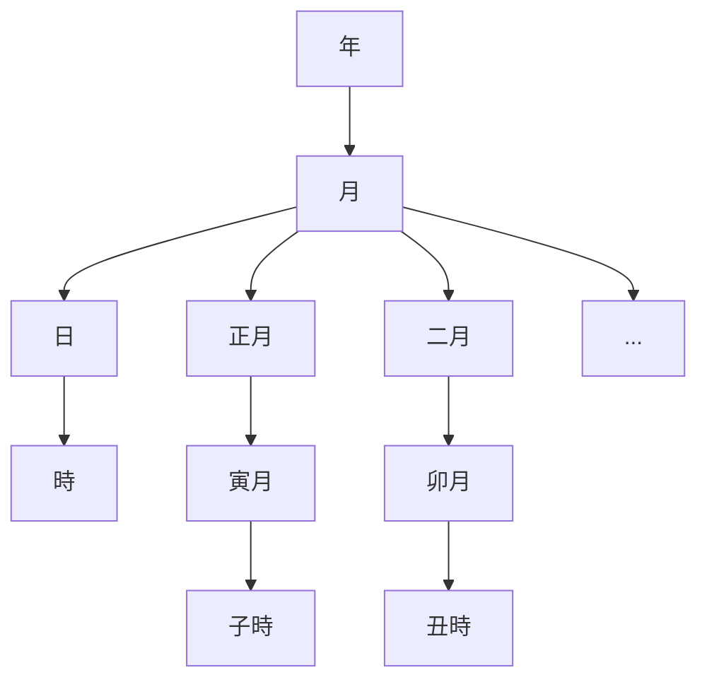

#### 年上起月法

# 方法
1. 取年卦：年上起月，如2024年→2024年對應的年卦
2. 取月卦：月上起日，如農曆正月
3. 取日卦：日上起時，如日上起時辰
4. 取時卦：時上起刻，如子時對應的時卦

#### 具體起卦示例

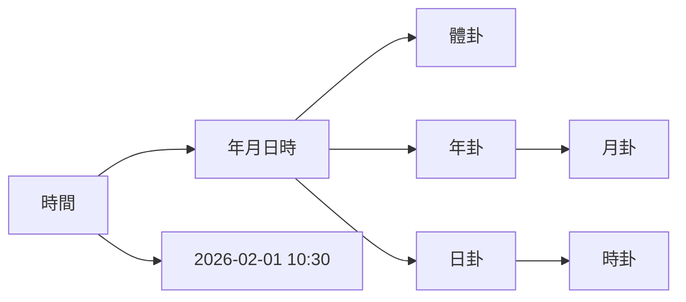

### 方位起卦法

#### 方位八卦對應

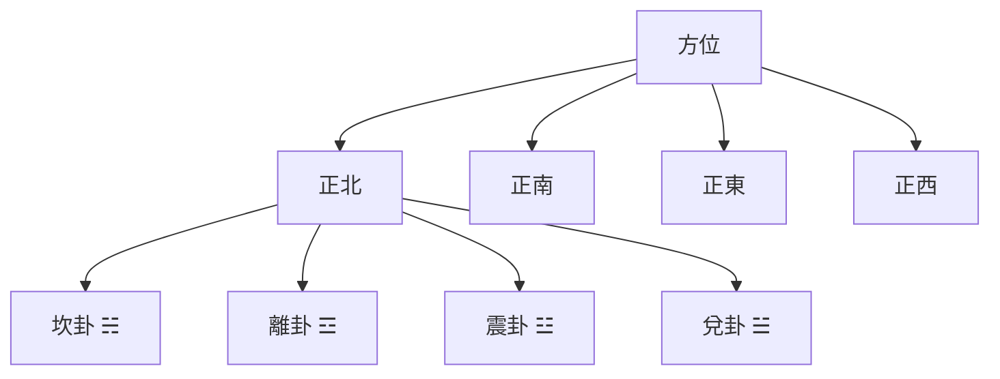

#### 方位起卦步驟

1. **確定方位**：確定起卦的方位
2. **確定卦象**：根據方位確定對應的八卦
3. **確定體卦**：方位爲上卦，反卦爲下卦

### 數字起卦法

# 方法

**基本原理**：
- 取1-8任意數字，按照規則組合成卦

#### 常用數字起卦法

1. **上下卦各3數字組合法**
2. **餘數起卦法**
3. **卦序數法**
4. **數字分組起卦法**

## 🎯 外應的重要性

### 外應的基本概念

#### 外應的構成

**外應 = 年 + 月 + 日 + 時**

- **年上起月**：根據年份取年卦，根據農曆月份取月卦
- **日上起日**：根據日支取日卦，根據時辰取時卦
- **日上起時**：根據時支取時卦

#### 外應的卦象關係

**上下卦關係**：
- 上卦：外應年卦
- 下卦：外應月卦
- 上上卦：外應年卦的上卦
- 下下卦：外應年卦的下卦

### 外應的吉凶作用

#### 外應與體卦的關係

**相生爲吉，相剋爲兇**

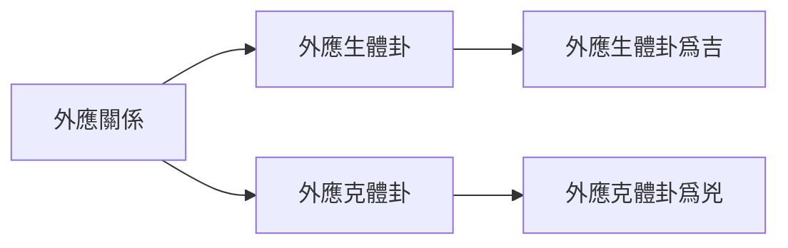

## 🔄 互卦的求法

### 互卦的概念

互卦是指從體卦的上下卦各取三爻組成的新卦。

### 互卦的求法

#### 基本互卦

**上卦互卦**：
- 上上卦：上卦的上三爻
- 上下卦：上卦的下三爻
- 互卦：上上卦 + 上下卦

#### 下卦互卦

**下卦互卦**：
- 下上卦：下卦的上三爻
- 下下卦：下卦的下三爻
- 互卦：下上卦 + 下下卦

### 互卦的圖表

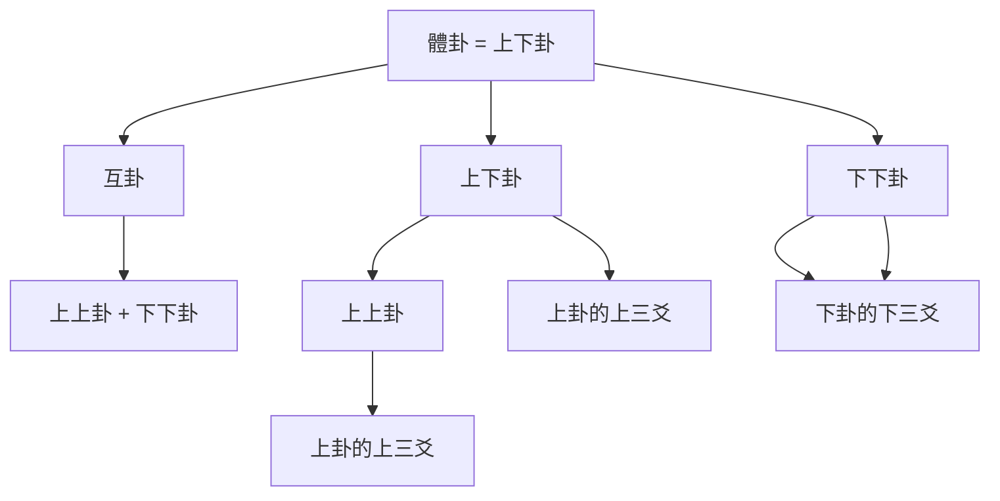

### 互卦的作用

**輔助判斷**：
- 互卦輔助判斷卦的含義
- 互卦的五行關係影響吉凶

**補充體卦**：
- 提供體卦的補充資訊
- 豐富對卦的理解

## 🔀 變卦的求法

### 變卦的概念

變卦是指當某爻發生變化時（從陽變陰或從陰變陽），產生的新卦。

### 變卦的求法

#### 基本變卦求法

**動爻位置**：
- 初爻變：初爻發生變化
- 二爻變：二爻發生變化
- ...（其他爻不變）

#### 變卦的圖表

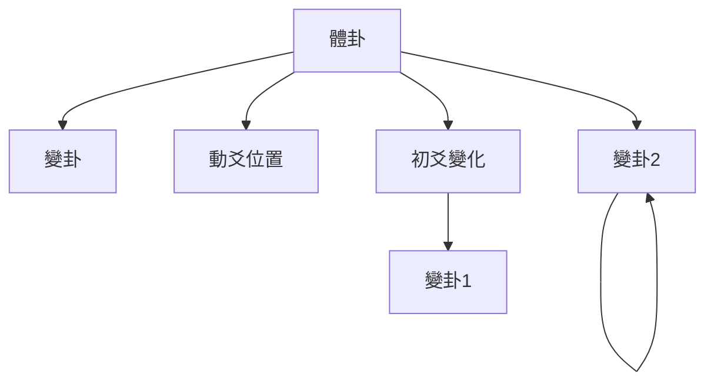

### 動爻位置對變卦的影響

#### 初爻變

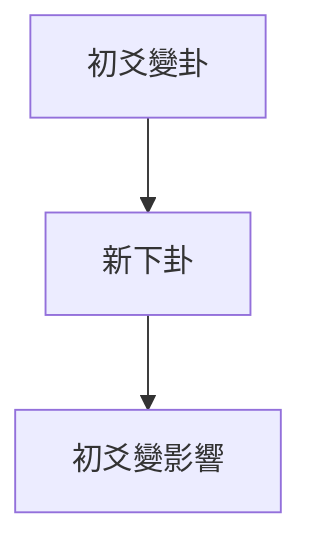

#### 上爻變

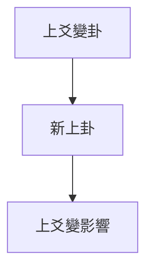

#### 中爻變

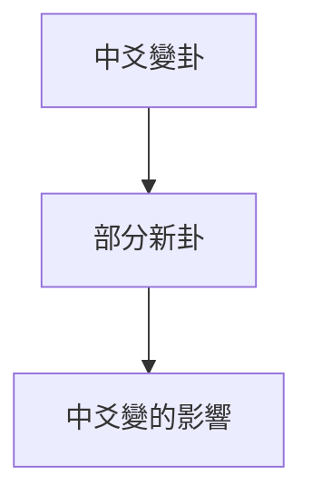

### 變卦的類型

#### 本卦變卦關係

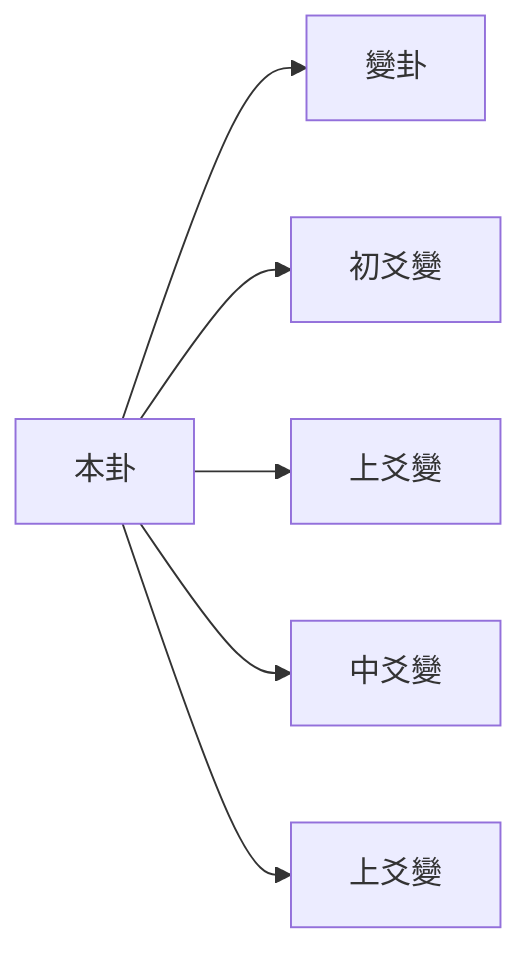

### 變卦的哲學意義

**變化原理**：
- 動爻變化體現事物的變化
- 體現了"變易"的哲學
- 變化是宇宙的基本規律

**變與不變**：
- 動爻變化：部分變化
- 不動爻：保持穩定
- 體現了"不易"的思想

### 變卦的吉凶判斷

#### 變卦的吉凶規律

**變卦與體卦的關係**：
- 變卦生體卦：多爲吉
- 變卦克體卦：多爲兇
- 變卦比體卦：多爲和

#### 動爻位置吉凶

**初爻變**：影響基礎
- 二爻變：影響發展
- 三爻變：影響轉折
- 四爻變：影響深入
- 五爻變：影響巔峯
- 上爻變：影響結果

# 方法

### 斷卦的綜合判斷

#### 綜合判斷要素

```mermaid
graph TB
    A[斷卦] --> B[綜合判斷]
    
    A --> C[體卦]
    A --> D[互卦]
    A --> E[變卦]
    
    B --> B1[體卦含義]
    B --> B2[互卦補充]
    B --> B3[變卦影響]
    
    B --> F[綜合判斷]
    F --> F1[吉凶判斷]
# 分析
```

#### 斷卦的流程

# 分析
1. 理解體卦的基本含義
# 分析
3. 判斷體卦的基本吉凶

# 分析
1. 理解互卦的組成和關係
# 分析
3. 判斷互卦對體卦的影響

# 分析
1. 理解變卦的變化類型
# 分析
3. 判斷變化的方向和結果

**第四步：綜合判斷**
1. 綜合體卦、互卦、變卦
2. 結合外應卦體卦的關係
3. 判斷最終的吉凶

### 斷卦的技巧

#### 理解主卦

**主卦的選擇**：
# 分析
- 互卦和變卦是輔助判斷
- 主次分明

# 分析

**陰爻變化**：
- 陰爻變陽：從消極到積極
- 陽爻保持：維持現狀

**陽爻變化**：
- 陽爻變陰：從積極到保守
- 陽爻保持：保持剛健

#### 動爻位置

**下爻變化**：
- 初爻變：影響基礎
- 中爻變化：影響發展
- 上爻變化：影響結果

## 💡 梅花易數學習要點

### 循序漸進

1. **先理解基礎概念**：體卦、互卦、變卦
# 方法
3. **理解外應原理**：外應與體卦的關係
# 方法

### 實踐應用程式

# 方法
2. **記錄斷卦心得**：記錄起卦、解卦、驗證結果
3. **驗證斷卦準確性**：事後驗證斷卦的準確性
4. **總結斷卦經驗**：總結各種情況的斷卦經驗

### 常見斷卦要點

# 分析

**重基礎**：重視體卦的基本含義和哲學內涵

# 分析

**看三才**：天人地三才是否協調

# 分析

**重輔助**：互卦只是輔助判斷，不是主斷卦依據

# 分析

# 分析

**重變化**：理解變卦對整體的影響

**看位置**：不同位置的變化影響不同

# 分析

**整體判斷**：不要只看單一因素
**綜合平衡**：體、互卦、變卦綜合判斷
**實事求是**：根據實際情況判斷吉凶

## 📊 梅花易數圖表彙總

### 外應八卦對應表

| 時間 | 外應 | 外應上下卦 | 外應上上卦 | 外應下下卦 |
|------|------|------------|-------------|-------------|
| 子時 | 坎 | 艮坤 | 坎坎 |
| 丑時 | 坎 | 艮坤 | 坎兌 |
| 寅時 | 艮坤 | 巽巽 | 艮離 |
| 卯時 | 巽震 | 巽艮 | 巽坎 |
| 辰時 | 巽震 | 巽艮 | 巽兌 |
| 辰時 | 巽巽 | 巽坎 | 巽離 |
| 已時 | 巽巽 | 巽艮 | 巽兌 |
| 午時 | 坎艮 | 坎坎 | 坎兌 |
| 申時 | 巽兌 | 巽坤 | 巽兌 |

### 方位八卦對應表

| 方位 | 八卦 | 方位 | 八卦 |
|------|------|------|------|
| 正北 | 坎卦 ☵ | 正東 | 震卦 ☳ |
| 正南 | 離卦 ☲ | 正西 | 兌卦 ☱ |
| 正東 | 震卦 ☳ | 正西 | 兌卦 ☱ |
| 正西 | 兌卦 ☱ | 正東 | 震卦 ☳ |
| 東南 | 巽卦 ☴ | 西南 | 離卦 ☷ |
| 西南 | 離卦 ☷ | 東北 | 坎卦 ☶ |
| 西北 | 坎坎 ☵ | 西東 | 兌卦 ☱ |

## 🎯 梅花易數實例演示

### 示例1：起卦演示

#### 時間起卦法演示

假設2026年2月1日上午10:30起卦，演示體卦計算過程：

#### 第一步：確定外應

```mermaid
graph LR
    A[時間] --> B[年月日時]
    
    B --> C[2026] --> C1[年卦]
    B --> D[正月] -[[六爻預測基礎]]
    B --> E[[六爻預測基礎]]3[日卦]
    B --> F[10時] --> C4[時卦]
    
    B --> G[外應組合]
```

#### 第二步：計算體卦

根據外應組合，計算得到體卦的上下卦。

#### 第三步：求互卦

根據體卦的上下卦，求出上卦互卦和下卦互卦。

#### 第四步：確定變卦

根據實際起卦時的動爻位置，確定變卦。

# 分析

綜合體卦、互卦、變卦進行綜合斷卦。

## 💡 梅花易數的應用程式場景

### 占卜應用程式

# 方法
- 時間起卦：選擇合適的時間起卦
- 方位起卦：選擇合適的方位起卦
- 數字起卦：選擇合適的數字起卦
- 物象起卦：選擇合適的物象起卦

### 斷卦應用程式

**個人決策**：
# 分析
- 用梅花易數輔助決策
- 綜合體卦、互卦、卦象斷吉凶

**職業規劃**：
- 用梅花易數輔助職業決策
# 分析
- 評估發展方向

### 事務預測

**事務判斷**：
- 事務的發展趨勢
- 事務的成功概率
- 事務的風險評估

## 🔗 相關資源

- [[六爻預測基礎]] - 學習六爻占卜
- [[六爻預測基礎]] - 六爻的世應六親系統
# 方法
- [[占卜中的心理投射]] - 理解占卜的心理機制
- [[個人修身與易經]] - 個人修養指導

---
*創建時間: 2026-02-01*  
*分類: 4 Interests*
