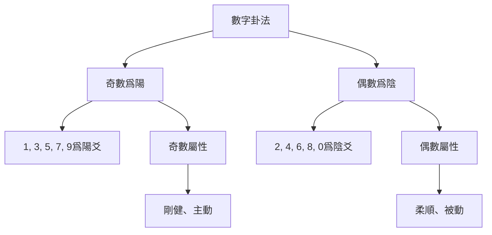
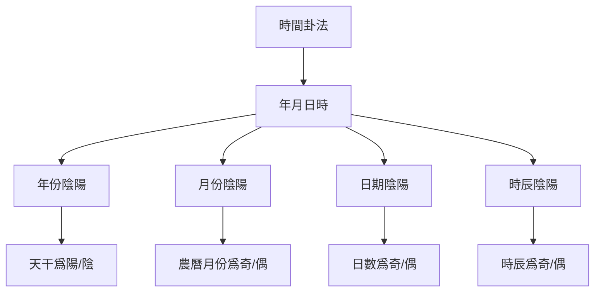
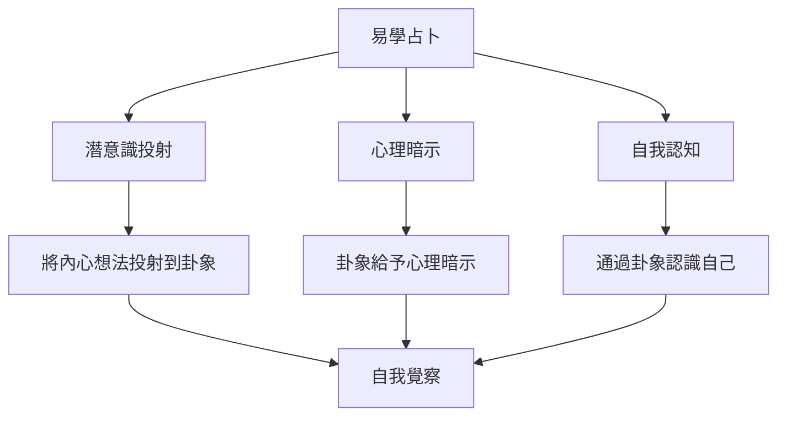
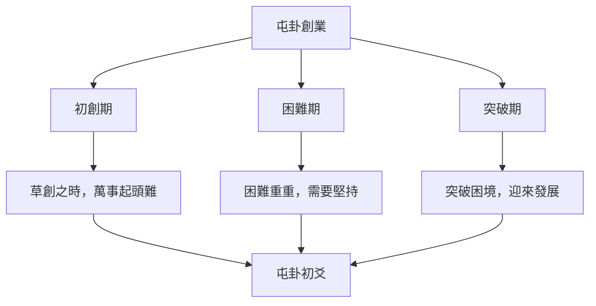
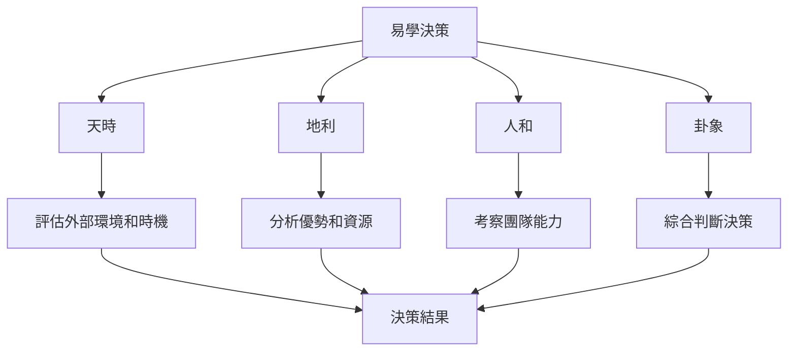

# 現代易學應用

# 學習

## 📚 現代易學概述

### 易學的現代轉型

傳統易學在現代社會中經歷了重要轉型，從純粹的占卜工具轉向哲學智慧體系。現代易學更強調易理的哲學內涵和心理調節作用，而非簡單的預測未來。

### 現代易學的特點

**哲學導向**：強調易學作爲哲學智慧的指導作用

# 分析

# 管理

**決策輔助**：將易學作爲輔助決策的思考工具，而非決定工具

# 方法

### 數字卦法

#### 數字卦法的原理

# 方法

#### 數字卦法操作步驟

**第一步：選取數字**
從生活中選取一個數字，可以是：
- 手機號碼中的數字
- 身份證號中的數字
- 時間數字
- 隨機數字

**第二步：確定卦象**
將數字轉換爲陰陽爻：
- 奇數 → 陽爻（—）
- 偶數 → 陰爻（- -）

**第三步：組成卦象**
按照從下到上的順序排列六爻，形成卦象

#### 數字卦法示例

假設選取手機號碼13800138000中的前6位：

| 位置 | 數字 | 奇偶 | 陰陽 | 爻象 |
|------|------|------|------|------|
| 初爻 | 1 | 奇 | 陽爻 | — |
| 二爻 | 3 | 奇 | 陽爻 | — |
| 三爻 | 8 | 偶 | 陰爻 | - - |
| 四爻 | 0 | 偶 | 陰爻 | - - |
| 五爻 | 0 | 偶 | 陰爻 | - - |
| 上爻 | 1 | 奇 | 陽爻 | — |

最終卦象：䷀（乾卦）變體

### 時間卦法

#### 時間卦法的原理

時間卦法根據時間的陰陽屬性起卦，體現了易學"天人合一"的思想。

#### 時間卦法操作步驟

# 記錄
# 記錄

**第二步：確定陰陽**
- 年份：根據天干確定陰陽
- 月份：農曆月份奇數爲陽，偶數爲陰
- 日期：日數奇數爲陽，偶數爲陰
- 時辰：子醜寅卯辰巳爲陽，午未申酉戌亥爲陰

**第三步：組成卦象**
按照時間順序確定初爻到上爻

#### 時間卦法示例

假設占卜時間爲2026年2月1日10:30：

| 時間 | 數值 | 奇偶 | 陰陽 | 爻象 |
|------|------|------|------|------|
| 年份 | 2026（丙午年） | 丙火爲陽 | 陽爻 | — |
| 月份 | 正月 | 1爲奇 | 陽爻 | — |
| 日期 | 1日 | 1爲奇 | 陽爻 | — |
| 時辰 | 巳時 | 巳爲陽 | 陽爻 | — |
| 時序 | 10時 | 0爲偶 | 陰爻 | - - |
| 分鐘 | 30 | 0爲偶 | 陰爻 | - - |

最終卦象：䷀（乾卦）變體

### 隨機數卦法

#### 隨機數卦法的原理

利用現代隨機數生成器起卦，體現易學的隨機性原理。

#### 隨機數卦法操作步驟

**第一步：生成隨機數**
使用手機、電腦等設備生成隨機數

**第二步：確定陰陽**
- 隨機數爲奇數 → 陽爻
- 隨機數爲偶數 → 陰爻

**第三步：重複六次**
重複上述過程六次，得到六爻

## 🧠 易學與現代心理學

### 心理投射理論

#### 占卜的心理機制

易學占卜在現代心理學中可理解爲一種"心理投射"機制：

#### 心理投射的作用

**自我認知**：
通過起卦和斷卦，認識自己的內心真實想法和需求

**情緒疏導**：
# 管理

**決策輔助**：
通過卦象的哲學內涵，啓發新的思考角度

### 認知行爲理論

#### 易學與認知行爲的結合

易學智慧可以幫助改善認知偏差：

# 方法
|---------|---------|---------|
| 二元對立思維 | 陰陽平衡 | 理解陰陽相生相剋，避免絕對化思維 |
| 過度概括 | 變易思想 | 理解事物不斷變化，避免以偏概全 |
| 災難化思維 | 不易思想 | 理解規律永恆，從變化中找到穩定性 |
| 個人化思維 | 天人合一 | 理解天人關係，避免過分自責或自大 |

#### 易學認知重構練習

**第一步：識別負面思維**
用易學概念識別負面思維模式

# 分析
# 分析

**第三步：變易思考**
用變易思想考慮變化的可能性

**第四步：不易穩定**
用不易思想找到穩定的支點

# 管理

# 管理

#### 乾坤之道與領導力

**乾卦領導力**：
- 自強不息：領導者要不斷進取
- 厚德載物：領導者要寬容包容
- 剛柔並濟：領導方式要剛柔適度

**坤卦領導力**：
- 順勢而爲：順應規律而非強求
- 包容萬物：包容不同觀點和人才
- 持之以恆：堅持長期主義

# 管理

屯卦（䷂）象徵萬物始生，對應創業階段：

# 管理
- 創業要有長期堅持的準備
- 困難時要保持信心和耐心
- 時機成熟時要果斷突破

# 管理

泰卦（䷊）象徵天地交泰，對應團隊和諧：

# 管理
- 上下溝通要順暢（天地交）
- 團隊氛圍要和諧
- 目標一致才能成功

# 管理

#### 易學決策框架

**易學決策四要素**：
1. **天時**：外部環境和時機
# 資源
3. **人和**：團隊和能力
# 分析

#### 易學決策應用

# 分析
# 分析
- 判斷決策的時機是否成熟
- 理解變易的規律

**第二步：評估地利**
# 資源
# 分析
- 理解不易的穩定因素

**第三步：考察人和**
- 評估團隊能力
- 考慮利益相關者
- 理解人的因素

**第四步：卦象綜合判斷**
- 綜合天時地利人和
- 參考卦象的哲學內涵
- 做出理性決策

## 🌟 易學與現代生活

### 職場應用

#### 易學職場智慧

**謙卦與職場**
- 謙卦（䷎）象徵謙虛低調
- 職場中保持謙虛，更容易獲得支持和認可
- 謙虛不等於軟弱，是智慧的體現

**夬卦與職場**
- 夬卦（䷪）象徵決斷
- 職場中需要果斷的決策能力
# 分析

#### 易學職業規劃

**第一步：自我認知**
# 分析
- 理解陰陽平衡，發揮自己的優勢

# 分析
# 分析
- 判斷職業發展的時機

**第三步：目標設定**
- 設定符合易學智慧的職業目標
- 目標要有長遠規劃，符合不易思想

**第四步：行動執行**
- 根據天時地利人和制定行動計劃
- 在變化中保持不變的原則

### 家庭應用

#### 易學家庭智慧

**家人卦與家庭**
- 家人卦（䷤）象徵家庭和睦
- 家庭中要遵循家人卦的啓示
- 父母要有威嚴，子女要孝順

**漸卦與家庭教育**
- 漸卦（䷴）象徵循序漸進
- 教育子女要循序漸進，不能急於求成
- 每個階段都有不同的教育重點

#### 易學家庭關係

**夫妻關係**：
- 理解陰陽互補，相互包容
- 夫妻關係要和諧平衡
- 遇到問題要變易思考

**親子關係**：
- 父母要厚德載物，包容子女
- 子女要自強不息，不斷進步
- 父母要引導子女，而非強制

### 健康應用

#### 易學養生智慧

**五行養生**：
- 根據五行屬性養生
- 木（肝）：養肝護肝，情志舒暢
- 火（心）：養心安神，心態平和
- 土（脾胃）：健脾養胃，飲食有節
- 金（肺）：養肺潤肺，呼吸順暢
- 水（腎）：養腎固腎，節制房事

**四季養生**：
- 春養肝：順應春生之氣
- 夏養心：順應夏長之氣
- 秋養肺：順應秋收之氣
- 冬養腎：順應冬藏之氣

#### 易學心理養生

**心態調節**：
- 用陰陽平衡調節心態
- 避免過於剛強或過於柔弱
- 保持中正平和的心態

# 管理
- 用易學概念理解情緒
- 情緒也是陰陽變化
- 順應情緒，而非壓抑

# 學習

# 學習

1. **避免迷信**：不將占卜作爲決定命運的依據
2. **哲學導向**：注重易學的哲學內涵
3. **心理調節**：將易學作爲心理調節的工具
4. **決策輔助**：將易學作爲輔助決策的思考工具

### 實踐應用

# 方法
2. **心理應用**：運用易學智慧進行心理調節
# 管理
4. **生活應用**：將易學智慧應用於現代生活

# 學習

1. **研讀經典**：深入研讀《周易》等經典文獻
2. **實踐驗證**：在實踐中驗證易學智慧
# 分析
# 知識

## 📊 現代易學應用圖表彙總

# 方法

# 方法
|---------|------|------|---------|
# 場景
| 時間卦法 | 體現天人合一 | 需要記住時間對應關係 | 需要考慮時間的占卜 |
| 隨機數卦法 | 隨機性強 | 需要電子設備 | 需要強隨機性的占卜 |

### 易學與現代心理學對應關係

| 易學概念 | 心理學概念 | 應用 |
|---------|-----------|------|
| 陰陽平衡 | 認知平衡 | 調節極端思維 |
| 變易思想 | 認知靈活性 | 適應變化 |
| 不易思想 | 心理穩定 | 尋找穩定支點 |
| 簡易思想 | 簡化策略 | 簡化複雜問題 |
| 天人合一 | 整體觀 | 整體看待問題 |

# 資源

# 學習
# 學習
# 學習
- [[易經與決策智慧]] - 易學決策智慧
- [[個人修身與易經]] - 個人修養指導

---
# 創建
# 分類
