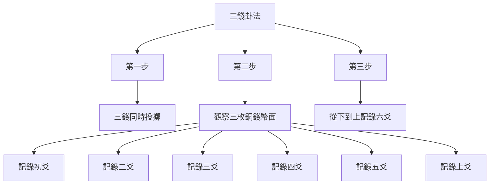
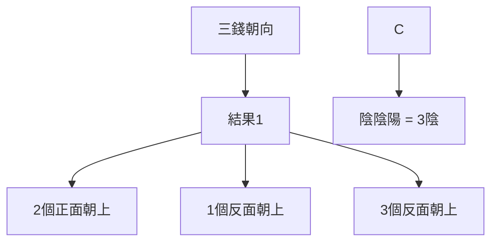
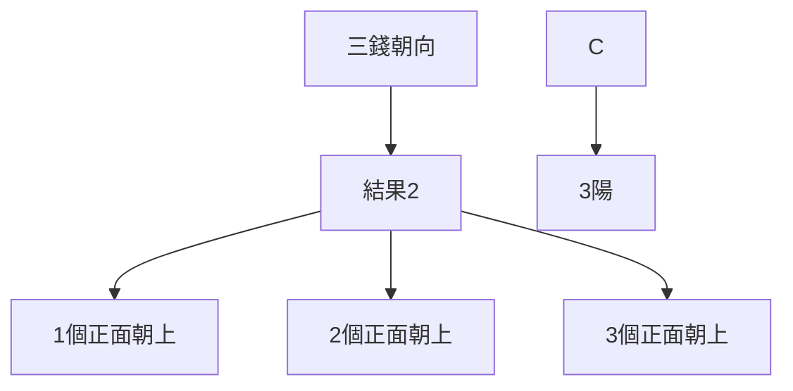
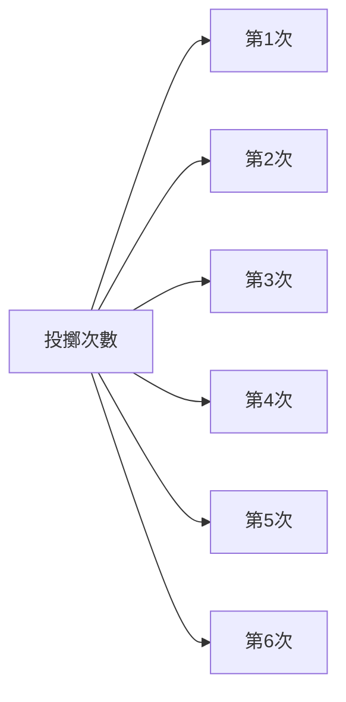
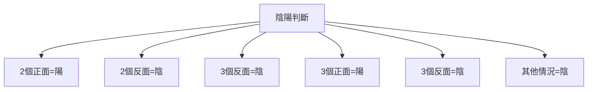
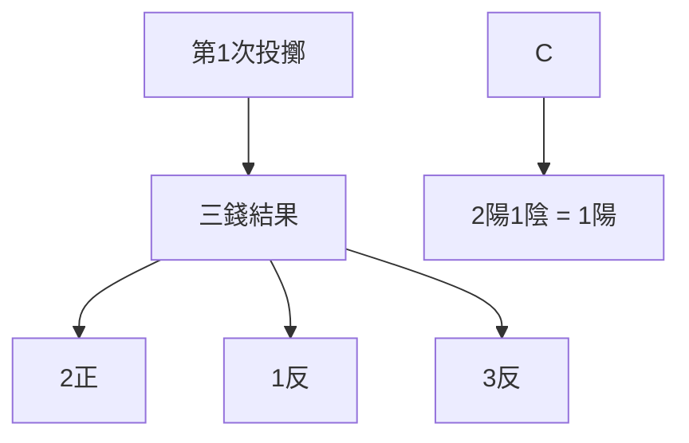
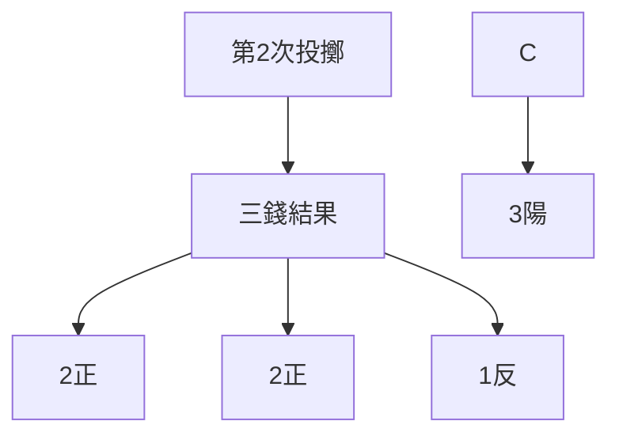
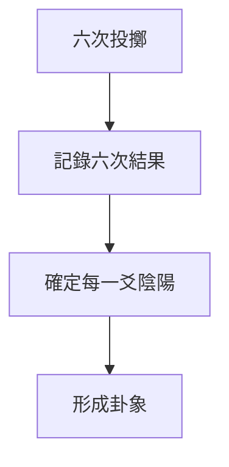
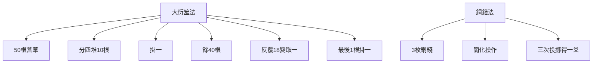

# 銅錢卦法

> 🎯 **學習目標**：掌握金錢卦法的基本操作步驟、簡化特點和起卦技巧，理解其與大衍筮法的對應關係，能夠獨立進行金錢卦占卜。

## 📚 銅錢卦法概述

### 什麼是金錢卦法

# 方法

### 金錢卦法的優點

**簡化操作**：用銅錢蓍草，操作簡單易學

**節省時間**：不需要複雜的蓍草準備和清潔

**便於普及**：更容易被初學者掌握和傳播

**攜帶方便**：三枚銅錢隨時可以進行占卜

## 🔄 銅錢卦法的操作步驟

### 基礎操作

#### 準備工作

**準備三枚銅錢**
- 材質：銅錢即可，不拘泥於特定朝代或面值
- 數量：三枚相同的銅錢
- 特徵：最好選擇有正反兩面區分明顯的銅錢

#### 明確幣面定義

**幣面規定**：
- 正面：陽爻（—）
- 反面：陰爻（- -）
- 或：規定某一面爲陽，另一面爲陰

**幣值規定**：
- 字面：4、5、6、8、9、0
- 花面：1、2、7、8、3

## 🔍 三錢起卦法

# 方法

#### 操作步驟

#### 第一步：三錢同時投擲
將三枚銅錢同時投擲，讓銅錢自然落地。

#### 第二步：觀察結果
記錄下三枚銅錢幣面的朝向：
- **正面朝上**（陽爻）
- **反面朝上**（陰爻）

#### 第三步：從下到上記錄

按照從初爻到上爻的順序，記錄六爻：

# 方法

**第一次投擲**：得到初爻（初爻）

**第二次投擲**：得到二爻（二爻）

繼續投擲，共六次，得到從初爻到上爻的六爻。

# 方法

#### 操作步驟

#### 第一步：第一枚銅錢投擲
投擲第一枚銅錢，觀察幣面朝向，記錄爲初爻。

#### 第二步：第二枚銅錢投擲
投擲第二枚銅錢，觀察幣面朝向，記錄爲二爻。

#### 第三步：第三枚銅錢投擲
投擲第三枚銅錢，觀察幣面朝向，記錄爲三爻。

#### 第四步：重複上述過程
重複上述過程，記錄四爻、五爻、上爻。

## 📊 六爻的陰陽確定

### 陰陽判斷規則

#### 基本規則
- **陽爻（—）**：正面朝上
- **陰爻（- -）**：反面朝上

#### 變形規則

#### 實例說明

| 三錢正面數 | 三錢反面數 | 初爻（下爻） | 解釋 |
|-----------|-----------|-----------|------|
| 3 | 0 | 陽爻（—） | 3個正面，2個反面 |
| 0 | 3 | 陰爻（- -） | 0個正面，3個反面 |
| 2 | 1 | 陰爻（- -） | 2個正面，1個反面 |
| 1 | 2 | 陽爻（—） | 1個正面，2個反面 |
| 1 | 2 | 陰爻（- -） | 1個正面，2個反面 |
| 0 | 3 | 陰爻（- -） | 0個正面，3個反面 |

## 🎯 起卦實戰演示

### �示一：構建乾卦（䷀）

#### 投擲過程

**第一次投擲（初爻）**

**第二次投擲（二爻）**

繼續投擲第三、四、五、六次，記錄各爻的陰陽。

#### 完整卦象結果

假設六次投擲的結果如下：
- 初爻：1陽2陰 = 陽爻（—）
- 二爻：3陽0陰 = 陽爻（—）
- 三爻：2陽1陰 = 陰爻（- -）
- 四爻：0陽3陰 = 陰爻（- -）
- 五爻：1陽2陰 = 陽爻（—）
- 上爻：3陽0陰 = 陽爻（—）

最終得到：䷀（乾卦）

### 演示二：構建坤卦（䷁）

#### 投擲過程

假設六次投擲結果如下：
- 初爻：0正3反 = 陰爻（- -）
- 二爻：1正2反 = 陽爻（—）
- 三爻：2正1反 = 陰爻（- -）
- 四爻：3正0反 = 陽爻（—）
- 五爻：0正3反 = 陰爻（- -）
- 上爻：1正2反 = 陽爻（—）

最終得到：䷁（坤卦）

## 🎯 實戰練習

### 練習1：獨立起卦

**任務要求**：
1. 按照三錢起卦法進行六次投擲
2. 記錄每次投擲的三錢朝向
3. 確定每一爻的陰陽
4. 寫出最終的卦象

**參考結果**：

### 練習2：識別卦象

**任務要求**：
1. 給定一個卦象，反推可能的三錢朝向組合
2. 列舉所有可能的三錢朝向組合
3. 驗證是否能夠得到該卦象

**示例**：
- 目標卦象：䷁（坤卦）
- 可能的三錢朝向組合：每次都是1正2反（0正3反）
- 驗證：這種組合確實能產生坤卦

## 💡 學習要點

### 操作步驟
1. **明確幣面規則**：先確定哪一面是陽，哪一面是陰
2. **均勻用力**：每次投擲要均勻用力，確保隨機性
3. **及時記錄**：每次投擲後立即記錄結果，避免遺忘
4. **從下到上**：嚴格按照從初爻到上爻的順序記錄

### 理解原理
1. **50根蓍草簡化爲3枚銅錢**：大衍之數五十，揲之四十有九，其餘一分爲二，各四十有九，揲之以四。
2. **每次投擲代表一次取蓍**：六次投擲模擬大衍之數的操作過程
3. **隨機性原則**：銅錢的隨機性對應了大衍筮法中的隨機性

### 嚌錢法與大衍筮法的對應

### 對應關係

### 主要簡化

1. **操作簡化**：從50根蓍草簡化爲3枚銅錢
2. **時間節省**：大大縮短占卜時間
3. **門檻降低**：更容易被初學者掌握
4. **便於攜帶**：三枚銅錢隨時可用

### 核心原理保持

1. **隨機性**：保持與大衍筮法相同的隨機性
2. **六次投擲**：每次投擲得一爻
3. **從下到上**：嚴格按照初爻到上爻的順序
4. **陰陽判定**：根據2正1反=陽的規則判定陰陽

## 🔍 相關資源

- [[大衍筮法]] - 學習傳統大衍筮法
# 方法
# 方法
- [[占卜中的心理投射]] - 理解占卜的心理機制

---
*創建時間: 2026-02-01*  
*分類: 4 Interests*
