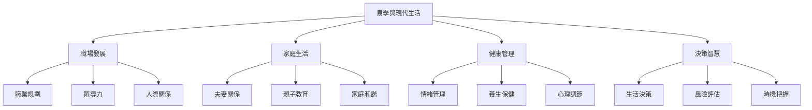

# 易學與現代生活

> 🎯 **學習目標**：瞭解易學在現代生活中的應用，掌握在職場、家庭、健康等方面的易學智慧，能夠在現實生活中運用易學智慧提高生活質量，應對現代生活挑戰。

---

## 📚 易學的現代價值

傳統易學在現代社會中仍然具有重要的價值。易學智慧可以指導現代人的職業發展、家庭生活、健康管理等方面，幫助我們應對現代生活的挑戰，提高生活質量。

**易學的現代應用領域**：

- **職場發展**：職業規劃、領導力、人際關係
- **家庭生活**：夫妻關係、親子教育、家庭和諧
- **健康管理**：情緒管理、養生保健、心理調節
- **決策智慧**：生活決策、風險評估、時機把握

---

## 🔄 易學在現代生活中的應用

### 職場發展

易學智慧為職場發展提供了全面的指導：

**職業規劃**：天時地利人和
- 順應天時：適應市場變化，堅持核心能力，簡化職業規劃
- 合乎地利：發揮優勢，利用資源，保持陰陽平衡
- 重視人和：建立人際關係，運用謙卦、兌卦、泰卦智慧

**領導力發展**：乾卦與謙卦的智慧
- 乾卦：自強不息、循序漸進、剛柔並濟
- 謙卦：謙遜有禮、低調做人、勞謙不伐

**職場人際關係**：
- 同事相處：兌卦智慧——和諧相處、真誠交流、溝通順暢
- 上下級關係：泰卦智慧——天地相交、陰陽和合、吉祥通達

👉 詳細內容請查看：[[易學與職場發展]]

---

### 家庭生活

易學智慧為家庭生活提供了和諧的指導：

**夫妻關係**：
- 夫妻相處：泰卦智慧——天地相交、陰陽和合、吉祥通達
- 夫妻溝通：兌卦智慧——和諧溝通、真誠交流、溝通順暢

**親子教育**：
- 父母的智慧：謙卦智慧——謙遜有禮、低調做人、勞謙不伐
- 子女的教育：乾卦智慧——自強不息、循序漸進、剛柔並濟

**家庭和諧**：
- 家庭和諧之道：泰卦智慧——相互溝通、和諧相處、和睦幸福
- 家庭矛盾處理：損卦智慧——以損爲益、誠信爲本、適時而損

👉 詳細內容請查看：[[易學與家庭生活]]

---

### 健康管理

易學智慧為健康管理提供了整體的指導：

**情緒管理**：
- 陰陽平衡的情緒管理：理解情緒的陰陽，保持情緒平衡
- 應對壓力：變易思想——認識變化、接受變化、適應變化；不易思想——找到穩定、堅持原則、保持平衡；簡易思想——化繁爲簡、簡單應對、輕鬆生活

**養生保健**：
- 五行養生：木（肝）、火（心）、土（脾胃）、金（肺）、水（腎）的養生方法
- 四季養生：春季、夏季、秋季、冬季的養生原則和方法

**心理調節**：
- 易理心理調節：陰陽平衡、變易思想、簡易思想
- 應對焦慮和抑鬱：運用變易不易簡易思想應對心理問題

👉 詳細內容請查看：[[易學與健康管理]]

---

### 決策智慧

易學智慧為決策提供了系統的指導：

**生活決策**：
- 決策三要素：天時（時機）、地利（條件）、人和（支持）
- 決策方法：變易決策、不易決策、簡易決策

**風險評估**：
- 陰陽風險評估：陽的風險（積極風險）、陰的風險（消極風險）
- 風險評估：陰陽平衡、陰陽調節、陰陽和諧

**時機把握**：
- 時機判斷：變易思想、不易思想、簡易思想
- 時機應用：把握時機、創造時機

👉 詳細內容請查看：[[易學與決策智慧]]

---

## 💡 易學現代生活應用建議

### 循序漸進

1. **理解易理**：理解易學的基本原理
2. **應用易理**：嘗試在生活中應用易理
3. **總結經驗**：總結應用經驗，不斷改進
4. **持續學習**：持續學習易學智慧

### 理性應用

1. **避免迷信**：不將易學作爲迷信
2. **理性分析**：理性分析易學的應用價值
3. **哲學導向**：注重易學的哲學內涵
4. **生活導向**：將易學智慧應用於生活

### 實踐驗證

1. **實踐應用**：在實踐中應用易學智慧
2. **驗證效果**：驗證應用效果
3. **總結改進**：總結經驗，不斷改進
4. **分享交流**：與他人分享應用經驗

---

## 📊 易學現代生活應用總覽

| 應用領域 | 易學智慧 | 易理原則 | 實踐方法 | 詳細內容 |
|---------|---------|---------|---------|---------|
| **職場發展** | 屯卦、泰卦、謙卦、乾卦 | 順應天時、合乎地利、重視人和 | 職業規劃、領導力發展、人際關係 | [[易學與職場發展]] |
| **家庭生活** | 泰卦、兌卦、謙卦 | 夫妻和諧、親子教育、家庭和睦 | 溝通技巧、教育方法、矛盾處理 | [[易學與家庭生活]] |
| **健康管理** | 陰陽、五行、變易 | 情緒管理、養生保健、心理調節 | 情緒調節、四季養生、心理調節 | [[易學與健康管理]] |
| **決策智慧** | 變易、不易、簡易 | 天時地利人和、風險評估、時機把握 | 決策方法、風險評估、時機把握 | [[易學與決策智慧]] |

---

## 🗺️ 易學現代生活應用架構

---

## 🔗 相關資源

### 應用領域專題
- [[易學與職場發展]] - 職場應用詳解
- [[易學與家庭生活]] - 家庭應用詳解
- [[易學與健康管理]] - 健康應用詳解
- [[易學與決策智慧]] - 決策應用詳解

### 相關理論
- [[易經中的處世哲學]] - 處世哲學思想
- [[陰陽變化與變易之道]] - 變易哲學
- [[易理管理智慧]] - 管理智慧應用
- [[陰陽五行在生活中應用]] - 陰陽五行實踐

### 基礎理論
- [[易學概述與發展史]] - 易學的發展歷程
- [[MOC_陰陽五行理論基礎]] - 陰陽五行基礎
- [[八卦基礎與象徵]] - 八卦基礎知識

---

*創建時間: 2026-02-01*
*最後更新: 2026-02-02*
*分類: 4 Interests*
