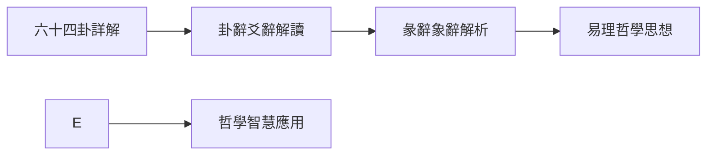

# 易學學習路徑

## 學習路徑概述

易學博大精深，需要循序漸進地學習。根據學習的深度和階段，可以將學習路徑分爲三個層次：初學者路徑、進階路徑和專家路徑。

## 🟢 初學者路徑（1-3個月）

### 學習目標

建立對易學的整體認識，掌握基本概念和基礎理論。

### 學習步驟

### 具體內容

**1. 易學概述（1-2週）**
- 瞭解易學的歷史地位和哲學價值
- 理解易學三義（變易、不易、簡易）
- 建立對易學的正確認識

**2. 基礎理論（2-3週）**
- 學習陰陽理論基礎
- 理解陰陽的特性和相互關係
- 掌握五行學說的基本概念

**3. 八卦基礎（3-4週）**
- 記憶八卦的基本構成
- 理解八卦的象徵意義
- 瞭解先天八卦和後天八卦

**4. 易經結構（2-3週）**
- 瞭解《周易》的結構（《經》和《傳》）
- 理解六十四卦的結構和組成
- 掌握卦辭、爻辭的基本概念

**5. 六十四卦概覽（4-6週）**
- 瞭解六十四卦的基本含義
- 記憶常用的幾個卦
- 建立對六十四卦的整體認識

### 學習方法

- 閱讀易學概述性文章
- 記憶八卦的基本構成和象徵
- 理解陰陽五行的基本概念
- 瞭解《周易》的基本結構

### 推薦資源

- [[易學概述]] - 建立整體認識
- [[MOC_陰陽五行理論基礎]] - 掌握基礎理論
- [[八卦基礎與象徵]] - 學習八卦
- [[易經結構與組成]] - 瞭解結構

## 🟡 進階路徑（3-6個月）

### 學習目標

掌握六十四卦的基本含義，理解易學的哲學思想，能夠進行基本的占卜。

### 學習步驟

### 具體內容

**1. 六十四卦詳解（6-8週）**
- 系統學習每一卦的含義
- 理解每一卦的象徵意義
- 掌握六十四卦的基本判斷

**2. 卦辭爻辭解讀（4-6週）**
- 學習卦辭的解讀方法
- 理解爻辭的含義
- 掌握從爻位理解卦的方法

**3. 彖辭象辭解析（4-6週）**
- 理解彖辭的哲學內涵
- 掌握象辭的修辭藝術
- 提升易學的哲學理解

**4. 易理哲學思想（6-8週）**
- 深入理解變易、不易、簡易三義
- 掌握天人合一的思想
- 理解易學的辯證思維和整體思維

**5. 哲學智慧應用（持續）**
- 將易學智慧應用於決策
- 應用易學於處世之道
- 應用易學於自我修養

### 學習方法

- 系統學習每一卦的含義
- 理解彖辭象辭的哲學內涵
- 深入理解易學的哲學思想
- 進行實際的占卜練習

### 推薦資源

- [[六十四卦詳解]] - 系統學習每一卦
- [[彖辭象辭解析]] - 深入理解哲學內涵
- [[易理哲學思想]] - 掌握核心哲學思想

## 🔴 專家路徑（6-12個月及以上）

### 學習目標

能夠獨立進行占卜，將易學智慧應用於實踐，形成自己獨特的體悟。

### 學習步驟

### 具體內容

**1. 深度研讀（持續）**
- 深入研讀《周易》原文
- 反覆體悟易理的深層內涵
- 結合自身經驗進行思考

**2. 流派研究（4-6週）**
- 瞭解歷代易學流派
- 研究象數易、義理易等流派
- 瞭解歷代易學家的貢獻

**3. 經典文獻（8-12週）**
- 閱讀經典註疏（朱熹《周易本義》、來知德《易經來注》等）
- 研讀王弼、李光地等註本
- 對比不同註家的解釋

**4. 實踐應用（持續）**
- 進行實際的占卜練習
- 將易學智慧應用於生活
- 記錄實踐心得和體悟

**5. 現代闡釋（4-6週）**
- 探索易學與現代生活的結合
- 研究現代學者的易學觀點
- 思考易學的現代價值

**6. 個人體悟（持續）**
- 形成自己獨特的易學見解
- 總結自己的學習經驗
- 建立個人的易學體系

### 學習方法

- 進行實際的占卜練習
- 將易學智慧應用於生活
- 形成自己獨特的體悟

### 推薦資源

- [[經典文獻導讀]] - 閱讀經典著作
- [[易學流派與傳承]] - 瞭解易學流派
- [[易學與現代生活]] - 探索現代應用

## 學習重點

### 理論學習
- ✅ **掌握基礎理論**：陰陽五行、八卦象數
- ✅ **理解哲學思想**：變易不易簡易、天人合一
- ✅ **熟悉經典原文**：卦辭爻辭、彖辭象辭
- ✅ **瞭解歷史傳承**：三聖作易、歷代易學流派

### 實踐應用
- ✅ **學會占卜方法**：蓍草卦、銅錢卦等
- ✅ **培養觀象能力**：從現象中體悟易理
- ✅ **運用於生活**：決策、處世、修身等
- ✅ **避免迷信化**：保持理性客觀的學習態度

## 學習建議

1. **循序漸進**：按照初學者→進階→專家的順序學習
2. **理論實踐結合**：在理解理論的基礎上進行實踐
3. **長期堅持**：易學學習是長期過程，需要持續學習
4. **做筆記**：養成做筆記的習慣，記錄學習心得
5. **交流學習**：與他人交流學習心得，相互啟發

## 相關資源

- [[易學學習目標]] - 學習目標和階段劃分
- [[易學學習建議]] - 學習方法和注意事項
- [[易學學習進度追蹤]] - 成就系統和技能評估
- [[易學概述]] - 易學的基本概念

---
*創建時間: 2026-02-01*
*分類: 4 Interests*
