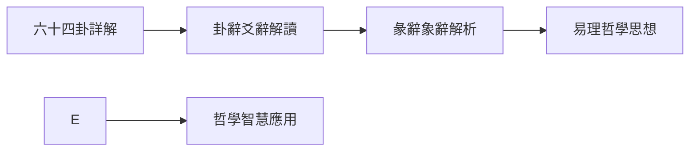

# 易學學習路徑圖

## 學習路徑概述

易學博大精深，需要循序漸進地學習。根據學習的深度和階段，可以將學習路徑分爲三個層次：初學者路徑、進階路徑和專家路徑。

## 初學者路徑（1-3個月）

### 學習目標

建立對易學的整體認識，掌握基本概念和基礎理論。

### 學習步驟

### 詳細內容

**第1步：易學概述（1-2週）**
- 學習內容：
  - 瞭解易學的歷史地位和哲學價值
  - 理解易學三義（變易、不易、簡易）
  - 建立對易學的正確認識
- 推薦資源：[[易學概述]]、[[易學概述與發展史]]
- 學習目標：建立對易學的整體認識

**第2步：基礎理論（2-3週）**
- 學習內容：
  - 學習陰陽理論基礎
  - 理解陰陽的特性和相互關係
  - 掌握五行學說的基本概念
- 推薦資源：[[陰陽理論]]、[[五行理論]]、[[五行相生相剋]]
- 學習目標：理解陰陽五行的基本概念

**第3步：八卦基礎（3-4週）**
- 學習內容：
  - 記憶八卦的基本構成
  - 理解八卦的象徵意義
  - 瞭解先天八卦和後天八卦
- 推薦資源：[[八卦基礎與象徵]]、[[陰陽五行關係]]
- 學習目標：掌握八卦的構成和象徵

**第4步：易經結構（2-3週）**
- 學習內容：
  - 瞭解《周易》的結構（《經》和《傳》）
  - 理解六十四卦的結構和組成
  - 掌握卦辭、爻辭的基本概念
- 推薦資源：[[易經結構與組成]]
- 學習目標：瞭解《周易》的基本結構

**第5步：六十四卦概覽（4-6週）**
- 學習內容：
  - 瞭解六十四卦的基本含義
  - 記憶常用的幾個卦
  - 建立對六十四卦的整體認識
- 推薦資源：[[六十四卦詳解]]
- 學習目標：建立對六十四卦的整體認識

## 進階路徑（3-6個月）

### 學習目標

掌握六十四卦的基本含義，理解易學的哲學思想，能夠進行基本的占卜。

### 學習步驟

### 詳細內容

**第1步：六十四卦詳解（6-8週）**
- 學習內容：
  - 系統學習每一卦的含義
  - 理解每一卦的象徵意義
  - 掌握六十四卦的基本判斷
- 推薦資源：[[六十四卦詳解]]
- 學習目標：掌握六十四卦的基本含義

**第2步：卦辭爻辭解讀（4-6週）**
- 學習內容：
  - 學習卦辭的解讀方法
  - 理解爻辭的含義
  - 掌握從爻位理解卦的方法
- 推薦資源：[[六十四卦詳解]]、[[彖辭象辭解析]]
- 學習目標：掌握卦辭爻辭的解讀方法

**第3步：彖辭象辭解析（4-6週）**
- 學習內容：
  - 理解彖辭的哲學內涵
  - 掌握象辭的修辭藝術
  - 提升易學的哲學理解
- 推薦資源：[[彖辭象辭解析]]
- 學習目標：深入理解易學的哲學內涵

**第4步：易理哲學思想（6-8週）**
- 學習內容：
  - 深入理解變易、不易、簡易三義
  - 掌握天人合一的思想
  - 理解易學的辯證思維和整體思維
- 推薦資源：[[易理哲學思想]]、[[陰陽變化與變易之道]]
- 學習目標：掌握易學的核心哲學思想

**第5步：哲學智慧應用（持續）**
- 學習內容：
  - 將易學智慧應用於決策
  - 應用易學於處世之道
  - 應用易學於自我修養
- 推薦資源：[[易經與決策智慧]]、[[易經中的處世哲學]]、[[個人修身與易經]]
- 學習目標：將易學智慧應用於實踐

## 專家路徑（6-12個月及以上）

### 學習目標

能夠獨立進行占卜，將易學智慧應用於實踐，形成自己獨特的體悟。

### 學習步驟

### 詳細內容

**第1步：深度研讀（持續）**
- 學習內容：
  - 深入研讀《周易》原文
  - 反覆體悟易理的深層內涵
  - 結合自身經驗進行思考
- 推薦資源：[[經典文獻導讀]]、[[推薦閱讀書單]]
- 學習目標：深入理解易學的深層內涵

**第2步：流派研究（4-6週）**
- 學習內容：
  - 瞭解歷代易學流派
  - 研究象數易、義理易等流派
  - 瞭解歷代易學家的貢獻
- 推薦資源：[[易學流派與傳承]]
- 學習目標：瞭解易學的流派和傳承

**第3步：經典文獻（8-12週）**
- 學習內容：
  - 閱讀經典註疏（朱熹《周易本義》、來知德《易經來注》等）
  - 研讀王弼、李光地等註本
  - 對比不同註家的解釋
- 推薦資源：[[經典文獻導讀]]、[[推薦閱讀書單]]
- 學習目標：閱讀並理解經典註疏

**第4步：實踐應用（持續）**
- 學習內容：
  - 進行實際的占卜練習
  - 將易學智慧應用於生活
  - 記錄實踐心得和體悟
- 推薦資源：[[銅錢卦法]]、[[六爻預測基礎]]、[[現代易經案例解析]]
- 學習目標：將易學智慧應用於實踐

**第5步：現代闡釋（4-6週）**
- 學習內容：
  - 探索易學與現代生活的結合
  - 研究現代學者的易學觀點
  - 思考易學的現代價值
- 推薦資源：[[易學與現代生活]]、[[現代易經案例解析]]
- 學習目標：探索易學的現代價值

**第6步：個人體悟（持續）**
- 學習內容：
  - 形成自己獨特的易學見解
  - 總結自己的學習經驗
  - 建立個人的易學體系
- 學習目標：形成自己獨特的體悟和見解

## 學習路徑的轉換

### 路徑轉換條件

**從初學者到進階**：
- 完成基礎理論學習
- 理解陰陽五行、八卦基礎
- 瞭解《周易》的基本結構

**從進階到專家**：
- 掌握六十四卦的基本含義
- 能夠獨立進行基本占卜
- 理解易學的哲學思想

### 路徑轉換建議

**循序漸進**：
- 不要跳躍式學習
- 循序漸進地從一個階段過渡到下一個階段

**打牢基礎**：
- 在進入下一個階段前，確保當前階段的基礎已經打牢
- 通過複習和練習鞏固已學內容

## 學習路徑的個性化

### 根據目標調整

**決策導向**：
- 側重學習易經與決策智慧
- 增加占卜方法的練習

**處世導向**：
- 側重學習易經中的處世哲學
- 增加哲學思想的學習

**養生導向**：
- 側重學習易經與健康養生
- 增加陰陽五行在生活中應用的學習

### 根據時間調整

**時間充裕**：
- 可以按照完整的路徑學習
- 深入學習各個主題

**時間有限**：
- 可以選擇重點學習
- 側重實踐應用

## 相關資源

- [[易學學習指導]] - 快速導航和推薦學習流程
- [[易學學習目標]] - 學習目標和階段劃分
- [[易學學習建議]] - 學習方法和注意事項
- [[易學學習進度追蹤]] - 成就系統和技能評估

---
*創建時間: 2026-02-01*
*分類: 4 Interests*
