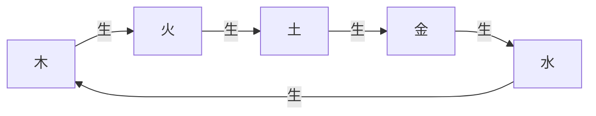
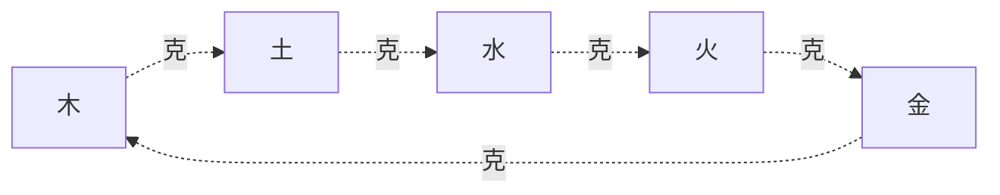

# 陰陽五行理論基礎 MOC

> 🎯 **學習目標**：掌握陰陽的基本概念和五行理論，理解陰陽五行的相生相剋關係，以及在易學中的應用，爲深入學習《周易》打下堅實的理論基礎。

## 📚 知識體系

### 基礎理論

- [[陰陽理論]] - 陰陽的基本概念、特徵、關係
- [[五行理論]] - 五行的基本概念、屬性、對應關係
- [[五行相生相剋]] - 五行相生、相剋、旺相休囚死
- [[陰陽五行關係]] - 陰陽在五行中的體現、五行在八卦中的體現

### 應用實踐

- [[陰陽五行在占卜中的應用]] - 卦的五行屬性、爻的五行屬性、五行生克應用
- [[陰陽五行在生活中應用]] - 養生保健、情緒管理、人際交往、日常佈局

## 🎯 學習重點

### 陰陽的核心概念

**陰陽的特徵**：
- 陽：主動、外向、明亮、溫暖、剛強
- 陰：被動、內向、陰暗、寒冷、柔弱

**陰陽的關係**：
- 陰陽互根：相互依存、不可分離
- 陰陽消長：此消彼長、動態平衡
- 陰陽轉化：陰極必陽、陽極必陰
- 陰陽平衡：和諧共存、中庸之道

### 五行的核心概念

**五行的基本屬性**：

| 屬性 | 木 | 火 | 土 | 金 | 水 |
|------|----|----|----|----|-----|
| 季節 | 春 | 夏 | 長夏 | 秋 | 冬 |
| 方位 | 東 | 南 | 中 | 西 | 北 |
| 顏色 | 青 | 赤 | 黃 | 白 | 黑 |
| 五德 | 仁 | 禮 | 信 | 義 | 智 |

### 五行相生相剋

**五行相生**：
- 木生火 → 火生土 → 土生金 → 金生水 → 水生木
- 相生爲吉：表示事物得到促進和支持

**五行相剋**：
- 木克土 → 土克水 → 水克火 → 火克金 → 金克木
- 相剋爲兇：表示事物受到制約和壓制

### 陰陽五行關係

**陰陽在五行中的體現**：
- 每一行都有陰陽之分：陽木、陰木，陽火、陰火等

**五行在八卦中的體現**：
- 震、巽：木
- 離：火
- 艮、坤：土
- 乾、兌：金
- 坎：水

## 🔄 五行相生相剋循環

### 五行相生循環

**相生關係**：
- 木生火：木燃燒產生火
- 火生土：火燒成灰變爲土
- 土生金：土中埋藏金礦
- 金生水：金屬冷卻產生水
- 水生木：水滋養樹木

### 五行相剋循環

**相剋關係**：
- 木克土：樹木破土而出
- 土克水：土吸收水分
- 水克火：水能滅火
- 火克金：火能熔金
- 金克木：金能砍木

## 📊 五行旺相休囚死

### 四季五行狀態

| 季節 | 旺 | 相 | 休 | 囚 | 死 |
|------|----|----|----|----|-----|
| 春 | 木 | 火 | 土 | 金 | 水 |
| 夏 | 火 | 土 | 金 | 水 | 木 |
| 長夏 | 土 | 金 | 水 | 木 | 火 |
| 秋 | 金 | 水 | 木 | 火 | 土 |
| 冬 | 水 | 木 | 火 | 土 | 金 |

**基本概念**：
- **旺**：處於最旺盛的狀態
- **相**：處於次旺盛的狀態
- **休**：處於休息的狀態
- **囚**：處於受制狀態
- **死**：處於最衰弱的狀態

## 🔍 陰陽五行在易學中的地位

### 基礎理論

陰陽五行理論是易學的基礎理論，不理解陰陽五行就無法理解《周易》的深層含義。

### 哲學核心

陰陽五行理論是易學哲學的核心，體現了中國古代對宇宙萬物的根本認識。

### 實踐指導

陰陽五行理論是易學實踐的指導，爲占卜、養生、處世等提供了理論基礎。

## 💡 陰陽五行的現代意義

### 哲學意義

陰陽五行理論體現了中國古代的辯證法思想，對現代哲學仍有啓發意義。

### 科學意義

陰陽五行理論雖然不是現代科學，但其整體觀念、平衡觀念對現代科學仍有借鑑意義。

### 文化意義

陰陽五行理論是中國傳統文化的重要組成部分，對現代文化仍有重要影響。

## 📈 學習建議

### 理解爲主

理解陰陽五行的基本概念和相互關係，不要死記硬背。

### 圖形結合

結合五行圖、八卦圖等圖形來理解，通過圖形可以更直觀地理解陰陽五行的關係。

### 實踐應用

將陰陽五行的理論應用於實際生活，在實踐中加深理解。

### 理性客觀

以理性客觀的態度學習陰陽五行，不要陷入迷信和神祕化。

## 🔗 相關資源

### 易學基礎

- [[易學概述]] - 易學的基本概念
- [[易學核心概念體系]] - 三才之道、核心要素
- [[八卦基礎與象徵]] - 八卦的詳細解釋

### 進階學習

- [[六十四卦詳解]] - 系統學習每一卦
- [[彖辭象辭解析]] - 深入理解哲學內涵
- [[易理哲學思想]] - 掌握核心哲學思想

### 實踐應用

- [[易經與健康養生]] - 五行臟腑、情緒調理與四季養生
- [[易經與人際關係]] - 處世之道、人際交往與和諧共處
- [[銅錢卦法]] - 金錢卦法與簡化起卦技巧

---
*創建時間: 2026-02-01*
*更新時間: 2026-02-02*
*分類: 4 Interests*
