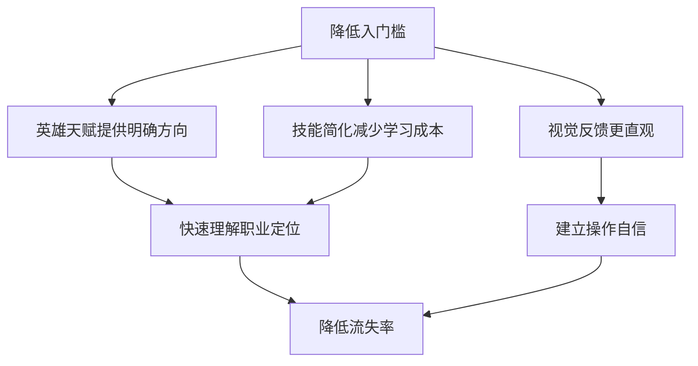

# 💡魔獸世界地心之战12.0设计洞察与影响分析

> **概述**：基于深度分析文档，提取设计核心洞察，分析机制变化对游戏生态的深远影响，为未来游戏设计提供参考框架。

---

## 🎯 核心设计洞察

### 1. 设计哲学的根本转变

#### 从"复杂即深度"到"简洁有特色"
- **过去理念**：复杂的机制叠加体现游戏深度
- **新设计理念**：简洁的核心机制突出职业特色
- **转变意义**：降低了入门槛，保持了可扩展性

#### 三维职业设计模型
```
传统维度：职业 → 专精 → 常规天赋
新增维度：职业 → 专精 → 英雄天赋
实现：每个职业都有3种截然不同的玩法风格
```

### 2. 英雄天赋系统的革命性意义

#### 玩法定义的新维度
- **创新性**：首次为所有职业提供第三种玩法路径
- **选择权**：玩家可以基于喜好选择不同风格
- **扩展性**：为未来内容更新提供基础框架

#### 设计优势
- **降低入门门槛**：清晰的玩法方向指引
- **保持操作深度**：高玩仍有发挥空间
- **视觉体验升级**：技能特效更加直观明显
- **性能优化**：减少屏幕元素混乱

### 3. 机制简化的精准平衡

#### 复杂度管理策略
| 维度 | 优化前 | 优化后 | 效果 |
|------|--------|--------|------|
| 核心机制 | 5-8个 | 3-4个 | 更易理解 |
| 平均按键数 | 6-8个 | 4-6个 | 操作更流畅 |
| 天赋选择 | 复杂决策 | 明确方向 | 减少选择焦虑 |

#### 简化不等于简化内容
- **保留深度**：高难度内容仍需精湛操作
- **突出核心**：移除非必要的机制叠加
- **增强反馈**：让玩家感受到操作的价值

---

## 📊 影响分析矩阵

### 1. 玩家群体影响

#### 新手玩家体验


#### 老玩家适应
- **学习成本**：需要2-4周适应新机制
- **肌肉记忆**：长期养成操作习惯需要调整
- **心理落差**：部分复杂机制爱好者需要适应
- **新发现**：英雄天赋带来全新操作体验

### 2. 游戏生态影响

#### 团队配置变化
- **灵活性提升**：同一职业可承担不同职责
- **Meta演变**：英雄天赋组合影响团队配置
- **协作加强**：更强调职业间的互补性

#### PVP环境重构
- **竞技场平衡**：39个英雄天赋的平衡挑战
- **技能重做**：经典技能移除影响PVP风格
- **策略多样性**：不同英雄天赋带来新战术组合

### 3. 商业价值影响

#### 玩家留存率
- **新玩家**：入门槛降低 → 增加新用户
- **老玩家**：新机制带来新鲜感 → 减少流失
- **内容消耗**：英雄天赋延长游戏生命周期

#### 社区活跃度
- **讨论热度**：新机制引发大量社区讨论
- **攻略更新**：需要重新制定职业攻略
- **直播内容**：新玩法创造新的直播内容

---

## 🔍 设计原则提炼

### 1. 核心设计原则

#### 易上手，难精通
- **上手层面**：清晰的机制指引
- **精通层面**：英雄天赋提供操作深度
- **平衡点**：保持不同水平玩家的参与感

#### 个性化和多样性
- **个人表达**：通过英雄天赋展现个性
- **团队表达**：不同组合创造独特团队风格
- **内容表达**：新机制适配不同游戏内容

#### 可扩展性和可持续性
- **框架预留**：英雄天赋系统为未来内容预留空间
- **机制简化**：为基础系统提供优化基础
- **玩家反馈**：建立持续的优化循环

### 2. 具体实施策略

#### 阶段性发布
- **第一阶段**：英雄天赋系统引入
- **第二阶段**：专精机制重做
- **第三阶段**：种族职业扩展
- **第四阶段**：平衡性调整

#### 反馈收集机制
- **数据监控**：实时监控使用率数据
- **玩家调研**：定期收集玩家反馈
- **社区讨论**：建立官方社区讨论区
- **专家评估**：邀请核心玩家参与测试

---

## 🎮 玩家体验分析

### 1. 正面影响

#### 操作体验提升
- **反应速度**：简化机制减少决策时间
- **操作流畅**：减少不必要的资源管理
- **视觉享受**：技能特效更加华丽直观

#### 心理感受改善
- **成就感**：明确的成功反馈机制
- **掌控感**：技能效果更容易预测
- **归属感**：更多符合个人喜好的玩法选择

#### 社交体验丰富
- **协作机会**：不同英雄天赋组合创造新协作方式
- **角色扮演**：更多符合角色背景的职业组合
- **策略讨论**：新的战术组合引发讨论

### 2. 潜在挑战

#### 适应期管理
- **学习曲线**：老玩家需要适应期
- **心理落差**：部分玩家可能怀念旧机制
- **技能重做**：习惯技能被移除的不适

#### 平衡性挑战
- **数量庞大**：39个英雄天赋的平衡难度
- **Meta演变**：特定组合可能过强
- **环境适应**：不同游戏环境需要不同平衡

#### 内容深度担忧
- **简化争议**：部分玩家担心游戏深度降低
- **怀旧情绪**：对经典机制的情感依恋
- **创新压力**：需要在创新和经典间平衡

---

## 🔮 未来发展建议

### 1. 短期优化方向

#### 平衡性调整
- **数据驱动**：基于实际使用数据进行平衡
- **社区反馈**：收集玩家使用体验反馈
- **快速响应**：建立快速平衡调整机制

#### 新手体验优化
- **教程升级**：更新新手教学内容
- **指南完善**：提供详细的机制说明
- **实践指导**：增加实战练习内容

### 2. 中期发展规划

#### 英雄天赋扩展
- **主题设计**：配合资料片主题设计新英雄天赋
- **经典回归**：考虑回归经典版本的玩法风格
- **玩家参与**：让玩家参与新英雄天赋设计

#### 机制深度增加
- **进阶机制**：为高玩提供进阶挑战
- **组合系统**：英雄天赋间的协同机制
- **环境适配**：不同游戏环境下的机制变化

### 3. 长期愿景

#### 游戏设计标准确立
- **框架定型**：英雄天赋系统成为行业标准
- **设计哲学**：简洁有特色的设计理念
- **玩家分层**：满足不同层次玩家需求

#### 技术创新应用
- **AI辅助**：机器学习辅助平衡性调整
- **数据分析**：更精准的玩家行为分析
- **云端技术**：可能的云端计算应用

---

## 💡 核心成功要素

### 1. 设计思维的突破
- **三维设计**：英雄天赋创造了第三维度玩法
- **简化精准**：复杂度管理恰到好处
- **用户导向**：以玩家体验为中心的设计

### 2. 技术实现的完美
- **框架预留**：为未来内容预留扩展空间
- **性能优化**：在简化的同时保持游戏性能
- **视觉升级**：技能特效提升视觉体验

### 3. 生态健康的保障
- **平衡性**：维持长期的竞技环境
- **包容性**：照顾不同玩家群体
- **可持续性**：为长期发展奠定基础

---

## 📈 成功指标与评估

### 1. 量化指标
- **玩家留存率**：版本更新后3个月留存变化
- **新用户增长**：新玩家注册数量变化
- **内容消耗**：新内容平均完成时间
- **社交活跃度**：社区讨论热度变化

### 2. 质化指标
- **玩家满意度**：满意度调研结果
- **社区氛围**：社区讨论质量和氛围
- **内容质量**：攻略和直播内容质量
- **媒体报道**：专业媒体的评测和报道

---

## 🎯 总结与启示

### 核心价值
魔兽世界地心之战12.0版本的设计变化代表了游戏设计理念的重大进步，从"复杂即深度"转向"简洁有特色"，为行业树立了新的设计标准。

### 关键启示
1. **三维设计思维**：英雄天赋系统展示了多维度设计的价值
2. **简化艺术**：机制简化需要精准把握平衡点
3. **用户导向**：以玩家体验为中心的设计理念
4. **可持续发展**：为长期发展预留框架和空间

### 行业影响
这些设计理念将影响整个游戏行业，为其他游戏的设计提供参考和借鉴，推动游戏设计的创新发展。

---

**相关文档**：
- [[魔獸世界地心之战12.0版本機制變化深度分析]] - 详细机制分析
- [[魔獸世界-職業機制模板]] - 职业分析框架
- [[魔獸世界-種族體系分析]] - 种族设计分析
- [[遊戲設計-設計原則]] - 通用设计原则

**标签**：`wow/設計洞察` `wow/地心之战` `wow/設計原則` `wow/玩家體驗` `wow/機制分析` `遊戲設計/最佳實踐`