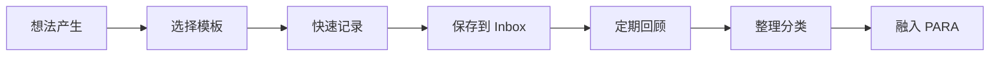
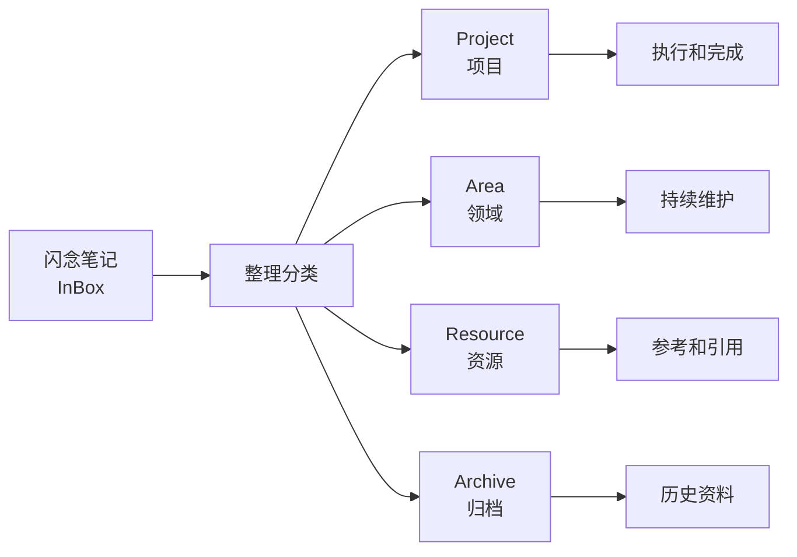

# ⚡ 快速捕获指南

> **"不要让想法溜走 - 趁热打铁，及时记录"**

---

## 📋 目录

- [🎯 什么是快速捕获？](#什么是快速捕获)
- [🛠️ 三种捕获模板](#三种捕获模板)
- [🚀 使用流程](#使用流程)
- [💡 最佳实践](#最佳实践)
- [🔗 与 PARA 系统的集成](#与-para-系统的集成)
- [❓ 常见问题](#常见问题)

---

## 🎯 什么是快速捕获？

### 定义

**快速捕获**是指在想法、灵感、观察或重要信息出现的**第一时间**，用**最快的方式**记录下来的过程。

### 为什么需要快速捕获？

| 原因 | 说明 |
|------|------|
| **避免遗忘** | 灵感和想法往往转瞬即逝 |
| **减轻认知负担** | 把想法写下来，大脑可以专注于其他任务 |
| **培养意识** | 重视自己的想法，养成记录习惯 |
| **积累素材**为后续的深度思考和组织提供素材 |

### 快速捕获的核心原则

1. **速度优先** - 不追求完美，先记录下来再说
2. **保持简单** - 使用最简单的方式记录
3. **抓住时机** - 趁热打铁，不要拖延
4. **后续整理** - 定期回顾和组织这些闪念

---

## 🛠️ 五种捕获模板

### 模板对比总览

| 特性 | 📝 快速捕获 | ⚡ 极简捕获 | 📖 阅读捕获 | 🌐 网页捕获 | 🔗 网页快速 |
|------|------------|-------------|-------------|-------------|-------------|
| **结构完整度** | ⭐⭐⭐⭐ | ⭐⭐ | ⭐⭐⭐ | ⭐⭐⭐⭐⭐ | ⭐⭐ |
| **记录速度** | ⭐⭐⭐ | ⭐⭐⭐⭐⭐ | ⭐⭐⭐ | ⭐⭐⭐ | ⭐⭐⭐⭐⭐ |
| **后续整理友好度** | ⭐⭐⭐⭐⭐ | ⭐⭐ | ⭐⭐⭐⭐ | ⭐⭐⭐⭐⭐ | ⭐⭐ |
| **推荐场景** | 日常使用 | 紧急/手机端 | 阅读笔记 | 网页深度收藏 | 网页快速收集 |
| **文件路径** | [[_templates/fleeting/_template-快速捕获]] | [[_templates/fleeting/_template-极简捕获]] | [[_templates/fleeting/_template-阅读捕获]] | [[_templates/fleeting/_template-网页捕获]] | [[_templates/fleeting/_template-网页快速]] |
| **推荐指数** | ⭐⭐⭐⭐⭐ | ⭐⭐⭐ | ⭐⭐⭐⭐ | ⭐⭐⭐⭐⭐ | ⭐⭐⭐⭐ |

---

### 1. 📝 快速捕获模板 - ⭐ 推荐

**适用场景**：
- ✅ 突发的想法和灵感
- ✅ 日常观察和思考
- ✅ 需要后续整理的笔记
- ✅ 作为新想法的起点

**文件**：[[_templates/fleeting/_template-快速捕获]]

**结构**：
```markdown
# 💡 {标题}

## 🎯 核心想法
<!-- 快速记录你的想法 -->

## 📝 详细内容
### 背景/上下文
### 关键要点
### 问题或疑问

## 🔗 关联思考
### 相关想法/笔记
### 可能关联的 PARA
### 需要进一步研究的内容

## 📋 后续行动
### 待办事项
### 整理方向

## 🏷️ 标签
```

**使用建议**：
- 🎯 **日常首选** - 作为默认的快速捕获模板
- 📊 **结构完整** - 提供足够的结构但不失简洁
- 🔗 **关联友好** - 包含 PARA 关联字段，便于后续整理
- ✅ **行动导向** - 有明确的后续行动区域

---

### 2. ⚡ 极简捕获模板 - 最快速度

**适用场景**：
- ✅ 紧急情况下的快速记录
- ✅ 会议中的快速笔记
- ✅ 手机端快速输入
- ✅ 最少干扰的记录方式

**文件**：[[_templates/fleeting/_template-极简捕获]]

**结构**：
```markdown
# ⚡ {标题}

## 💭 想法
<!-- 在这里快速记录你的想法 -->

## 🏷️ 标签
- #标签1 #标签2

## 🔗 相关
- [[]]
```

**使用建议**：
- ⚡ **最快速度** - 只有 4 个字段，记录速度最快
- 📱 **手机友好** - 适合在手机上快速输入
- 🔄 **后续整理** - 记录后需要后续整理才能融入 PARA 系统
- 🎯 **保持简单** - 不要过度思考，快速记录即可

---

### 3. 📖 阅读捕获模板 - 阅读专用

**适用场景**：
- ✅ 阅读书籍时的笔记
- ✅ 阅读文章、论文时的摘录
- ✅ 观看视频时的记录
- ✅ 听播客时的笔记

**文件**：[[_templates/fleeting/_template-阅读捕获]]

**结构**：
```markdown
# 📖 {标题}

## 📌 原始摘录
> {原文重要内容}

## 💡 我的理解
<!-- 用自己的话解释 -->

## 🔑 核心观点
1. 观点 1
2. 观点 2
3. 观点 3

## 💭 思考与启发
- 这个观点让我想到了什么？
- 它与我的其他知识有什么关联？

## 🔗 关联笔记
### 相关的 Literature Note
### 可能关联的 PARA
### 可能转化为 Permanent Note 的主题

## 📋 后续行动
```

**使用建议**：
- 📚 **阅读专用** - 专门为阅读场景设计
- 📝 **摘录+理解** - 原始摘录和个人理解分离
- 🔄 **转化提示** - 提示如何转化为 Permanent Note
- 💡 **思考导向** - 强调思考和启发，不仅是记录

---

### 4. 🌐 网页捕获模板 - 深度收藏

**适用场景**：
- ✅ 发现高质量文章、教程、研究论文
- ✅ 找到有用的工具或资源
- ✅ 看到有趣的观点或研究
- ✅ 需要深度保存和整理的网页

**文件**：[[_templates/fleeting/_template-网页捕获]]

**结构**：
```markdown
# 🌐 {标题}

> **来源**: [标题](URL)
> **捕获时间**: {日期}
> **网站**: {域名}

## 📌 原始摘录
### 核心内容
<!-- 粘贴网页的核心内容 -->

### 关键数据/图表
<!-- 数据或图表 -->

## 💡 我的理解
### 核心观点
1. 观点 1
2. 观点 2
3. 观点 3

### 个人思考
- 核心价值是什么？
- 与其他知识的关联？

## 🔑 关键要点
| 要点 | 说明 |
|------|------|
| 要点 1 | 说明 |

## 🏷️ 分类标签
### 内容类型
- #教程 / #资讯 / #研究 / #观点 / #工具

## 🔗 关联链接
### 相关网页
### PARA 关联

## 📋 后续行动
### 待办事项
### 整理方向

## 📊 质量评估
| 维度 | 评分 (1-5) | 说明 |
|------|------------|------|
| 内容质量 | ⭐⭐⭐⭐⭐ | 内容的准确性和深度 |
| 实用性 | ⭐⭐⭐⭐⭐ | 对我实际的帮助 |
| 时效性 | ⭐⭐⭐⭐⭐ | 内容的新鲜程度 |
| 推荐度 | ⭐⭐⭐⭐⭐ | 是否值得分享 |
```

**使用建议**：
- 🌐 **网页专用** - 专门为网页内容设计
- 📊 **质量评估** - 包含质量评估表格
- 🔗 **URL 保留** - 始终保留原始链接
- 💡 **深度整理** - 适合深度收藏和长期保存

---

### 5. 🔗 网页快速模板 - 快速收集

**适用场景**：
- ✅ 快速浏览网页时的临时保存
- ✅ 批量收集相关网页
- ✅ 移动端快速记录链接
- ✅ 最少干扰的网页记录

**文件**：[[_templates/fleeting/_template-网页快速]]

**结构**：
```markdown
# 🔗 {标题}

> {日期} | [原文链接](URL)

## 📌 核心内容
<!-- 粘贴最重要的内容 -->

## 💡 要点
- 要点 1
- 要点 2
- 要点 3

## 🏷️ 标签
- #主题 #领域

## 🔗 相关
- [[]]
```

**使用建议**：
- 🔗 **最快速度** - 极简结构，快速记录
- 📱 **移动友好** - 适合在手机上快速收集
- 🔄 **后续整理** - 需要后续整理才能深度使用
- 🎯 **批量收集** - 适合批量收集相关网页

---

### 选择决策树

```
需要快速记录？
├─ 是 → 选择闪念/网页捕获模板
│   日常想法/灵感？
│   ├─ 是 → _template-快速捕获.md（推荐）
│   │
│   └─ 否
│      紧急情况/手机端？
│      ├─ 是 → _template-极简捕获.md
│      │
│      └─ 否
│         阅读书籍/文章？
│         ├─ 是 → _template-阅读捕获.md
│         │
│         └─ 否 → 收集网页内容？
│            ├─ 是 → 深度收藏？
│            │   ├─ 是 → _template-网页捕获.md（推荐）
│            │   └─ 否 → _template-网页快速.md
│            │
│            └─ 否 → _template-快速捕获.md
│
└─ 否 → 使用 PARA 模板（项目/领域/资源）
```

---

## 🚀 使用流程

### 基本流程



### 详细步骤

#### 1️⃣ 准备阶段

**配置 Obsidian 快捷键**：

1. 打开 Obsidian 设置
2. 进入 **快捷键** 设置
3. 搜索 "Template"
4. 为模板设置快捷键（如 `Ctrl/Cmd + 1`, `Ctrl/Cmd + 2`, `Ctrl/Cmd + 3`）
5. 分别对应三种快速捕获模板

**建议配置**：
- `Ctrl/Cmd + 1` → 快速捕获（推荐）
- `Ctrl/Cmd + 2` → 极简捕获
- `Ctrl/Cmd + 3` → 阅读捕获
- `Ctrl/Cmd + 4` → 网页捕获（深度收藏）
- `Ctrl/Cmd + 5` → 网页快速（快速收集）

#### 2️⃣ 捕获阶段

**步骤**：
1. **选择模板** - 根据场景选择合适的模板
2. **填写标题** - 简洁描述核心想法
3. **快速记录** - 在"核心想法"区域快速记录
4. **添加标签** - 根据内容添加相关标签
5. **保存文件** - 快速保存，不要纠结完美

**时间控制**：
- ⚡ **1-2 分钟** - 快速记录核心想法
- ⏱️ **不超过 5 分钟** - 完成基本记录
- 🎯 **目标是速度，不是完美**

#### 3️⃣ 整理阶段

**整理频率**：
- 📅 **每日** - 快速浏览当天的闪念
- 📅 **每周** - 深度整理闪念笔记
- 📅 **每月** - 全面回顾和优化

**整理流程**：
1. **回顾内容** - 浏览所有闪念笔记
2. **识别价值** - 识别有价值的想法
3. **分类整理** - 按 PARA 系统分类
   - Project → 关联到具体项目
   - Area → 归入相关领域
   - Resource → 作为参考资料
   - Archive → 归档无用内容
4. **建立链接** - 与已有笔记建立关联
5. **后续行动** - 添加需要执行的任务

**使用 `para-整理收集` 技能**：
- 可以使用 PARA 助手的整理技能
- 批量整理 InBox 中的闪念笔记
- 自动化分类和链接建立

---

## 💡 最佳实践

### 捕获技巧

#### 1. 速度优先

✅ **推荐做法**：
- 先记录标题和核心想法
- 其他字段可以后续补充
- 不要追求完美格式

❌ **避免做法**：
- 一开始就想写出完美的笔记
- 在格式上花费太多时间
- 因为追求完美而延迟记录

#### 2. 使用快捷键

**Obsidian 命令面板**：
- 按 `Ctrl/Cmd + P` 打开命令面板
- 输入"Template"快速选择模板
- 设置自定义快捷键提高速度

**插件推荐**：
- **Templater** - 提供更强大的模板功能
- **QuickAdd** - 快速添加笔记和内容
- **Hotkeys for specific templates** - 为特定模板设置快捷键

#### 3. 保持一致性

**命名规范**：
- 使用简洁、描述性的标题
- 包含关键信息（主题、类型）
- 例如：`[想法] 产品功能优化建议`

**标签规范**：
- 建立标签体系
- 使用分层标签（如 `#领域/子领域`）
- 保持标签一致性

### 整理技巧

#### 1. 定期回顾

**每日回顾**：
- 📅 **时间**：每天结束前 5-10 分钟
- 📋 **内容**：浏览当天的闪念笔记
- 🎯 **目标**：快速识别需要关注的内容

**每周回顾**：
- 📅 **时间**：每周结束前 30 分钟
- 📋 **内容**：深度整理本周的闪念
- 🎯 **目标**：融入 PARA 系统

**每月回顾**：
- 📅 **时间**：每月结束前 1 小时
- 📋 **内容**：全面回顾和优化
- 🎯 **目标**：发现模式和趋势

#### 2. 建立链接

**主动链接**：
- 寻找与已有笔记的关联
- 使用双括号 `[[` 建立链接
- 添加反向链接

**自动链接**：
- 使用 Dataview 插件自动发现关联
- 建立标签索引
- 使用关键词搜索

#### 3. 转化行动

**从闪念到行动**：
1. 识别可以立即执行的想法
2. 添加到待办事项清单
3. 设置截止日期
4. 跟踪执行情况

**从闪念到 Permanent Note**：
1. 选择有深度的闪念
2. 扩展和完善内容
3. 添加更多例证和引用
4. 转化为永久笔记

### 工具和技巧

#### Obsidian 插件推荐

| 插件 | 用途 | 推荐指数 |
|------|------|----------|
| **Templater** | 强大的模板功能 | ⭐⭐⭐⭐⭐ |
| **QuickAdd** | 快速添加笔记 | ⭐⭐⭐⭐⭐ |
| **Hotkeys for specific templates** | 模板快捷键 | ⭐⭐⭐⭐ |
| **Markdownload** | 网页抓取为 Markdown | ⭐⭐⭐⭐⭐ |
| **Calendar** | 按日期管理笔记 | ⭐⭐⭐⭐ |
| **Daily Notes** | 每日笔记管理 | ⭐⭐⭐⭐ |

#### 网页捕获技巧

**使用浏览器插件**：
- 📥 **Markdownload** - 一键保存网页为 Markdown
- 📥 **Copy Selection as Markdown** - 复制选中内容为 Markdown
- 📥 **OneTab** - 批量保存标签页
- 📥 **Pocket / Raindrop.io** - 稍后阅读服务

**网页捕获流程**：
1. 浏览网页，发现有价值内容
2. 选择重要内容复制（或使用插件一键抓取）
3. 使用网页捕获模板记录
4. 添加个人理解和思考
5. 填写质量评估
6. 保存到 InBox，后续整理

#### 跨设备同步

**方案选择**：
- 📱 **移动端**：Obsidian 移动版 + 云同步
- ☁️ **云同步**：iCloud、Dropbox、OneDrive
- 🔒 **Git 同步**：Obsidian Git 插件
- 📡 **第三方同步**：Syncthing、坚果云

**快速捕获在任何设备**：
- 设置相同模板
- 使用快捷键
- 定期同步

---

## 🔗 与 PARA 系统的集成

### 闪念与 PARA 的关系



### 从闪念到 PARA

#### 转化为 Project

**适用情况**：
- 有明确目标和截止日期
- 需要多步骤完成
- 有具体交付物

**转化步骤**：
1. 使用 [[_templates/para/📁 quick/Project]] 模板创建项目
2. 将闪念内容复制到项目描述
3. 添加任务和里程碑
4. 从 InBox 移动到 `1 Projects/`

#### 转化为 Area

**适用情况**：
- 持续的责任和职责
- 需要长期维护的领域
- 无明确截止日期

**转化步骤**：
1. 使用 [[_templates/para/📁 quick/Area]] 模板创建领域
2. 将闪念内容作为领域内容
3. 添加维护目标和计划
4. 从 InBox 移动到 `2 Areas/`

#### 转化为 Resource

**适用情况**：
- 有价值的参考资料
- 学习材料和笔记
- 最佳实践和工具

**转化步骤**：
1. 使用 [[_templates/para/📁 quick/Resource]] 模板创建资源
2. 扩展和完善内容
3. 添加标签和分类
4. 从 InBox 移动到 `3 Resources/`

#### 转化为 Archive

**适用情况**：
- 已完成或过时的内容
- 不再需要的临时笔记
- 历史资料

**转化步骤**：
1. 使用 [[_templates/para/📁 quick/Archive]] 模板创建归档
2. 记录归档原因
3. 从 InBox 移动到 `4 Archives/`

### 使用 `para-整理收集` 技能

**功能**：
- 🔄 批量整理 InBox 中的内容
- 📊 自动分析并分类
- 🔗 自动建立链接
- ✅ 一键融入 PARA 系统

**使用方法**：
1. 在 Claudian 中调用 `para-整理收集` 技能
2. AI 会自动分析和分类 InBox 内容
3. 确认分类结果
4. 一键执行整理

---

## ❓ 常见问题

### Q1: 应该选择哪个快速捕获模板？

**A**: 根据场景选择：
- 🎯 **日常想法** → `_template-快速捕获.md`（推荐）
- ⚡ **紧急情况** → `_template-极简捕获.md`
- 📖 **阅读书籍** → `_template-阅读捕获.md`
- 🌐 **深度收藏网页** → `_template-网页捕获.md`（推荐）
- 🔗 **快速收集网页** → `_template-网页快速.md`

### Q2: 快速捕获后一定要整理吗？

**A**: 不一定，但强烈建议整理：
- ✅ **整理的价值**：避免信息堆积，保持 InBox 整洁
- ⏰ **整理频率**：每日快速浏览，每周深度整理，每月全面回顾
- 🤖 **自动化**：使用 `para-整理收集` 技能辅助整理

### Q3: 如何避免 InBox 堆积？

**A**: 建立整理习惯：
- 📅 **设置提醒**：每周固定时间整理
- 🎯 **限制数量**：InBox 保持不超过 50 条
- 🔄 **快速决策**：每个闪念快速决策处理方式
- 🤖 **自动化**：使用技能和插件自动化整理

### Q4: 极简捕获的闪念如何整理？

**A**: 后续扩展内容：
1. 回顾核心想法
2. 补充详细内容
3. 添加关联和标签
4. 决定整理方向
5. 融入 PARA 系统

### Q5: 快速捕获和 Zettelkasten 有什么区别？

**A**: 定位不同：

| 特性 | 快速捕获 | Zettelkasten |
|------|----------|--------------|
| **目的** | 快速记录 | 原子化知识 |
| **结构** | 简洁灵活 | 标准化 |
| **整理** | 后续整理 | 即时组织 |
| **关系** | 临时笔记 | 永久笔记 |

**转化关系**：
- 闪念 → Literature Note → Permanent Note（Zettel）

---

## 📚 相关资源

### 相关笔记

- [[0 Inbox]] - Inbox 使用指南
- [[PARA工作流 1]] - PARA 系统完整指南
- [[5 Zettels/💡 fleeting]] - 闪念笔记存储位置
- [[_templates/fleeting/_template-快速捕获]] - 快速捕获模板
- [[_templates/fleeting/_template-极简捕获]] - 极简捕获模板
- [[_templates/fleeting/_template-阅读捕获]] - 阅读捕获模板
- [[_templates/fleeting/_template-网页捕获]] - 网页捕获模板
- [[_templates/fleeting/_template-网页快速]] - 网页快速模板

### 外部参考

- [Building a Second Brain - Quick Capture](https://www.buildingasecondbrain.com/quick-capture/)
- [The PARA Method - Organize](https://fortelabs.com/blog/para/)
- [Zettelkasten Method](https://zettelkasten.de/)

### Obsidian 插件

- [Templater](https://github.com/SilentVoid13/Templater)
- [QuickAdd](https://github.com/chhoumann/QuickAdd)
- [Hotkeys for specific templates](https://github.com/vinzent03/obsidian-hotkeys-for-specific-templates)
- [Markdownload](https://github.com/deathau/markdownload)

### 浏览器插件

- [Markdownload](https://github.com/deathau/markdownload) - 网页保存为 Markdown
- [Copy Selection as Markdown](https://github.com/0xacab0a/copy-selection-as-markdown) - 复制为 Markdown
- [OneTab](https://addons.mozilla.org/en-US/firefox/addon/onetab/) - 批量保存标签页

---

## 🎯 总结

快速捕获是知识管理的第一步，也是最重要的一步：

✅ **速度优先** - 不要追求完美，先记录下来再说
✅ **选择合适的模板** - 根据场景选择快速/极简/阅读/网页捕获
✅ **定期整理** - 避免信息堆积，保持 InBox 整洁
✅ **融入 PARA** - 将闪念转化为项目、领域、资源
✅ **建立习惯** - 养成及时记录和定期整理的习惯

**记住**：一个记录下来但未完美的想法，比一个完美但未记录的想法更有价值。

---

> 💡 **最后的话**
>
> "想法就像蝴蝶，飞得很快。如果你不抓住它们，它们就会消失。但如果你抓住了它们，并把它们放进你的花园，它们就会变成美丽的蝴蝶。"
>
> — 改编自《构建第二大脑》

---

**创建时间**：2026-01-28
**最后更新**：2026-01-28
**状态**：✅ 完成
