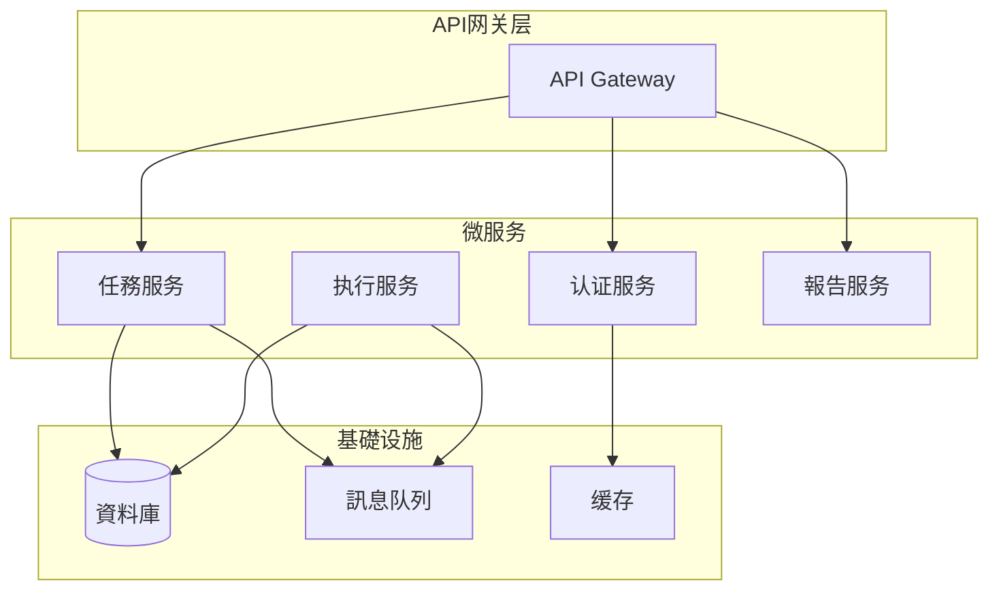

# 自動化工具對比研究

## 主流自動化框架對比

### 1. Python生態系統

#### Selenium WebDriver
**优点:**
- 瀏覽器自動化功能强大
- 支持多语言(Python, Java, C#等)
- 社區活跃，文檔豐富
- 支持所有主流瀏覽器

**缺点:**
- 速度相对较慢
- 需要處理頁面加载等待
- 移动端支持有限

**适用場景:** Web自動化測試、數據抓取、瀏覽器交互

```python
# 示例代碼
from selenium import webdriver
from selenium.webdriver.common.by import By

driver = webdriver.Chrome()
driver.get("https://example.com")
element = driver.find_element(By.ID, "search-box")
```

#### Playwright
**优点:**
- 现代API設計
- 更快的执行速度
- 内置等待機制
- 支持瀏覽器追踪

**缺点:**
- 相对较新，社區较小
- 部分高级功能有限

**适用場景:** 现代Web應用程式自動化、CI/CD整合

```python
# 示例代碼
from playwright.sync_api import sync_playwright

with sync_playwright() as p:
    browser = p.chromium.launch()
    page = browser.new_page()
    page.goto("https://example.com")
```

### 2. 無代碼/低代碼平台

#### Zapier
**特點:**
# 工作流
- 3000+應用程式整合
# 知識
# 部署

**定价:** 免費版(100次/月)起

**Claude Code評價:** 适合简单任務，复杂逻辑有限

#### Microsoft Power Automate
**特點:**
- 深度整合微软生態
- 企业级功能
- AI智能建議
- RPA(robotic process automation)能力

**定价:** Office 365訂閱一部分

**Claude Code評價:** 企业级自動化，學習曲线中等

### 3. RPA专业工具

#### UiPath
**特點:**
- 企业级RPA解決方案
- 可视化設計器
- AI/ML整合
- 强大社區支持

**定价:** 按机器人数量訂閱

**Claude Code評價:** 功能全面但成本较高，适合大型企业

#### Automation Anywhere
**特點:**
- 雲端原生架構
- 认知自動化
# 管理
- A2019架構升級

# 部署

## 技術決策矩阵

| 工具/框架 | 學習曲线 | 開發速度 | 执行效能 | 企业支持 | 成本 | 推荐指数 |
|-----------|----------|----------|----------|----------|------|----------|
| Selenium | 中等 | 中等 | 中等 | 社區 | 免費 | ⭐⭐⭐⭐ |
| Playwright | 简单 | 快 | 快 | 社區 | 免費 | ⭐⭐⭐⭐⭐ |
| Zapier | 非常简单 | 快 | 中等 | 商业 | 中高 | ⭐⭐⭐ |
| Power Automate | 中等 | 快 | 中等 | 企业 | 高 | ⭐⭐⭐⭐ |
| UiPath | 复杂 | 中等 | 快 | 企业 | 很高 | ⭐⭐⭐ |
| Automation Anywhere | 中等 | 中等 | 快 | 企业 | 高 | ⭐⭐⭐ |

## 针对Clawdbot的技術选型建議

### 推荐技術棧组合

#### 方案A: 轻量级Python方案
```
核心引擎: FastAPI
任務调度: Celery + Redis
UI操作: Playwright
數據儲存: SQLite/PostgreSQL
```

**優勢:**
- 開發快速
- 成本低
- 社區支持好
# 部署

#### 方案B: 企业级方案
```
核心引擎: Node.js + TypeScript
任務调度: Bull Queue
UI操作: Puppeteer/Playwright
數據儲存: PostgreSQL + Redis
```

**優勢:**
- 类型安全
- 异步效能好
- 适合复杂流程
- 企业级特性

### 整合方案

#### 微服务架構


## 实施建議

### 分階段開發策略

# 版本
- 基礎API框架
- 简单任務调度
- 基本执行器
- SQLite數據儲存

#### 第二階段: 功能增强
- 使用者认证系統
# 管理
- 報告生成
- PostgreSQL遷移

#### 第三階段: 企业特性
- 微服务拆分
# 部署
- 監控告警
- 效能優化

# 分析

**高风险项:**
- 任務执行稳定性
- 大规模效能瓶颈
- 安全漏洞防护

**缓解措施:**
- 充分的单元測試
- 效能基准測試
- 安全审计流程

## 相關資源

- [[Python自動化最佳實踐]]
- [[Web爬虫技術选型]]
- [[RPA工具评测報告]]
- [[API設計規範]]

---
# 更新
*分類: 3 Resources*