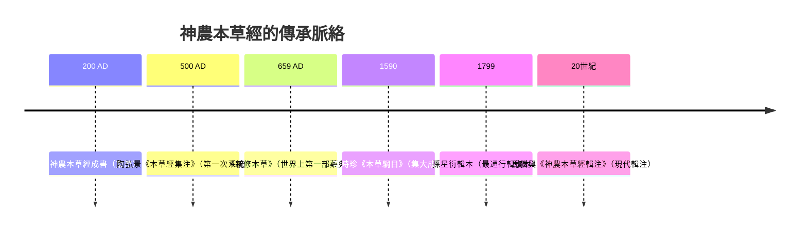

# 神農本草經 Shennong Bencao Jing

> **Local:** 619.1(093)-2 · **DDC:** 619.1 · **UDC:** 615.89(510)(091) · **CLC:** R281 · **LCC:** R611
>
> 《神農本草經》是中醫學現存最早的藥物學專著，成書於東漢時期（約公元 200 年），託名神農氏。全書載藥 365 種，首創三品分類法，奠定中藥學理論基礎。原書已佚，今存輯復本。

---

## 快速導航

| 模組 | 說明 |
|------|------|
| [[3 Resources/600 Applied Sciences/619.1 中醫學/09-中醫經典與歷史/619.1(093)-2 神农本草经/01-成書與傳承/01-成書與傳承\|📜 成書與傳承]] | 作者、輯本、流傳 |
| [[02-三品分類\|🏺 三品分類]] | 上中下三品體系 |
| [[03-四氣五味\|🌡️ 四氣五味]] | 藥性理論基礎 |
| [[04-玉石部\|💎 玉石部]] | 礦物藥 46 種 |
| [[05-草部\|🌿 草部]] | 植物藥 252 種 |
| [[06-木部\|🌳 木部]] | 木本藥 70 種 |
| [[07-獸禽蟲魚\|🐅 獸禽蟲魚]] | 動物藥 67 種 |
| [[08-果菜米穀\|🍎 果菜米穀]] | 食用植物藥 29 種 |
| [[09-現代研究\|🔬 現代研究]] | 藥理學驗證 |
| [[神農本草經資源收集\|📦 資源收集]] | 輯本、研究文獻 |
| [[神農本草經常見問題\|❓ 常見問題]] | 常見迷思 |

---

## 核心數據

| 指標 | 數值 |
|:----:|:----:|
| 成書年代 | 東漢（約 200 AD） |
| 原載藥物 | 365 種 |
| 三品分類 | 上品 120 · 中品 120 · 下品 125 |
| 分類維度 | 四氣（寒熱溫涼）· 五味（酸苦甘辛鹹） |
| 原書狀態 | ❌ 宋代已佚，今為輯復本 |
| 主要輯本 | 孫星衍（1799）、顧觀光（1844）、森立之（1854）、馬繼興 |

---

## 三品分類

神農本草經首創**三品分類法**，按藥物的毒性與功效分為三類：

| 品 | 數量 | 特點 | 代表藥物 |
|:--:|:----:|------|----------|
| **上品** | 120 | 無毒，可久服，養命延年 | 人參、黃耆、甘草、茯苓 |
| **中品** | 120 | 無毒或有毒，養性，補虛治病 | 當歸、麻黃、黃連、丹參 |
| **下品** | 125 | 有毒，攻邪治病，不可久服 | 大黃、附子、半夏、烏頭 |

> 三品分類反映了早期中藥學的安全等級意識——上品養生、中品調和、下品攻邪。

---

## 四氣五味

神農本草經奠定了中藥的**藥性理論**基礎：

### 四氣（四性）

| 氣 | 屬性 | 功效 | 代表藥 |
|:--:|------|------|--------|
| **寒** | 陰 | 清熱瀉火 | 石膏、黃連 |
| **熱** | 陽 | 溫裡散寒 | 附子、乾薑 |
| **溫** | 陽 | 溫中補虛 | 人參、當歸 |
| **涼** | 陰 | 清熱解毒 | 薄荷、桑葉 |

### 五味

| 味 | 屬性 | 功效 | 代表藥 |
|:--:|------|------|--------|
| **酸** | 陰 | 收斂固澀 | 五味子、烏梅 |
| **苦** | 陰 | 清熱燥濕 | 黃連、黃苓 |
| **甘** | 陽 | 補益和中 | 人參、甘草 |
| **辛** | 陽 | 發散行氣 | 麻黃、桂枝 |
| **鹹** | 陰 | 軟堅散結 | 牡蠣、芒硝 |

---

## 歷史影響

---

## 本經與內經的關係

| 面向 | 黃帝內經 | 神農本草經 |
|:----:|----------|------------|
| 側重 | 理論基礎（陰陽五行、經絡臟象） | 藥物學（藥性、功效、分類） |
| 體裁 | 問答體（黃帝問、岐伯答） | 條目體（每藥一錄） |
| 影響 | 中醫理論之源 | 中藥學之源 |
| 分類 | 619.1 | 619.2(093)-2 |
| 關係 | 理論指導 | 用藥依據 |

> 💡 中醫的「理法方藥」體系：**內經**提供理法（理論與治法），**本經**提供方藥（藥物與功效），二者缺一不可。

---

## 相關資源

| 資源 | 說明 |
|------|------|
| [[3 Resources/600 Applied Sciences/619.1 中醫學/09-中醫經典與歷史/619.1 黄帝内经/619.1 黄帝内经\|黃帝內經]] | 中醫理論奠基經典（619.1） |
| [[神農本草經資源收集\|📦 資源收集]] | 輯本、研究文獻、數據庫 |
| [[神農本草經常見問題\|❓ 常見問題]] | 常見迷思辨析 |
