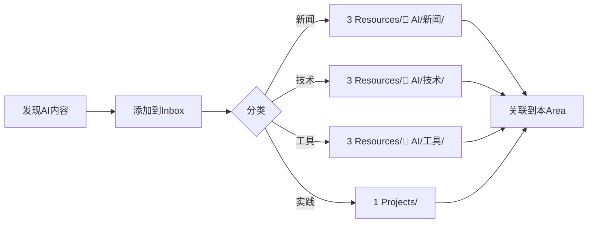

# AI 知识库领域

> **核心理念**: 构建系统化的 AI 知识体系，持续跟踪 AI 技术发展，将理论知识转化为实践能力。

---

## 领域描述 / Area Description

### 范围

本领域涵盖所有 AI 相关的知识收集、整理、学习与实践，包括但不限于：

- **大语言模型 (LLM)**: 模型原理、使用技巧、本地部署
- **AI Agent**: 智能体架构、技能系统、工作流设计
- **提示工程 (Prompt Engineering)**: 模板设计、最佳实践、优化方法
- **AI 工具**: 各类 AI 工具的评测、配置与使用
- **本地模型**: Ollama、GLM 等本地部署方案
- **行业动态**: AI 行业新闻、研究论文、技术趋势

### Area 特点

> [!info] Area 特点
> - **长期持续性**: AI 技术快速发展，需要持续跟踪
> - **实践导向**: 理论学习需要配合实际操作
> - **系统构建**: 建立完整的知识体系而非零散笔记
> - **可衡量性**: 通过笔记数量、项目实践等指标评估

---

## 基本信息 / Basic Information

| 项目 | 内容 |
|------|------|
| 创建日期 | 2026-01-30 |
| 最后更新 | 2026-01-30 |
| 状态 | `[[#active]]` |
| 重要性 | `[[#high]]` |
| 回顾频率 | 每月 |

---

## 关联项目 / Related Projects

```dataview
TABLE WITHOUT id
  file.link as "项目",
  status as "状态",
  created as "创建日期"
FROM [[]]
WHERE para = "projects"
SORT created DESC
```

---

## 维护目标 / Maintenance Goals

| 目标 | 当前状态 | 目标状态 | 目标日期 |
|------|---------|---------|---------|
| 每周新增 AI 相关笔记 | 0 | 3-5 篇 | 持续 |
| 掌握至少 2 个本地模型 | Ollama | 3+ 模型 | 2026-03 |
| 完成至少 2 个 AI 实践项目 | 0 | 2+ 项目 | 2026-06 |
| 建立完整的 Prompt 模板库 | 进行中 | 20+ 模板 | 2026-03 |
| 定期参与 AI 社区讨论 | 偶尔 | 每周 | 持续 |
| 撰写 AI 技术分享笔记 | 0 | 10+ 篇 | 2026-06 |

---

## 关键指标 / Key Metrics

```dataviewjs
// 统计 AI 相关笔记数量
const aiResources = dv.pages('"3 Resources/01-Tech"').where(p =>
  p.file.path.includes('AI') ||
  p.file.path.includes('OpenCode') ||
  (Array.isArray(p.tags) && p.tags.some(t => ['AI', 'LLM', 'agent', 'prompt-engineering'].includes(t)))
);

const aiInbox = dv.pages('"0 Inbox"').where(p =>
  p.file.name.toLowerCase().includes('ai') ||
  p.file.name.toLowerCase().includes('llm') ||
  p.file.name.toLowerCase().includes('ollama')
);

dv.table(['指标', '当前值'], [
  ['AI 资源笔记数', aiResources.length],
  ['Inbox AI 笔记数', aiInbox.length],
  ['总计', aiResources.length + aiInbox.length]
]);
```

| 指标 | 目标值 | 当前值 | 状态 |
|------|--------|--------|------|
| 资源笔记数 | 50+ | ~10 | 📈 进行中 |
| 实践项目数 | 5+ | 1 | 📈 进行中 |
| Prompt 模板数 | 20+ | 5 | 📈 进行中 |
| 本地模型数 | 3+ | 1 | 📈 进行中 |
| 每月新增笔记 | 10+ | ~5 | 📈 进行中 |
| 知识库覆盖率 | 80% | ~40% | 📈 进行中 |

---

## 当前状态 / Current Status

### 近期更新

**2026-01-30**
> 创建 AI 知识库领域，完成初始结构搭建

### 本周重点

1. 整理 Inbox 中的 AI 相关笔记到对应资源目录
2. 完善 Prompt 模板库
3. 配置更多本地模型

### 待办事项
- [ ] 整理 Inbox 中的 OpenCode 相关笔记
- [ ] 补充 Agent 架构相关知识
- [ ] 建立月度回顾模板
- [ ] 创建 AI 学习路径图

---

## 定期检查 / Regular Reviews

### 月度回顾 / Monthly Review

**本月重点：**
> 每月第一周回顾上个月的学习进展，更新关键指标

**完成情况：**
> 记录上月目标的完成情况，分析未完成的原因

**下月计划：**
> 基于本月情况制定下月学习计划

### 季度规划 / Quarterly Planning

| 季度 | 关键目标 | 预期结果 | 完成日期 |
|------|---------|---------|---------|
| Q1 2026 | 掌握基础 LLM 使用 | 能熟练使用 3+ 模型 | 2026-03-31 |
| Q2 2026 | 完成实践项目 | 2+ 完整 AI 项目 | 2026-06-30 |
| Q3 2026 | 深入 Agent 开发 | 能独立创建 AI Agent | 2026-09-30 |
| Q4 2026 | 知识体系完善 | 形成完整 AI 知识地图 | 2026-12-31 |

### 年度总结 / Annual Summary

**本年度成就：**
> 记录本年度在 AI 领域取得的主要成就

**待改进项：**
> 需要在下一年改进的方面

**下一年目标：**
> 为下一年设定的目标

---

## 资源链接 / Resources

### 核心资源文档

- [[3 Resources/01-Tech/🧠 AI/AI知识库.md]] - AI 知识库索引
- [[3 Resources/01-Tech/AI-ML/Prompt模板.md]] - Prompt 模板库
- [[OpenCode本地模型集成指南]] - 本地模型配置指南

### 技术文档
- [[OpenCode-智能体搭建教程]]
- [[Ollama 本地模型开发笔记]]
- [[AI员工搭建全流程指南]]

### 学习路径
- [[如何搭建AI员工]] - AI 员工搭建指南
- [[渐进式总结工作流]] - 知识内化流程

---

## 子主题组织 / Subtopics

```dataview
TABLE WITHOUT id (subtopic + " (" + length(rows.file.link) + ")") as "子主题", sort(rows.file.link) as "笔记"
WHERE contains(file.path, this.file.folder) AND file.name != this.file.name
FLATTEN subtopic
GROUP BY subtopic
SORT subtopic
```

---

## 笔记与记录 / Notes

### 改进想法 / Improvement Ideas

| 想法 | 优先级 | 状态 |
|------|--------|------|
| 创建 AI 学习路径可视化图 | `[[#high]]` | `[[#todo]]` |
| 建立 AI 技术指标追踪表 | `[[#medium]]` | `[[#todo]]` |
| 创建 AI 工具对比矩阵 | `[[#medium]]` | `[[#todo]]` |
| 定期举办 AI 分享会 | `[[#low]]` | `[[#todo]]` |

### 问题记录 / Issue Log

| 问题 | 发现日期 | 状态 | 解决方案 |
|------|---------|------|---------|
| 本地模型内存占用高 | 2026-01-29 | `[[#open]]` | 考虑使用量化模型 |
| Prompt 模板复用性不足 | 2026-01-30 | `[[#open]]` | 设计更通用的模板结构 |

### 学习路径 / Learning Path

#### 阶段一：基础入门 (进行中)
- [x] 了解 LLM 基本概念
- [x] 配置第一个本地模型 (Ollama)
- [ ] 掌握基础 Prompt 技巧
- [ ] 完成首个 AI 项目

#### 阶段二：进阶实践
- [ ] 深入理解 Transformer 架构
- [ ] 掌握 RAG (检索增强生成)
- [ ] 开发自定义 Agent
- [ ] 优化本地模型性能

#### 阶段三：深度应用
- [ ] 构建企业级 AI 解决方案
- [ ] 研究 Fine-tuning 技术
- [ ] 参与 AI 开源项目
- [ ] 分享技术心得

---

## 工作流集成 / Workflow Integration

### 知识收集工作流

1. **捕获阶段**: 添加到 `0 Inbox/`
2. **分类阶段**: 判断类型（新闻/技术/工具/实践）
3. **整理阶段**: 移动到对应资源目录
4. **链接阶段**: 关联到相关主题和笔记



### 实践项目工作流

1. **定义目标**: 明确项目要解决的问题
2. **技术选型**: 选择合适的模型和工具
3. **开发实现**: 参考技术文档进行开发
4. **记录总结**: 完成后记录经验教训

### 快速操作

- **添加新笔记**: 使用 `[[2 Areas/ai-knowledge/ai-knowledge.md|AI 知识库领域]]` 链接
- **搜索 AI 内容**: 使用标签 `#AI`、`#LLM`、`#agent`
- **查看统计**: 查看本文件的关键指标部分
- **月度回顾**: 在 `reviews/monthly/` 创建回顾笔记

---

## 链接笔记 / Linked Notes

```dataview
TABLE WITHOUT id
  file.link as "关联笔记",
  tags as "标签"
FROM [[]]
WHERE !contains(file.folder, this.file.folder)
SORT file.mtime DESC
LIMIT 20
```

---

> [!tip] Area 管理提示
> - 每月回顾一次领域状态，更新关键指标
> - 定期整理 Inbox，确保 AI 相关内容及时分类
> - 保持实践项目与理论学习的平衡
> - 使用标签系统便于快速检索
> - 定期更新维护目标，确保与当前进展一致
