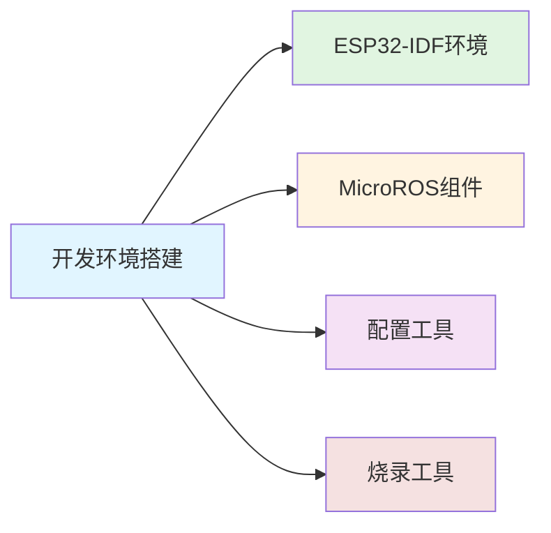

# 开发环境搭建

> 搭建ESP32和MicroROS开发环境，为机器人控制板开发做准备。

---

## 📋 概述

本章节介绍如何搭建完整的开发环境，包括ESP32-IDF环境、MicroROS组件以及相关配置工具。

---

## 📚 目录导航

### 相关文档
- [[开发环境搭建总览]] - 环境搭建总体介绍
- [[microROS控制板简介]] - 控制板硬件介绍
- [[ESP32-IDF配置]] - ESP32开发环境配置
- [[安装ESP32-microros组件]] - MicroROS组件安装
- [[flash-tool烧录]] - 固件烧录工具使用

---

## 📖 学习路径

---

## 🔗 相关资源

### 官方文档
- [ESP-IDF 编程指南](https://docs.espressif.com/projects/esp-idf/)
- [microROS 官方文档](https://micro.ros.org/docs/)

### 相关笔记
- [[ESP32开发基础]] - ESP32基础教程
- [[MicroROS机器人控制板]] - 产品主页
