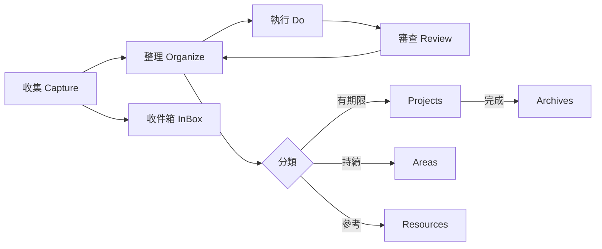
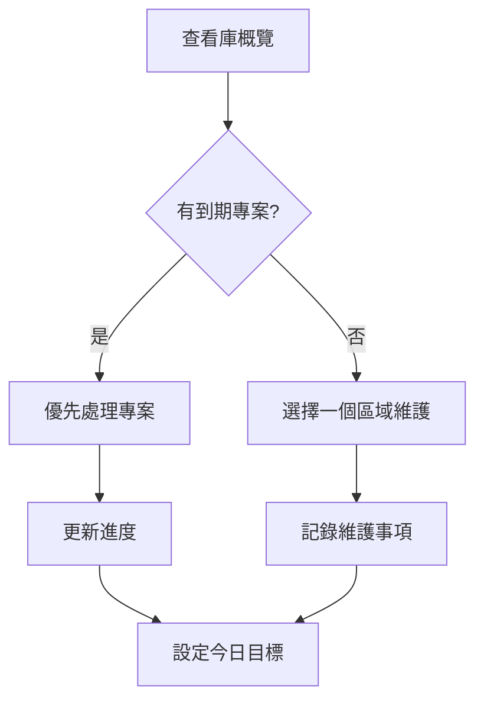

# Obsidian 知識管理方法

> [!info] 概述
> 本文件整理 Obsidian 知識管理的核心方法、工作流程和最佳實踐。

---

## 🌟 核心理念

### 為什麼選擇 Obsidian？

| 特性 | 說明 |
|------|------|
| **本地優先** | 資料完全儲存在本地，擁有完全的資料主權 |
| **Markdown 格式** | 純文字格式，可移植性高，不依賴特定平台 |
| **雙向連結** | 透過 `[[連結]]` 建立知識網絡 |
| **外掛豐富** | 大量社群外掛，可高度客製化 |
| **免費開源** | 完全免費，原始碼開放 |

### 知識管理原則

1. **連結勝過分類** - 透過關聯性而非單純分類組織知識
2. **原子化筆記** - 每個筆記專注於一個概念或主題
3. **持續迭代** - 筆記不斷更新和優化
4. **行動導向** - 知識管理要服務於實際行動和應用

---

## 📂 PARA 方法論

### PARA 結構說明

| 分類 | 定義 | 時間跨度 | 範例 |
|------|------|----------|------|
| **Projects (專案)** | 有明確期限和目標的短期任務 | 數週至數月 | 完成課程、開發專案、寫論文 |
| **Areas (區域)** | 需要持續維護的責任領域 | 長期 | 健康、職涯、財務、關係 |
| **Resources (資源)** | 持續感興趣的主題和資訊 | 持續進化 | 程式設計、寫作、投資理財 |
| **Archives (歸檔)** | 已完成或不再活躍的項目 | 永久保存 | 完成的專案、過時的文件 |

### 工作流程



### 使用時機

| 情境 | 選擇 | 說明 |
|------|------|------|
| 有明確截止日期 | Projects | 需要追蹤進度和時限的任務 |
| 持續進行的責任 | Areas | 沒有明確截止日期但需維護的事項 |
| 想了解某個主題 | Resources | 為了未來參考而收集的資訊 |
| 完成的項目 | Archives | 不再活躍但需要保留的記錄 |

---

## 🗃️ Zettelkasten 卡片盒方法

### 原子化筆記原則

| 原則 | 說明 | 範例 |
|------|------|------|
| **單一主題** | 每個筆記只討論一個概念 | 「雙向連結」而非「Obsidian 功能介紹」 |
| **獨立存在** | 筆記可獨立理解，不依賴其他筆記 | 包含必要的背景說明 |
| **可連結性** | 筆記間透過連結形成網絡 | 使用 `[[相關筆記]]` 建立關聯 |
| **使用自己的話** | 用自己的理解重述資訊 | 不僅是複製貼上 |

### Zettels 分類

| 類型 | 路徑 | 說明 | 範例 |
|------|------|------|------|
| 💡 **閃念筆記** | `5 Zettels/💡 fleeting/` | 快速捕捉的想法和靈感 | 待整理的想法、突發的點子 |
| 📌 **永久筆記** | `5 Zettels/📌 permanent/` | 經過整理的知識原子 | 核心概念、方法論 |
| 📚 **文獻筆記** | `5 Zettels/📚 literature/` | 閱讀資料的筆記 | 書籍摘要、論文筆記 |
| 📁 **結構筆記** | `5 Zettels/📁 structure/` | 組織和導航筆記 | 索引、主題彙整 |

---

## 🛠️ Obsidian 語法與功能

### 基本語法

| 功能 | 語法 | 範例 |
|------|------|------|
| **Wikilink 連結** | `[[筆記名稱]]` | `[[PARA 方法論]]` |
| **帶別名連結** | `[[筆記名稱\|顯示文字]]` | `[[PARA\|PARA 方法]]` |
| **嵌入筆記** | `![[筆記名稱]]` | `![[範例筆記]]` |
| **標籤** | `#標籤` | `#知識管理` |
| **標題錨點** | `#標題` | `#📂 PARA 結構` |
| **區塊引用** | `[[筆記\|^區塊ID]]` | `[[筆記\|^ref1]]` |

### Callout 提示框

```markdown
> [!note] 提示
> 這是一般提示

> [!info] 資訊
> 這是資訊

> [!warning] 警告
> 這是警告

> [!danger] 危險
> 這是危險提示

> [!success] 成功
> 這是成功提示

> [!question] 問題
> 這是問題

> [!example] 範例
> 這是範例
```

### YAML Frontmatter

```yaml
---
title: 筆記標題
date: 2026-01-22
tags: [標籤1, 標籤2]
para: resources  # projects/areas/resources/archives
status: active    # active/completed/hold
language: zh-tw   # en/zh-cn/zh-tw
---
```

---

## 📝 日常工作流程

### 早晨例程



### 日常工作

1. **快速捕捉** → 將想法寫入 InBox
2. **整理分類** → 將 InBox 內容分發到 PARA
3. **執行任務** → 根據專案和區域進行工作
4. **記錄反思** → 將經驗轉化為筆記

### 週末復盤

| 項目 | 內容 | 頻率 |
|------|------|------|
| **收件箱清理** | 處理所有未整理的 InBox 項目 | 每週 |
| **專案進度** | 檢查所有進行中專案的進度 | 每週 |
| **區域維護** | 審視各區域的維護需求 | 每週 |
| **資源更新** | 更新和整理資源筆記 | 每月 |

---

## 🎯 最佳實踐

### 筆記命名

| 原則 | 說明 | 範例 |
|------|------|------|
| **描述性名稱** | 用一句話描述筆記內容 | `雙向連結的使用方法` 而非 `連結` |
| **使用空格** | 方便閱讀和搜尋 | `時間管理方法` 而非 `時間管理方法` |
| **避免重複** | 確保名稱的唯一性 | 先搜尋再建立 |

### 建立連結

| 策略 | 說明 |
|------|------|
| **前瞻連結** | 在新筆記中連結到已有筆記 |
| **後向連結** | 在已有筆記中加入指向新筆記的連結 |
| **主題連結** | 建立主題索引筆記，連結相關筆記 |
| **關鍵字連結** | 使用一致的關鍵字方便搜尋和連結 |

### 資料維護

| 任務 | 頻率 | 說明 |
|------|------|------|
| **刪除重複** | 每月 | 合併相似筆記，刪除重複內容 |
| **更新過時資訊** | 每季 | 檢查並更新不再準確的資訊 |
| **歸檔完成項目** | 專案完成時 | 將完成的專案移至 Archives |
| **清理未使用標籤** | 每月 | 刪除或合併使用過少的標籤 |

---

## 🔗 推薦外掛

### 核心外掛

| 外掛名稱 | 功能 | 必要性 |
|----------|------|--------|
| **Dataview** | 資料庫查詢和動態表格 | 強烈推薦 |
| **Templater** | 高級範本功能 | 強烈推薦 |
| **QuickAdd** | 快速建立和執行操作 | 推薦 |
| **Calendar** | 日曆視圖和日期導航 | 推薦 |

### 效率外掛

| 外掛名稱 | 功能 | 用途 |
|----------|------|------|
| **Advanced Tables** | 表格編輯增強 | 編輯 Markdown 表格 |
| **Kanban** | 看板視圖 | 專案管理和任務追蹤 |
| **Excalidraw** | 繪圖和白板 | 視覺化思考 |
| **Tasks** | 任務管理 | 追蹤待辦事項 |

### 整合外掛

| 外掛名稱 | 功能 | 整合對象 |
|----------|------|----------|
| **Obsidian Git** | 版本控制 | Git 備份 |
| **Auto-hotkeys** | 快捷鍵自訂 | 工作效率 |
| **Command Palette** | 快速指令啟動 | 快速操作 |

---

## 📚 相關資源

### 內部連結

- [[3 Resources/工作技巧/PARA工作流]] - PARA 工作流詳解
- [[5 Zettels/📁 structure/知識管理原則]] - 知識管理核心原則
- [[_Template/para_template-resource]] - 資源筆記範本

### 外部資源

| 資源 | 連結 | 說明 |
|------|------|------|
| **Obsidian 官方文件** | https://help.obsidian.md | 官方使用指南 |
| **Building a Second Brain** | https://basb.com/ | Tiago Forte 的第二大脑方法 |
| **Zettelkasten 方法** | https://zettelkasten.de/ | 原始卡片盒方法 |
| **Obsidian 社群** | https://forum.obsidian.md/ | 使用者討論區 |

---

## 🔄 持續改進

### 定期檢視清單

- [ ] 收件箱是否已清空？
- [ ] 所有專案進度是否已更新？
- [ ] 區域維護事項是否已記錄？
- [ ] 重複筆記是否已合併？
- [ ] 連結是否完整且有效？
- [ ] 標籤系統是否一致？

### 改進方向

1. **優化工作流程** - 根據使用情況調整流程
2. **完善範本** - 建立更多實用範本
3. **加強連結** - 增加筆記間的連結密度
4. **定期審視** - 保持系統的活力和準確性

---

> [!tip] 最後提示
> 知識管理是一個持續演進的過程，沒有唯一的正確方法。重要的是找到適合您的工作方式，並持續優化。

---

*建立日期：2026-01-22*
*最後更新：2026-01-22*
*標籤：#obsidian #知識管理 #PARA #PKM*
