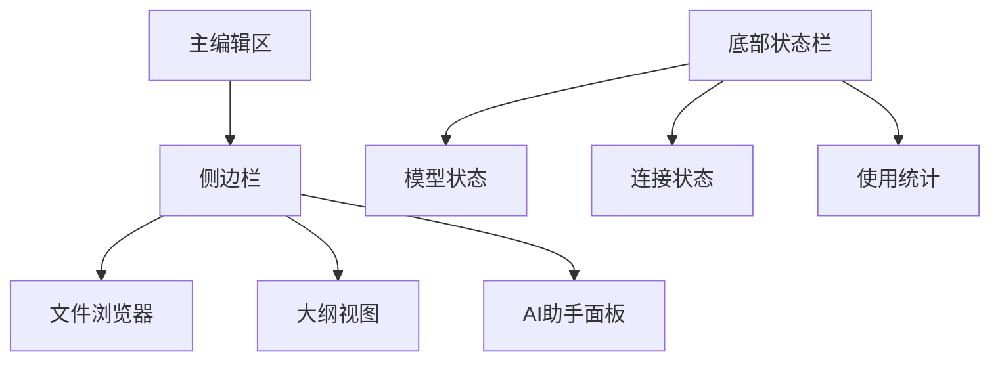

# 📝 Obsidian AI集成配置指南

> 🎯 **章节目标**：配置Obsidian与AI模型的深度集成 | ⏱️ **预计时间**：45分钟 | 📊 **难度等级**：⭐⭐

## 📖 概述

Obsidian作为强大的知识管理工具，通过AI插件可以实现智能化的内容创建、知识组织和学习辅助。本指南将详细介绍如何配置Obsidian与OpenCode、Ollama、GPT-oss:120b-cloud的集成。

## 🛠️ 环境准备

### 📋 前置要求
- ✅ **Obsidian安装**：已安装Obsidian 1.0.0+
- ✅ **AI服务准备**：至少配置一种AI服务（Ollama或GPT-oss）
- ✅ **基础配置**：完成Obsidian基础设置

### 🎯 推荐配置
| 组件 | 版本要求 | 用途 |
|------|----------|------|
| **Obsidian** | 1.0.0+ | 主应用 |
| **AI插件** | 最新版 | AI集成 |
| **API密钥** | 有效 | 云端服务 |

## 🔌 AI插件安装与配置

### 📦 核心AI插件

#### 1. Text Generator
**功能**：强大的文本生成和AI助手
```bash
# 安装步骤
1. 打开Obsidian设置
2. 进入"第三方插件"
3. 关闭"安全模式"
4. 浏览社区插件
5. 搜索"Text Generator"
6. 点击安装并启用
```

**配置参数**：
```json
{
  "api_key": "your-api-key",
  "model": "gpt-oss:120b-cloud",
  "max_tokens": 2000,
  "temperature": 0.7,
  "endpoint": "https://api.gpt-oss.com/v1"
}
```

#### 2. Copilot
**功能**：智能代码和文本补全
```bash
# 配置要点
- 支持多种AI模型
- 实时智能补全
- 上下文理解
- 自定义快捷键
```

#### 3. Smart Connections
**功能**：智能知识连接和推荐
```bash
# 核心特性
- 自动建立笔记连接
- 智能内容推荐
- 语义搜索
- 知识图谱可视化
```

### 🔧 插件配置详解

#### Text Generator完整配置
```yaml
# API配置
api:
  provider: "openai-compatible"  # 兼容OpenAI格式
  base_url: "https://api.gpt-oss.com/v1"
  api_key: "sk-your-api-key-here"
  model: "gpt-oss:120b-cloud"
  
# 生成参数
generation:
  max_tokens: 2000
  temperature: 0.7
  top_p: 0.9
  frequency_penalty: 0.0
  presence_penalty: 0.0
  
# 界面设置
ui:
  show_model_selector: true
  show_temperature_slider: true
  auto_generate_title: true
  confirm_before_generate: false
```

#### 本地Ollama配置
```yaml
# Ollama本地配置
api:
  provider: "ollama"
  base_url: "http://localhost:11434"
  model: "llama2:7b"
  
# 本地模型参数
generation:
  max_tokens: 1500
  temperature: 0.5
  top_p: 0.8
```

## 🎨 界面定制

### 📋 工作区布局

#### 推荐布局方案


#### AI面板配置
```css
/* AI面板样式 */
.ai-panel {
  width: 300px;
  background: var(--background-secondary);
  border-right: 1px solid var(--background-modifier-border);
}

.ai-chat {
  height: 400px;
  overflow-y: auto;
  padding: 12px;
}

.ai-input {
  padding: 8px;
  border: 1px solid var(--background-modifier-border);
  border-radius: 4px;
}
```

### 🎯 快捷键设置

#### AI相关快捷键
| 快捷键 | 功能 | 说明 |
|--------|------|------|
| `Ctrl+Shift+A` | 打开AI助手 | 快速访问AI功能 |
| `Ctrl+Shift+G` | 生成文本 | 智能文本生成 |
| `Ctrl+Shift+C` | 智能补全 | 上下文补全 |
| `Ctrl+Shift+S` | 语义搜索 | 智能内容搜索 |
| `Ctrl+Shift+L` | 建立连接 | 智能笔记连接 |

## 🤖 AI模型配置

### 🌐 云端模型配置

#### GPT-oss:120b-cloud设置
```json
{
  "model_config": {
    "name": "gpt-oss:120b-cloud",
    "provider": "gpt-oss",
    "api_base": "https://api.gpt-oss.com/v1",
    "api_key": "your-api-key",
    "context_length": 4096,
    "capabilities": [
      "text-generation",
      "code-generation",
      "translation",
      "summarization"
    ]
  },
  "usage_limits": {
    "requests_per_minute": 60,
    "tokens_per_minute": 90000,
    "monthly_quota": 1000000
  }
}
```

#### API密钥管理
```bash
# 安全存储API密钥
export GPT_OSS_API_KEY="sk-your-secure-key"
# 在Obsidian中使用环境变量
api_key: "${GPT_OSS_API_KEY}"
```

### 🏠 本地模型配置

#### Ollama集成设置
```yaml
# Ollama配置文件
ollama:
  host: "localhost"
  port: 11434
  models:
    - name: "llama2:7b"
      size: "7B"
      context_length: 4096
    - name: "codellama:7b"
      size: "7B"
      context_length: 4096
    - name: "mistral:7b"
      size: "7B"
      context_length: 8192
```

#### 模型切换策略
```javascript
// 智能模型选择逻辑
function selectModel(taskType, complexity) {
  if (taskType === 'code' && complexity === 'high') {
    return 'gpt-oss:120b-cloud';  // 复杂任务用云端
  } else if (taskType === 'note' && complexity === 'low') {
    return 'llama2:7b';  // 简单任务用本地
  } else {
    return 'mistral:7b';  // 默认本地模型
  }
}
```

## 📝 智能笔记创建

### 🎯 笔记模板配置

#### AI增强笔记模板
```markdown
---
title: {{title}}
created: {{date}}
tags: {{tags}}
ai_model: {{model}}
ai_generated: true
---

# {{title}}

## 🤖 AI生成内容

### 📋 概述
{{ai_generated_overview}}

### 🔍 关键要点
{{ai_generated_keypoints}}

### 📚 相关资源
{{ai_generated_resources}}

## 📝 人工补充

### 💭 个人思考
{{personal_thoughts}}

### 🔗 实际应用
{{practical_applications}}

### 📊 数据验证
{{data_validation}}
```

#### 自动化工作流
```yaml
# 自动化配置
workflows:
  auto_tag:
    enabled: true
    ai_suggested_tags: true
  auto_link:
    enabled: true
    similarity_threshold: 0.8
  auto_summarize:
    enabled: true
    max_length: 200
```

### 🧠 智能内容生成

#### 文本生成提示词模板
```prompt
你是一个专业的知识管理助手。请根据以下要求生成内容：

主题：{topic}
类型：{type}（笔记/总结/分析）
深度：{depth}（基础/详细/专业）
风格：{style}（正式/轻松/技术）

要求：
1. 结构清晰，层次分明
2. 内容准确，有据可查
3. 语言流畅，易于理解
4. 包含实际应用案例

请生成符合要求的内容。
```

#### 代码生成配置
```javascript
// 代码生成设置
const codeGenerationConfig = {
  language: "python",
  style: "pep8",
  include_comments: true,
  include_tests: false,
  max_lines: 100,
  context_window: 2000
};
```

## 🔗 智能知识连接

### 🕸️ 自动链接建立

#### Smart Connections配置
```yaml
# 智能连接设置
smart_connections:
  auto_link:
    enabled: true
    threshold: 0.7
    max_links_per_note: 10
  
  semantic_search:
    enabled: true
    embedding_model: "text-embedding-ada-002"
    search_depth: 3
  
  knowledge_graph:
    enabled: true
    update_frequency: "daily"
    visualization: "force-directed"
```

#### 链接质量评估
```python
# 链接质量评分算法
def calculate_link_quality(note1, note2, similarity):
    factors = {
        'content_similarity': similarity * 0.4,
        'tag_overlap': calculate_tag_overlap(note1, note2) * 0.3,
        'temporal_proximity': calculate_temporal_proximity(note1, note2) * 0.2,
        'user_feedback': get_user_feedback(note1, note2) * 0.1
    }
    return sum(factors.values())
```

### 📊 知识图谱可视化

#### 图谱配置
```json
{
  "graph_settings": {
    "layout": "force",
    "node_size": "degree",
    "edge_width": "similarity",
    "color_scheme": "category",
    "interactive": true,
    "3d_mode": false
  },
  "node_categories": {
    "concept": "#3498db",
    "person": "#e74c3c",
    "event": "#f39c12",
    "document": "#2ecc71"
  }
}
```

## 🔍 智能搜索与检索

### 🧠 语义搜索配置

#### 搜索引擎设置
```yaml
# 语义搜索配置
semantic_search:
  enabled: true
  embedding_model: "text-embedding-3-small"
  vector_database: "chroma"
  search_algorithm: "cosine_similarity"
  results_limit: 20
  
# 搜索优化
search_optimization:
  query_expansion: true
  synonym_matching: true
  context_weighting: 0.3
  recency_boost: 0.2
```

#### 搜索结果排序
```javascript
// 搜索结果排序算法
function rankSearchResults(results, query) {
  return results.sort((a, b) => {
    const scoreA = calculateRelevanceScore(a, query);
    const scoreB = calculateRelevanceScore(b, query);
    return scoreB - scoreA;
  });
}

function calculateRelevanceScore(result, query) {
  return (
    result.semantic_similarity * 0.4 +
    result.text_match * 0.3 +
    result.tag_match * 0.2 +
    result.recency_score * 0.1
  );
}
```

## 📈 使用统计与优化

### 📊 使用数据分析

#### 统计配置
```yaml
# 使用统计设置
usage_analytics:
  enabled: true
  track_metrics:
    - "ai_requests_count"
    - "tokens_used"
    - "response_time"
    - "user_satisfaction"
  
  reporting:
    frequency: "weekly"
    format: "dashboard"
    export_options: ["csv", "json"]
```

#### 性能监控
```javascript
// 性能监控脚本
const performanceMonitor = {
  trackRequest: (startTime, endTime, tokens) => {
    const duration = endTime - startTime;
    const tokensPerSecond = tokens / (duration / 1000);
    
    return {
      duration,
      tokensPerSecond,
      cost: calculateCost(tokens)
    };
  },
  
  optimizeSettings: (metrics) => {
    if (metrics.averageResponseTime > 2000) {
      // 建议切换到更快的模型
      return suggestModelUpgrade();
    }
  }
};
```

### 🎯 个性化优化

#### 学习偏好配置
```json
{
  "user_preferences": {
    "writing_style": "professional",
    "content_depth": "detailed",
    "language": "chinese",
    "technical_level": "intermediate",
    "preferred_models": {
      "note_taking": "mistral:7b",
      "code_generation": "codellama:7b",
      "research": "gpt-oss:120b-cloud"
    }
  }
}
```

## 🔒 安全与隐私

### 🛡️ 数据保护设置

#### 隐私配置
```yaml
# 隐私保护设置
privacy:
  data_encryption: true
  local_processing: true
  cloud_backup: false
  audit_logging: true
  
# 敏感内容过滤
content_filtering:
  enabled: true
  blocked_categories: ["personal", "financial", "medical"]
  custom_rules: ["no_personal_identifiers"]
```

#### API密钥安全
```bash
# 环境变量配置
export OBSIDIAN_AI_API_KEY="your-secure-key"
export OLLAMA_HOST="localhost:11434"

# Obsidian配置中的安全引用
api_key: "$OBSIDIAN_AI_API_KEY"
ollama_host: "$OLLAMA_HOST"
```

## 🚀 高级功能

### 🤖 自定义AI助手

#### 助手角色定义
```json
{
  "ai_assistants": {
    "research_assistant": {
      "role": "学术研究助手",
      "expertise": ["文献分析", "数据整理", "学术写作"],
      "personality": "严谨、专业、耐心",
      "model": "gpt-oss:120b-cloud"
    },
    "coding_assistant": {
      "role": "编程助手",
      "expertise": ["代码生成", "调试", "优化"],
      "personality": "高效、准确、友好",
      "model": "codellama:7b"
    },
    "creative_assistant": {
      "role": "创意助手",
      "expertise": ["内容创作", "头脑风暴", "文案写作"],
      "personality": "创意、灵活、启发",
      "model": "mistral:7b"
    }
  }
}
```

### 🔄 自动化工作流

#### 工作流配置
```yaml
# 自动化工作流
automated_workflows:
  daily_review:
    trigger: "daily 09:00"
    actions:
      - "summarize_yesterday_notes"
      - "suggest_today_topics"
      - "update_knowledge_graph"
  
  weekly_organization:
    trigger: "weekly monday 10:00"
    actions:
      - "identify_orphaned_notes"
      - "suggest_merging_opportunities"
      - "update_tag_taxonomy"
  
  monthly_optimization:
    trigger: "monthly 1st 10:00"
    actions:
      - "analyze_usage_patterns"
      - "suggest_model_optimizations"
      - "generate_performance_report"
```

## 📋 故障排除

### 🔧 常见问题解决

#### 连接问题
```bash
# 检查API连接
curl -X GET "https://api.gpt-oss.com/v1/models" \
  -H "Authorization: Bearer $API_KEY"

# 检查Ollama状态
curl http://localhost:11434/api/tags
```

#### 性能问题
```javascript
// 性能优化建议
const optimizationTips = {
  slow_response: "考虑使用更快的本地模型",
  high_cost: "增加本地模型使用比例",
  poor_quality: "调整temperature和top_p参数",
  connection_error: "检查网络和API密钥"
};
```

## 📚 扩展资源

### 📖 推荐阅读
- **Obsidian AI插件官方文档**
- **Text Generator使用指南**
- **Smart Connections配置手册**
- **Ollama最佳实践**

### 🎥 视频教程
- **Obsidian AI集成完整教程**
- **高级工作流配置**
- **性能优化技巧**

### 💬 社区支持
- **Obsidian Discord社区**
- **AI插件用户群**
- **技术支持论坛**

---

## ✅ 配置检查清单

### 🔧 基础配置
- [ ] Obsidian安装并更新到最新版本
- [ ] AI插件安装并启用
- [ ] API密钥配置并测试
- [ ] 基础设置完成并验证

### 🎯 高级配置
- [ ] 自定义工作流配置
- [ ] 智能连接设置
- [ ] 性能监控启用
- [ ] 安全隐私设置

### 🚀 优化配置
- [ ] 使用统计和分析
- [ ] 个性化偏好设置
- [ ] 自动化规则配置
- [ ] 备份和恢复设置

---

## 🎉 下一步

配置完成后，您可以：

1. **📝 创建第一个AI辅助笔记**
2. **🔗 建立智能知识连接**
3. **🔍 使用语义搜索功能**
4. **📊 监控使用情况和性能**

> 💡 **提示**：建议先从基础功能开始使用，逐步启用高级功能，以确保系统的稳定性和可靠性。

---

**📝 创建时间**：2026-01-21 | **🔄 最后更新**：2026-01-21 | **👥 维护者**：AI Integration Team