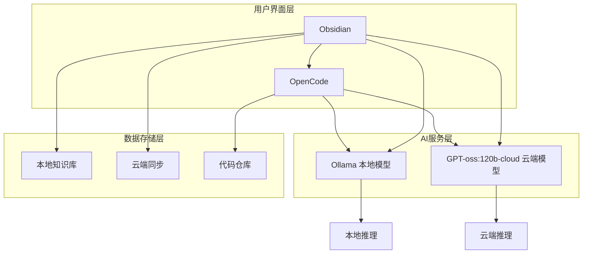
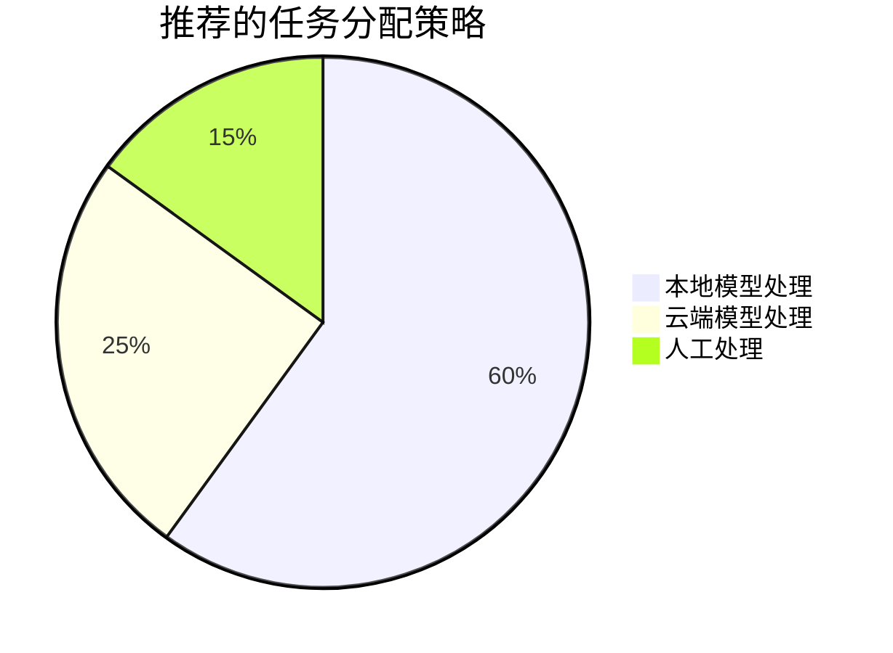

# 🚀 Obsidian + OpenCode + Ollama + GPT-oss:120b-cloud 集成使用指南

> 📚 **完整指南** | 🔄 **最后更新**：2026-01-21 | ⭐ **难度等级**：中级

## 📖 指南概述

本指南将帮助您构建一个强大的AI辅助知识管理和开发工作流，整合以下工具：

- **📝 Obsidian** - 专业的知识管理和笔记系统
- **💻 OpenCode** - AI驱动的代码开发助手
- **🦙 Ollama** - 本地大语言模型部署平台
- **🤖 GPT-oss:120b-cloud** - 高性能云端大语言模型

### 🎯 集成目标
- 🧠 **智能知识管理**：AI辅助的笔记创建和知识组织
- 💻 **智能代码开发**：AI驱动的代码生成和优化
- 🔒 **数据隐私保护**：本地+云端混合部署方案
- ⚡ **高效工作流程**：无缝衔接的开发和知识管理流程

## 🏗️ 系统架构

## 📋 目录导航

### 🎯 快速开始
| 章节 | 内容 | 难度 | 预计时间 |
|------|------|------|----------|
| [[系统要求]] | 硬件软件环境配置 | ⭐ | 30分钟 |
| [[基础配置]] | Obsidian安装和基础设置 | ⭐⭐ | 45分钟 |
| [[安装配置]] | OpenCode安装和集成 | ⭐⭐ | 60分钟 |
| [[本地部署]] | Ollama本地模型部署 | ⭐⭐⭐ | 90分钟 |

### 🔧 深度配置
| 章节                  | 内容                   | 难度    | 预计时间  |
| ------------------- | -------------------- | ----- | ----- |
| [[云端配置]] | GPT-oss:120b-cloud配置 | ⭐⭐⭐   | 60分钟  |
| [[整合工作流]]   | 完整工作流程设计             | ⭐⭐⭐⭐  | 120分钟 |
| [[故障排除與維護]] | 故障诊断和解决              | ⭐⭐    | 45分钟  |
| [[自动化]]     | 高级自动化配置              | ⭐⭐⭐⭐⭐ | 180分钟 |

## 🎯 适用人群

### 👨‍💻 开发者
- **全栈开发者**：需要管理技术文档和代码
- **AI开发者**：需要AI辅助的开发环境
- **独立开发者**：需要高效的个人工作流

### 📚 知识工作者
- **技术写作者**：需要AI辅助的内容创作
- **研究人员**：需要AI支持的学术研究
- **产品经理**：需要AI驱动的需求分析

### 🎓 学生学者
- **计算机专业学生**：学习AI辅助开发
- **研究生**：需要AI支持的学术研究
- **终身学习者**：构建个人知识体系

## 🛠️ 技术栈详解

### 📝 Obsidian
**核心功能**：
- 🔗 **双向链接**：知识网络构建
- 🗺️ **知识图谱**：可视化知识结构
- 📝 **Markdown支持**：标准化的文档格式
- 🔌 **插件生态**：丰富的扩展功能

**AI集成优势**：
- 🤖 **AI助手插件**：直接在Obsidian中使用AI
- 📊 **智能分析**：AI辅助的内容分析
- 🔄 **自动整理**：AI驱动的知识组织

### 💻 OpenCode
**核心功能**：
- 🧠 **AI代码生成**：智能代码编写
- 🔍 **代码分析**：深度代码理解
- 🛠️ **重构建议**：AI驱动的代码优化
- 📚 **文档生成**：自动生成代码文档

**集成优势**：
- 🔗 **无缝衔接**：与Obsidian知识库联动
- 🎯 **上下文理解**：基于知识库的智能编码
- 📈 **效率提升**：显著提高开发效率

### 🦙 Ollama
**核心功能**：
- 🏠 **本地部署**：数据隐私保护
- 🤖 **多模型支持**：支持多种开源模型
- ⚡ **高性能推理**：优化的推理性能
- 🔧 **易于管理**：简单的模型管理

**部署优势**：
- 🔒 **数据安全**：敏感数据不离开本地
- 💰 **成本控制**：避免云端API费用
- 🚀 **快速响应**：本地推理的低延迟

### 🤖 GPT-oss:120b-cloud
**核心特性**：
- 🧠 **超大参数**：1200亿参数规模
- ⚡ **云端高性能**：强大的计算能力
- 🌐 **全球可用**：云端服务的高可用性
- 💰 **按需付费**：灵活的成本控制

**使用优势**：
- 🎯 **复杂任务**：处理复杂的AI任务
- 🔄 **负载均衡**：与本地模型形成互补
- 📈 **可扩展性**：根据需求动态扩展

## 📊 性能对比

### 🏠 本地 vs ☁️ 云端
| 特性 | Ollama本地 | GPT-oss云端 | 推荐场景 |
|------|------------|-------------|----------|
| **数据隐私** | ⭐⭐⭐⭐⭐ | ⭐⭐⭐ | 敏感数据处理 |
| **响应速度** | ⭐⭐⭐⭐ | ⭐⭐⭐⭐ | 实时交互需求 |
| **模型能力** | ⭐⭐⭐ | ⭐⭐⭐⭐⭐ | 复杂任务处理 |
| **成本控制** | ⭐⭐⭐⭐ | ⭐⭐⭐ | 预算敏感场景 |
| **可扩展性** | ⭐⭐ | ⭐⭐⭐⭐⭐ | 大规模应用 |

### 💡 混合部署策略

## 🎯 使用场景

### 📚 知识管理场景
- **📖 智能笔记**：AI辅助的笔记创建和整理
- **🔍 智能搜索**：基于语义的智能内容检索
- **📊 知识分析**：AI驱动的知识结构分析
- **🔄 自动更新**：AI维护的知识库更新

### 💻 开发场景
- **🧠 代码生成**：基于需求描述的代码生成
- **🔍 代码审查**：AI辅助的代码质量检查
- **📚 文档编写**：自动生成API文档
- **🐛 调试辅助**：AI驱动的错误诊断

### 🎓 学习场景
- **📚 个性化学习**：AI定制的学习路径
- **🤝 智能问答**：基于知识库的智能问答
- **📝 内容创作**：AI辅助的学术写作
- **🔄 知识巩固**：AI驱动的知识复习

## 📋 前置要求

### 💻 硬件要求
| 组件 | 最低配置 | 推荐配置 | 说明 |
|------|----------|----------|------|
| **CPU** | 4核心 | 8核心+ | 本地推理需要较强CPU |
| **内存** | 8GB | 16GB+ | 大模型需要充足内存 |
| **存储** | 50GB | 100GB+ | 模型和数据存储 |
| **GPU** | 可选 | RTX 3060+ | 加速本地推理 |

### 🛠️ 软件要求
| 软件 | 最低版本 | 推荐版本 | 用途 |
|------|----------|----------|------|
| **操作系统** | Windows 10 | Windows 11 | 主要运行环境 |
| **Obsidian** | 0.15.0 | 1.0.0+ | 知识管理 |
| **Python** | 3.8 | 3.10+ | Ollama依赖 |
| **Docker** | 20.10 | 24.0+ | 容器化部署 |

### 🌐 网络要求
- **带宽**：≥10Mbps（云端模型调用）
- **延迟**：≤100ms（实时交互需求）
- **稳定性**：99%+（云端服务可用性）

## 🚀 快速开始

### ⚡ 5分钟快速体验
如果您想快速体验集成效果，可以按以下步骤：

1. **📥 下载Obsidian**：安装最新版Obsidian
2. **🔧 安装AI插件**：在Obsidian中安装AI助手插件
3. **🌐 配置云端API**：连接GPT-oss:120b-cloud
4. **✨ 开始使用**：创建第一个AI辅助笔记

### 🎯 完整部署路径
如果您需要完整的本地+云端混合部署：

1. **📖 阅读环境准备**：[[系统要求]]
2. **🔧 配置Obsidian**：[[基础配置]]
3. **💻 安装OpenCode**：[[安装配置]]
4. **🦙 部署Ollama**：[[本地部署]]
5. **🤖 配置GPT模型**：[[云端配置]]
6. **🔄 整合工作流**：[[整合工作流]]

## 💡 核心优势

### 🎯 效率提升
- **⚡ 快速响应**：本地模型的低延迟
- **🧠 智能辅助**：AI驱动的自动化处理
- **🔄 无缝切换**：本地和云端模型智能切换

### 🔒 数据安全
- **🏠 本地处理**：敏感数据本地化处理
- **🔐 隐私保护**：用户数据完全可控
- **🛡️ 安全隔离**：本地和云端安全隔离

### 💰 成本优化
- **🏠 本地优先**：减少云端API调用
- **⚡ 智能调度**：根据任务类型选择模型
- **📊 使用监控**：实时监控成本和使用

### 🌈 用户体验
- **🎨 统一界面**：Obsidian中的统一操作界面
- **🔗 深度集成**：工具间的无缝衔接
- **📱 多端同步**：支持多设备使用

## 📈 学习路径

### 🥇 初学者路径（1-2周）

**学习目标**：
- 🎯 掌握基础配置和使用
- 🔧 理解各工具的基本功能
- 📝 建立简单的AI辅助工作流

### 🥈 进阶路径（2-4周）

**学习目标**：
- 🏠 掌握本地模型部署
- 🔄 理解混合部署策略
- ⚡ 建立高效的自动化工作流

### 🥉 专家路径（4-8周）

**学习目标**：
- 🎨 深度定制系统配置
- ⚡ 优化系统性能
- 🔧 掌握高级集成技术

## 📞 支持与帮助

### 🆘 获取帮助
- **📖 在线文档**：详细的操作文档
- **💬 社区支持**：活跃的用户社区
- **🐛 问题反馈**：及时的问题响应
- **📧 邮件支持**：专业的技术支持

### 🔄 更新维护
- **📅 定期更新**：保持内容的时效性
- **🔧 版本管理**：清晰的版本控制
- **📊 兼容性**：确保版本兼容性
- **🎯 持续优化**：基于用户反馈的改进

---

## 🎉 开始您的AI增强之旅

准备好构建您的AI辅助知识管理和开发工作流了吗？

### 📌 推荐起点
- **🚀 快速体验**：直接从 [[基础配置]] 开始
- **🏠 完整部署**：从 [[系统要求]] 系统学习
- **🎯 特定需求**：根据您的需求选择相应章节

### 💡 温馨提示
- 📖 **循序渐进**：建议按章节顺序学习
- 🧪 **实践验证**：每个步骤都要实际操作验证
- 🔄 **及时反馈**：遇到问题及时寻求帮助
- 📈 **持续优化**：根据使用情况不断优化配置

---

> 🌟 **祝您使用愉快！** 如果有任何问题，请随时查看相关章节或寻求社区帮助。

**📧 联系方式**：support@ai-integration-guide.com

**🔄 最后更新**：2026-01-21 | **📊 版本**：v1.0 | **👥 贡献者**：AI Integration Team