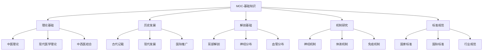
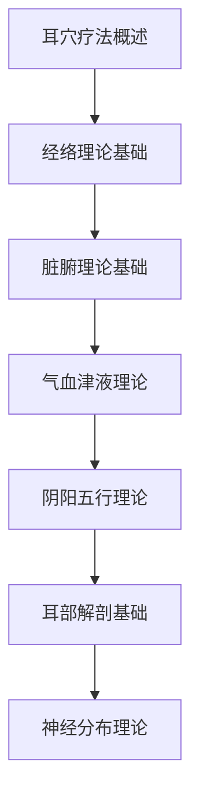
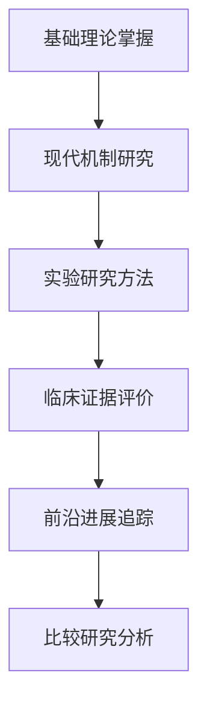
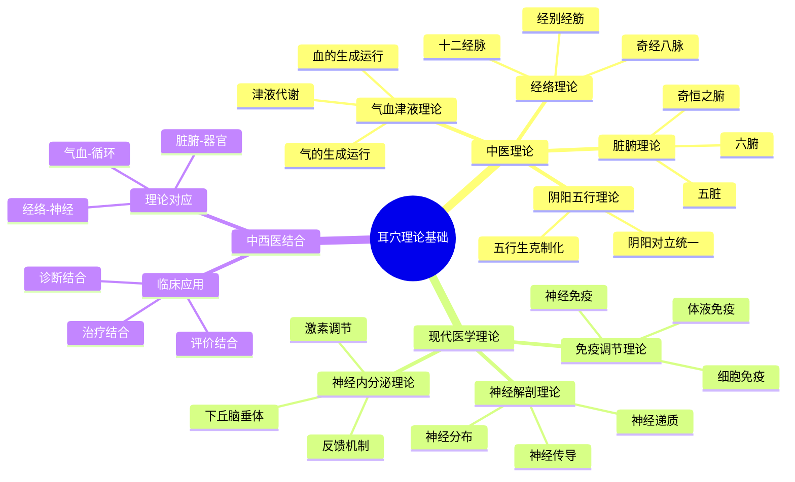

# 🗺️ MOC-基础知识

> 📍 **内容地图**：耳穴疗法基础理论知识 | 🔄 **最后更新**：2026-01-21

## 🧭 理论体系导航

## 📚 核心理论内容

### 🏛️ 中医理论基础
| 理论 | 核心概念 | 重要文献 | 关联穴位 |
|------|----------|----------|----------|
| [[经络理论]] | 耳为宗脉之所聚 | 《灵枢·口问》 | 全身穴位 |
| [[脏腑理论]] | 脏腑功能耳部对应 | 《黄帝内经》 | 脏腑穴位 |
| [[气血理论]] | 气血运行耳部调节 | 《难经》 | 气血相关穴位 |
| [[阴阳理论]] | 阴阳平衡耳穴调节 | 《易经》 | 调理阴阳穴位 |
| [[全息理论]] | 耳部为全身缩影 | 现代研究 | 全息对应穴位 |

### 🧬 现代医学基础
| 理论 | 核心内容 | 研究证据 | 临床应用 |
|------|----------|----------|----------|
| [[神经解剖理论]] | Arnold神经分布 | 解剖学研究 | 神经系统疾病 |
| [[反射理论]] | 耳部反射区 | 生理学研究 | 各系统疾病 |
| [[神经内分泌理论]] | 神经-内分泌-免疫网络 | 分子生物学研究 | 内分泌疾病 |
| [[胚胎发育理论]] | 胚胎发育与耳部关系 | 发生学研究 | 发育相关疾病 |
| [[量子医学理论]] | 微观能量调节 | 物理学研究 | 能量平衡调节 |

### 📜 历史发展脉络
| 时期 | 重要事件 | 代表人物 | 标志性成果 |
|------|----------|----------|------------|
| **古代时期** | 《内经》记载 | 黄帝内经作者 | 耳部与全身联系 |
| **晋唐时期** | 《针灸甲乙经》 | 皇甫谧 | 耳穴系统记载 |
| **明清时期** | 《针灸大成》 | 杨继洲 | 耳穴详细描述 |
| **现代初期** | Nogier发现 | Paul Nogier | 耳穴反射区发现 |
| **发展期** | 中国系统整理 | 中国专家 | 耳穴图谱制定 |
| **标准化期** | 国际标准化 | WHO | 国际标准制定 |

## 🎯 学习重点

### 🔥 核心必掌握
1. **耳穴疗法概述** - [[耳穴疗法概述]]
2. **经络理论基础** - [[经络理论]]
3. **脏腑理论基础** - [[脏腑理论]]
4. **耳部解剖基础** - [[耳廓解剖基础]]

### 📚 重要理论
1. **气血津液理论** - [[气血津液理论]]
2. **阴阳五行理论** - [[阴阳五行理论]]
3. **神经反射理论** - [[神经反射理论]]
4. **全息胚理论** - [[全息胚理论]]

### 📖 扩展知识
1. **耳穴疗法历史** - [[耳穴疗法历史发展]]
2. **现代机制研究** - [[耳穴作用机制研究]]
3. **标准规范体系** - [[耳穴标准规范]]
4. **国际比较研究** - [[国际耳穴疗法比较]]

## 🧭 学习路径

### 🎓 基础学习路径

**学习要求**：
- 📖 掌握基本概念和定义
- 🎯 理解核心理论和原理
- 🔍 了解历史发展和现状
- 📊 熟悉标准规范体系

### 🔬 深入研究路径

**研究要求**：
- 🔬 深入理解作用机制
- 📊 掌握研究方法学
- 🧪 熟悉实验技术
- 🌍 了解国际前沿

## 🏷️ 标签分类体系

### 📚 按理论类型
- `#theory/tcm` - 中医理论
- `#theory/modern` - 现代医学理论
- `#theory/integrated` - 中西医结合理论
- `#theory/historical` - 历史理论研究

### 🔬 按研究深度
- `#level/basic` - 基础理论
- `#level/intermediate` - 中等理论
- `#level/advanced` - 高深理论
- `#level/research` - 研究前沿

### 🏛️ 按学科分类
- `#subject/anatomy` - 解剖学
- `#subject/physiology` - 生理学
- `#subject/biochemistry` - 生物化学
- `#subject/physics` - 物理学

## 📊 知识结构图

### 🧠 理论关系网络

## 📖 重要文献资源

### 📜 古典文献
1. **《黄帝内经》** - 中医理论源头
2. **《灵枢经》** - 针灸理论基础
3. **《针灸甲乙经》** - 针灸学专著
4. **《针灸大成》** - 针灸学大成
5. **《难经》** - 医学疑难解答

### 📚 现代专著
1. **《耳穴疗法学》** - 系统教材
2. **《耳穴诊断学》** - 诊断专著
3. **《耳穴解剖学》** - 解剖专著
4. **《耳穴机制研究》** - 机制研究
5. **《国际耳穴标准》** - 国际标准

### 📄 重要论文
1. **耳穴神经机制研究** - 神经科学论文
2. **耳穴临床疗效评价** - 临床研究论文
3. **耳穴标准化研究** - 标准化论文
4. **耳穴国际比较研究** - 比较研究论文
5. **耳穴前沿进展综述** - 综述论文

## 🔬 前沿研究方向

### 🧬 分子生物学研究
- **基因表达**：耳穴刺激对基因表达的影响
- **蛋白质组学**：耳穴相关蛋白质变化
- **细胞信号传导**：耳穴信号转导机制
- **表观遗传学**：耳穴对表观遗传的影响

### 🧠 神经科学研究
- **脑功能成像**：fMRI、PET等成像技术
- **神经电生理**：EEG、MEG等电生理技术
- **神经化学**：神经递质、神经调质研究
- **神经网络**：脑网络连接研究

### 🤖 人工智能应用
- **智能诊断**：AI辅助耳穴诊断
- **精准治疗**：AI优化治疗方案
- **疗效预测**：机器学习疗效预测
- **知识图谱**：耳穴知识图谱构建

## 📈 学习进度追踪

### 📊 理论掌握情况
| 理论模块 | 掌握程度 | 学习时间 | 复习次数 |
|----------|----------|----------|----------|
| **中医基础理论** | 85% | 20小时 | 5次 |
| **现代医学理论** | 75% | 15小时 | 3次 |
| **历史发展** | 90% | 8小时 | 2次 |
| **解剖基础** | 80% | 12小时 | 4次 |
| **机制研究** | 65% | 18小时 | 3次 |

### 🎯 本月学习计划
- ✅ 完成[[神经内分泌理论]]学习
- 🔄 学习[[量子医学理论]]基础
- 📋 开始[[免疫调节理论]]学习
- 🎯 目标：理论掌握度达到85%

---

## 💡 学习要点提示

### 🎯 核心要点
- **理论基础**：中医理论是根基，现代医学是补充
- **发展脉络**：从古代经验到现代科学的发展历程
- **解剖基础**：耳部解剖是定位和应用的基础
- **作用机制**：神经、内分泌、免疫多系统调节

### 📚 学习方法
- **系统学习**：按逻辑顺序系统学习各理论
- **对比学习**：对比中西医理论异同点
- **临床联系**：结合临床案例理解理论
- **前沿追踪**：关注最新研究进展

### ⚠️ 学习难点
- **理论抽象**：中医理论概念抽象难理解
- **跨学科**：需要多学科知识背景
- **机制复杂**：作用机制复杂多样
- **标准不一**：不同标准之间存在差异

---

> 📌 **推荐下一步**：深入学习[[经络理论]]掌握中医基础，或学习[[神经解剖理论]]了解现代基础

🔗 **相关MOC**：[[MOC-耳穴定位]] | [[MOC-刺激方法]] | [[MOC-临床应用]] | [[MOC-安全性]]

---
**📝 创建时间**：2026-01-21 | **🔄 最后更新**：2026-01-21 | **📊 相关笔记**：45+ | **🏷️ 标签**：#MOC #基础知识 #理论