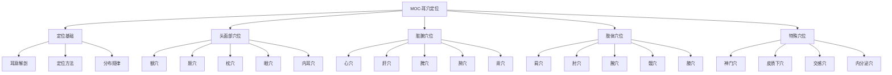

# 🗺️ MOC-耳穴定位

> 📍 **内容地图**：耳穴定位与主治功能 | 🔄 **最后更新**：2026-01-21

## 🧭 导航地图

## 📚 核心内容

### 📍 定位基础
| 笔记 | 主题 | 重要性 | 掌握程度 |
|------|------|--------|----------|
| [[耳廓解剖基础]] | 耳部解剖结构 | ⭐⭐⭐⭐⭐ | 🔥 重点掌握 |
| [[耳穴定位方法]] | 各种定位技术 | ⭐⭐⭐⭐ | 🔥 重点掌握 |
| [[耳穴分布规律]] | 分布特点规律 | ⭐⭐⭐ | 📚 理解掌握 |

### 🧠 头面部穴位
| 穴位 | 定位 | 主治 | 关联疾病 |
|------|------|------|----------|
| [[额穴]] | 对耳屏外前下方 | 头痛、头晕、失眠 | 偏头痛、紧张性头痛 |
| [[颞穴]] | 对耳屏外中部 | 偏头痛、三叉神经痛 | 偏头痛 |
| [[枕穴]] | 对耳屏外后下方 | 头痛、眩晕、癫痫 | 后头痛、眩晕症 |
| [[眼穴]] | 耳垂中央 | 近视、结膜炎 | 眼部疾病 |
| [[内耳穴]] | 耳垂后上方 | 耳鸣、耳聋、眩晕 | 耳部疾病 |

### ❤️ 脏腑穴位
| 穴位 | 定位 | 主治 | 关联疾病 |
|------|------|------|----------|
| [[心穴]] | 耳甲腔中央 | 心悸、失眠、癫狂 | 心血管疾病、失眠 |
| [[肝穴]] | 耳甲艇后下部 | 胁痛、眩晕、月经不调 | 肝胆疾病、妇科病 |
| [[脾穴]] | 耳甲腔后上部 | 食欲不振、腹胀、泄泻 | 消化系统疾病 |
| [[肺穴]] | 心穴周围 | 咳嗽、哮喘、胸闷 | 呼吸系统疾病 |
| [[肾穴]] | 对耳轮下脚下方 | 耳鸣、腰痛、遗精 | 肾脏疾病、老年病 |

### 💪 肢体穴位
| 穴位 | 定位 | 主治 | 关联疾病 |
|------|------|------|----------|
| [[肩穴]] | 耳舟末端 | 肩周炎、肩痛 | 肩部疾病 |
| [[肘穴]] | 耳舟中段 | 肘关节炎、网球肘 | 肘部疾病 |
| [[腕穴]] | 耳舟中段 | 腕关节炎、腱鞘炎 | 腕部疾病 |
| [[髋穴]] | 对耳轮上脚下缘 | 髋关节炎、股骨头坏死 | 髋部疾病 |
| [[膝穴]] | 对耳轮上脚中部 | 膝关节炎、半月板损伤 | 膝部疾病 |

### ⭐ 特殊穴位
| 穴位 | 定位 | 主治 | 重要性 |
|------|------|------|----------|
| [[神门穴]] | 三角窝后1/3上部 | 安神、止痛、戒烟 | ⭐⭐⭐⭐⭐ |
| [[皮质下穴]] | 对耳屏内侧面 | 镇静、止痛、调节 | ⭐⭐⭐⭐ |
| [[交感穴]] | 耳轮下脚末端 | 解痉、止痛、调节 | ⭐⭐⭐⭐ |
| [[内分泌穴]] | 耳甲腔屏间切迹 | 调节内分泌 | ⭐⭐⭐⭐ |

## 🎯 学习路径

### 🥇 初学者路径
1. 📖 [[耳廓解剖基础]] → 了解耳部结构
2. 📍 [[耳穴定位方法]] → 掌握定位技术
3. 🌟 [[神门穴]] → 学习重要穴位
4. ❤️ [[心穴]] → 理解脏腑穴位

### 🥈 进阶学习路径
1. 📋 [[耳穴分布规律]] → 理解分布特点
2. 🧠 [[头面部穴位汇总]] → 系统学习头面部穴位
3. ❤️ [[脏腑穴位汇总]] → 深入脏腑穴位
4. ⭐ [[特殊穴位详解]] → 掌握特殊功能穴位

### 🥉 专家级学习
1. 🔬 [[耳穴定位机制研究]] → 深入机制研究
2. 🧪 [[耳穴定位变异研究]] → 了解个体差异
3. 📊 [[耳穴定位标准化]] → 掌握标准规范
4. 🌍 [[国际耳穴定位比较]] → 国际标准对比

## 🏷️ 标签体系

### 按解剖部位分类
- `#anatomy/ear` - 耳部解剖
- `#anatomy/auricle` - 耳廓结构
- `#anatomy/tragus` - 耳屏
- `#anatomy/antitragus` - 对耳屏
- `#anatomy/concha` - 耳甲

### 按穴位功能分类
- `#function/analgesic` - 止痛穴位
- `#function/sedative` - 镇静穴位
- `#function/regulatory` - 调节穴位
- `#function/specific` - 特异性穴位

### 按系统分类
- `#system/nervous` - 神经系统相关
- `#system/cardiovascular` - 心血管系统相关
- `#system/respiratory` - 呼吸系统相关
- `#system/digestive` - 消化系统相关

## 📊 学习进度

### 📈 掌握程度统计
- 📍 **定位基础**：80% 完成
- 🧠 **头面部穴位**：70% 完成
- ❤️ **脏腑穴位**：75% 完成
- 💪 **肢体穴位**：60% 完成
- ⭐ **特殊穴位**：90% 完成

### 🎯 本周目标
- ✅ 完成[[膝穴]]详细笔记
- 🔄 正在学习[[髋穴]]定位要点
- 📋 计划学习[[踝穴]]定位技术
- 🎯 目标：掌握下肢穴位定位

## 🔍 快速查找

### 按疾病查找穴位
- 🤕 **头痛** → [[额穴]], [[颞穴]], [[枕穴]]
- 😴 **失眠** → [[神门穴]], [[心穴]], [[肾穴]]
- 🩸 **高血压** → [[降压沟]], [[心穴]], [[肝穴]]
- 🤢 **胃痛** → [[胃穴]], [[脾穴]], [[交感穴]]
- 🤰 **痛经** → [[内生殖器穴]], [[肾穴]], [[肝穴]]

### 按症状查找穴位
- 😰 **疼痛** → [[神门穴]], [[皮质下穴]]
- 😰 **焦虑** → [[神门穴]], [[心穴]], [[肝穴]]
- 😴 **疲劳** → [[肾穴]], [[脾穴]], [[心穴]]
- 🤧 **过敏** → [[内分泌穴]], [[肺穴]], [[肾穴]]

## 📖 延伸资源

### 📚 标准规范
- [[GB/T 13734-2020]] - 国家标准
- [[WHO耳穴标准]] - 国际标准
- [[耳穴定位图谱]] - 详细图谱

### 🎥 视频资源
- [[耳穴定位教学视频]] - 操作演示
- [[耳廓解剖3D动画]] - 结构展示
- [[穴位定位技巧]] - 技术要点

### 🧪 实践工具
- [[耳穴定位练习题]] - 自测练习
- [[耳穴定位卡片]] - 便携记忆卡
- [[耳穴模型使用指南]] - 模型教学

---

## 💡 学习提示

### 🎯 记忆技巧
- **形象记忆**：将耳穴分布与倒置胎儿对应
- **系统记忆**：按系统分组记忆穴位
- **对比记忆**：对比相似穴位的不同特点
- **临床记忆**：结合具体病例记忆穴位

### ⚠️ 常见错误
- **解剖位置不清** → 需加强耳部解剖学习
- **定位方法不当** → 需练习各种定位技术
- **个体差异忽视** → 需了解常见变异情况
- **标准理解偏差** → 需仔细阅读标准规范

---

> 📌 **推荐下一步**：学习 [[耳廓解剖基础]] 掌握耳部结构，或查看 [[神门穴]] 了解重要穴位详情

🔗 **相关MOC**：[[MOC-基础知识]] | [[MOC-刺激方法]] | [[MOC-临床应用]]