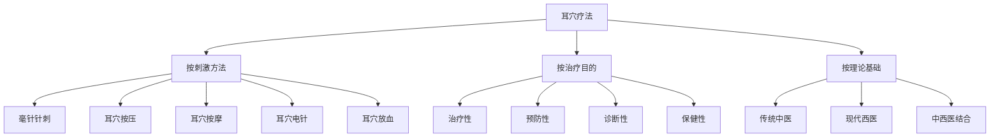
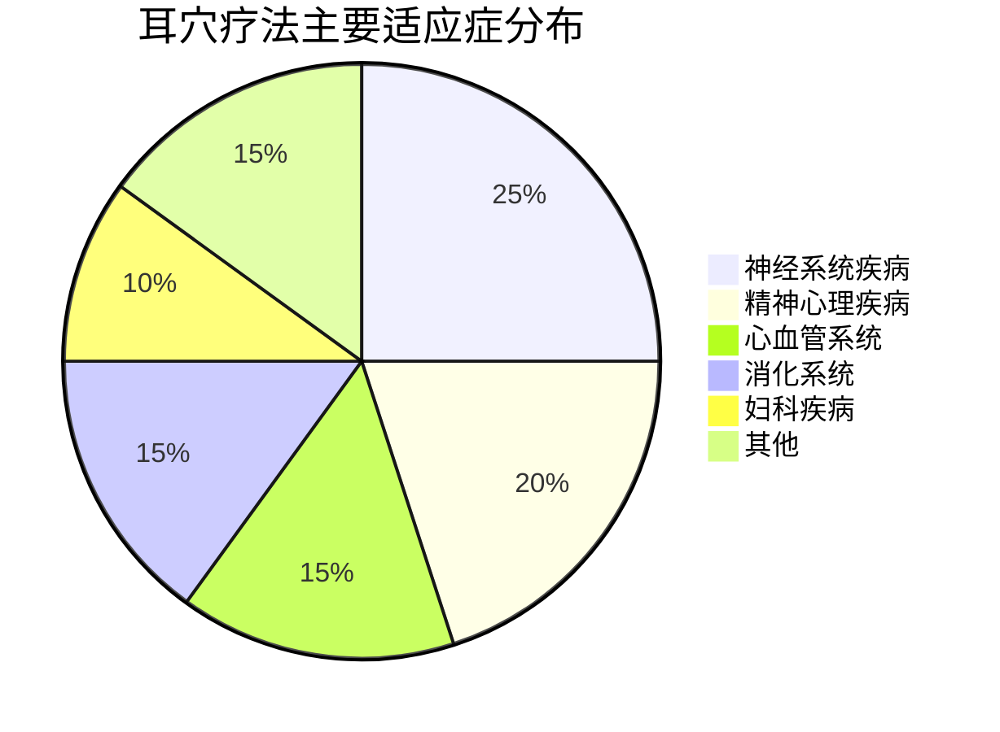

---
aliases:
tags:
  - theory
  - basics
  - auricular-therapy
type: concept
created: 2026-01-21
related_to:
---

---
tags: #theory #basics #auricular-therapy
type: concept
created: 2026-01-21
related: [[耳穴疗法历史发展]], [[耳穴理论基础]], [[耳穴解剖基础]]
---

# 🧠 耳穴疗法概述

## 📖 定义

> **耳穴疗法**（Auricular Therapy）是指在耳廓上特定反应点（耳穴）进行刺激，通过经络传导，达到防治疾病目的的一种治疗方法。

### 🔍 核心特征
- #non-invasive - 多数方法无创伤
- #safe - 安全性高，不良反应少
- #effective - 疗效确切，适应症广
- #simple - 操作简便，易于掌握

## 🏛️ 理论基础

### 🇨🇳 中医理论基础
> **"耳为宗脉之所聚"** - 《灵枢·口问》

#### 核心理论
- #meridian-theory [[经络学说]] - 十二经脉、三百六十五络汇聚于耳
- #zang-fu-theory [[脏腑理论]] - 脏腑功能在耳部的对应关系
- #qi-blood-theory [[气血理论]] - 气血运行与耳部调节
- #yin-yang-theory [[阴阳理论]] - 阴阳平衡与耳穴调节

### 🧬 现代医学基础
- #neuro-anatomy [[神经解剖]] - Arnold神经分布理论
- #reflex-theory [[反射理论]] - 耳部反射区与全身对应
- #holographic-theory [[全息理论]] - 耳廓作为全身缩影
- #endocrine-theory [[神经内分泌]] - 神经-内分泌-免疫网络调节

## 📊 分类体系

## 🌍 发展历程

### 📜 古代记载
- **《黄帝内经》** - 首次记载耳与全身联系
- **《针灸甲乙经》** - 记载耳部穴位和治疗方法
- **《针灸大成》** - 详细记载耳部穴位和主治

### 🚀 现代发展
- **1957年** - 法国Paul Nogier发现耳穴反射区
- **1970年代** - 中国系统整理耳穴图谱
- **1990年代** - 耳穴疗法标准化研究
- **2000年代** - 耳穴疗法国际化推广
- **2020年** - WHO发布耳穴国际标准

## 🎯 主要特点

### 💪 优势特点
| 特点 | 具体表现 | 临床意义 |
|------|----------|----------|
| #safety | 非侵入性，不良反应少 | 适合老年、儿童患者 |
| #effectiveness | 适应症广，疗效确切 | 多种疾病均有良效 |
| #simplicity | 操作简便，易于学习 | 便于基层推广 |
| #economy | 成本低廉，设备简单 | 减轻患者经济负担 |
| #compatibility | 可与其他疗法联合 | 提高综合治疗效果 |

### 🔄 作用机制
> 参见 [[耳穴作用机制]]

## 🏥 临床应用

### 📋 主要适应症

### 🎖️ 代表性应用
- 🧠 [[失眠症治疗]] - 有效率85-95%
- 💔 [[抑郁症治疗]] - 轻中度有效率80-90%
- 🩸 [[高血压治疗]] - 轻中度有效率70-80%
- 😮💨 [[哮喘治疗]] - 有效率75-85%
- 🤰 [[痛经治疗]] - 有效率90-95%

## ⚠️ 安全性考量

### 🚫 禁忌症
- #contraindication [[禁忌症列表]]
- 耳部皮肤感染、溃疡
- 严重出血性疾病
- 严重心脏病（不稳定期）
- 孕妇（腹部穴位）

### ⚠️ 不良反应
- #adverse-reaction [[不良反应处理]]
- 局部皮肤反应（<3%）
- 全身性反应（<0.5%）
- 严重反应（<0.05%）

## 🔗 相关概念

### 📚 核心概念
- [[耳穴]] - 耳部特定反应点
- [[耳穴定位]] - 耳穴的准确定位方法
- [[刺激方法]] - 各种刺激技术
- [[辨证论治]] - 中医辨证选穴原则

### 🧬 相关理论
- [[经络理论]] - 经络循行与耳部关系
- [[脏腑理论]] - 脏腑功能与耳穴对应
- [[全息理论]] - 全息胚理论在耳穴的应用
- [[神经反射理论]] - 现代神经生理学基础

## 📖 延伸阅读

### 📖 必读文献
1. [[GB/T 13734-2020]] - 耳穴名称与定位国家标准
2. [[WHO耳穴标准]] - 世界卫生组织耳穴国际标准
3. [[耳穴疗法学]] - 系统教材
4. [[耳穴机制研究进展]] - 最新研究综述

### 🔍 深入学习
- [[MOC-基础知识]] - 基础知识内容地图
- [[MOC-临床应用]] - 临床应用内容地图
- [[研究文献汇总]] - 重要研究文献索引

---

## 💡 核心要点

- 🎯 **定义**：耳部特定穴位刺激防治疾病的方法
- 🏛️ **理论基础**：中医经络理论 + 现代神经科学
- 🌟 **特点**：安全、有效、简便、经济
- 🏥 **应用**：适应症广，疗效确切
- ⚠️ **安全**：禁忌症明确，不良反应少

---

> 📌 **下一步**：建议继续学习 [[耳穴理论基础]] 了解深层机制，或查看 [[耳穴定位总论]] 掌握定位技术

🔄 **最后更新**：2026-01-21 | 📊 **相关链接**：{{linkCount}} | 🏷️ **标签**：{{tags}}