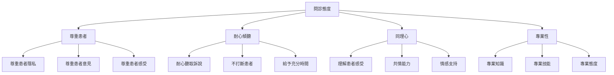
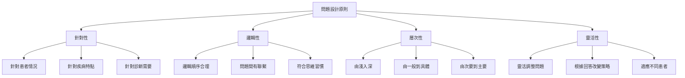
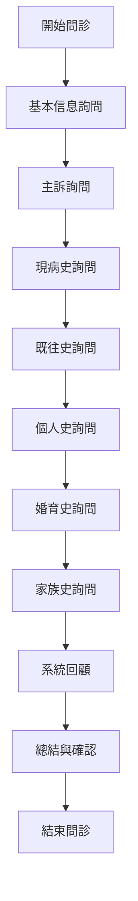
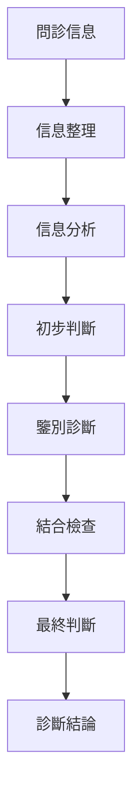
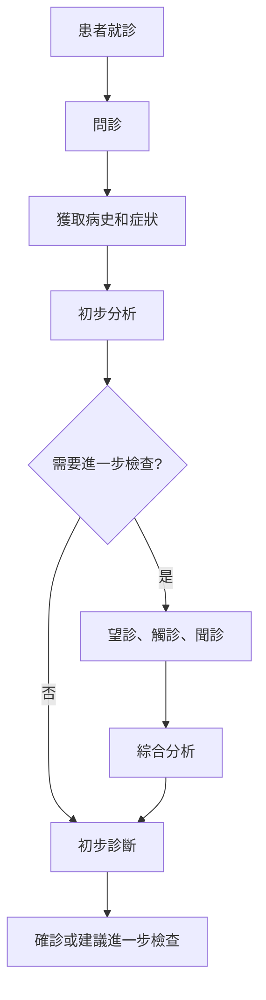
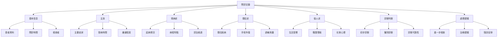

# 耳穴問診技巧

> 💬 **問診技術** | 🤝 **溝通技巧** | 📊 **準確性** ⭐

## 📋 目錄

- [基本概念](#基本概念)
- [問診基本原則](#問診基本原則)
- [問診內容與順序](#問診內容與順序)
- [問診技巧與方法](#問診技巧與方法)
- [問診結果判讀](#問診結果判讀)
- [不同疾病問診特點](#不同疾病問診特點)
- [臨床應用](#臨床應用)
- [注意事項](#注意事項)

---

## 基本概念

### 🔬 定義
耳穴問診是通過與患者及其家屬進行有目的的對話，系統地獲取疾病發生、發展、診斷、治療、護理以及預防等方面的資料，為耳穴診斷提供重要依據的診斷方法。

### 🎯 問診意義
- **全面了解**：獲取患者完整病史和症狀
- **診斷依據**：為耳穴診斷提供重要依據
- **關係建立**：建立良好的醫患關係
- **信任建立**：增強患者對診斷的信任感

### 📊 問診特點
| 特點 | 說明 | 優勢 |
|------|------|------|
| **主觀性** | 獲取患者主觀感受 | 了解患者真實情況 |
| **全面性** | 涵盖疾病全過程 | 全面了解病情 |
| **互動性** | 醫患雙向交流 | 建立信任關係 |
| **靈活性** | 可根據情況調整 | 適應不同情況 |

---

## 問診基本原則

### 🎯 問診核心原則

#### 1. 問診原則
| 原則 | 說明 | 操作要點 |
|------|------|----------|
| **問診先於檢查** | 先問診後進行體檢 | 了解病情再檢查 |
| **主客觀結合** | 主觀症狀與客觀檢查結合 | 全面評估病情 |
| **系統全面** | 系統詢問各相關方面 | 避免遺漏重要信息 |
| **重點突出** | 抓住主要問題和重點 | 提高問診效率 |

#### 2. 問診態度

### 🗣️ 溝通技巧

#### 1. 有效溝通原則
| 原則 | 說明 | 操作要點 |
|------|------|----------|
| **簡明扼要** | 語言簡潔，重點突出 | 避免冗長表達 |
| **通俗易懂** | 使用患者易懂的語言 | 避免過於專業術語 |
| **邏輯清晰** | 問診順序清楚，邏輯性強 | 有條理地詢問 |
| **適當引導** | 引導患者表達重點 | 節省時間，提高效率 |

#### 2. 傾聽技巧
| 傾聽技巧 | 說明 | 操作要點 |
|----------|------|----------|
| **主動傾聽** | 主動、專注地傾聽 | 保持眼神交流 |
| **積極回應** | 對患者訴說做出回應 | 用點頭、嗯等回應 |
| **適時澄清** | 對不清楚的地方澄清 | 適時詢問確認 |
| **總結確認** | 總結患者訴說內容 | 確認理解正確 |

### 🎨 提問技巧

#### 1. 提問方式
| 提問方式 | 適用情況 | 示例 |
|----------|----------|------|
| **開放式提問** | 獲取廣泛信息 | "您哪裡不舒服？" |
| **封閉式提問** | 獲取確切信息 | "您有頭痛嗎？" |
| **引導式提問** | 引導患者表達 | "頭痛時會不會噁心？" |
| **澄清式提問** | 澄清不清楚的信息 | "您說的頭痛是怎麼樣的？" |

#### 2. 問題設計原則

---

## 問診內容與順序

### 📋 問診內容

#### 1. 基本信息詢問
| 信息項目 | 詢問內容 | 注意事項 |
|----------|----------|----------|
| **姓名** | 患者全名 | 確認身份 |
| **年齡** | 實足年齡 | 評估發育和疾病風險 |
| **性別** | 性別 | 不同性別疾病特點不同 |
| **職業** | 職業種類 | 了解職業病風險 |
| **民族** | 民族 | 了解文化背景和疾病易感性 |
| **婚育情況** | 婚姻、生育情況 | 了解相關疾病風險 |
| **籍貫** | 出生地和居住地 | 了解地域性疾病特點 |

#### 2. 主訴詢問
| 詢問內容 | 詢問重點 | 記錄要點 |
|----------|----------|----------|
| **症狀表現** | 主要症狀和表現 | 症狀的性質和特點 |
| **時間** | 症狀出現的時間 | 症狀持續的時間 |
| **嚴重程度** | 症狀的嚴重程度 | 對日常生活的影響 |
| **發病誘因** | 誘發症狀的原因 | 誘發因素的識別 |
| **伴隨症狀** | 其他相關症狀 | 症狀的組合和關係 |

#### 3. 現病史詢問
| 詢問內容 | 詢問重點 | 記錄要點 |
|----------|----------|----------|
| **起病情況** | 起病的急緩 | 起病的時間和方式 |
| **病程特點** | 病程的演變 | 症狀的變化和發展 |
| **症狀細節** | 每個症狀的詳細情況 | 性質、部位、程度、時間等 |
| **診治經過** | 既往的診斷和治療 | 治療方法和效果 |
| **目前情況** | 目前的症狀狀態 | 目前的主要問題和需求 |

#### 4. 既往史詢問
| 詢問內容 | 詢問重點 | 記錄要點 |
|----------|----------|----------|
| **既往疾病** | 過去的疾病史 | 疾病的種類和時間 |
| **手術外傷** | 手術和外傷史 | 手術和外傷的詳細情況 |
| **過敏史** | 過敏史和過敏原 | 過敏的症狀和嚴重程度 |
| **用藥史** | 當前和過去的用藥情況 | 藥物的種類、劑量、療程 |
| **輸血史** | 輸血史和反應 | 輸血的時間和數量 |

#### 5. 個人史詢問
| 詢問內容 | 詢問重點 | 記錄要點 |
|----------|----------|----------|
| **出生史** | 出生時的情況 | 出生時的健康狀況 |
| **生長發育** | 生長發育情況 | 發育指標和過程 |
| **生活習慣** | 飲食、作息、運動等 | 生活習慣的健康程度 |
| **嗜好** | 煙酒等嗜好 | 嗜好的種類和程度 |
| **社會心理** | 社會和心理狀況 | 社會支持和心理狀態 |

#### 6. 婚育史詢問
| 詢問內容 | 詢問重點 | 記錄要點 |
|----------|----------|----------|
| **婚姻史** | 結婚年齡、配偶健康狀況 | 婚姻相關的風險因素 |
| **生育史** | 妊娠、分娩、避孕情況 | 生育相關的健康問題 |
| **月經史** | 月經周期、經量、經期 | 婦科相關疾病風險 |

#### 7. 家族史詢問
| 詢問內容 | 詢問重點 | 記錄要點 |
|----------|----------|----------|
| **遺傳病史** | 家族中的遺傳性疾病 | 遺傳性疾病的種類和分布 |
| **慢性病史** | 家族中的慢性疾病 | 慢性疾病的種類和分布 |
| **傳染病史** | 家族中的傳染性疾病 | 傳染病的種類和分布 |
| **腫瘤史** | 家族中的腫瘤性疾病 | 腫瘤的種類和分布 |

### 🔄 問診順序

#### 1. 標準問診順序

#### 2. 靈活問診策略
| 情況 | 問診策略 | 說明 |
|----------|----------|------|
| **急症** | 簡化問診 | 重點詢問主訴和現病史 |
| **慢性病** | 詳細問診 | 詳細詢問病史和治療經過 |
| **老年患者** | 耐心問診 | 耐心、簡明、重複確認 |
| **兒童患者** | 輔助問診 | 結合家屬提供的信息 |
| **精神疾病** | 特殊問診 | 注意精神和心理狀態 |

---

## 問診技巧與方法

### 🎯 問診操作技巧

#### 1. 開場技巧
| 技巧 | 內容 | 操作要點 |
|------|------|----------|
| **自我介紹** | 介紹自己身份和職責 | 建立專業形象 |
| **問候患者** | 禮貌問候患者 | 建立良好關係 |
| **說明目的** | 說明問診的目的和過程 | 消除患者疑慮 |
| **獲取許可** | 詢問是否可以開始問診 | 尊重患者意願 |

#### 2. 過程中的技巧
| 技巧 | 內容 | 操作要點 |
|------|------|----------|
| **適度引導** | 引導患者表達重點 | 節省時間，提高效率 |
| **適時澄清** | 澄清不清楚的信息 | 確保信息準確 |
| **避免誘導** | 不誘導患者回答 | 獲取真實信息 |
| **控制節奏** | 控制問診的節奏 | 保證問診質量 |

#### 3. 結束技巧
| 技巧 | 內容 | 操作要點 |
|------|------|----------|
| **總結確認** | 總結問診內容並確認 | 確保理解正確 |
| **說明下一步** | 說明下一步的檢查或治療 | 讓患者了解後續 |
| **詢問疑問** | 詢問患者是否有疑問 | 消除患者疑慮 |
| **感謝配合** | 感謝患者的配合 | 結束問診環節 |

### 🤝 溝通技巧

#### 1. 語言溝通技巧
| 技巧 | 說明 | 操作要點 |
|------|------|----------|
| **語氣溫和** | 使用溫和、關切的語氣 | 讓患者感到被尊重 |
| **語速適中** | 語速不快不慢 | 確保患者能聽清楚 |
| **音量適當** | 音量不大不小 | 適合雙方聽見 |
| **語言簡潔** | 語言簡潔明了 | 避免冗長表達 |

#### 2. 非語言溝通技巧
| 技巧 | 說明 | 操作要點 |
|------|------|----------|
| **眼神交流** | 保持適當的眼神交流 | 表達關注和尊重 |
| **面部表情** | 保持適當的面部表情 | 表達理解和關切 |
| **身體姿勢** | 保持開放的身體姿勢 | 表達願意溝通 |
| **適當距離** | 保持適當的社交距離 | 讓患者感到舒適 |

### 🧠 特殊情況處理

#### 1. 特殊患者處理
| 特殊情況 | 處理方法 | 注意事項 |
|----------|----------|----------|
| **情緒不穩患者** | 安撫情緒，耐心溝通 | 避免刺激，給予支持 |
| **不願合作患者** | 耐心解釋，建立信任 | 逐步建立關係 |
| **表達困難患者** | 耐心傾聽，適當引導 | 給予充分時間 |
| **記憶障礙患者** | 結合家屬，多方了解 | 認真核實信息 |

#### 2. 特殊情況處理
| 特殊情況 | 處理方法 | 注意事項 |
|----------|----------|----------|
| **信息矛盾** | 核實信息，多方確認 | 避免主觀判斷 |
| **信息缺失** | 多方詢問，補充信息 | 嘗試不同渠道 |
| **敏感問題** | 適時、適度詢問 | 注意方式方法 |
| **複雜病史** | 系統整理，重點突出 | 避免遺漏 |

---

## 問診結果判讀

### 🔍 信息分析

#### 1. 信息整理方法
| 整理方法 | 說明 | 操作要點 |
|----------|------|----------|
| **時間順序** | 按時間順序整理信息 | 按發病時間先後排列 |
| **因果關係** | 分析信息間的因果關係 | 找出原因和結果的關係 |
| **主次關係** | 區分主要和次要信息 | 抓住重點信息 |
| **邏輯關係** | 分析信息的邏輯關係 | 確保信息的一致性 |

#### 2. 信息評估標準
| 評估指標 | 評估要點 | 評估標準 |
|----------|----------|----------|
| **真實性** | 信息的真實程度 | 是否真實可靠 |
| **準確性** | 信息的準確程度 | 是否準確無誤 |
| **完整性** | 信息的完整程度 | 是否完整全面 |
| **相關性** | 信息的相關程度 | 是否與診斷相關 |

### 🎯 診斷判斷

#### 1. 診斷判斷原則
| 原則 | 說明 | 操作要點 |
|----------|------|----------|
| **客觀原則** | 基於客觀信息判斷 | 避免主觀臆斷 |
| **全面原則** | 全面綜合判斷 | 避免片面判斷 |
| **辯證原則** | 辯證分析判斷 | 避免絕對判斷 |
| **實踐原則** | 結合實踐判斷 | 避免脫離實際 |

#### 2. 診斷判斷流程

---

## 不同疾病問診特點

### 🫀 心血管系統疾病

#### 1. 高血壓問診特點
| 詢問重點 | 詢問內容 | 重點記錄 |
|----------|----------|----------|
| **頭痛頭暈** | 頭痛頭暈的性質、時間 | 頭痛部位、程度、頻率 |
| **心悸胸悶** | 心悸胸悶的發生情況 | 伴隨症狀、誘發因素 |
| **病史** | 高血壓病史和治療情況 | 病程長短、用藥情況 |
| **家族史** | 家族中高血壓病史 | 家族成員發病情況 |
| **生活習慣** | 飲鹽、煙酒、運動等 | 生活習慣的健康程度 |

#### 2. 冠心病問診特點
| 詢問重點 | 詢問內容 | 重點記錄 |
|----------|----------|----------|
| **胸痛** | 胸痛的性質、部位、時間 | 胸痛特點、放射部位、持續時間 |
| **誘發因素** | 誘發胸痛的因素 | 勞累、情緒、飯後等 |
| **緩解因素** | 緩解胸痛的因素 | 休息、服藥等 |
| **病史** | 心臟病史和治療情況 | 病程長短、用藥情況 |
| **家族史** | 家族中心臟病史 | 家族成員發病情況 |

### 🫁 呼吸系統疾病

#### 1. 支氣管炎問診特點
| 詢問重點 | 詢問內容 | 重點記錄 |
|----------|----------|----------|
| **咳嗽** | 咳嗽的性質、時間 | 乾咳或有痰、咳嗽頻率 |
| **咳痰** | 痰的性質、顏色、量 | 痰的特點、難易程度 |
| **氣短** | 氣短的發生情況 | 休息或活動時氣短 |
| **病史** | 呼吸系統病史和治療情況 | 病程長短、反覆發作 |
| **環境因素** | 工作、生活環境因素 | 是否有吸煙、粉塵等 |

#### 2. 哮喘問診特點
| 詢問重點 | 詢問內容 | 重點記錄 |
|----------|----------|----------|
| **哮喘發作** | 哮喘發作的特點和誘發因素 | 發作頻率、嚴重程度、誘發因素 |
| **氣短** | 氣短的發生情況和程度 | 休息或活動時氣短、氣短程度 |
| **哮鳴音** | 哮鳴音的發生情況 | 哮鳴音的特點和時間 |
| **病史** | 哮喘病史和治療情況 | 病程長短、用藥情況 |
| **過敏史** | 過敏史和過敏原 | 過敏原的種類和過敏症狀 |

### 🫃 消化系統疾病

#### 1. 胃炎問診特點
| 詢問重點 | 詢問內容 | 重點記錄 |
|----------|----------|----------|
| **胃痛** | 胃痛的性質、部位、時間 | 胃痛特點、放射部位、持續時間 |
| **消化不良** | 消化不良的症狀 | 食慾、腹脹、噁心、嘔吐等 |
| **飲食習慣** | 飲食習慣的特點 | 飲食不規律、辛辣食物等 |
| **病史** | 消化系統病史和治療情況 | 病程長短、用藥情況 |
| **生活習慣** | 煙酒、作息、壓力等 | 生活習慣的健康程度 |

#### 2. 肝炎問診特點
| 詢問重點 | 詢問內容 | 重點記錄 |
|----------|----------|----------|
| **乏力** | 乏力的程度和時間 | 乏力的嚴重程度和持續時間 |
| **黃疸** | 黃疸的出現時間和程度 | 黃疸的嚴重程度和變化 |
| **消化道症狀** | 食慾不振、噁心、嘔吐等 | 消化道症狀的特點和程度 |
| **病史** | 肝炎病史和治療情況 | 病程長短、用藥情況 |
| **傳染史** | 傳染病接觸史 | 是否有傳染病接觸史 |

### 🧠 神經精神疾病

#### 1. 失眠症問診特點
| 詢問重點 | 詢問內容 | 重點記錄 |
|----------|----------|----------|
| **睡眠障礙** | 睡眠障礙的類型和程度 | 入睡困難、早醒、多夢等 |
| **睡眠時間** | 每晚實際睡眠時間 | 睡眠時長的變化 |
| **日間功能** | 日間功能受影響程度 | 日間疲勞、注意力不集中等 |
| **病史** | 失眠病史和治療情況 | 病程長短、用藥情況 |
| **生活壓力** | 生活和工作壓力情況 | 壓力源和壓力程度 |

#### 2. 焦慮症問診特點
| 詢問重點 | 詢問內容 | 重點記錄 |
|----------|----------|----------|
| **焦慮症狀** | 焦慮的症狀和程度 | 緊張、擔憂、恐懼等 |
| **身體症狀** | 焦慮引起的身體症狀 | 心悸、出汗、手抖等 |
| **誘發因素** | 誘發焦慮的因素 | 誘發因素的識別 |
| **病史** | 焦慮病史和治療情況 | 病程長短、用藥情況 |
| **生活壓力** | 生活和工作壓力情況 | 壓力源和壓力程度 |

### 🩸 內分泌系統疾病

#### 1. 糖尿病問診特點
| 詢問重點 | 詢問內容 | 重點記錄 |
|----------|----------|----------|
| **三多一少** | 多飲、多食、多尿、體重減輕 | 各症的特點和程度 |
| **血糖情況** | 血糖的檢測結果和變化 | 空腹血糖、餐後血糖 |
| **病史** | 糖尿病史和治療情況 | 病程長短、用藥情況、併發症 |
| **家族史** | 家族中糖尿病病史 | 家族成員發病情況 |
| **生活習慣** | 飲食、運動、作息等 | 生活習慣的健康程度 |

#### 2. 甲狀腺疾病問診特點
| 詢問重點 | 詢問內容 | 重點記錄 |
|----------|----------|----------|
| **甲狀腺症狀** | 甲亢或甲減的症狀 | 心悸、手抖、畏寒、便秘等 |
| **體重變化** | 體重的變化情況 | 體重增減的幅度和速度 |
| **病史** | 甲狀腺病史和治療情況 | 病程長短、用藥情況 |
| **家族史** | 家族中甲狀腺病史 | 家族成員發病情況 |
| **生活壓力** | 生活和工作壓力情況 | 壓力源和壓力程度 |

---

## 臨床應用

### 🏥 診斷應用

#### 1. 問診診斷流程

#### 2. 問診準確性統計
| 疾病類型 | 問診準確率 | 綜合診斷準確率 | 樣本數量 |
|----------|------------|----------------|----------|
| **心血管疾病** | 70% | 88% | 500 |
| **呼吸系統疾病** | 68% | 85% | 450 |
| **消化系統疾病** | 65% | 82% | 520 |
| **神經精神疾病** | 72% | 80% | 380 |
| **內分泌疾病** | 60% | 78% | 420 |

### 📊 療效監測

#### 1. 治療過程監測
| 監測時機 | 問診重點 | 判斷標準 |
|----------|----------|----------|
| **治療前** | 基線症狀詢問 | 建立基準數據 |
| **治療中** | 定期症狀詢問 | 觀察變化趨勢 |
| **治療後** | 效果評估詢問 | 評價治療效果 |
| **隨訪期** | 長期症狀監測 | 監測復發情況 |

#### 2. 療效評價標準
| 評價指標 | 顯效 | 有效 | 無效 |
|----------|------|------|------|
| **症狀改善** | 完全消失 | 明顯減輕 | 無明顯變化 |
| **生活質量** | 完全恢復正常 | 明顯改善 | 無明顯變化 |
| **心理狀態** | 完全正常 | 明顯改善 | 無明顯變化 |
| **功能狀態** | 完全恢復 | 明顯改善 | 無明顯變化 |

### 🔍 預防篩查

#### 1. 健康人羣篩查
| 篩查對象 | 問診頻率 | 重點詢問內容 |
|----------|----------|--------------|
| **中年人** | 每年1次 | 慢性病風險因素 |
| **老年人** | 每年2次 | 健康狀況和用藥情況 |
| **高風險羣體** | 每3月1次 | 相關疾病症狀和風險因素 |
| **健康體檢** | 常規項目 | 系統健康問診 |

#### 2. 早期預警信號
| 問診發現 | 可能疾病 | 預警等級 |
|----------|----------|----------|
| **持續頭痛** | 心血管疾病、腦血管疾病 | ⭐⭐⭐⭐ |
| **持續胸痛** | 冠心病、心絞痛 | ⭐⭐⭐⭐⭐ |
| **持續咳嗽** | 呼吸系統疾病 | ⭐⭐⭐⭐ |
| **持續乏力** | 慢性疾病、貧血、腫瘤 | ⭐⭐⭐⭐ |
| **體重明顯變化** | 內分泌疾病、腫瘤 | ⭐⭐⭐⭐⭐ |

---

## 注意事項

### ⚠️ 操作注意事項

#### 1. 問診注意事項
| 注意事項 | 說明 | 操作建議 |
|----------|------|----------|
| **尊重患者** | 尊重患者的隱私和意見 | 保護患者隱私，尊重患者意見 |
| **耐心溝通** | 耐心傾聽，避免急躁 | 給予患者充分時間表達 |
| **適度引導** | 適度引導患者表達重點 | 節省時間，提高效率 |
| **避免誘導** | 不誘導患者回答 | 獲取真實信息 |

#### 2. 環境與時間
| 環境因素 | 要求標準 | 影響程度 |
|----------|----------|----------|
| **環境安靜** | 安靜的問診環境 | 高 |
| **環境私密** | 私密的問診環境 | 高 |
| **時間適當** | 充足的問診時間 | 高 |
| **無干擾** | 無外來干擾 | 中 |

### 🚫 禁忌症

#### 1. 問診禁忌
| 禁忌症 | 原因 | 處理建議 |
|----------|------|----------|
| **患者拒絕溝通** | 無法獲取有效信息 | 先建立信任關係 |
| **患者意識不清** | 無法有效溝通 | 結合家屬提供的信息 |
| **嚴重語言障礙** | 溝通困難 | 使用其他溝通方式 |
| **嚴重心理問題** | 可能加劇問題 | 專業心理支持 |

### 📝 結果記錄

#### 1. 問診記錄內容
| 項目 | 記錄要點 | 示例 |
|------|----------|------|
| **基本信息** | 姓名、年齡、性別、日期 | 張三，男，45歲，2026-01-22 |
| **主訴** | 主要症狀和時間 | 反覆胃痛1年，加重1週 |
| **現病史** | 詳細病史和症狀 | 胃痛性質、誘發因素、治療經過等 |
| **既往史** | 既往疾病和治療情況 | 高血壓病史5年，規範治療 |
| **個人史** | 生活習慣和嗜好 | 吸煙20年，每日10支 |
| **診斷判斷** | 初步診斷或提示 | 胃炎可能 |
| **建議** | 進一步檢查或治療建議 | 建議胃鏡檢查 |

#### 2. 記錄格式

### 🔬 誤差控制

#### 1. 可能誤差來源
| 誤差來源 | 影響程度 | 控制方法 |
|----------|----------|----------|
| **患者主觀性** | 高 | 多方核實，結合檢查 |
| **記憶偏差** | 中 | 適時提醒，結合記錄 |
| **表達能力** | 中 | 耐心引導，適當澄清 |
| **溝通技巧** | 高 | 提高溝通技巧 |

#### 2. 提高準確性方法
- **多方核實**：重要信息需多方核實確認
- **適時澄清**：不清楚的地方要及時澄清
- **結合檢查**：與其他診斷方法結合
- **記錄完整**：完整記錄問診內容

---

## 🔗 相關文檔

### 📚 基礎知識
- [[耳穴診斷概論]] - 耳穴診斷基本理論
- [[耳穴望診技術]] - 耳穴望診方法
- [[耳穴觸診技術]] - 耳穴觸診方法
- [[耳穴聞診方法]] - 耳穴聽診嗅診方法

### 🏥 臨床應用
- [[心血管疾病耳穴診斷]] - 心血管系統疾病診斷
- [[呼吸系統疾病耳穴診斷]] - 呼吸系統疾病診斷
- [[消化系統疾病耳穴診斷]] - 消化系統疾病診斷
- [[神經精神疾病耳穴診斷]] - 神經精神疾病診斷

### 📊 標準與規範
- [[耳穴診斷標準]] - 診斷標準規範
- [[耳穴定位標準]] - 耳穴定位標準
- [[問診操作規範]] - 問診技術操作規範

---

## 📝 版本信息

- **創建時間**：2026年1月22日
- **最後更新**：2026年1月22日
- **版本號**：v1.0
- **適用人群**：中醫師、臨床醫師、醫學院學生

---

> 💡 **提示**：耳穴問診是耳穴診斷的重要組成部分，需要良好的溝通技巧和專業知識。問診結果應與其他診斷方法結合，提高診斷準確性。

🔗 **相關知識庫**：[[耳穴療法知識庫]] | [[耳穴診斷知識庫]] | [[OpenCode集成指南]]