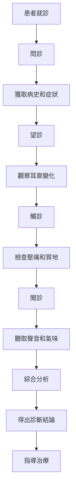

# 心血管疾病耳穴診斷

> 🫀 **心血管系統** | 🩺 **耳穴診斷** | 📊 **準確性** ⭐⭐⭐⭐

## 📋 目錄

- [基本概念](#基本概念)
- [高血壓耳穴診斷](#高血壓耳穴診斷)
- [冠心病耳穴診斷](#冠心病耳穴診斷)
- [心律失常耳穴診斷](#心律失常耳穴診斷)
- [心力衰竭耳穴診斷](#心力衰竭耳穴診斷)
- [心肌炎耳穴診斷](#心肌炎耳穴診斷)
- [心臟瓣膜病耳穴診斷](#心臟瓣膜病耳穴診斷)
- [臨床應用案例](#臨床應用案例)
- [注意事項](#注意事項)

---

## 基本概念

### 🔬 心血管疾病與耳穴關係

#### 1. 中醫理論基礎
| 理論 | 說明 | 臨床意義 |
|------|------|----------|
| **心開竅於耳** | 心與耳有密切關聯 | 心病可反映於耳 |
| **經絡聯繫** | 手少陰心經絡通於耳 | 經絡傳導病邪 |
| **氣血運行** | 心主血脈，耳部血運 | 氣血運行失常影響耳 |
| **神經反射** | 迷走神經分布於耳 | 神經反射病變信息 |

#### 2. 現代醫學理論
| 理論 | 說明 | 臨床意義 |
|------|------|----------|
| **神經分布** | 耳廓有豐富的神經末梢 | 可反映心血管狀態 |
| **血管分布** | 耳廓有豐富的血管網 | 可反映血液循環狀態 |
| **反射機制** | 耳穴相應器官存在反射關係 | 心血管病變引起耳穴反應 |
| **生化改變** | 心血管疾病引起全身生化改變 | 可在耳穴表現出來 |

### 🎯 診斷原則

#### 1. 診斷原則
| 原則 | 說明 | 操作要點 |
|------|------|----------|
| **四診合參** | 望聞問切四診結合 | 綜合判斷病情 |
| **左右對比** | 兩側耳廓對比檢查 | 發現差異變化 |
| **動態觀察** | 觀察治療過程中變化 | 評價治療效果 |
| **綜合評估** | 結合其他檢查結果 | 提高診斷準確性 |

#### 2. 診斷流程

---

## 高血壓耳穴診斷

### 📊 病理基礎

#### 1. 高血壓與耳穴關係
| 關係類型 | 機制 | 耳穴表現 |
|----------|------|----------|
| **血壓升高** | 血管張力增加 | 降壓溝壓痛 |
| **交感神經興奮** | 自主神經功能紊亂 | 交感穴壓痛 |
| **腎虛** | 腎精虧虛，水液代謝失常 | 腎穴壓痛 |
| **肝陽上亢** | 肝氣鬱結化火 | 肝穴壓痛 |

#### 2. 耳穴變化機理
| 變化類型 | 機理 | 時間特點 |
|----------|------|----------|
| **顏色變化** | 血管擴張或收縮 | 急性期明顯 |
| **質地變化** | 組織增生或萎縮 | 慢性期明顯 |
| **壓痛變化** | 感覺神經敏感性增加 | 持續存在 |
| **溫度變化** | 局部血流變化 | 急性期明顯 |

### 🔍 診斷要點

#### 1. 望診特點
| 耳穴部位 | 正常表現 | 高血壓表現 | 診斷價值 |
|----------|----------|------------|----------|
| **降壓溝** | 無明顯變化 | 呈深紅色，血管怒張 | ⭐⭐⭐⭐⭐ |
| **心穴** | 淡紅色，光澤正常 | 暗紅色，光澤減退 | ⭐⭐⭐⭐ |
| **肝穴** | 淡紅色，光澤正常 | 暗紅色，光澤減退 | ⭐⭐⭐ |
| **腎穴** | 淡紅色，光澤正常 | 暗淡色，光澤減退 | ⭐⭐⭐ |

#### 2. 觸診特點
| 耳穴部位 | 正常觸診 | 高血壓觸診 | 診斷價值 |
|----------|----------|------------|----------|
| **降壓溝** | 無明顯壓痛 | 明顯壓痛3-4分 | ⭐⭐⭐⭐⭐ |
| **心穴** | 輕微壓痛或無 | 中度壓痛2-3分 | ⭐⭐⭐⭐ |
| **交感穴** | 輕微壓痛或無 | 中度壓痛2-3分 | ⭐⭐⭐⭐ |
| **腎穴** | 輕微壓痛或無 | 輕度壓痛1-2分 | ⭐⭐⭐ |

#### 3. 聽診特點
| 聽診內容 | 正常聲音 | 高血壓聲音 | 診斷價值 |
|----------|----------|------------|----------|
| **心聲** | 60-100次/分，規律 | 心音亢進，規律 | ⭐⭐⭐ |
| **血流聲** | 輕微，連續 | 血流聲增強 | ⭐⭐ |
| **肌肉音** | 輕微顫動 | 肌肉緊張音增強 | ⭐⭐ |

### 📈 診斷標準

#### 1. 診斷標準
| 標準 | 具體要求 | 權重 |
|------|----------|------|
| **降壓溫壓痛** | 壓痛≥3分 | 30% |
| **心穴壓痛** | 壓痛≥2分 | 25% |
| **交感穴壓痛** | 壓痛≥2分 | 20% |
| **耳廓顏色** | 暗紅色或深紅色 | 15% |
| **聽診異常** | 心音亢進或血流聲增強 | 10% |

#### 2. 嚴重程度分級
| 分級 | 壓痛分數 | 顏色變化 | 聽診變化 | 血壓水平 |
|------|----------|----------|----------|----------|
| **輕度** | 1-2分 | 輕微暗紅 | 輕微變化 | 140-159/90-99 |
| **中度** | 2-3分 | 明顯暗紅 | 明顯變化 | 160-179/100-109 |
| **重度** | 3-4分 | 深紅色 | 明顯變化 | ≥180/≥110 |
| **危重** | 4-5分 | 紺色或蒼白 | 嚴重變化 | 伴有器官損害 |

---

## 冠心病耳穴診斷

### 📊 病理基礎

#### 1. 冠心病與耳穴關係
| 關係類型 | 機制 | 耳穴表現 |
|----------|------|----------|
| **心肌缺血** | 心肌供血不足 | 心穴壓痛、顏色變化 |
| **神經反射** | 心臟病變引起神經反射 | 皮質下、交感穴壓痛 |
| **自主神經紊亂** | 交感神經興奮 | 交感穴壓痛 |
| **脂質代謝異常** | 血脂異常影響血管 | 內分泌穴壓痛 |

#### 2. 耳穴變化機理
| 變化類型 | 機理 | 時間特點 |
|----------|------|----------|
| **顏色變化** | 心肌缺血引起局部血流改變 | 發作期明顯 |
| **質地變化** | 心肌病變引起組織改變 | 慢性期明顯 |
| **壓痛變化** | 心肌缺血引起神經敏感性增加 | 發作期明顯 |
| **溫度變化** | 心肌缺血引起局部血流變化 | 發作期明顯 |

### 🔍 診斷要點

#### 1. 望診特點
| 耳穴部位 | 正常表現 | 冠心病表現 | 診斷價值 |
|----------|----------|------------|----------|
| **心穴** | 淡紅色，光澤正常 | 暗紅色，光澤減退 | ⭐⭐⭐⭐⭐ |
| **皮質下** | 淡紅色，光澤正常 | 暗紅色，可見小結節 | ⭐⭐⭐⭐ |
| **交感穴** | 淡紅色，光澤正常 | 暗紅色，光澤減退 | ⭐⭐⭐⭐ |
| **胸椎** | 淡紅色，光澤正常 | 暗紅色，光澤減退 | ⭐⭐⭐ |

#### 2. 觸診特點
| 耳穴部位 | 正常觸診 | 冠心病觸診 | 診斷價值 |
|----------|----------|------------|----------|
| **心穴** | 輕微壓痛或無 | 明顯壓痛3-4分 | ⭐⭐⭐⭐⭐ |
| **皮質下** | 輕微壓痛或無 | 中度壓痛2-3分 | ⭐⭐⭐⭐ |
| **交感穴** | 輕微壓痛或無 | 中度壓痛2-3分 | ⭐⭐⭐⭐ |
| **胸椎** | 輕微壓痛或無 | 輕度壓痛1-2分 | ⭐⭐⭐ |

#### 3. 聽診特點
| 聽診內容 | 正常聲音 | 冠心病聲音 | 診斷價值 |
|----------|----------|------------|----------|
| **心聲** | 60-100次/分，規律 | 心律不齊，心音減弱 | ⭐⭐⭐⭐ |
| **心音** | S1、S2清楚 | 可有雜音 | ⭐⭐⭐ |
| **呼吸音** | 正常 | 患側呼吸音減弱 | ⭐⭐ |

### 📈 診斷標準

#### 1. 診斷標準
| 標準 | 具體要求 | 權重 |
|------|----------|------|
| **心穴壓痛** | 壓痛≥3分 | 35% |
| **皮質下壓痛** | 壓痛≥2分 | 20% |
| **交感穴壓痛** | 壓痛≥2分 | 20% |
| **耳廓顏色** | 暗紅色 | 15% |
| **聽診異常** | 心律不齊或心音異常 | 10% |

#### 2. 嚴重程度分級
| 分級 | 壓痛分數 | 顏色變化 | 聽診變化 | 臨床表現 |
|------|----------|----------|----------|----------|
| **輕度** | 2-3分 | 輕微暗紅 | 輕微變化 | 勞累後胸悶 |
| **中度** | 3-4分 | 明顯暗紅 | 明顯變化 | 活動後胸痛 |
| **重度** | 4-5分 | 深紅色 | 嚴重變化 | 休息時胸痛 |
| **危重** | 5分 | 紺色或蒼白 | 嚴重變化 | 持續胸痛，伴出汗 |

---

## 心律失常耳穴診斷

### 📊 病理基礎

#### 1. 心律失常與耳穴關係
| 關係類型 | 機制 | 耳穴表現 |
|----------|------|----------|
| **心律不齊** | 心臟節律異常 | 心穴壓痛、聽診異常 |
| **自主神經紊亂** | 交感或副交感神經功能異常 | 交感穴或迷走神經壓痛 |
| **心肌病變** | 心肌病變引起電生理異常 | 心穴壓痛、質地變化 |
| **電解質紊亂** | 電解質異常影響心臟 | 內分泌穴壓痛 |

#### 2. 耳穴變化機理
| 變化類型 | 機理 | 時間特點 |
|----------|------|----------|
| **顏色變化** | 心律失常引起局部血流改變 | 發作期明顯 |
| **質地變化** | 心肌病變引起組織改變 | 慢性期明顯 |
| **壓痛變化** | 心律失常引起神經敏感性增加 | 發作期明顯 |
| **聽診變化** | 心律失常直接影響心聲 | 持續存在 |

### 🔍 診斷要點

#### 1. 望診特點
| 耳穴部位 | 正常表現 | 心律失常表現 | 診斷價值 |
|----------|----------|----------------|----------|
| **心穴** | 淡紅色，光澤正常 | 暗紅色，光澤減退 | ⭐⭐⭐⭐⭐ |
| **神門** | 淡紅色，光澤正常 | 暗紅色，光澤減退 | ⭐⭐⭐⭐ |
| **交感穴** | 淡紅色，光澤正常 | 暗紅色，光澤減退 | ⭐⭐⭐⭐ |
| **內分泌穴** | 淡紅色，光澤正常 | 暗紅色，光澤減退 | ⭐⭐⭐ |

#### 2. 觸診特點
| 耳穴部位 | 正常觸診 | 心律失常觸診 | 診斷價值 |
|----------|----------|----------------|----------|
| **心穴** | 輕微壓痛或無 | 明顯壓痛3-4分 | ⭐⭐⭐⭐⭐ |
| **神門** | 輕微壓痛或無 | 中度壓痛2-3分 | ⭐⭐⭐⭐ |
| **交感穴** | 輕微壓痛或無 | 中度壓痛2-3分 | ⭐⭐⭐⭐ |
| **內分泌穴** | 輕微壓痛或無 | 輕度壓痛1-2分 | ⭐⭐⭐ |

#### 3. 聽診特點
| 聽診內容 | 正常聲音 | 心律失常聲音 | 診斷價值 |
|----------|----------|----------------|----------|
| **心聲** | 60-100次/分，規律 | 心律不齊，節律異常 | ⭐⭐⭐⭐⭐ |
| **心音** | S1、S2清楚 | 心音強弱不等 | ⭐⭐⭐⭐ |
| **額外音** | 無 | 可有額外心音 | ⭐⭐⭐ |

### 📈 診斷標準

#### 1. 診斷標準
| 標準 | 具體要求 | 權重 |
|------|----------|------|
| **心穴壓痛** | 壓痛≥3分 | 30% |
| **神門壓痛** | 壓痛≥2分 | 25% |
| **交感穴壓痛** | 壓痛≥2分 | 20% |
| **聽診異常** | 心律不齊 | 25% |

#### 2. 類型鑒別
| 類型 | 心率特點 | 耳穴特點 | 聽診特點 |
|------|----------|----------|----------|
| **竇性心動過速** | >100次/分 | 心穴、交感穴壓痛 | 心音亢進，規律 |
| **竇性心動過緩** | <60次/分 | 心穴、迷走神經壓痛 | 心音減弱，規律 |
| **心房纖顫** | 絕對不齊 | 心穴、神門明顯壓痛 | 心音強弱不等，節律絕對不齊 |
| **早搏** | 期前收縮 | 心穴、神門壓痛 | 可聽到期前收縮 |

---

## 心力衰竭耳穴診斷

### 📊 病理基礎

#### 1. 心力衰竭與耳穴關係
| 關係類型 | 機制 | 耳穴表現 |
|----------|------|----------|
| **心功能減退** | 心臟泵功能下降 | 心穴壓痛、質地變化 |
| **肺淤血** | 左心衰竭引起肺淤血 | 肺穴壓痛、顏色變化 |
| **體循環淤血** | 右心衰竭引起體循環淤血 | 肝穴、腎穴壓痛 |
| **水鈉瀦留** | 心衰引起水鈉瀦留 | 腎穴、三焦穴壓痛 |

#### 2. 耳穴變化機理
| 變化類型 | 機制 | 時間特點 |
|----------|------|----------|
| **顏色變化** | 心衰引起全身血流改變 | 持續存在 |
| **質地變化** | 長期心衰引起組織改變 | 慢性期明顯 |
| **壓痛變化** | 心衰引起神經敏感性增加 | 持續存在 |
| **腫脹變化** | 心衰引起水腫 | 明顯腫脹 |

### 🔍 診斷要點

#### 1. 望診特點
| 耳穴部位 | 正常表現 | 心力衰竭表現 | 診斷價值 |
|----------|----------|--------------|----------|
| **心穴** | 淡紅色，光澤正常 | 暗淡色，光澤減退，可見腫脹 | ⭐⭐⭐⭐⭐ |
| **肺穴** | 淡紅色，光澤正常 | 暗紅色，光澤減退 | ⭐⭐⭐⭐ |
| **肝穴** | 淡紅色，光澤正常 | 暗紅色，光澤減退 | ⭐⭐⭐⭐ |
| **腎穴** | 淡紅色，光澤正常 | 暗淡色，光澤減退 | ⭐⭐⭐⭐ |

#### 2. 觸診特點
| 耳穴部位 | 正常觸診 | 心力衰竭觸診 | 診斷價值 |
|----------|----------|--------------|----------|
| **心穴** | 輕微壓痛或無 | 明顯壓痛3-4分，質地軟 | ⭐⭐⭐⭐⭐ |
| **肺穴** | 輕微壓痛或無 | 中度壓痛2-3分 | ⭐⭐⭐⭐ |
| **肝穴** | 輕微壓痛或無 | 中度壓痛2-3分 | ⭐⭐⭐⭐ |
| **腎穴** | 輕微壓痛或無 | 中度壓痛2-3分 | ⭐⭐⭐⭐ |

#### 3. 聽診特點
| 聽診內容 | 正常聲音 | 心力衰竭聲音 | 診斷價值 |
|----------|----------|--------------|----------|
| **心聲** | 60-100次/分，規律 | 心音減弱，節律可正常或異常 | ⭐⭐⭐⭐⭐ |
| **心音** | S1、S2清楚 | S1、S2減弱 | ⭐⭐⭐⭐ |
| **呼吸音** | 正常 | 肺底可聞及濕羅音 | ⭐⭐⭐⭐ |

### 📈 診斷標準

#### 1. 診斷標準
| 標準 | 具體要求 | 權重 |
|------|----------|------|
| **心穴壓痛** | 壓痛≥3分，質地軟 | 30% |
| **肺穴壓痛** | 壓痛≥2分 | 25% |
| **肝穴壓痛** | 壓痛≥2分 | 20% |
| **腎穴壓痛** | 壓痛≥2分 | 15% |
| **聽診異常** | 心音減弱，肺底濕羅音 | 10% |

#### 2. 嚴重程度分級
| 分級 | 壓痛分數 | 質地變化 | 聽診變化 | 心功能分級 |
|------|----------|----------|----------|------------|
| **輕度** | 2-3分 | 輕微軟 | 輕微變化 | I-II級 |
| **中度** | 3-4分 | 明顯軟 | 明顯變化 | III級 |
| **重度** | 4-5分 | 明顯軟，可凹陷 | 嚴重變化 | IV級 |
| **危重** | 5分 | 明顯軟，凹陷明顯 | 嚴重變化 | IV級，伴休克 |

---

## 心肌炎耳穴診斷

### 📊 病理基礎

#### 1. 心肌炎與耳穴關係
| 關係類型 | 機制 | 耳穴表現 |
|----------|------|----------|
| **心肌炎症** | 心肌細胞炎症損傷 | 心穴壓痛、顏色變化 |
| **病毒感染** | 病毒感染引起心肌炎 | 內分泌穴、免疫穴位壓痛 |
| **免疫反應** | 免疫反應引起心肌損傷 | 內分泌穴、脾穴壓痛 |
| **全身中毒** | 全身中毒症狀 | 內分泌穴、胃穴壓痛 |

#### 2. 耳穴變化機理
| 變化類型 | 機理 | 時間特點 |
|----------|------|----------|
| **顏色變化** | 炎症引起局部血流改變 | 急性期明顯 |
| **質地變化** | 炎症引起組織改變 | 急性期明顯 |
| **壓痛變化** | 炎症引起神經敏感性增加 | 急性期明顯 |
| **溫度變化** | 炎症引起局部發熱 | 急性期明顯 |

### 🔍 診斷要點

#### 1. 望診特點
| 耳穴部位 | 正常表現 | 心肌炎表現 | 診斷價值 |
|----------|----------|------------|----------|
| **心穴** | 淡紅色，光澤正常 | 紅腫，光澤增強 | ⭐⭐⭐⭐⭐ |
| **內分泌穴** | 淡紅色，光澤正常 | 紅色，光澤增強 | ⭐⭐⭐⭐ |
| **脾穴** | 淡紅色，光澤正常 | 紅色，光澤增強 | ⭐⭐⭐ |
| **免疫穴位** | 淡紅色，光澤正常 | 紅色，光澤增強 | ⭐⭐⭐ |

#### 2. 觸診特點
| 耳穴部位 | 正常觸診 | 心肌炎觸診 | 診斷價值 |
|----------|----------|------------|----------|
| **心穴** | 輕微壓痛或無 | 明顯壓痛3-4分，質地軟 | ⭐⭐⭐⭐⭐ |
| **內分泌穴** | 輕微壓痛或無 | 中度壓痛2-3分 | ⭐⭐⭐⭐ |
| **脾穴** | 輕微壓痛或無 | 輕度壓痛1-2分 | ⭐⭐⭐ |
| **免疫穴位** | 輕微壓痛或無 | 輕度壓痛1-2分 | ⭐⭐⭐ |

#### 3. 聽診特點
| 聽診內容 | 正常聲音 | 心肌炎聲音 | 診斷價值 |
|----------|----------|------------|----------|
| **心聲** | 60-100次/分，規律 | 心音減弱，心率增快 | ⭐⭐⭐⭐⭐ |
| **心音** | S1、S2清楚 | S1、S2減弱 | ⭐⭐⭐⭐ |
| **雜音** | 無 | 可有收縮期雜音 | ⭐⭐⭐ |

### 📈 診斷標準

#### 1. 診斷標準
| 標準 | 具體要求 | 權重 |
|------|----------|------|
| **心穴壓痛** | 壓痛≥3分，紅腫 | 35% |
| **內分泌穴壓痛** | 壓痛≥2分 | 25% |
| **耳廓顏色** | 紅腫，光澤增強 | 20% |
| **聽診異常** | 心音減弱，心率增快 | 20% |

#### 2. 嚴重程度分級
| 分級 | 壓痛分數 | 顏色變化 | 聽診變化 | 臨床表現 |
|------|----------|----------|----------|----------|
| **輕度** | 2-3分 | 輕微紅腫 | 輕微變化 | 乏力，輕微心悸 |
| **中度** | 3-4分 | 明顯紅腫 | 明顯變化 | 心悸，氣短，胸悶 |
| **重度** | 4-5分 | 明顯紅腫，腫脹 | 嚴重變化 | 心衰症狀，心源性休克 |
| **危重** | 5分 | 嚴重紅腫，腫脹明顯 | 嚴重變化 | 生命體徵不穩定 |

---

## 心臟瓣膜病耳穴診斷

### 📊 病理基礎

#### 1. 心臟瓣膜病與耳穴關係
| 關係類型 | 機制 | 耳穴表現 |
|----------|------|----------|
| **瓣膜狹窄** | 瓣膜開放受限 | 心穴壓痛、聽診雜音 |
| **瓣膜關閉不全** | 瓣膜關閉不嚴密 | 心穴壓痛、聽診雜音 |
| **血流動力學改變** | 瓣膜病變引起血流改變 | 心穴、相應腔室壓痛 |
| **心室負擔增加** | 瓣膜病變引起心室負擔增加 | 心穴、室間隔壓痛 |

#### 2. 耳穴變化機理
| 變化類型 | 機理 | 時間特點 |
|----------|------|----------|
| **顏色變化** | 瓣膜病變引起長期血流改變 | 慢性期明顯 |
| **質地變化** | 長期瓣膜病變引起組織改變 | 慢性期明顯 |
| **壓痛變化** | 瓣膜病變引起神經敏感性增加 | 持續存在 |
| **聽診變化** | 瓣膜病變直接產生雜音 | 持續存在 |

### 🔍 診斷要點

#### 1. 望診特點
| 耳穴部位 | 正常表現 | 心臟瓣膜病表現 | 診斷價值 |
|----------|----------|----------------|----------|
| **心穴** | 淡紅色，光澤正常 | 暗紅色，光澤減退 | ⭐⭐⭐⭐⭐ |
| **主動脈瓣區** | 淡紅色，光澤正常 | 暗紅色，可見小結節 | ⭐⭐⭐⭐ |
| **二尖瓣區** | 淡紅色，光澤正常 | 暗紅色，可見小結節 | ⭐⭐⭐⭐ |
| **肺動脈瓣區** | 淡紅色，光澤正常 | 暗紅色，光澤減退 | ⭐⭐⭐ |

#### 2. 觸診特點
| 耳穴部位 | 正常觸診 | 心臟瓣膜病觸診 | 診斷價值 |
|----------|----------|----------------|----------|
| **心穴** | 輕微壓痛或無 | 明顯壓痛3-4分 | ⭐⭐⭐⭐⭐ |
| **主動脈瓣區** | 輕微壓痛或無 | 中度壓痛2-3分 | ⭐⭐⭐⭐ |
| **二尖瓣區** | 輕微壓痛或無 | 中度壓痛2-3分 | ⭐⭐⭐⭐ |
| **肺動脈瓣區** | 輕微壓痛或無 | 輕度壓痛1-2分 | ⭐⭐⭐ |

#### 3. 聽診特點
| 聽診內容 | 正常聲音 | 心臟瓣膜病聲音 | 診斷價值 |
|----------|----------|----------------|----------|
| **心聲** | 60-100次/分，規律 | 心音改變，節律可正常或異常 | ⭐⭐⭐⭐ |
| **心音** | S1、S2清楚 | S1、S2改變，可有額外音 | ⭐⭐⭐⭐⭐ |
| **雜音** | 無 | 有明顯雜音 | ⭐⭐⭐⭐⭐ |

### 📈 診斷標準

#### 1. 診斷標準
| 標準 | 具體要求 | 權重 |
|------|----------|------|
| **心穴壓痛** | 壓痛≥3分 | 25% |
| **瓣膜區壓痛** | 壓痛≥2分 | 25% |
| **耳廓質地** | 可觸及小結節 | 20% |
| **聽診異常** | 有明顯雜音 | 30% |

#### 2. 類型鑒別
| 類型 | 雜音部位 | 雜音時期 | 耳穴特點 |
|------|----------|----------|----------|
| **主動脈瓣狹窄** | 主動脈瓣區 | 收縮期 | 主動脈瓣區明顯壓痛，可觸及小結節 |
| **主動脈瓣關閉不全** | 主動脈瓣區 | 舒張期 | 主動脈瓣區明顯壓痛，心穴壓痛 |
| **二尖瓣狹窄** | 二尖瓣區 | 舒張期 | 二尖瓣區明顯壓痛，可觸及小結節 |
| **二尖瓣關閉不全** | 二尖瓣區 | 收縮期 | 二尖瓣區明顯壓痛，心穴壓痛 |

---

## 臨床應用案例

### 📊 案例一：高血壓患者

#### 1. 病例資料
| 項目 | 內容 |
|------|------|
| **姓名** | 張三 |
| **年齡** | 52歲 |
| **性別** | 男 |
| **主訴** | 反覆頭痛頭暈3年，加重1週 |

#### 2. 耳穴診斷
| 診斷方法 | 發現 |
|----------|------|
| **望診** | 降壓溝呈深紅色，血管怒張；心穴、肝穴暗紅色 |
| **觸診** | 降壓溝壓痛4分，心穴壓痛3分，交感穴壓痛2分 |
| **聽診** | 心聲亢進，心率88次/分，規律；血流聲增強 |

#### 3. 診斷結論
根據耳穴診斷結果，患者降壓溝明顯壓痛，心穴、交感穴壓痛，結合病史，診斷為**中度高血壓**。

#### 4. 治療建議
- 規範抗高血壓治療
- 定期監測血壓
- 耳穴治療：壓降壓溝、心穴、肝穴、腎穴
- 生活調理：低鹽飲食，規律作息，適量運動

### 📊 案例二：冠心病患者

#### 1. 病例資料
| 項目 | 內容 |
|------|------|
| **姓名** | 李四 |
| **年齡** | 58歲 |
| **性別** | 男 |
| **主訴** | 活動後胸悶胸痛6個月，加重2週 |

#### 2. 耳穴診斷
| 診斷方法 | 發現 |
|----------|------|
| **望診** | 心穴暗紅色，光澤減退；皮質下暗紅色，可見小結節 |
| **觸診** | 心穴壓痛4分，皮質下壓痛3分，交感穴壓痛2分，胸椎壓痛2分 |
| **聽診** | 心聲減弱，心律不齊，可聽及收縮期雜音 |

#### 3. 診斷結論
根據耳穴診斷結果，患者心穴明顯壓痛，皮質下、交感穴壓痛，結合病史和聽診發現，診斷為**冠心病，勞力性心絞痛**。

#### 4. 治療建議
- 規範冠心病的診斷和治療
- 完善心電圖、心臟超聲等檢查
- 耳穴治療：壓心穴、皮質下、交感穴、胸椎
- 生活調理：避免過勞，規律作息，控制情緒

---

## 注意事項

### ⚠️ 診斷注意事項

#### 1. 診斷誤差控制
| 誤差來源 | 影響程度 | 控制方法 |
|----------|----------|----------|
| **檢查者經驗** | 高 | 規範培訓，經驗累積 |
| **患者個體差異** | 中 | 結合其他檢查，綜合判斷 |
| **環境因素** | 低 | 控制環境條件 |
| **工具精度** | 中 | 使用標準化工具 |

#### 2. 診斷限制
| 限制 | 說明 | 應對方法 |
|------|------|----------|
| **不能替代現代檢查** | 耳穴診斷不能替代心電圖、心臟超聲等檢查 | 結合現代檢查手段 |
| **個體差異大** | 不同患者耳穴表現差異大 | 建立個人基準，動態觀察 |
| **受干擾因素多** | 環境、情緒等因素可影響耳穴表現 | 控制干擾因素，提高準確性 |

### 🚫 禁忌症

#### 1. 耳穴治療禁忌
| 禁忌症 | 原因 | 處理建議 |
|----------|------|----------|
| **嚴重心臟病** | 可能加重病情 | 穩定病情後再治療 |
| **急性心梗** | 可能誘發不適 | 先穩定生命體徵 |
| **嚴重心律失常** | 可能誘發不適 | 先規範治療心律失常 |
| **妊娠期** | 可能誘發宮縮 | 減輕壓力，縮短時間 |

### 📝 結果記錄

#### 1. 記錄內容
| 項目 | 記錄要點 | 示例 |
|------|----------|------|
| **基本信息** | 姓名、年齡、性別、日期 | 張三，男，52歲，2026-01-22 |
| **病史摘要** | 主訴、現病史、既往史 | 反覆頭痛頭暈3年，高血壓病史2年 |
| **望診結果** | 顏色、形態、光澤變化 | 降壓溝深紅色，血管怒張 |
| **觸診結果** | 壓痛、質地、溫度變化 | 降壓溝壓痛4分，質地正常 |
| **聽診結果** | 心聲、心音、雜音變化 | 心聲亢進，心率88次/分 |
| **診斷結論** | 初步診斷 | 中度高血壓 |
| **治療建議** | 進一步檢查或治療建議 | 規範抗高血壓治療，定期監測 |

---

## 🔗 相關文檔

### 📚 基礎知識
- [[耳穴診斷概論]] - 耳穴診斷基本理論
- [[耳穴望診技術]] - 耳穴望診方法
- [[耳穴觸診技術]] - 耳穴觸診方法
- [[耳穴聞診方法]] - 耳穴聽診嗅診方法

### 🏥 臨床應用
- [[呼吸系統疾病耳穴診斷]] - 呼吸系統疾病診斷
- [[消化系統疾病耳穴診斷]] - 消化系統疾病診斷
- [[神經精神疾病耳穴診斷]] - 神經精神疾病診斷
- [[內分泌疾病耳穴診斷]] - 內分泌系統疾病診斷

### 📊 標準與規範
- [[耳穴診斷標準]] - 診斷標準規範
- [[耳穴定位標準]] - 耳穴定位標準
- [[心血管疾病診療指南]] - 心血管疾病診療指南

---

## 📝 版本信息

- **創建時間**：2026年1月22日
- **最後更新**：2026年1月22日
- **版本號**：v1.0
- **適用人群**：中醫師、臨床醫師、醫學院學生

---

> 💡 **提示**：心血管疾病耳穴診斷是耳穴診斷的重要應用領域，需要豐富的臨床經驗。耳穴診斷應與現代醫學檢查手段結合，提高診斷準確性。

🔗 **相關知識庫**：[[耳穴療法知識庫]] | [[耳穴診斷知識庫]] | [[OpenCode集成指南]]