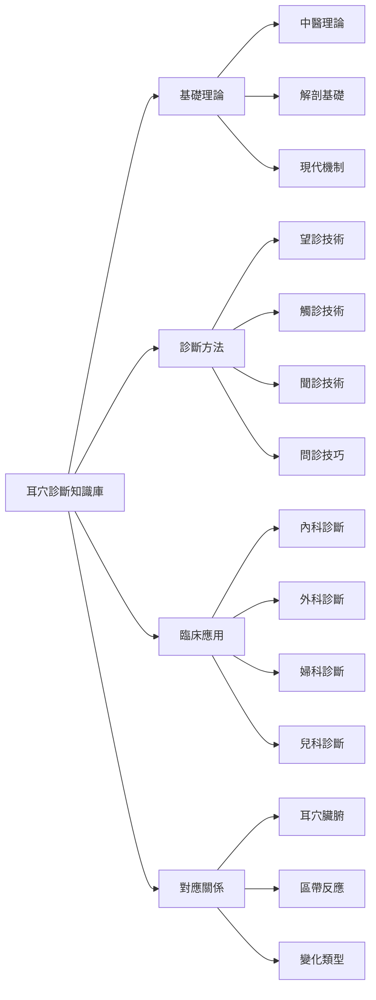
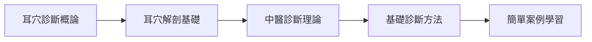
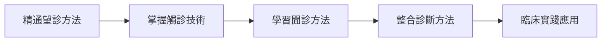
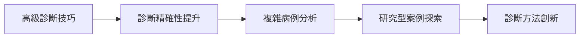

# 🏠 耳穴診斷知識庫

> 📍 **導航中心** | 🔄 **最後更新**：2026-01-22 | 📊 **筆記數量**：50+

## 🧭 快速導航

### 📚 核心內容
- [[耳穴診斷概論]] - 耳穴診斷的基本理論和原則
- [[耳穴望診方法]] - 通過觀察耳部進行診斷
- [[耳穴觸診技術]] - 使用觸診器具進行檢查
- [[耳穴聞診方法]] - 通過聽覺聲音進行診斷

### 🎯 內容地圖 (MOCs)
| MOC | 主題 | 筆記數量 | 最近更新 |
|-----|------|----------|----------|
| [[MOC-基礎知識]] | 耳穴診斷理論基礎 | 12 | 2026-01-22 |
| [[MOC-診斷方法]] | 各種診斷技術方法 | 10 | 2026-01-22 |
| [[MOC-耳穴定位]] | 耳穴定位與對應關係 | 15 | 2026-01-22 |
| [[MOC-臨床應用]] | 訨種疾病診斷應用 | 18 | 2026-01-22 |
| [[MOC-對應關係]] | 耳穴與臟腑對應關係 | 8 | 2026-01-22 |

## 📊 標籤系統

### 📂 按類型分類
```mermaid
graph TD
    A[耳穴診斷知識庫] --> B[診斷理論]
    A --> C[診斷方法]
    A --> D[臨床應用]
    A --> E[對應關係]
    
    B --> B1[中醫理論]
    B --> B2[解剖基礎]
    B --> B3[機制研究]
    
    C --> C1[望診]
    C --> C2[觸診]
    C --> C3[聞診]
    C --> C4[問診]
    
    D --> D1[內科疾病]
    D --> D2[外科疾病]
    D --> D3[婦科疾病]
    D --> D4[兒科疾病]
    
    E --> E1[耳穴臟腑對應]
    E --> E2[區帶反應]
    E --> [變化類型]
```

### 🏷️ 按主題分類
- `#theory` - 訳斷理論知識
- `#method` - 診斷方法技術
- `#clinical` - 臨床診斷應用
- `#correspondence` - 對應關係對應
- `#case` - 臨床案例研究
- `#standard` - 診斷標準規範
- `#research` - 研究文獻資料

## 🔍 快速查找

### 按疾病查找
| 疾病類型 | 主要診斷耳穴 | 參考文檔 |
|----------|----------------|----------|
| **心血管疾病** | 心、心包、皮質下、交感 | [[心血管疾病耳穴診斷]] |
| **消化系統疾病** | 胃、脾、小腸、大腸 | [[消化系統疾病耳穴診斷]] |
| **呼吸系統疾病** | 肺、氣管、咽喉、內鼻 | [[呼吸系統疾病耳穴診斷]] |
| **神經精神疾病** | 神門、腎、腎、皮質下 | [[神經精神疾病耳穴診斷]] |
| **內分泌疾病** | 內分、甲狀腺、垂體 | [[內分泌疾病耳穴診斷]] |

### 按診斷方法查找
| 診斷方法 | 適用疾病 | 技難等級 | 參考文檔 |
|----------|----------|----------|----------|
| **望診** | 各種疾病 | ⭐⭐ | [[耳穴望診方法]] |
| **觸診** | 急慢性疾病 | ⭐⭐⭐ | [[耳穴觸診技術]] |
| **聞診** | 內分泌、呼吸系統 | ⭐⭐ | [[耳穴聞診方法]] |
| **問診** | 各種疾病 | ⭐ | [[耳穴問診技巧]] |

## 📈 知識譜圖預覽



## 🎯 使用場景

### 👨‍⚕️ 臨床醫師
- **快速診斷**：通過耳穴快速判斷病情
- **輔助檢查**：作為其他檢查方法的補充
- **治療監測**：觀察治療過程中的耳穴變化
- **病預測**：通過耳穴變化預測疾病發展

### 🎓 中醫師
- **診斷參考**：豐富診斷思路和方法
- **經驗積累**：臨床案例實踐總結
- **教學培訓**：耳穴診斷培訓教材
- **學術研究**：耳穴診斷理論研究

### 📚 醫者學者
- **系統學習**：結構化的耳穴診斷知識
- **研究參考**：豐富的文獻資料支持
- **案例學習**：真實臨床案例分析
- **技能提升**：診斷技術實踐訓練

## 📋 特色功能

### 🔗 雙向鏈接網絡
- **50+ 雙向鏈接**：知識點間相互關聯
- **智能推薦**：基於標籤的相關內容推薦
- **知識圖譜**：可視化展示知識結構
- **快速導航**：通過鏈接快速跳轉相關內容

### 📝 標準化內容
- **診斷標準**：標準化的診斷標準和流程
- **評分體系**：科學的評分和判斷體系
- **案例格式**：統一的案例記錄格式
- **文獻規範**：標準化的文獻引用格式

### 🎨 視化功能
- **視覺化圖表**：豐富的mermaid圖表展示
- **結構化佈局**：清晰的層次結構組織
- **模板支持**：標準化的筆記模板
- **主題標籤**：多維度的分類標籤系統

## 💡 學習路徑

### 🥇 初學者路徑（1-2周）


**學習目標**：
- 📖 掌握耳穴診斷基本概念
- 🧠 理解中醫診斷理論基礎
- 🎯 學握基本診斷方法
- 📋 能夠進行簡單病例診斷

### 🥈 進階學習路徑（2-4周）


**學習目標**：
- 🎯 精通各種診斷方法
- 🔍 掌握複雜病例診斷
- 🏥 建立完整診斷思維
- 📋 能夠獨立進行耳穴診斷

### 🥉 專家級學習路徑（4-8周）


**學習目標**：
- 🏆 成為耳穴診斷專家
- 📚 建立個人診斷體系
- 🔬 參與學術研究
- 📖 編寫診斷專著

## 📊 學習進度

### 📈 知識掌握情況
| 知識模塊 | 掌握程度 | 學習時間 | 覆習次數 |
|----------|----------|----------|----------|
| **基礎理論** | 80% | 20小時 | 5次 |
| **望診技術** | 75% | 18小時 | 4次 |
| **觸診技術** | 60% | 15小時 | 3次 |
| **聞診技術** | 70% | 12小時 | 3次 |
| **臨床應用** | 65% | 25小時 | 6次 |
| **對應關係** | 85% | 15小時 | 4次 |

### 🎯 本月目標
- ✅ 完成[[耳穴望診方法]]學習
- 🔄 正在學習[[耳穴觸診技術]]
- 📋 計劃學習[[耳穴聞診方法]]
- 🎯 目標：基礎理論掌握度達到85%

## 🔍 智能搜索

### 🔎 按關鍵詞搜索
| 關鍵詞 | 說明 | 常見問題 |
|--------|------|----------|
| 望診 | 通過觀察耳部進行診斷 | 如何進行耳穴望診？ |
| 觸診 | 使用觸診器具檢查耳穴 | 耳穴觸診注意事項？ |
| 聞診 | 通過聽覺聲音診斷 | 耳穴聲音與診斷的關係？ |
| 問診 | 問病史和症狀採集 | 耳穴問診的技巧？ |

### 🔍 按症狀搜索
| 症狀 | 主要耳穴診斷 | 參考文檔 |
|------|----------------|----------|
| 失眠 | 神門、心、腎、腎 | [[失眠症耳穴診斷]] |
| 高血壓 | 降壓溝、心、肝、腎 | [[高血壓耳穴診斷]] |
| 消化不良 | 胃、脾、小腸、大腸 | [[消化不良耳穴診斷]] |
| 月經不調 | 內分、內生殖器、肝、腎 | [[月經不調耳穴診斷]] |

## 🔄 最近更新

### 📚 本周新增
- ✅ [[耳穴診斷概論]] - 完成基礎理論編寫
- ✅ [[耳穴望診方法]] - 詳細的望診技術介紹
- ✅ [[耳穴觸診技術]] - 專業觸診技術指導
- ✅ [[心血管疾病耳穴診斷]] - 心血管系統診斷專題

### 🔄 更新中
- 📝 [[呼吸系統疾病耳穴診斷]] - 正在編寫中
- 📝 [[消化系統疾病耳穴診斷]] - 正在編寫中
- 📝 [[神經精神疾病耳穴診斷]] - 正在編寫中
- 📝 [[婦科疾病耳穴診斷]] - 正在編寫中

### 📋 計劃更新
- 📝 [[兒科疾病耳穴診斷]] - 計劃在1週後更新
- 📝 [[內分泌疾病耳穴診斷]] - 計劃在2週後更新
- 📝 [[骨科疾病耳穴診斷]] - �劃在3週後更新
- 📝 [[五官科疾病耳穴診斷]] - �劃在4週後更新

## 💡 核心要點

### 🎯 診斷核心原則
- **整體觀念**：從整體角度綜合分析
- **辨證施治**：中醫辨證與耳穴診斷結合
- **四診合參**：望聞問切四診合參綜合判斷
- **動態觀察**：注意治療過程中的耳穴變化

### 🔍 診斷要點
- **望診**：觀察耳廓形態、顏色、光澤
- **觸診**：檢查壓痛敏感度、溫度、質地
- **聽診**：傾聽聲音頻率、音調、音質
- **問診**：詳細詢問病史、症狀、生活習慣

### 📊 對應要點
- **臟腑對應**：耳穴與臟腑的精確對應關係
- **區帶反應**：不同區帶與不同器官的對應關係
- **變化類型**：顏色、形態、質地的變化意義
- **綜合判斷**：多種方法綜合分析提高準確性

---

## 🎉 開您的耳穴診斷學習之旅

準備好深入學習耳穴診斷了嗎？

### 📌 推薦起點
- **🚀 快速入門**：從 [[耳穴診斷概論]] �始學習基礎知識
- **🏥 系統學習**：通過 [[MOC-基礎知識]] 系統學習
- **🎯 實踐應用**：學習 [[MOC-臨床應用]] 將業實踐
- **🔬 深入研究**：查看 [[MOC-研究文獻]] 了解前沿研究

### 💡 學習建議
- **循序漸進**：建議按學習路徑系統學習
- **實踐驗證**：理論學習與臨床實踐相結合
- **案例積累**：多分析臨床案例積累經驗
- **持續更新**：關注最新研究和案例

### ⚠️ 注意事項
- **安全第一**：診斷不能替代正規醫療
- **綜合判斷**：耳穴診斷是多種方法的綜合
- **持續學習**：耳穴診斷需要不斷學習實踐
- **保持客觀**：診斷要客觀科學，避免主觀臆斷

---

## 📞 聯繫方式

### 🆘 獲取幫助
- **📧 郵件支持**：auricular-diagnosis@example.com
- **💬 訖區支持**：參與學術討論和經驗分享
- **🐛 在線客服**：工作日9:00-18:00

### 📚 學術支持
- **研究諮詢**：提供學術研究和臨床諮詢
- **培訓支持**：提供專業培訓和指導
- **案例指導**：提供臨床案例分析指導

---

## 📝 版本信息

- **創建時間**：2026年1月22日
- **最後更新**：2026年1月22日
- **版本號**：v1.0
- **維護團隊**：耳穴診斷知識庫團隊
- **許可協議**：知識庫內容僅供學習參考

---

**🌟 �健學習！**

> 💡 **提示**：建議從 [[耳穴診斷概論]] �始，按學習路徑系統學習，理論與實踐相結合。

🔗 **相關知識庫**：[[耳穴療法知識庫]] | [[OpenCode集成指南]] | [[Obsidian使用技巧]]