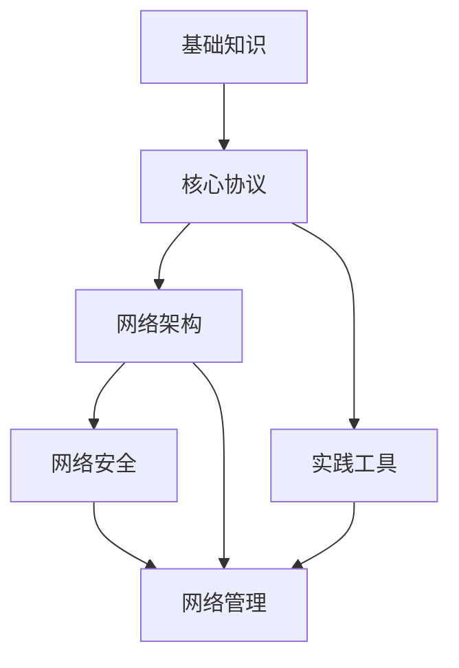

> [!summary] 知识地图
> 这是计算机网络知识库的完整知识地图，展示所有模块及其相互关系。

## 🗺️ 知识体系全景

```
┌─────────────────────────────────────────────────────────────┐
│                    计算机网络知识库                            │
├─────────────────────────────────────────────────────────────┤
│                                                               │
│  ┌──────────────┐    ┌──────────────┐    ┌──────────────┐    │
│  │  基础理论层   │───→│  协议技术层   │───→│  架构设计层   │    │
│  │ ───────────  │    │ ───────────  │    │ ───────────  │    │
│  │ • OSI模型    │    │ • HTTP/HTTPS │    │ • LAN/WAN   │    │
│  │ • TCP/IP    │    │ • TCP/UDP    │    │ • 无线网络   │    │
│  │ • 网络拓扑   │    │ • IP/ARP     │    │ • 云计算网络 │    │
│  └──────────────┘    └──────────────┘    └──────────────┘    │
│         ↓                  ↓                  ↓              │
│  ┌─────────────────────────────────────────────────────┐     │
│  │              应用与实践层                              │     │
│  │ ───────────────────────────────────────────────   │     │
│  │ • 网络安全      • 网络管理      • 实践工具          │     │
│  └─────────────────────────────────────────────────────┘     │
│                                                               │
└─────────────────────────────────────────────────────────────┘
```

---

## 📚 模块详解

### 01-基础知识模块

```
📖 基础理论
├── [[OSI七层模型]]
│   ├── 应用层
│   ├── 表示层
│   ├── 会话层
│   ├── 传输层
│   ├── 网络层
│   ├── 数据链路层
│   └── 物理层
│
├── [[TCP/IP协议栈]]
│   ├── 应用层
│   ├── 传输层 (TCP/UDP)
│   ├── 网络层 (IP)
│   └── 网络接口层
│
├── [[网络拓扑结构]]
│   ├── 总线型
│   ├── 星型
│   ├── 环型
│   ├── 网状型
│   └── 混合型
│
└── [[IP地址与子网划分]]
    ├── IPv4地址
    ├── IPv6地址
    ├── 子网掩码
    ├── CIDR
    └── 路由与转发
```

### 02-核心协议模块

```
🔌 核心协议
├── [[应用层协议]]
│   ├── HTTP/HTTPS - Web协议
│   ├── FTP - 文件传输
│   ├── SMTP/POP3/IMAP - 邮件
│   ├── DNS - 域名解析
│   ├── DHCP - 动态主机配置
│   └── SSH/Telnet - 远程登录
│
├── [[传输层协议]]
│   ├── TCP - 可靠传输
│   │   ├── 三次握手
│   │   ├── 流量控制
│   │   ├── 拥塞控制
│   │   └── 可靠性保证
│   └── UDP - 不可靠但快速
│
├── [[网络层协议]]
│   ├── IP - 网际协议
│   ├── ICMP - 网络控制消息
│   ├── ARP - 地址解析
│   ├── RARP - 反向地址解析
│   └── 路由协议 (RIP, OSPF, BGP)
│
└── [[数据链路层协议]]
    ├── Ethernet - 以太网
    ├── MAC地址
    ├── VLAN - 虚拟局域网
    ├── STP - 生成树协议
    └── 交换机技术
```

### 03-网络架构模块

```
🌐 网络架构
├── [[局域网(LAN)]]
│   ├── 以太网标准
│   ├── 交换机配置
│   ├── VLAN设计
│   └── 冗余设计 (STP, VRRP)
│
├── [[广域网(WAN)]]
│   ├── 专线网络
│   ├── MPLS
│   ├── VPN技术
│   └── 负载均衡
│
├── [[无线网络(Wi-Fi)]]
│   ├── 802.11标准 (a/b/g/n/ac/ax)
│   ├── 安全协议 (WEP/WPA/WPA2/WPA3)
│   ├── 无线控制器 (AC/AP)
│   └── 漫游设计
│
├── [[云计算网络]]
│   ├── 虚拟网络 (VPC)
│   ├── 软件定义网络 (SDN)
│   ├── 容器网络 (Docker/K8s)
│   └── 服务网格 (Service Mesh)
│
└── [[SDN软件定义网络]]
    ├── 控制平面
    ├── 数据平面
    ├── OpenFlow协议
    └── NFV网络功能虚拟化
```

### 04-网络安全模块

```
🔒 网络安全
├── [[网络安全基础]]
│   ├── 安全框架 (CIA三元组)
│   ├── 威胁模型
│   ├── 攻击面分析
│   └── 安全策略
│
├── [[加密与认证]]
│   ├── 对称加密 (AES)
│   ├── 非对称加密 (RSA/ECC)
│   ├── 哈希算法 (SHA/MD5)
│   ├── 数字签名
│   ├── PKI/证书体系
│   └── TLS/SSL
│
├── [[防火墙技术]]
│   ├── 包过滤防火墙
│   ├── 状态检测防火墙
│   ├── 应用层防火墙
│   ├── Web应用防火墙 (WAF)
│   └── 防火墙规则设计
│
├── [[VPN虚拟专用网络]]
│   ├── IPSec VPN
│   ├── SSL VPN
│   ├── WireGuard
│   └── Zero Trust架构
│
└── [[常见网络攻击与防御]]
    ├── DDoS攻击
    ├── 中间人攻击
    ├── ARP欺骗
    ├── DNS劫持
    ├── 端口扫描
    └── 社会工程学
```

### 05-网络管理模块

```
⚙️ 网络管理
├── [[网络监控]]
│   ├── SNMP协议
│   ├── 流量分析
│   ├── 日志管理
│   └── 性能指标
│
├── [[故障排查]]
│   ├── 分层排查法
│   ├── 常见故障案例
│   ├── 排查工具使用
│   └── 应急响应
│
├── [[网络性能优化]]
│   ├── 带宽管理
│   ├── QoS服务质量
│   ├── 负载均衡
│   └── 加速技术 (CDN)
│
└── [[自动化运维]]
    ├── Ansible
    ├── Python网络编程
    ├── 配置管理
    └── CI/CD集成
```

### 06-实践工具模块

```
🛠️ 实践工具
├── [[网络诊断工具]]
│   ├── ping - 连通性测试
│   ├── traceroute - 路由追踪
│   ├── netstat - 端口状态
│   ├── nslookup - DNS查询
│   ├── dig - DNS详细查询
│   ├── nmap - 端口扫描
│   ├── ip/ifconfig - 网络配置
│   └── route - 路由表
│
├── [[抓包分析工具]]
│   ├── Wireshark - 图形界面抓包
│   ├── tcpdump - 命令行抓包
│   ├── tshark - Wireshark CLI
│   └── 抓包分析与技巧
│
└── [[配置管理工具]]
    ├── SSH客户端
    ├── SCP/SFTP
    ├── TFTP/FTP
    └── 终端复用工具
```

---

## 🔗 模块关联图



---

## 📋 学习检查清单

### 入门阶段
- [ ] 理解 OSI 七层模型和 TCP/IP 四层模型
- [ ] 掌握 IP 地址和子网划分
- [ ] 了解常用的应用层协议 (HTTP, DNS, DHCP)
- [ ] 会使用 ping, traceroute, netstat 等基础工具

### 进阶阶段
- [ ] 深入理解 TCP 的可靠传输机制
- [ ] 掌握路由协议原理 (OSPF, BGP)
- [ ] 熟悉交换机、路由器的基本配置
- [ ] 会使用 Wireshark 进行抓包分析

### 高级阶段
- [ ] 掌握网络安全基础知识
- [ ] 理解 VPN 和防火墙技术
- [ ] 熟悉 SDN 和云计算网络
- [ ] 具备网络故障排查和优化能力

---

## 🎯 快速导航

- 🔙 [[README|返回知识库首页]]
- 📖 [[MOC-学习路径|查看学习路径]]
- 📝 [[08-笔记|学习笔记]]
- 🛠️ [[06-实践工具|实践工具]]

---

> [!info] 使用说明
>
> - 点击蓝色链接跳转到具体知识点
> - 使用 `Ctrl/Cmd + K` 快捷链接搜索
> - 建议按学习路径顺序阅读
> - 每个模块都有对应的实践建议

---

最后更新：2026-01-21
